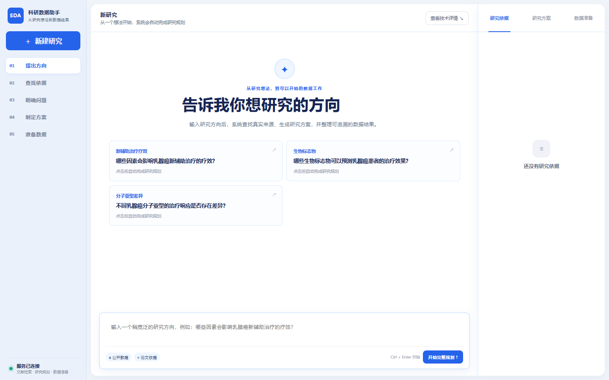

# 肿瘤精准治疗科研数据智能整合系统

面向多癌种精准治疗科研的数据整合系统：把自然语言研究问题转成可执行的研究方案，从公开数据库取数，完成字段标准化、患者/样本关联、医学安全检查和缺口驱动的两轮迭代，最终导出可分析、可追溯的数据与质量报告。乳腺癌是当前专项验证场景，系统同时配置了 17 个其他常见癌种，并为未配置癌种保留通用发现入口。

> 模型负责理解、规划与反思；公开数据库提供事实；确定性规则负责医学安全和发布边界。本项目服务科研数据整理，不提供临床诊疗建议。



## 当前能力

| 环节 | 已实现能力 | 交付结果 |
|---|---|---|
| 问题理解 | 从研究方向生成候选问题与 Research Contract | 人群、暴露、结局、字段和来源约束 |
| 真实取数 | GDC、GEO、cBioPortal、AACT、CIViC、DepMap 与论文表格/图注 | 带真实 `source_id` 的原始记录 |
| 数据整合 | Schema 匹配、实体关联、医学字段归一化 | 保留 `raw_field`、`raw_value` 的标准表 |
| 质量控制 | 来源、字段、实体、研究适用性四层质量门 | PASS / REVIEW / FAIL 与问题清单 |
| 自主闭环 | 根据缺字段、结局域错配和来源不足规划下一轮补搜 | 两轮指标快照、动作与输入/输出哈希 |
| 多癌种扩展 | 乳腺癌专项流程与 17 个其他常见癌种配置 | 按癌种加载研究上下文与安全边界 |
| 导出审计 | CSV、Excel、Evidence 与运行报告 | 可追溯科研数据包 |

## 核心对照结果

| 能力 | 本项目方法与结果 | 对照方法与结果 | 差值 |
|---|---:|---:|---:|
| 问题解析（EBM-NLP） | 序列特征解析：**0.5522** | 项目词典：0.4662 | **+0.0860** |
| 科学检索（BEIR 五任务主对照） | BM25+BGE 名次融合：**0.3915** | BGE 单路：0.3880 | **+0.0035** |
| 字段匹配（Valentine） | 千问辅助：**0.9018** | 项目原方法：0.7994；COMA：0.7670 | **+0.1024；+0.1348** |
| 实体匹配（DeepMatcher） | 自适应融合：**0.7449** | RecordLinkage：0.7440 | **+0.0009** |
| 数据清洗（Raha/HoloClean） | 来源锚点第6版：**0.9169**（六项） | Raha：0.8159（五项共同任务） | **+0.0870**（共同五项） |
| 乳腺癌专项完整链路 | 千问 3.8-Max + 真实来源 + 规则核验：**SDTI 98.1118** | 项目内确定性链路：SDTI 99.45 | 独立口径，不合并 |

上表中的公开数据集结果是在各自官方测试划分上完成的，分数只在同一能力内部比较，不相加为总准确率。完整链路的 98.1118 来自候选题集，固定规划链路的 99.45 来自另一种运行条件，二者用于说明工程表现，不能替代封存测试成绩。

## 快速启动

需要 Python 3.11+。首次启动：

```powershell
python -m venv .venv
.\.venv\Scripts\Activate.ps1
python -m pip install -r backend\requirements.txt
python -m uvicorn backend.app.main:app --host 127.0.0.1 --port 8000 --reload
```

打开 <http://127.0.0.1:8000/>。Docker 用户可运行 `./scripts/docker_up.ps1`，然后访问 <http://localhost:8888>。

千问凭据只在会话或本机环境变量中配置，不要提交 `.env` 或任何密钥。

## 报告导航

| 报告 | 用途 |
|---|---|
| [最终交付索引](docs/FINAL_DELIVERY_INDEX.md) | 最新交付物与最终正文入口 |
| [最终正文报告](docs/多癌种精准治疗科研数据智能整合系统_专业叙事与规范图示终稿_20260904.md) | 项目设计、数据整合流程与最终展示 |
| [公开数据集统一对照报告](evaluation/PUBLIC_DATASET_COMPARISON_20260902.md) | 问题解析、科学检索、字段匹配、实体匹配、清洗的真实逐任务指标、消融和 API 条件实验 |
| [公开检索统一多方法矩阵](evaluation/PUBLIC_RETRIEVAL_MATRIX_20260903.md) | 同一公开测试集上的多种方法、命中率、召回率、排序质量和耗时 |
| [论文及图示阅读包 ZIP](deliverables/多癌种精准治疗科研数据智能整合系统_论文及图示阅读包_20260904_最终.zip) | 只含论文、图示、公开对照与必要证据的最终阅读包 |

## 复现评测与图表

外部依赖准备完成后，可重跑 GitHub 同类项目评测：

```powershell
python scripts\run_github_competitor_benchmark.py --external-package-dir <外部评测依赖目录>
python scripts\build_github_report_charts.py
```

三层公开能力评测可分别复现：

```powershell
python scripts\run_public_problem_benchmark.py
python scripts\run_public_retrieval_benchmark.py --dataset beir_scifact
python scripts\run_public_retrieval_benchmark.py --dataset beir_trec_covid --method bm25 --method project_bm25_tuned_v2 --method project_hybrid
python scripts\build_public_retrieval_matrix.py
python scripts\run_public_cleaning_benchmark.py
```

当前公开主结果为：EBM-NLP 问题解析平均片段 F1 `0.5522`，BEIR 五任务检索前十条排序质量 `0.3915`（名次融合，公开 BGE 为 `0.3880`），新增 TREC-COVID 医学文献任务 50 个测试问题，并补齐 FiQA 与 Quora 的关键词对照；Valentine 字段对齐 F1 `0.9018`，DeepMatcher 实体匹配 F1 `0.7449`，Raha/HoloClean 六任务错误单元 F1 `0.9169`。仓库只保留上述报告实际引用的公开运行证据，其他重复运行可由脚本重新生成。

公开数据集的完整统一对照、实体匹配结果、逐任务消融和“为什么问题解析/检索偏低”的分析见 [`evaluation/PUBLIC_DATASET_COMPARISON_20260902.md`](evaluation/PUBLIC_DATASET_COMPARISON_20260902.md)；检索的多方法、多指标同表见 [`evaluation/PUBLIC_RETRIEVAL_MATRIX_20260903.md`](evaluation/PUBLIC_RETRIEVAL_MATRIX_20260903.md)，机器可读结果见 [`evaluation/public_benchmarks/retrieval_matrix_20260903.json`](evaluation/public_benchmarks/retrieval_matrix_20260903.json)。

图表直接读取 `results.json`，不在绘图代码中填写成绩。完整逐方法指标、数据哈希和运行环境均保留在评测产物中。

## 医学安全边界

- HER2 IHC 2+ 不得直接自动判为 HER2 Positive。
- ERBB2 CNA amplification 不等同 HER2 IHC positive。
- 低置信度患者/样本关联进入 `unresolved/review`。
- 高权威来源存在不可解释冲突时不得自动选边。
- 细胞系 `AUC/IC50` 与患者 `pCR/response` 必须用 `response_domain` 区分。
- 关键字段缺少 Evidence 时禁止自动发布。

## 验证

```powershell
python -m pytest -q
node --check frontend\app.js
```

验收时运行后端测试和前端语法检查；最终交付内容以 [最终交付索引](docs/FINAL_DELIVERY_INDEX.md) 和 [最终正文报告](docs/多癌种精准治疗科研数据智能整合系统_专业叙事与规范图示终稿_20260904.md) 为准。

项目入口与硬约束见 [README_START_HERE.md](README_START_HERE.md) 和 [AGENTS.md](AGENTS.md)。
