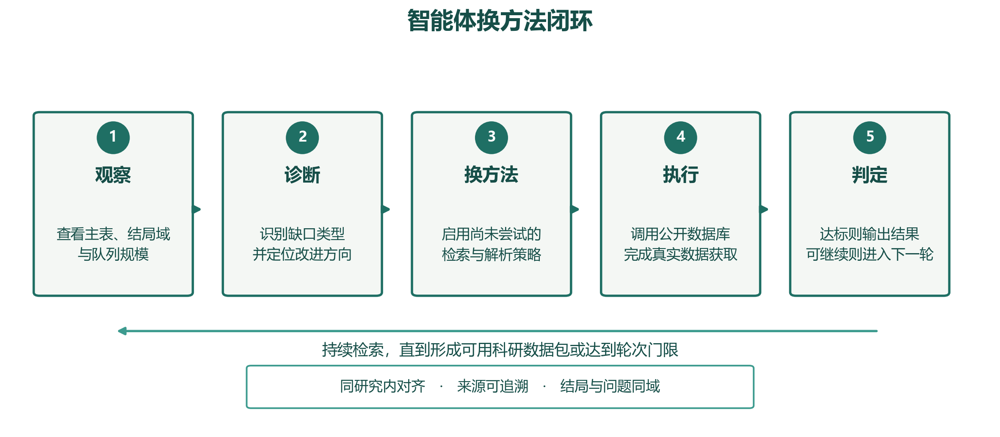
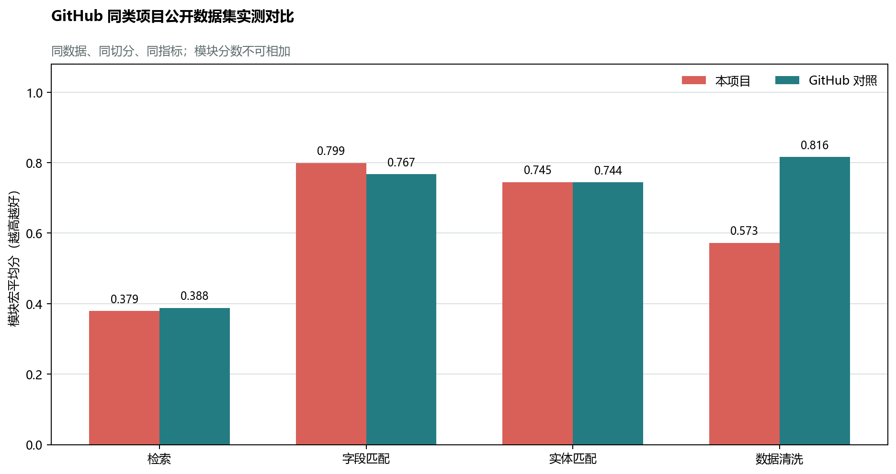
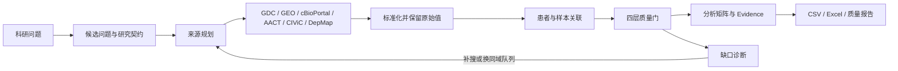

# 乳腺癌精准治疗科研数据智能体

面向乳腺癌科研的数据整合 Agent：把自然语言研究问题转成可执行的研究方案，从公开数据库取数，完成字段标准化、患者/样本关联、医学安全检查和缺口驱动的两轮迭代，最终导出可分析、可追溯的数据与质量报告。

> 模型负责理解、规划与反思；公开数据库提供事实；确定性规则负责医学安全和发布边界。本项目服务科研数据整理，不提供临床诊疗建议。


## 当前能力

| 环节 | 已实现能力 | 交付结果 |
|---|---|---|
| 问题理解 | 从研究方向生成候选问题与 Research Contract | 人群、暴露、结局、字段和来源约束 |
| 真实取数 | GDC、GEO、cBioPortal、AACT、CIViC、DepMap 与论文表格/图注 | 带真实 `source_id` 的原始记录 |
| 数据整合 | Schema 匹配、实体关联、医学字段归一化 | 保留 `raw_field`、`raw_value` 的标准表 |
| 质量控制 | 来源、字段、实体、研究适用性四层质量门 | PASS / REVIEW / FAIL 与问题清单 |
| 自主闭环 | 根据缺字段、结局域错配和来源不足规划下一轮补搜 | 两轮指标快照、动作与输入/输出哈希 |
| 导出审计 | CSV、Excel、Evidence 与运行报告 | 可追溯科研数据包 |



## GitHub 同类项目实测

本项目与 GitHub 同类方法使用相同公开数据、相同划分和相同指标运行。下列数字是模块级能力对比，不能相加，也不是乳腺癌正式 SDTI。



| 功能 | 公共评测集 | **本项目** | GitHub 对照 | 结论 |
|---|---|---:|---:|---|
| 科学检索 | BEIR 5 个数据集 | **0.3791** | BGE 0.3880 | 接近，低 0.0088 |
| 字段匹配 | Valentine 10 个任务 | **0.7994** | COMA 0.7670 | 高 0.0324 |
| 实体匹配 | DeepMatcher 5 个任务 | **0.7449** | RecordLinkage 0.7440 | 高 0.0009 |
| 数据清洗 | 5 个共同实测任务 | **0.5726** | Raha 子集 0.8159 | 低 0.2433 |

实体匹配采用验证集选择的 V2/V3/AND 自适应策略；数据清洗融合格式归一化与高频 `x` 占位符一致性修复。完整逐数据集结果、未运行项目原因、方法差异与复现信息见 [GitHub 同类项目公开数据集实测报告](evaluation/github_competitor_benchmark_20260830/report.md)。机器可读证据在 [results.json](evaluation/github_competitor_benchmark_20260830/results.json)。


## 正式成绩与内部观察

| 评测 | 当前结果 | 状态 | 正确读法 |
|---|---:|---|---|
| `official_candidate` 正式卷观察 | **SDTI 63.36** | `publish_allowed=false` | 当前正式口径，但尚非 sealed frozen test |
| development 练习册 | 66.94 | 非正式 | 已用于迭代，不能当正式成绩 |
| 自主迭代候选运行 | 见内部报告 | `REVIEW` | 用于回归诊断，不替代 63.36 |

内部候选卷曾出现更高观察值，但卷面未封存且仍有高风险 REVIEW；因此 README 不把该值作为项目成绩。正式公式和阈值见 [评测指标与 SDTI](docs/06_评测指标与SDTI.md)。

## 工作流程



闭环不会为了“通过”而猜测缺失医学事实。需要患者 pCR 时，生存结局或细胞系 AUC/IC50 不能替代；第二轮只能寻找更匹配的数据源，仍缺失则保持 REVIEW。

## 快速启动

需要 Python 3.11+。首次启动：

```powershell
python -m venv .venv
.\.venv\Scripts\Activate.ps1
python -m pip install -r backend\requirements.txt
python -m uvicorn backend.app.main:app --host 127.0.0.1 --port 8000 --reload
```

打开 <http://127.0.0.1:8000/>。Docker 用户可运行 `./scripts/docker_up.ps1`，然后访问 <http://localhost:8888>。

千问凭据只在会话或本机环境变量中配置，不要提交 `.env` 或任何密钥。

## 报告导航

| 报告 | 用途 |
|---|---|
| [GitHub 同类项目实测报告](evaluation/github_competitor_benchmark_20260830/report.md) | 同数据、同切分、同指标的外部方法对比 |
| [指标提升与两轮融合说明](docs/METRIC_IMPROVEMENT_REPORT_20260830.md) | 提升前后差值、融合策略与闭环取优规则 |
| [分层评测与消融报告](evaluation/agent_stratified_ablation_20260829/report.md) | development 分层、候选卷迭代、检索与规划消融 |
| [迭代交付说明](docs/ITERATION_REPORT_20260829.md) | 本轮自主闭环、持久化与质量能力变更 |
| [当前生产主链](docs/CURRENT_MAINLINE.md) | 生产默认、评测方法与 legacy 能力边界 |
| [数据与指标口径](docs/DATA_REPORT_20260829.md) | 正式/非正式指标及公开检索分层 |
| [完整设计与评测](docs/FINAL_INTEGRATED_REPORT_20260829.md) | 架构、功能、接口与阶段评测总览 |

## 复现评测与图表

外部依赖准备完成后，可重跑 GitHub 同类项目评测：

```powershell
python scripts\run_github_competitor_benchmark.py --external-package-dir <外部评测依赖目录>
python scripts\build_github_report_charts.py
```

图表直接读取 `results.json`，不在绘图代码中填写成绩。完整逐方法指标、数据哈希和运行环境均保留在评测产物中。DeepMatcher、Ditto、HoloClean 未在当前环境完成公平复现的模型不填论文数字，统一标记 `NOT_EVALUATED`。

## 医学安全边界

- HER2 IHC 2+ 不得直接自动判为 HER2 Positive。
- ERBB2 CNA amplification 不等同 HER2 IHC positive。
- 低置信度患者/样本关联进入 `unresolved/review`。
- 高权威来源存在不可解释冲突时不得自动选边。
- 细胞系 `AUC/IC50` 与患者 `pCR/response` 必须用 `response_domain` 区分。
- 关键字段缺少 Evidence 时禁止自动发布。

冻结接口包括 `configs/canonical_schema.yaml`、`configs/medical_rules.yaml` 和 `docs/06_评测指标与SDTI.md`，公式与医学规则不得为提高成绩而放宽。

## 验证

```powershell
python -m pytest -q
node --check frontend\app.js
```

## 当前局限

- 正式 SDTI 仍未达到 90，安全门未允许自动发布。
- 外部评测显示清洗检测仍是主要短板；实体融合已达到并略超过 RecordLinkage 对照，但仍需扩展跨域测试。
- 当前 SQLite 闭环记忆适合单实例运行，多副本部署需要共享状态存储。
- 真实临床结局与生物标志物经常分散在不同队列；系统能补搜和解释缺口，但不能保证公开数据一定覆盖目标字段。

项目入口与硬约束见 [README_START_HERE.md](README_START_HERE.md) 和 [AGENTS.md](AGENTS.md)。
