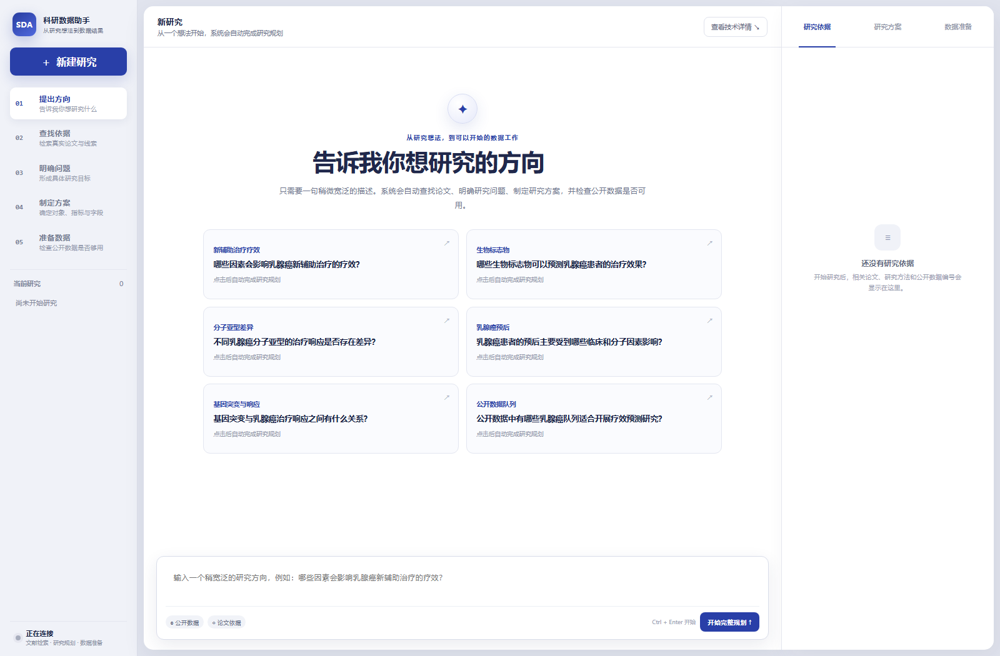

# 乳腺癌精准治疗科研数据智能体

一个面向乳腺癌精准治疗研究的中文科研数据 Agent。研究者从宽泛的研究方向或具体科研问题开始，系统逐步完成文献证据整理、研究问题细化、数据源规划、真实公开数据库检索、患者/样本级数据整合、质量检查、来源追溯和科研数据导出。

当前主产品采用阿里云百炼千问完成科研问题理解与工具规划，同时保留确定性规则、可复现的离线回归链路和人工复核边界。系统不会把模型生成内容当作患者事实，也不会用未经运行的论文或模型成绩冒充本项目成绩。



## 当前版本

当前仓库已完成主流程 `prompts/00` 至 `prompts/10`，并在此基础上继续实现了：

- **千问科研数据 Agent v2**：结构化解析科研问题，通过 Function Calling 选择真实数据工具。
- **Guided Research Planning Workspace**：从宽泛 Topic 进入 Literature Evidence、候选科研问题、Research Blueprint 和 Source Plan。
- **Planning RAG / Scientific KG MVP**：对 Europe PMC 开放全文进行结构化切片，支持词法、语义、章节和图谱混合检索。
- **Source Broker MVP**：按 Research Contract 选择 Dataset、Resource、字段覆盖、最小来源组合和 JoinPolicy。
- **分层公开评测**：已运行 BEIR 检索、Valentine 字段对齐、DeepMatcher 实体匹配和 HoloClean 数据清洗测试；结果只代表对应能力层，不代表完整 Agent 或临床有效性。

详细设计入口：

- [项目启动与阶段状态](README_START_HERE.md)
- [千问科研数据 Agent](docs/QWEN_RESEARCH_AGENT.md)
- [Guided Research Planning Workspace](docs/FRONTEND_PLANNING_WORKSPACE.md)
- [Planning RAG / Scientific KG](docs/PLANNING_RAG_PHASE3.md)
- [Source Broker](docs/SOURCE_BROKER_PHASE4.md)
- [分层公开评测方案](docs/PUBLIC_BENCHMARK_EVALUATION.md)
- [公开评测对比结果](docs/PUBLIC_BENCHMARK_COMPARISON.md)

## 端到端工作流

```text
宽泛研究方向或科研问题
        ↓
Literature Evidence 与候选科研问题
        ↓
Research Contract
        ↓
Source Broker 生成数据源、字段覆盖和 JoinPolicy
        ↓
GDC / GEO / cBioPortal / ClinicalTrials.gov / CIViC
        ↓
标准化、证据融合、质量门控和人工复核
        ↓
患者/样本级科研宽表、字段字典、质量报告、来源清单
        ↓
CSV / Parquet / Excel 导出
```

系统支持两种工作方式：

1. **科研规划工作台**：从 Topic 出发，先形成有 Evidence 支撑的研究契约和数据源方案。
2. **高级数据工作台**：直接提交结构化科研问题，运行数据 Agent 并查看整合结果。

## 主要能力

| 模块 | 能力 |
|---|---|
| 问题理解 | 识别疾病、亚型、基因、药物、治疗、研究结局和数据粒度 |
| 文献层 | Literature Provider、Europe PMC 全文切片、字段级 Evidence 和 Research Contract |
| 数据源层 | GDC、NCBI GEO、cBioPortal、AACT/ClinicalTrials.gov、CIViC |
| 数据整合 | 患者/样本级宽表、字段字典、来源登记、原始值审计和冲突记录 |
| Source Broker | DatasetCandidate、Field Coverage Matrix、最小来源组合、JoinPolicy 和 fallback |
| 质量控制 | 样本量、字段完整率、结局完整率、基因覆盖率、重复患者、截断和证据门控 |
| 可视化 | 中文结果表、指标面板、字段展开、来源筛选和交互式数据溯源 |
| 导出 | CSV、Snappy Parquet、多工作表 Excel |
| 开发者入口 | 中文 API 交互台、请求 JSON、HTTP 状态、耗时和 cURL 复制 |

## 五分钟启动

### 使用 Docker

先启动 Docker Desktop，然后在 PowerShell 中执行：

```powershell
git clone https://github.com/xsc2466729313-cyber/breast-cancer-research-agent.git
cd breast-cancer-research-agent
powershell -ExecutionPolicy Bypass -File .\scripts\docker_up.ps1
```

打开：

- 中文前端：<http://localhost:8888>
- 后端 API 文档：<http://localhost:8000/docs>
- 健康检查：<http://localhost:8000/health>

停止服务：

```powershell
docker compose down
```

### 连接千问 API

打开前端的“连接千问 API”，可以手动填写凭据，也可以导入阿里云百炼下载的凭据 CSV。需要的配置为：

| 配置 | 说明 |
|---|---|
| API Key | 百炼 API Key |
| OpenAI 兼容地址 | 业务空间的 `compatible-mode/v1` 地址 |
| 模型 | 默认 `qwen-plus` |
| 业务空间 ID | 可选 |

也可以用环境变量预配置：

```env
DASHSCOPE_API_KEY=
QWEN_BASE_URL=https://{WorkspaceId}.cn-beijing.maas.aliyuncs.com/compatible-mode/v1
QWEN_MODEL=qwen-plus
QWEN_WORKSPACE_ID=
QWEN_TIMEOUT_SECONDS=120
```

或从凭据 CSV 临时注入当前进程：

```powershell
powershell -ExecutionPolicy Bypass -File .\scripts\docker_up_qwen.ps1 `
  -CredentialCsv "C:\path\默认业务空间-apiKey.csv" `
  -Model "qwen-plus"
```

安全约束：

- CSV 只在当前浏览器解析，不上传原始文件。
- API Key 只在建立连接时发送，成功后前端输入框清空。
- 临时会话只保存在后端内存中，后续任务只携带随机 `session_id`。
- 凭据不会写入 `.env`、数据库、缓存、日志或任务结果。
- 临时会话最多保留 2 小时，后端重启后失效。
- 未配置千问时可以使用确定性规划兜底，但页面会明确标注，不冒充大模型结果。

## 运行科研任务

在前端输入类似问题：

```text
研究 HER2 阳性乳腺癌中 PIK3CA 突变与新辅助治疗响应的关系，
并整理患者级科研数据集。
```

系统会返回研究规格、执行计划、工具调用记录、候选数据集、科研宽表、字段字典、可科研性报告、Evidence 和数据来源。

核心 API：

```text
POST   /api/agent/qwen-sessions
DELETE /api/agent/qwen-sessions/{session_id}
POST   /api/agent/tasks
GET    /api/agent/tasks/{task_id}
GET    /api/agent/tasks/{task_id}/export/csv
GET    /api/agent/tasks/{task_id}/export/parquet
GET    /api/agent/tasks/{task_id}/export/xlsx
```

创建任务的最小示例：

```json
{
  "question": "研究 HER2 阳性乳腺癌中 PIK3CA 突变与新辅助治疗响应的关系，并整理患者级科研数据集",
  "qwen_session_id": "qws_临时会话编号",
  "use_qwen": true,
  "allow_deterministic_fallback": true,
  "data_mode": "live",
  "preferred_sources": [],
  "max_sources": 3,
  "max_records": 500
}
```

## 公开评测证据

当前已完成的公开测试如下。所有结果来自仓库中的真实运行产物，不能合并成一个总分：

| 能力层 | 数据集 | 当前方法 | 结果 |
|---|---|---|---|
| 科学检索 | BEIR SciFact | 哈希-词法混合检索 | nDCG@10 `0.4070`；BM25 `0.6040` |
| 医学检索 | BEIR NFCorpus | 哈希-词法混合检索 | nDCG@10 `0.2493`；BM25 `0.2899` |
| 字段对齐 | Valentine Education COVID Meals | 字段名/值形态规则 | F1 `1.0000`；精确字段名 `0.5714` |
| 字段对齐 | Valentine Capital Projects | 字段名/值形态规则 | F1 `0.6667`；精确字段名 `0.7500` |
| 实体匹配 | DBLP-ACM | 保守规则 | F1 `0.9163` |
| 实体匹配压力测试 | Walmart-Amazon | 保守规则 | F1 `0.4453`，Recall `0.3161` |
| 数据清洗 | HoloClean Hospital | 共识规则 | Cell F1 `0.0000`，未自动修复 |

这些结果说明：当前离线检索仍未超过 BM25；字段对齐规则在一个 Valentine 子任务上超过字段名基线，但在另一个子任务上低于字段名基线，仍不能视为稳定的通用字段语义映射能力；实体匹配规则不能直接迁移为患者身份合并能力；保守清洗策略避免误改，但尚未具备通用自动修复能力。EBM-NLP、BFCL、完整 Valentine 套件、正式 Raha/Baran 和端到端 ScienceAgentBench 仍需独立接入或受控下载。

复现入口：

```powershell
python scripts/run_public_retrieval_benchmark.py --download
python scripts/run_public_schema_benchmark.py --download
python scripts/run_public_entity_benchmark.py --download
python scripts/run_public_cleaning_benchmark.py --download
```

评测产物位于 `evaluation/public_benchmarks/runs/`。数据集原文件不提交到仓库；每次运行记录 `source_id`、真实来源、数据摘要、代码版本和运行指标。

## 数据语义与医学安全边界

- HER2 IHC 2+ 不得直接自动判为 HER2 Positive。
- ERBB2 CNA amplification 不等同于 HER2 IHC positive。
- 低置信度患者/样本关联进入 `unresolved` 或人工 `review`。
- 高权威来源发生不可解释冲突时，不自动选边。
- 细胞系 `AUC/IC50` 与患者 `pCR/response` 必须使用不同的 `response_domain`。
- 患者临床数据、细胞系药敏、临床试验和知识证据不会强行拼成同一患者表。
- 标准化后保留 `raw_field`、`raw_value`、`source_id` 和真实来源。
- 数据被上游 `max_records` 截断时，缺失记录不得解释为确定阴性。

冻结接口和规则位于：

- `configs/canonical_schema.yaml`
- `configs/medical_rules.yaml`
- `configs/quality_rules.yaml`

## 本地开发与测试

Python 3.11 或更高版本：

```powershell
python -m venv .venv
.\.venv\Scripts\Activate.ps1
python -m pip install -r backend\requirements.txt
python -m uvicorn backend.app.main:app --reload
```

运行后端测试和前端语法检查：

```powershell
python -m pytest -ra
node --check frontend\app.js
```

项目当前默认依赖保持精简；Planning RAG 的 ChromaDB、BGE 等后端属于可选扩展，详见 [Planning RAG 文档](docs/PLANNING_RAG_PHASE3.md)。

## 目录与文档

```text
backend/app/agent/          千问客户端、任务编排、研究宽表与导出
backend/app/research_planning/
                            Topic、Literature、Research Contract 与 Planning RAG
backend/app/source_broker/  数据源候选、字段覆盖和 JoinPolicy
backend/app/sources/        GDC、GEO、cBioPortal、AACT、CIViC Adapter
backend/app/normalization/  医学实体和冻结 Schema 标准化
backend/app/integration/    患者/样本关联、冲突检测和 Evidence 融合
backend/app/repair/         确定性修复、审计和医学安全门
backend/app/evaluation/     Gold Set、SDTI 和公开评测
frontend/                   中文科研规划与数据工作台
configs/                    冻结 Schema、医学规则、质量规则和评测注册表
evaluation/                 可复现评测结果与报告
docs/                       设计、实现、评测和验收文档
scripts/                    Docker、千问启动和评测脚本
```

历史兼容接口仍保留：

- `/api/adapters/gdc|geo|cbioportal|aact|civic`
- `/api/integration/normalize`
- `/api/evaluation/*`
- `/api/goldset/*`
- `/api/repair/*`
- `/api/tasks/mock`（仅用于历史回归测试和演示）
