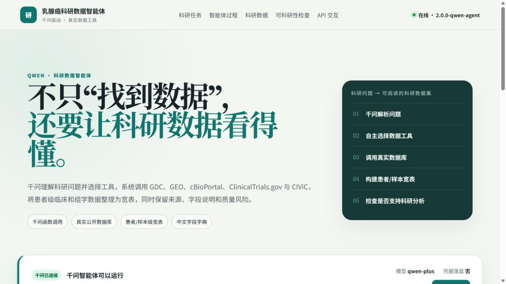
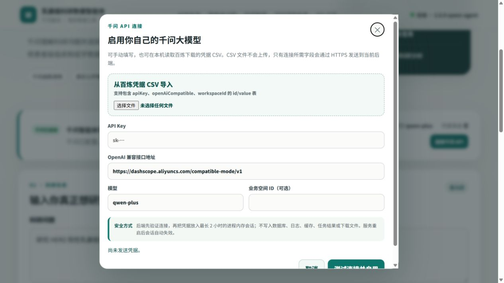
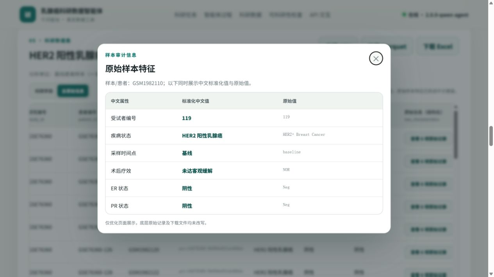
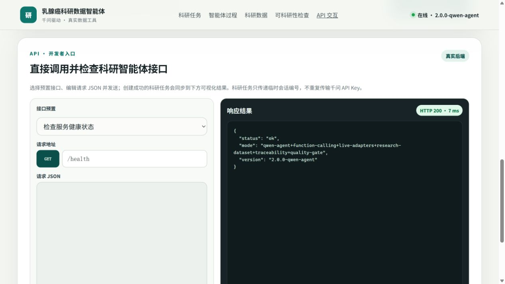

# 千问乳腺癌科研数据智能体

这是一个面向乳腺癌精准治疗研究的中文科研数据 Agent。研究者输入自然语言问题，千问负责理解问题和选择工具；后端调用真实公开数据库，整理患者/样本级科研宽表，并给出中文字段字典、质量指标、可科研性检查和数据溯源。

> 当前版本支持在前端直接连接自己的阿里云百炼千问 API：可手动填写，也可导入百炼凭据 CSV。连接成功后，Key 只保存在后端进程内存中，任务只传临时会话编号。



## 它能完成什么

```text
科研问题
→ 千问解析疾病、亚型、基因、药物和研究结局
→ Function Calling 自主选择真实数据工具
→ 调用 GDC / GEO / cBioPortal / ClinicalTrials.gov / CIViC
→ 构建患者/样本级科研宽表
→ 生成中文字段字典与指标可视化
→ 检查缺失、截断、样本量、重复患者和结局分布
→ 导出 CSV / Parquet / Excel，并保留来源与原始值
```

核心能力包括：

- 千问 `qwen-plus` 结构化解析科研问题与函数调用；
- GDC、NCBI GEO、cBioPortal、ClinicalTrials.gov、CIViC 真实数据工具；
- 患者/样本级科研宽表，而不是只有数据目录或证据摘要；
- 中文数据集名称、字段标签、分类值、科研用途与质量说明；
- 样本量、字段完整率、结局完整率、基因覆盖率等指标可视化；
- 可交互数据溯源点线图、来源筛选与主数据路径高亮；
- 原始样本特征拆分为可读中文表格，同时保留原文审计；
- CSV、Snappy Parquet 与多工作表 Excel 导出；
- HER2、ERBB2 CNA、患者/细胞系响应域等确定性医学安全规则。

## 五分钟启动

### 1. 启动服务

需要先安装并启动 Docker Desktop。在 PowerShell 中执行：

```powershell
git clone https://github.com/xsc2466729313-cyber/breast-cancer-research-agent.git
cd breast-cancer-research-agent
powershell -ExecutionPolicy Bypass -File .\scripts\docker_up.ps1
```

打开以下地址：

- 中文前端：<http://localhost:8888>
- 后端 API 文档：<http://localhost:8000/docs>
- 健康检查：<http://localhost:8000/health>

### 2. 在前端连接自己的千问 API

点击页面中的“连接千问 API”。可以手动填写，也可以点击“导入百炼凭据 CSV”，选择从阿里云百炼下载的凭据文件。



需要的字段：

| 字段 | 说明 |
|---|---|
| API Key | 百炼 API Key，通常以 `sk-` 开头 |
| OpenAI 兼容地址 | 百炼业务空间的 `compatible-mode/v1` 地址 |
| 模型 | 默认 `qwen-plus` |
| 业务空间 ID | 可选，用于显示当前业务空间 |

点击“测试连接并启用”后，后端会向千问发送一个最小验证请求。成功后页面显示“临时千问已连接”，此时即可启动科研任务。

安全设计：

- CSV 只在当前浏览器中解析，不上传原始文件；
- API Key 仅在创建连接时发送一次，成功后输入框立即清空；
- 后端只把凭据保存在当前进程内存，不写 `.env`、数据库、缓存、日志或任务结果；
- 前端后续只传随机会话编号，不重复传输 API Key；
- 临时会话最多保留 2 小时，后端重启后立即失效；
- 点击“断开临时连接”会立即删除对应内存会话；
- 公网部署必须使用 HTTPS，不能用明文 HTTP 传输凭据。

### 3. 输入科研问题并运行

建议使用明确的“疾病/亚型 + 基因或治疗 + 研究结局 + 数据粒度”问题，例如：

```text
研究 HER2 阳性乳腺癌中 PIK3CA 突变与新辅助治疗响应的关系，
并整理患者级科研数据集。
```

页面可以选择真实数据模式或仅生成检索计划，并控制数据源数量与每张表最大记录数。真实模式会访问公开数据库，耗时取决于网络和数据量。

### 4. 查看和导出研究结果

科研数据区展示整理后的患者/样本级表格；编号保留原值，医学类别尽量提供中文展示。


可科研性检查不是简单判断“有没有表”，而是展示样本量、候选变量、结局缺失率、字段完整率、基因覆盖率、重复患者、截断状态等真实指标。


原始样本特征可以按字段展开，中文值用于阅读，英文原文继续保留用于追溯。



数据溯源图支持悬停高亮、点击选择、来源表联动筛选、只看主路径和暂停/播放动画。图中连线表示“检索与选择关系”，不表示把不同数据库患者强行拼接。


可以下载：

- CSV：科研宽表；
- Parquet：适合 Python、R 和大规模分析；
- Excel：包含“科研数据集、字段字典、可科研性报告、数据来源”四个工作表。

## 中文 API 交互入口

页面顶部选择“API 交互”，即可选择预置接口、编辑请求 JSON、发送真实请求、查看 HTTP 状态与耗时，并复制 cURL。



开发者入口与普通科研任务共用同一后端。若已通过前端建立临时千问会话，创建任务时会自动带上会话编号，不会在 JSON 中回显 API Key。

## 两种千问配置方式

### 方式 A：前端临时连接（推荐给本地使用者）

先运行 `scripts/docker_up.ps1`，然后在网页中填写或导入百炼凭据。无需修改配置文件，也不会在磁盘保存 Key。

### 方式 B：服务器环境变量预配置

适合服务器管理员或固定部署：

```env
DASHSCOPE_API_KEY=
QWEN_BASE_URL=https://{WorkspaceId}.cn-beijing.maas.aliyuncs.com/compatible-mode/v1
QWEN_MODEL=qwen-plus
QWEN_WORKSPACE_ID=
QWEN_TIMEOUT_SECONDS=120
```

也可以通过安全启动脚本从百炼凭据 CSV 注入当前进程：

```powershell
powershell -ExecutionPolicy Bypass -File .\scripts\docker_up_qwen.ps1 `
  -CredentialCsv "C:\path\默认业务空间-apiKey.csv" `
  -Model "qwen-plus"
```

脚本不会创建包含密钥的 `.env` 文件。未配置千问时，系统仍可以使用确定性规划兜底，但页面会明确标注“千问未配置”，不会冒充大模型 Agent。

详细设计见 [千问科研数据 Agent 文档](docs/QWEN_RESEARCH_AGENT.md)。

## 主要 API

### 建立临时千问会话

`POST /api/agent/qwen-sessions`

```json
{
  "api_key": "<YOUR_DASHSCOPE_API_KEY>",
  "base_url": "https://<WorkspaceId>.cn-beijing.maas.aliyuncs.com/compatible-mode/v1",
  "model": "qwen-plus",
  "workspace_id": "<WorkspaceId>"
}
```

响应只包含脱敏后的连接状态、随机 `session_id` 和过期时间，不返回 API Key。

### 删除临时千问会话

`DELETE /api/agent/qwen-sessions/{session_id}`

### 运行科研数据 Agent

`POST /api/agent/tasks`

```json
{
  "question": "研究 HER2 阳性乳腺癌中 PIK3CA 突变与新辅助治疗响应的关系，并整理患者级科研数据集",
  "qwen_session_id": "qws_临时会话编号",
  "use_qwen": true,
  "allow_deterministic_fallback": true,
  "data_mode": "live",
  "preferred_sources": [],
  "max_sources": 3,
  "max_records": 500
}
```

没有 `qwen_session_id` 时，任务使用服务器环境变量中的千问配置。响应包含 `research_spec`、中文执行计划、工具调用记录、候选数据集、科研宽表、字段字典、可科研性报告和受约束总结。

### 导出科研数据

```text
GET /api/agent/tasks/{task_id}/export/csv
GET /api/agent/tasks/{task_id}/export/parquet
GET /api/agent/tasks/{task_id}/export/xlsx
```

## 数据语义与医学安全边界

- 患者临床数据、细胞系药敏、临床试验和知识证据不会强行拼成同一患者表；
- HER2 IHC 2+ 不自动判为 HER2 Positive；
- ERBB2 CNA amplification 不等同于临床 HER2 IHC positive；
- cBioPortal 结果被 `max_records` 截断时，缺失突变不得解释为确定阴性；
- 同一患者多个样本必须按 `patient_id` 分组，避免跨分析分区泄漏；
- 细胞系 `AUC/IC50` 与患者 `pCR/response` 用 `response_domain` 区分；
- 千问可以规划和总结，但不能覆盖确定性医学规则，也不能生成患者事实。

## 本地开发与测试

Python 3.11 或更高版本：

```powershell
python -m venv .venv
.\.venv\Scripts\Activate.ps1
python -m pip install -r backend\requirements.txt
python -m uvicorn backend.app.main:app --reload
```

前端是静态页面，可由 Docker 中的 Nginx 提供，也可使用任意静态文件服务器。运行全部测试：

```powershell
python -m pytest -ra
node --check frontend\app.js
```

停止 Docker 服务：

```powershell
docker compose down
```

## 关键目录

```text
backend/app/agent/          千问客户端、临时会话、Function Calling、Agent 编排与导出
backend/app/sources/        GDC、GEO、cBioPortal、AACT、CIViC 真实数据工具
backend/app/normalization/  医学实体和冻结 Schema 标准化
backend/app/integration/    患者/样本关联、冲突检测和 Evidence 融合
backend/app/repair/         确定性修复与医学安全门
backend/app/evaluation/     Gold Set、指标与 SDTI
frontend/                   中文可交互前端
docs/images/                README 使用说明截图
scripts/                    Docker 与千问安全启动脚本
configs/                    冻结 Schema、医学和质量规则
mock/                       历史阶段 00 回归资产，不是主产品数据
```

## 兼容保留接口

- `/api/adapters/gdc|geo|cbioportal|aact|civic`
- `/api/integration/normalize`
- `/api/evaluation/*`
- `/api/goldset/*`
- `/api/repair/*`
- `/api/tasks/mock`（仅历史回归与演示资产）
