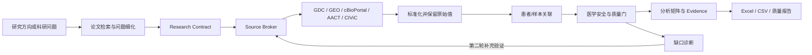

# 乳腺癌精准治疗科研数据智能体

一个面向“从科学问题到可用数据”的中文科研数据 Agent。用户输入研究方向或具体问题后，系统会查找真实论文与开放数据，形成研究方案，调用公开数据库，完成字段标准化、患者/样本关联、医学安全检查和两轮缺口修正，最终导出可分析、可追溯的数据结果。

> 当前生产规划模型为 **Qwen3.8-Max**。模型负责理解与规划，公开数据库负责提供事实，确定性规则负责医学安全和发布边界。本项目不提供临床诊疗建议。


## 快速入口

| 目标 | 入口 |
|---|---|
| 下载完整项目 | [下载 main 分支 ZIP](https://github.com/xsc2466729313-cyber/breast-cancer-research-agent/archive/refs/heads/main.zip) |
| 阅读综合报告 | [综合设计、功能与评测报告](docs/FINAL_INTEGRATED_REPORT_20260829.md) |
| 阅读完整评测 | [Qwen3.8-Max 分层、对比与消融报告](evaluation/reports/qwen38_20260829/FINAL_EVALUATION_REPORT_ZH.md) |
| 查看评测证据 | [可下载评测产物目录](evaluation/reports/qwen38_20260829/) |
| 查看启动状态 | [README_START_HERE.md](README_START_HERE.md) |
| 查看 API 设计 | [最终功能与 API 报告](docs/FINAL_FUNCTION_REPORT_20260828.md) |

## 系统交付什么

输入一个科研问题，例如：

```text
研究 HER2 阳性乳腺癌中 PIK3CA 突变与新辅助治疗响应的关系，
并整理患者级科研数据集。
```

系统输出：

1. 有论文 Evidence 支撑的候选研究问题；
2. 包含人群、变量、结局和字段需求的 Research Contract；
3. GDC、GEO、cBioPortal、ClinicalTrials.gov/AACT、CIViC 等来源的真实检索记录；
4. 保留 `source_id`、`raw_field`、`raw_value` 的患者/样本级分析矩阵；
5. 来源、身份、字段和科研适用性质量门；
6. 基于第一轮缺口进行补充验证的第二轮闭环结果；
7. Excel、CSV 和质量报告。

## 工作流



### 两轮闭环不是重复运行

第一轮保存完整输入、工具调用、来源和结果。第二轮读取第一轮的字段缺口、结局缺口和 Evidence 缺口，生成新的补充请求；当质量门通过、输入重复、没有可验证改进或达到轮次限制时停止。系统同时保留未决缺口，不把“执行了第二轮”写成“问题已经完全解决”。


## 主要能力

| 层级 | 已实现能力 |
|---|---|
| 问题理解 | 中文科研问题解析、PICO/PECO、研究类型、目标字段与 Research Contract |
| 文献证据 | Europe PMC 文献检索、开放全文切片、字段级 Evidence、候选问题生成 |
| 数据源规划 | DatasetCandidate、字段覆盖矩阵、最小来源组合、JoinPolicy 与 fallback |
| 真实数据获取 | GDC/TCGA-BRCA、NCBI GEO、cBioPortal、ClinicalTrials.gov/AACT、CIViC |
| 数据整合 | Canonical Schema、原始值保留、字段字典、患者/样本关联、冲突隔离 |
| 医学安全 | HER2、ERBB2 CNA、低置信度身份、跨 response domain 和高权威冲突门控 |
| 闭环修正 | 第一轮缺口诊断、第二轮补充检索、前后指标与停止原因审计 |
| 数据交付 | 用户端分析矩阵、来源溯源、Excel、CSV、质量报告 |
| 离线评测 | BEIR 分层检索、A-E 查询消融、Qwen/DeepSeek 替换实验、字段与实体匹配测试 |

## 五分钟启动

### 方式一：Docker

前置条件：Git、Docker Desktop。

```powershell
git clone https://github.com/xsc2466729313-cyber/breast-cancer-research-agent.git
cd breast-cancer-research-agent
powershell -ExecutionPolicy Bypass -File .\scripts\docker_up.ps1
```

启动后打开：

- 用户端：<http://localhost:8888>
- API 文档：<http://localhost:8000/docs>
- 健康检查：<http://localhost:8000/health>

停止：

```powershell
docker compose down
```

### 方式二：直接运行

前置条件：Python 3.11 或更高版本。

```powershell
python -m venv .venv
.\.venv\Scripts\Activate.ps1
python -m pip install -r backend\requirements.txt
python -m uvicorn backend.app.main:app --host 127.0.0.1 --port 8000 --reload
```

打开 <http://127.0.0.1:8000/>。FastAPI 同时托管用户端，因此无需再次填写前端端口或 API 地址。

## 连接千问

用户端右上角进入“连接千问 API”，可以手工填写阿里云百炼凭据，也可以导入本地凭据 CSV。默认配置：

```env
DASHSCOPE_API_KEY=
QWEN_BASE_URL=https://dashscope.aliyuncs.com/compatible-mode/v1
QWEN_MODEL=qwen3.8-max
QWEN_WORKSPACE_ID=
QWEN_TIMEOUT_SECONDS=120
```

也可以启动时导入：

```powershell
powershell -ExecutionPolicy Bypass -File .\scripts\docker_up_qwen.ps1 `
  -CredentialCsv "C:\path\百炼-api-key.csv" `
  -Model "qwen3.8-max"
```

安全约束：

- API Key 不得提交到 GitHub；
- CSV 原文件不上传，前端只解析连接所需字段；
- 凭据只保存在后端进程内存中，最长 2 小时；
- 任务只携带随机 `session_id`；
- 凭据不会写入数据库、日志、缓存、任务结果或下载文件；
- 未连接模型时可使用确定性兜底，页面会明确标注。

## API 使用

### 最小任务请求

```http
POST /api/agent/tasks
Content-Type: application/json
```

```json
{
  "question": "研究 HER2 阳性乳腺癌中 PIK3CA 突变与新辅助治疗响应的关系，并整理患者级科研数据集",
  "use_qwen": true,
  "allow_deterministic_fallback": true,
  "data_mode": "live",
  "preferred_sources": [],
  "max_sources": 8,
  "max_records": 10000,
  "iterative_collection": false,
  "max_collection_rounds": 8
}
```

### 核心端点

| 方法 | 路径 | 用途 |
|---|---|---|
| `GET` | `/health` | 服务健康检查 |
| `POST` | `/api/agent/qwen-sessions` | 建立临时千问会话 |
| `DELETE` | `/api/agent/qwen-sessions/{session_id}` | 删除临时会话 |
| `POST` | `/api/agent/tasks` | 创建科研数据任务 |
| `GET` | `/api/agent/tasks/{task_id}` | 查询任务结果 |
| `POST` | `/api/v2/agent/closed-loop` | 运行两轮闭环 |
| `GET` | `/api/v2/agent/closed-loop/{loop_id}` | 查询闭环审计 |
| `GET` | `/api/agent/tasks/{task_id}/export/xlsx` | 下载 Excel |
| `GET` | `/api/agent/tasks/{task_id}/export/csv` | 下载 CSV |
| `GET` | `/api/agent/tasks/{task_id}/export/quality_report` | 下载质量报告 |

完整请求模型和响应结构以启动后的 `/docs` 为准。

## 可核查评测结果

评测不在用户端展示，统一放在报告和可下载证据目录中。下面只给出当前最重要的结论：

| 实验 | 数据范围 | 对照组 | **本项目结果** | 结论 |
|---|---|---:|---:|---|
| BEIR 公开检索 | 5 个数据集、3,677 条查询 | BM25 nDCG@10 0.3147 | **BGE 0.3880** | BGE 作为当前语义检索候选 |
| BEIR 深层召回 | 同上 | BM25 Recall@100 0.5552 | **BGE 0.6554** | 语义召回更完整 |
| 查询理解 A-E 消融 | 75 条冻结查询 | A nDCG 0.3151 / Recall 0.5557 | E nDCG 0.3007 / **Recall 0.5726** | E 增加召回但损害排序，不全局启用 |
| 中间智能体替换 | 3 题×3 次/组 | DeepSeek Recall@3 0.6667 | **Qwen3.8-Max 1.0000** | 小样本工程对照，不外推通用排名 |
| 两轮闭环 | 1 个真实 Qwen 任务 | 第一轮 target match 0.82 | **第二轮 1.00** | 改善目标匹配，但仍有 2 个缺口 |
| 正式 SDTI | 冻结乳腺癌 Gold Set | 未具备 | `NOT_EVALUATED` | 不用代理指标填充 |

公开检索的五数据集分层、Recall/MRR、Qwen/DeepSeek 延迟与 Analysis Ready、查询长度分层和失败边界详见：

- [综合设计、功能与评测报告](docs/FINAL_INTEGRATED_REPORT_20260829.md)
- [完整分层、模型对比与消融报告](evaluation/reports/qwen38_20260829/FINAL_EVALUATION_REPORT_ZH.md)
- [报告指标摘要 JSON](evaluation/reports/qwen38_20260829/report_metrics_summary.json)
- [A-E 消融原始结果](evaluation/reports/qwen38_20260829/query_understanding_ablation.json)
- [Qwen/DeepSeek 替换实验原始结果](evaluation/reports/qwen38_20260829/planner_replacement_ablation.json)

这些指标只评价对应能力层，不能相加为一个“模型总分”，也不能解释为临床疗效。正式 Retrieval F1、Faithfulness、Traceability、Error F1、Repair Accuracy 和 SDTI 需要冻结乳腺癌 Gold Set。

## 医学安全边界

- HER2 IHC 2+ 不得直接自动判为 HER2 Positive；
- ERBB2 CNA amplification 不等同于 HER2 IHC positive；
- 低置信度患者/样本关联进入 `unresolved/review`；
- 高权威来源发生不可解释冲突时不自动选边；
- 细胞系 `AUC/IC50` 与患者 `pCR/response` 通过 `response_domain` 区分；
- 患者、细胞系、临床试验和知识证据不强行拼成同一患者表；
- 上游数据被截断时，缺失记录不得解释为确定阴性。

冻结规范：

- [Canonical Schema](configs/canonical_schema.yaml)
- [医学安全规则](configs/medical_rules.yaml)
- [质量规则](configs/quality_rules.yaml)
- [冻结 SDTI 公式](docs/06_评测指标与SDTI.md)

## 界面与结果示例

### 桌面端与移动端

<p align="center">
  
  
</p>

### 数据矩阵与来源溯源

用户运行任务后，可在高级数据工作台查看患者/样本级数据、质量门、字段字典和来源路径。所有来源连线表示检索与选择关系，不表示跨研究患者拼接。

## 数据与 GitHub 边界

仓库不会提交 API Key、大型公开原始数据、本机缓存或含隐私的患者数据。其他使用者可通过来源编号和 Adapter 重新下载公开数据。

| 内容 | GitHub 中的处理 |
|---|---|
| 代码、配置、测试和文档 | 提交 |
| 脱敏评测报告与精简 JSON | 提交到 `evaluation/reports/` |
| API Key 与工作空间凭据 | 不提交 |
| 大型 BEIR/GEO/GDC 下载缓存 | 不提交，可按脚本复现 |
| 完整闭环运行原始 JSON | 默认不提交，可能包含大量公开记录 |
| 人工 Gold Set | 完成许可和脱敏后单独发布 |

## 测试与复现

运行全量测试：

```powershell
python -m pytest -q
node --check frontend\app.js
```

重新生成报告指标摘要：

```powershell
python scripts\export_report_benchmark_summary.py `
  --output evaluation\reports\qwen38_20260829\report_metrics_summary.json
```

公开评测入口：

```powershell
python scripts\run_public_retrieval_benchmark.py --download
python scripts\run_public_schema_benchmark.py --download
python scripts\run_public_entity_benchmark.py --download
python scripts\run_public_cleaning_benchmark.py --download
```

## 目录结构

```text
backend/app/agent/            Qwen 客户端、任务编排、闭环和导出
backend/app/research_planning Topic、文献、Research Contract 与 Planning RAG
backend/app/source_broker/    数据源候选、字段覆盖和 JoinPolicy
backend/app/sources/          GDC、GEO、cBioPortal、AACT、CIViC Adapter
backend/app/normalization/    医学实体和冻结 Schema 标准化
backend/app/integration/      患者/样本关联、冲突检测和 Evidence 融合
backend/app/repair/           确定性修复、审计和医学安全门
backend/app/evaluation/       Gold Set、SDTI 和公开评测
frontend/                     中文用户端与高级数据工作台
configs/                      冻结 Schema、医学规则、质量规则和评测配置
evaluation/reports/           可下载评测报告和脱敏证据
docs/                         系统设计、功能、部署和验收文档
scripts/                      Docker、模型连接和评测脚本
```

## 当前限制

- 正式乳腺癌 Gold Set 尚未冻结，因此 SDTI 不能报告；
- Qwen/DeepSeek 只有 3 条题、每题 3 次的受控替换实验，不代表通用模型排名；
- 公开 benchmark 反映模块能力，不等于完整 Agent 或临床效果；
- 大型数据下载受网络、上游服务和本机存储影响；
- 高风险医学字段和患者身份冲突仍需人工复核。

项目遵循“有真实来源才写入、有冻结 Gold Set 才报正式分数、发现缺口就明确保留”的原则。
