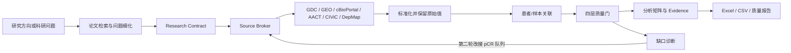

# 乳腺癌精准治疗科研数据智能体

一个面向“从科学问题到可用数据”的中文科研数据 Agent。用户输入研究方向或具体问题后，系统会查找真实论文与开放数据，形成研究方案，调用公开数据库，完成字段标准化、患者/样本关联、医学安全检查和两轮缺口修正，最终导出可分析、可追溯的数据结果。

> 当前生产规划模型为 **Qwen3.8-Max**。模型负责理解与规划，公开数据库负责提供事实，确定性规则负责医学安全和发布边界。本项目不提供临床诊疗建议。


## 快速入口

| 目标 | 入口 |
|---|---|
| GitHub 仓库 | https://github.com/xsc2466729313-cyber/breast-cancer-research-agent |
| **分层指标对照（真实数字）** | [docs/DATA_REPORT_20260829.md](docs/DATA_REPORT_20260829.md) |
| 综合设计与评测 | [综合设计、功能与评测报告](docs/FINAL_INTEGRATED_REPORT_20260829.md) |
| 完整分层消融 | [Qwen3.8-Max 分层、对比与消融](evaluation/reports/qwen38_20260829/FINAL_EVALUATION_REPORT_ZH.md) |
| 生产主链 | [docs/CURRENT_MAINLINE.md](docs/CURRENT_MAINLINE.md) |
| 从这里开始 | [README_START_HERE.md](README_START_HERE.md) |

## 分层怎么看（不要混成一个总分）

| 分层 | 看什么 | 当前大数字 | 不能据此声称 |
|---|---|---|---|
| 检索能力层 | BEIR：BM25 vs BGE vs 融合 | BGE nDCG@10 **0.3880** vs BM25 **0.3147**（3,677 查询） | 不是乳腺癌正式 Retrieval F1 |
| 字段 / Schema 层 | Valentine 10 任务 | 生产 V2 F1 **0.8451**（V3 0.7994，未切默认） | 不是医学 Gold Set |
| 实体层 | DeepMatcher 5 任务 | 生产 V2 F1 **0.7408** | 不是患者身份正式分 |
| 质量门 | 来源 / 字段 / 实体 / 适用性 | 研究任务上经常 **REVIEW**；正式卷安全门 **FAIL** | 过门 ≠ SDTI 达标 |
| 评测层 SDTI | 正式考卷 vs 练习册 | 正式 **63.36** / 非正式 **66.94** | 66.94 禁止进正式栏 |

完整对照表、分项分子分母、五数据集 nDCG 见数据报告。看板「结果对照」用同一张 BM25/BGE 表。

## 总对照：正式 vs 非正式

| 指标 | 非正式 development 千问 LIVE | **正式 official_candidate** | 目标 |
|---|---:|---:|---:|
| **SDTI** | 66.94 | **63.36** | 90 |
| retrieval_f1 | 0.588 | **0.449** | 0.9 |
| faithfulness | 0.771 | **0.654** | 0.95 |
| traceability | 1.000 | **1.000** | 1.0 |
| error_f1 | 0.593 | **0.696** | 0.9 |
| repair_accuracy | 0.50 | **0.50** | 0.9 |
| publish_allowed | false | **false** | true |

正式评测 ID：`official-candidate-20260829T132222Z`，审核人 xsc，**不是** `frozen_test`。练习册 ID：`development-xsc-qwen-live-20260829`。数字抄自各自 `metrics.json`。

## 检索层：BM25 vs BGE（看板同一张）

| 数据集 | n | BM25 nDCG@10 | BGE nDCG@10 | 融合 | BGE Δ |
|---|---:|---:|---:|---:|---:|
| SciFact | 300 | 0.6044 | **0.6803** | 0.6803 | +0.0759 |
| NFCorpus | 323 | 0.2902 | **0.3315** | 0.3318 | +0.0413 |
| SciDocs | 1,000 | 0.1490 | **0.1910** | 0.1563 | +0.0420 |
| ArguAna | 1,406 | 0.3067 | **0.3836** | 0.3741 | +0.0768 |
| FiQA | 648 | 0.2230 | **0.3533** | 0.3533 | +0.1304 |
| **宏平均** | **3,677** | **0.3147** | **0.3880** | 0.3791 | +0.0733 |

BGE Recall@100 宏平均 **0.6554** vs BM25 **0.5552**。这是公开检索层，不是正式 Gold Set 检索分。

## 其他已跑对照（能力层，不是正式 SDTI）

| 实验 | 数据范围 | 对照 | **本项目** | 边界 |
|---|---|---:|---:|---|
| 查询理解 A–E | 75 条冻结查询 | A nDCG 0.3151 / R 0.5557 | E nDCG 0.3007 / **R 0.5726** | E 伤排序，不全局启用 |
| 中间智能体 | 3 题×3 次 | DeepSeek Recall@3 0.6667 | **Qwen 1.0000** | 两组 9/9 REVIEW；不外推排名 |
| 两轮闭环 | 1 个真实 Qwen 任务 | 第一轮 target match 0.82 | **第二轮 1.00** | 行数仍 141，缺口仍 2 |

## 研究任务观察（不是正式分）

代表题：HER2 阳性 × PIK3CA × 新辅助响应。

- METABRIC **848×46**：生存域，治疗响应分析集 **0**，质量门 **REVIEW**（有表但结局不匹配）。
- GSE76360：**50** 例基线、48 例有响应，公开矩阵 **无 PIK3CA**。
- 闭环已接线：缺 pCR 改搜 GSE25066 等；**旧任务结果不会自动过门**。缺 HER2 / pCR 的还是缺。

## 系统交付什么

```text
研究 HER2 阳性乳腺癌中 PIK3CA 突变与新辅助治疗响应的关系，
并整理患者级科研数据集。
```

系统会尝试输出 Research Contract、公开库记录、保留 `source_id` / `raw_field` / `raw_value` 的矩阵、四层质量门、两轮闭环和 Excel/CSV。**当前这些输出经常仍不完整。**



## 怎么启动

```powershell
python -m venv .venv
.\.venv\Scripts\Activate.ps1
python -m pip install -r backend\requirements.txt
python -m uvicorn backend.app.main:app --host 127.0.0.1 --port 8000 --reload
```

打开 <http://127.0.0.1:8000/>。Docker：`.\scripts\docker_up.ps1` → 用户端 <http://localhost:8888>。

千问在右上角连接。凭据只进进程内存，**不要提交 `.env` 或密钥**。

## 医学安全边界

- HER2 IHC 2+ 不得直接自动判为 HER2 Positive
- ERBB2 CNA amplification 不等同 HER2 IHC positive
- 低置信度患者/样本关联进入 `unresolved/review`
- 高权威来源不可解释冲突不得自动选边
- 细胞系 `AUC/IC50` 与患者 `pCR/response` 用 `response_domain` 区分

冻结接口：`configs/canonical_schema.yaml`、`configs/medical_rules.yaml`、`docs/06_评测指标与SDTI.md`（公式不得改）。

## 测试

```powershell
python -m pytest -q
node --check frontend\app.js
```
