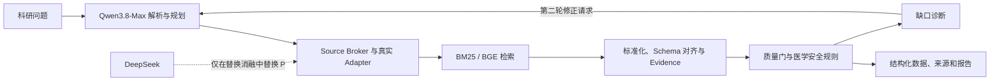

# Qwen3.8-Max 系统完整评测与消融报告

> 运行日期：2026-08-29。本文只汇总可追溯的实际运行，不把模型自评当作 Gold Set，也不把检索层指标解释成临床有效性。正式乳腺癌 Gold Set 尚未冻结，因此 Retrieval F1、Faithfulness、Traceability、Error F1、Repair Accuracy 和 SDTI 继续标记为 `NOT_EVALUATED`。

> 展示位置说明：本报告是 benchmark、分层对比、模型替换和消融实验的唯一展示入口。用户前端只保留研究输入、真实数据处理、质量门、两轮闭环反馈和结果导出，不展示跨模型排名或开发评测表。

## 1. 先回答评委最关心的问题

本轮要区分三个问题：公开语料上哪种检索器更强；Qwen 查询理解是否能在相同检索器上带来增益；把生产中间智能体替换为 DeepSeek 后，乳腺癌任务表现如何变化。三类实验的样本、指标和含义不同，不能混成一个“模型总分”。

### 1.1 先分清各组是谁

| 实验 | 对照组 | 实验组/替换组 | 只改变什么 | 回答的问题 |
|---|---|---|---|---|
| 公开检索 | Tuned BM25 | **本项目 BGE**、**本项目 BM25+BGE 融合** | 检索器 | 语义检索是否比词法检索更有效 |
| 查询理解消融 | A_raw 原始查询 | B_rules、C_qwen_single、D_qwen_multi、E_rules_qwen | 查询改写方式 | 规则或 Qwen 改写是否带来稳定增益 |
| 中间智能体替换 | **本项目生产模型 Qwen3.8-Max** | DeepSeek Chat | 只替换解析、规划和工具选择模型 | 更换中间智能体后来源排序如何变化 |
| 两轮闭环 | 第一轮原始任务 | **同一 Qwen 任务的第二轮补充验证** | 第二轮读取第一轮缺口后再检索 | 自我修正是否补齐目标，而非模型间排名 |

DeepSeek 只出现在第三项替换实验中；它不是生产模型，也不是评审器。两轮闭环也不是 Qwen 与 DeepSeek 的比较，而是同一 Qwen 任务前后两轮的纵向比较。

### 1.2 一张表看懂当前证据

| 能力 | 数据范围 | 对照结果 | **本项目/第二轮结果** | 当前判断 | 不能据此声称 |
|---|---|---:|---:|---|---|
| 公开检索 | BEIR 5 集、3,677 条查询 | BM25 nDCG@10 0.3147 | **BGE 0.3880** | BGE 是当前公开检索默认候选 | 不代表乳腺癌临床效果 |
| 深层召回 | 同上 | BM25 Recall@100 0.5552 | **BGE 0.6554** | 语义召回更完整 | 不等于正式 Retrieval Recall |
| 查询理解消融 | 75 条冻结查询 | A：nDCG 0.3151 / Recall 0.5557 | E：nDCG 0.3007 / **Recall 0.5726** | E 提高召回但损害前排排序，不全局启用 | 不能只取 Recall 宣称全面提升 |
| 中间智能体替换 | 3 题×3 次/组 | **Qwen Recall@3 1.0000** | DeepSeek 0.6667 | Qwen 的 top-3 来源排序更稳定 | 样本小，不能形成通用模型排名 |
| 两轮闭环 | 1 个真实 Qwen 任务 | 第一轮 target match 0.82 | **第二轮 1.00** | 第二轮完成定向补充验证 | 未消除 2 个缺口，不等于完全解决 |
| 正式 SDTI | 冻结乳腺癌 Gold Set | 未具备 | `NOT_EVALUATED` | 暂不报告分数 | 不能用以上任一代理指标替代 |

本轮可据实给出的结论是：

1. **公开 BEIR 检索层中，项目已集成的 BGE-small-en-v1.5 宏平均 nDCG@10 为 0.3880，优于 tuned BM25 的 0.3147。**
2. **Qwen3.8-Max 在 3 条乳腺癌 provisional 题、每题重复 3 次的中间智能体替换实验中，Recall@3、MRR@3 和 nDCG@3 均为 1.0000；DeepSeek 替换组均为 0.6667。**
3. Qwen 查询改写并未在 75 条冻结公开查询上全面胜过原始查询。E 组把 Recall@100 从 0.5557 提高到 **0.5726**，但 nDCG@10 从 0.3151 降到 0.3007，因此不应直接替换生产默认。
4. **真实 Qwen 两轮闭环把 target match 从 0.82 提高到 1.00，progress score 从 0.92 提高到 0.96**；但 unresolved gaps 仍为 2，说明第二轮是定向补齐，不是所有维度一起提升。

## 2. 系统与实验边界

- 生产主链：Qwen3.8-Max。
- DeepSeek：只在独立实验中替换问题解析、规划和工具选择，不进入生产前端，也不担任评审器。
- 医学安全、数据 Adapter、预算和后续处理：Qwen/DeepSeek 两组保持一致。
- Qwen Judge：只作辅助诊断，不是 Ground Truth。

## 3. 公开数据集横向检索对比

### 3.1 对比组含义

| 组别 | 身份 | 作用 |
|---|---|---|
| Tuned BM25 | 项目词法基线 | 不使用模型改写 |
| **BGE-small-en-v1.5** | **项目已集成的开源语义检索器** | 语义向量召回 |
| **BM25+BGE Fusion** | **项目融合检索器** | train/dev 选权重，test 只报告 |

### 3.2 五个 BEIR 测试集全量结果

| 方法 | 数据集数 | 测试查询数 | nDCG@10 | Recall@100 | MRR@10 |
|---|---:|---:|---:|---:|---:|
| Tuned BM25 | 5 | 3,677 | 0.3147 | 0.5552 | 0.3629 |
| **BGE-small-en-v1.5** | **5** | **3,677** | **0.3880** | **0.6554** | **0.4421** |
| **BM25+BGE Fusion** | **5** | **3,677** | **0.3791** | **0.6422** | **0.4277** |

与 BM25 相比，BGE 的 nDCG@10、Recall@100、MRR@10 分别增加 0.0733、0.1002、0.0792。该结果说明语义检索是当前公开检索层最可靠的增益来源；它不代表临床数据整合或 SDTI 已达到同样水平。

### 3.3 按公开数据集分层

| 公开数据集 | 任务类型 | 查询数 | BM25 nDCG@10 | **本项目 BGE nDCG@10** | 绝对变化 |
|---|---|---:|---:|---:|---:|
| SciFact | 科学事实核验 | 300 | 0.6044 | **0.6803** | **+0.0759** |
| NFCorpus | 生物医学检索 | 323 | 0.2902 | **0.3315** | **+0.0413** |
| SciDocs | 科学论文检索 | 1,000 | 0.1490 | **0.1910** | **+0.0420** |
| ArguAna | 长论证检索 | 1,406 | 0.3067 | **0.3836** | **+0.0768** |
| FiQA | 金融问答检索 | 648 | 0.2230 | **0.3533** | **+0.1304** |

BGE 在五个分层上的 nDCG@10 均高于 BM25，因此宏平均改善不是由单一数据集偶然拉高。NFCorpus 的增益最小，说明生物医学检索仍是需要继续优化的层；FiQA 的增益最大，但它属于跨领域问答，只用于检验通用检索能力，不能被包装成乳腺癌专项成绩。

## 4. 查询理解 A–E 消融

### 4.1 对照和实验组

| 组别 | 类型 | 唯一变化 |
|---|---|---|
| A_raw | 对照组 | 原始查询 + tuned BM25 |
| B_rules | 非模型消融 | 规则扩展 + 固定 `k=60` RRF |
| C_qwen_single | Qwen 实验组 | Qwen 单关键词查询 + BM25 |
| D_qwen_multi | Qwen 实验组 | Qwen 多查询 + 固定 `k=60` RRF |
| E_rules_qwen | 组合实验组 | 规则查询 + Qwen 查询 + 固定 `k=60` RRF |

75 条查询来自 SciFact、NFCorpus、SciDocs、ArguAna、FiQA，每集 15 条，并在每集内部按查询 token 长度分为短、中、长各 5 条。规划器只接收查询文本和冻结查询 ID，不接收相关文档 ID、gain 或 qrels。75 条计划最终 75/75 有效、0 回退；其中 19 条由确定性保护词补回器修复遗漏的标识符、数字、引号短语或否定词。

### 4.2 75 条共同子集宏平均

| 方法 | nDCG@10 | Recall@100 | MRR@10 | 相对 A 的主要变化 |
|---|---:|---:|---:|---|
| **A_raw 对照组** | **0.3151** | 0.5557 | **0.3538** | 基准 |
| B_rules | 0.3117 | 0.5490 | 0.3480 | 三项均小幅下降 |
| C_qwen_single | 0.2916 | 0.5520 | 0.3234 | nDCG -0.0235 |
| D_qwen_multi | 0.2913 | 0.5449 | 0.3218 | nDCG -0.0238 |
| E_rules_qwen | 0.3007 | **0.5726** | 0.3436 | Recall +0.0169，nDCG -0.0144 |

规划生成发生在离线缓存阶段，因此表中检索延迟不包含模型 API 时间，不能用 C 组较低的检索延迟宣称端到端更快。

### 4.3 按公开数据集分层

| 数据集 | 方法 | nDCG@10 | Recall@100 | MRR@10 |
|---|---|---:|---:|---:|
| SciFact | A_raw | **0.4812** | 0.6933 | **0.4778** |
| SciFact | C_qwen_single | 0.4685 | **0.7533** | 0.4567 |
| SciFact | E_rules_qwen | 0.4684 | 0.7400 | 0.4500 |
| NFCorpus | A_raw | 0.3354 | 0.1439 | **0.5356** |
| NFCorpus | D_qwen_multi | 0.3272 | 0.1772 | 0.4950 |
| NFCorpus | E_rules_qwen | **0.3422** | **0.1816** | 0.5300 |
| SciDocs | A_raw | **0.2074** | **0.5200** | 0.3308 |
| SciDocs | E_rules_qwen | 0.1973 | 0.5200 | **0.3329** |
| ArguAna | A_raw | **0.3930** | 0.8667 | **0.2462** |
| ArguAna | C_qwen_single | 0.2685 | **0.9333** | 0.1340 |
| ArguAna | E_rules_qwen | 0.3278 | 0.8667 | 0.2029 |
| FiQA | A_raw | 0.1585 | **0.5545** | 0.1784 |
| FiQA | D_qwen_multi | **0.1858** | 0.4073 | **0.2040** |
| FiQA | E_rules_qwen | 0.1675 | **0.5545** | 0.2022 |

上表只保留能说明差异的 A/C/D/E 行，完整五组结果在原始 JSON 中。SciFact 和 NFCorpus 显示 Qwen 改写可提高深层召回；ArguAna 显示长论证查询被压缩后，首屏排序明显变差。这是宏平均没有全面提升的主要原因。

### 4.4 按查询长度分层

| 层级 | 方法 | nDCG@10 | Recall@100 | MRR@10 |
|---|---|---:|---:|---:|
| 短查询 | A_raw | **0.3213** | 0.4949 | 0.3677 |
| 短查询 | E_rules_qwen | 0.3033 | **0.5266** | 0.3577 |
| 中查询 | A_raw | **0.3670** | 0.6687 | **0.4024** |
| 中查询 | C_qwen_single | 0.3108 | **0.6912** | 0.3140 |
| 中查询 | E_rules_qwen | 0.3395 | 0.6884 | 0.3730 |
| 长查询 | A_raw | 0.2570 | **0.5035** | 0.2911 |
| 长查询 | D_qwen_multi | 0.2378 | 0.4921 | 0.2709 |
| 长查询 | E_rules_qwen | **0.2592** | 0.5027 | **0.3000** |

E 组在短、中查询上提高 Recall，但没有同时提高 nDCG；长查询几乎没有稳定收益。因此更合理的后续方案是基于查询类型做路由，而不是全局开启多查询。

### 4.5 全量 A/B 验证

| 方法 | 查询数 | nDCG@10 | Recall@100 | MRR@10 |
|---|---:|---:|---:|---:|
| **A_raw** | **3,677** | **0.3147** | **0.5552** | **0.3629** |
| B_rules | 3,677 | 0.3147 | 0.5532 | 0.3619 |

全量结果再次表明规则扩展没有形成通用增益，生产保持 raw/compat 默认是当前更稳妥的选择。

## 5. Qwen3.8-Max 与 DeepSeek 中间智能体替换实验

### 5.1 公平性口径

- 题目：3 条 provisional 乳腺癌科研检索题，easy/medium/hard 各 1 条。
- 重复：每题 3 次，每组 9 次 live 运行。
- 固定条件：最多 3 个来源入口、500 条记录、2 轮采集。
- 对照组：**Qwen3.8-Max 中间智能体**。
- 实验组：仅将中间智能体换成 DeepSeek Chat。
- 共同摘要器和辅助评审：均固定为 Qwen3.8-Max。

### 5.2 主结果

| 指标 | **Qwen3.8-Max 对照组** | DeepSeek 替换组 | 更优组 |
|---|---:|---:|---|
| 完成运行 | **9/9** | 9/9 | 持平 |
| Recall@3 | **1.0000** | 0.6667 | **Qwen** |
| MRR@3 | **1.0000** | 0.6667 | **Qwen** |
| nDCG@3 | **1.0000** | 0.6667 | **Qwen** |
| Recall@5 | **1.0000** | 1.0000 | 持平 |
| 平均延迟 | 22.09 s | **16.24 s** | DeepSeek |
| Analysis Ready | 3/9（33.33%） | **5/9（55.56%）** | DeepSeek |
| Quality Gate | 9/9 REVIEW | 9/9 REVIEW | 持平 |

### 5.3 难度分层

| 难度 | **Qwen Recall@3** | DeepSeek Recall@3 |
|---|---:|---:|
| easy | **1.0000** | 1.0000 |
| medium | **1.0000** | 0.0000 |
| hard | **1.0000** | 1.0000 |

DeepSeek 的 medium 题三次都把期望来源排在第 4 位，这是 top-3 指标差异的直接原因。Qwen 在来源排序上更稳定；DeepSeek 更快、返回数据行更多，也更容易达到 Analysis Ready。两组全部 REVIEW，不能据此宣称 Qwen 已产生可直接发表的数据集。

主 18 次运行的 Qwen Judge 因上下文过大断连，分数未计入主表。压缩评审上下文后的独立 1 题 × 两组探针达到 2/2 有效；该探针只证明评审链路恢复，不能并入主结果或用于模型排名。

## 6. Qwen3.8-Max 两轮闭环实测

测试问题为“研究 HER2 阳性乳腺癌中 PIK3CA 突变与新辅助治疗响应的关系”，两轮均为 live，且两轮都实际调用 Qwen3.8-Max。

| 指标 | **第一轮** | **第二轮** | 变化 |
|---|---:|---:|---:|
| Progress score | 0.915 | **0.960** | **+0.045** |
| Required field coverage | **1.00** | **1.00** | 0 |
| Target match | 0.82 | **1.00** | **+0.18** |
| Traceability | **1.00** | **1.00** | 0 |
| Review burden | 0.01 | 0.01 | 0 |
| Unresolved gaps | 2 | 2 | 0 |
| 登记来源 | 63 | **68** | +5 |
| 候选来源 | 34 | **39** | +5 |
| 数据行 | 141 | 141 | 0 |
| 任务内 Quality Gate | PASS | PASS | 持平 |

第二轮的有效作用是补充验证并把 target match 补到 1.00；它没有增加最终数据行，也没有消除剩余两个关键缺口。该 progress score 是同一任务内的诊断分，不是 Repair Accuracy、临床正确率或 SDTI。

## 7. 哪些指标仍不能报告

| 指标 | 状态 | 原因 |
|---|---|---|
| 正式乳腺癌 Retrieval Precision / Recall / F1 | `NOT_EVALUATED` | 科研问题—数据集 Gold Set 未冻结 |
| Faithfulness | `NOT_EVALUATED` | 缺少人工/双模型复核后的字段级 Gold |
| 正式 Traceability | `NOT_EVALUATED` | 任务内诊断值不能替代冻结抽检口径 |
| Error F1 | `NOT_EVALUATED` | 乳腺癌 Error Gold Set 未冻结 |
| Repair Accuracy | `NOT_EVALUATED` | 高风险修复尚未完成正式审定 |
| SDTI | `NOT_EVALUATED` | 五个组成指标未同时正式评测 |

## 8. 当前决策与下一步

1. 生产中间智能体继续使用 **Qwen3.8-Max**；DeepSeek 仅保留为对照实验适配器。
2. 公开语义检索优先保留项目已验证的 **BGE-small-en-v1.5**；融合并非每个数据集都优于纯 BGE。
3. 查询理解继续保持 `compat/raw` 默认。E 组可作为短/中查询的候选召回增强，但在更大冻结样本和路由阈值验证前不全局启用。
4. 两轮闭环保留，因为本轮确实改善 target match；同时必须展示 unresolved gaps，避免把“完成两轮”误写成“问题已完全解决”。
5. 下一项真正决定正式成绩的工作不是继续换模型，而是冻结乳腺癌 Gold Set 并完成人工高风险复核。

## 9. 证据索引

- `query_subset_manifest.json`：75 条冻结查询、数据集和长度分层。
- `qwen38_query_plan_cache_final_v2.json`：75 条 Qwen 计划、v2 校验和保护词补回审计。
- `query_understanding_ablation.json`：75 条 A–E 总体、数据集和长度分层原始结果。
- `query_understanding_full_ab.json`：3,677 条全量 A/B 结果。
- `closed_loop_qwen38_live.json`：Qwen 两轮闭环完整输入、诊断、动作、结果和审计。
- `report_metrics_summary.json`：供本报告复核的总体、分层、消融、模型替换和闭环摘要，不由用户前端加载。
- `../planner_replacement_qwen38_20260829/planner_replacement_ablation.json`：Qwen/DeepSeek 主 18 次运行。
- `../planner_qwen38_judge_probe/planner_replacement_ablation.json`：Judge 修复后的 2 次链路探针。
- `../../../../evaluation/vnext_retrieval_calibrated_macro_20260828.json`：BM25、BGE 和融合的五数据集公开检索结果。

以上文件均不包含 API Key。本轮未提交或推送 GitHub。
