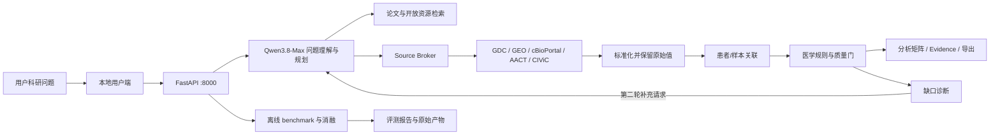

# 乳腺癌精准治疗科研数据智能体
# 综合设计、功能与评测报告

> 版本：2026-08-29（Qwen3.8-Max 最终实测口径）
>
> 本地服务：`http://127.0.0.1:8000`
>
> 证据原则：只报告可追溯运行结果；公开检索、开发消融和任务内诊断不冒充临床效果或正式 SDTI。

## 一、先看结论

本项目面向“从科学问题到可用数据”的场景。用户输入乳腺癌科研问题后，系统完成问题结构化、公开来源检索、数据解析、字段对齐、患者/样本关联、医学安全核验、两轮缺口修正和可追溯导出。Qwen3.8-Max 负责理解与规划；真实数据由 GDC、GEO、cBioPortal、ClinicalTrials.gov/AACT、CIViC 等适配器获取；医学规则和发布门由确定性程序控制。

评测与用户工作流分开。用户前端只展示完成研究所需的输入、处理状态、质量门、数据矩阵、来源和本次任务的两轮闭环反馈；跨模型比较、公开 benchmark 和消融实验只写入报告，不占用用户端页面。

### 1.1 当前可核查结果

| 能力 | 数据范围 | 对照组 | **本项目结果** | 结论边界 |
|---|---|---:|---:|---|
| 公开检索排序 | BEIR 5 集、3,677 条查询 | BM25 nDCG@10 0.3147 | **BGE 0.3880** | 通用检索层，不是临床效果 |
| 公开检索召回 | 同上 | BM25 Recall@100 0.5552 | **BGE 0.6554** | 不等于正式乳腺癌 Retrieval Recall |
| 公开检索首个相关结果 | 同上 | BM25 MRR@10 0.3629 | **BGE 0.4421** | 只评价排序位置 |
| 字段对齐 | Valentine 10 个公开任务 | V3 F1 0.7994 | **生产 V2 F1 0.8451** | 通用 Schema 匹配，不是医学 Gold Set |
| 实体关联 | DeepMatcher 5 个公开任务 | V3 F1 0.5579 | **生产 V2 F1 0.7408** | 不等于患者身份匹配正式成绩 |
| 中间智能体替换 | 3 题×3 次/组 | DeepSeek Recall@3 0.6667 | **Qwen3.8-Max 1.0000** | 小样本受控实验，不形成通用模型排名 |
| 两轮闭环 | 1 个真实 Qwen 任务 | 第一轮 target match 0.82 | **第二轮 1.00** | 仍有 2 个未决缺口 |
| 正式 SDTI | 冻结乳腺癌 Gold Set | 未具备 | `NOT_EVALUATED` | 不使用代理分数填充 |

上述结果回答的是“哪些模块在相同条件下更适合作为当前默认方案”，而不是宣称系统已经超过所有外部模型。正式乳腺癌 Retrieval F1、Faithfulness、Traceability、Error F1、Repair Accuracy 和 SDTI 仍需冻结 Gold Set 与人工复核。

## 二、问题、矛盾与设计判断

科研数据整合的难点不是生成一段回答，而是把多源异构记录整理成可分析、可复核的数据。直接依赖大模型会产生三类风险：来源可能不真实，医学概念可能被错误合并，患者/样本身份可能被过度关联。因此系统采用“模型提出计划、程序执行取数、规则守住边界、证据支持发布”的分工。

这一判断对应四个核心设计：

1. 模型只生成结构化研究需求与工具计划，不直接创造患者事实；
2. 每条外部数据保留 `source_id`，标准化后保留 `raw_field` 和 `raw_value`；
3. HER2、ERBB2 CNA、患者身份和 response domain 由冻结规则约束；
4. 第二轮只根据第一轮可验证缺口补充检索，不允许无证据“自我改好”。

## 三、系统架构

模型、数据和安全层之间不是简单串联。Source Broker 将研究字段需求转换为候选数据源；质量门检查返回数据是否满足研究问题；缺口诊断再把缺失字段、结局或 Evidence 转换为第二轮可执行请求。因此闭环传递的是可审计缺口，不是模型的主观自评。

## 四、用户端保留的核心功能

| 用户动作 | 系统行为 | 用户可见结果 |
|---|---|---|
| 输入研究方向 | 检索真实论文并生成候选问题 | 论文 Evidence、研究问题建议 |
| 确认研究问题 | 生成 PICO/PECO 与字段需求 | Research Contract |
| 启动真实任务 | 调用公开数据库适配器 | 工具状态、数据来源 |
| 运行标准化 | 对齐字段并保留原始值 | 患者/样本级分析矩阵 |
| 通过质量门 | 检查来源、字段、身份和科研适用性 | PASS / REVIEW / REJECT 与原因 |
| 启用两轮闭环 | 第二轮读取第一轮缺口并补充验证 | 两轮差异、停止原因、未决缺口 |
| 下载结果 | 生成 Excel、CSV 和质量报告 | 可复用数据与审计文件 |

跨模型排名、BEIR 分层表、开发消融和正式指标缺口不在用户端展示，统一放在本报告第六至第九节。

## 五、接口与本地部署

### 5.1 本地入口

- 用户端：`GET http://127.0.0.1:8000/`
- 健康检查：`GET http://127.0.0.1:8000/health`
- OpenAPI：`GET http://127.0.0.1:8000/docs`
- 研究任务：`POST /api/agent/tasks`
- 两轮闭环：`POST /api/v2/agent/closed-loop`
- 查询闭环结果：`GET /api/v2/agent/closed-loop/{loop_id}`
- 导出：`GET /api/agent/tasks/{task_id}/export/{format}`

前端与 API 使用同一 `127.0.0.1:8000` 地址，使用者无需重复填写端口。千问 API Key 可通过本地连接窗口临时提交，最长保留 2 小时，只存在后端进程内存中，不写入仓库、数据库、日志或下载文件。

### 5.2 GitHub 不应上传的数据

| 内容 | 处理方式 |
|---|---|
| API Key、业务空间凭据 | 只放本地 `.env` 或临时内存会话 |
| 大型公开原始数据 | 通过来源编号和 Adapter 重新下载 |
| 临时模型缓存 | 用脚本重新生成并记录模型、时间和参数 |
| 评测运行产物 | 可按需要发布脱敏 JSON；不得包含凭据 |
| 人工 Gold Set | 完成许可与脱敏检查后单独发布 |

## 六、公开检索：总体与分层对比

### 6.1 实验角色

| 角色 | 方法 | 说明 |
|---|---|---|
| 对照组 | Tuned BM25 | 本项目在相同公开测试集上重跑的词法基线 |
| **本项目实验组** | **BGE-small-en-v1.5** | 项目集成的语义检索器 |
| **本项目消融变体** | **BM25+BGE Fusion** | train/dev 选择权重，test 只报告 |

BM25 是本项目重跑的对照方法，不是“别人公布的成绩”；BGE 和融合是本项目当前实现。三组使用同一 BEIR 测试范围和评价脚本。

### 6.2 五数据集宏平均

| 方法 | 查询数 | nDCG@10 | Recall@100 | MRR@10 |
|---|---:|---:|---:|---:|
| Tuned BM25 对照组 | 3,677 | 0.3147 | 0.5552 | 0.3629 |
| **本项目 BGE** | **3,677** | **0.3880** | **0.6554** | **0.4421** |
| **本项目 BM25+BGE 融合** | **3,677** | **0.3791** | **0.6422** | **0.4277** |

BGE 相对 BM25 的绝对变化分别为 nDCG `+0.0733`、Recall `+0.1002`、MRR `+0.0792`。融合没有超过纯 BGE，因此生产推荐 BGE，BM25 保留为低依赖回退，融合不作为默认。

### 6.3 按公开数据集分层

| 数据集 | 任务类型 | 查询数 | BM25 nDCG@10 | **本项目 BGE** | 绝对变化 |
|---|---|---:|---:|---:|---:|
| SciFact | 科学事实核验 | 300 | 0.6044 | **0.6803** | **+0.0759** |
| NFCorpus | 生物医学检索 | 323 | 0.2902 | **0.3315** | **+0.0413** |
| SciDocs | 科学论文检索 | 1,000 | 0.1490 | **0.1910** | **+0.0420** |
| ArguAna | 长论证检索 | 1,406 | 0.3067 | **0.3836** | **+0.0768** |
| FiQA | 金融问答检索 | 648 | 0.2230 | **0.3533** | **+0.1304** |

五个分层都获得正向 nDCG 变化，说明宏平均提升并非单个数据集造成。NFCorpus 的提升最小，生物医学检索仍是当前短板；FiQA 增益最大但属于跨领域问答，不能被解释为乳腺癌专项性能。

## 七、查询理解 A–E 消融

75 条冻结查询来自五个 BEIR 数据集，每集 15 条，并按短、中、长各 5 条分层。检索器、评价脚本和 qrels 保持一致，只改变查询处理方式。

| 组别 | 唯一变化 | nDCG@10 | Recall@100 | MRR@10 |
|---|---|---:|---:|---:|
| **A_raw 对照组** | 原始查询 | **0.3151** | 0.5557 | **0.3538** |
| B_rules | 规则扩展 | 0.3117 | 0.5490 | 0.3480 |
| C_qwen_single | Qwen 单查询 | 0.2916 | 0.5520 | 0.3234 |
| D_qwen_multi | Qwen 多查询 | 0.2913 | 0.5449 | 0.3218 |
| E_rules_qwen | 规则与 Qwen 组合 | 0.3007 | **0.5726** | 0.3436 |

E 组提高了深层召回，却降低了首屏排序。该结果表明查询扩展能找到更多相关结果，但也引入排序噪声。因此生产继续使用 `raw/compat`，E 组只保留为短/中查询的候选召回增强，不全局开启。

## 八、Qwen3.8-Max 与 DeepSeek 替换实验

这不是两个完整系统的比较。两组共用数据源、Adapter、工具预算、医学规则、数据处理和 Qwen 摘要/辅助评审，只把中间问题解析、规划与工具选择模型从 Qwen3.8-Max 换成 DeepSeek Chat。

| 指标 | **Qwen3.8-Max 生产对照组** | DeepSeek 替换组 | 解读 |
|---|---:|---:|---|
| 运行数 | 9/9 | 9/9 | 两组均完成 |
| Recall@3 | **1.0000** | 0.6667 | Qwen top-3 来源排序更稳定 |
| MRR@3 | **1.0000** | 0.6667 | Qwen 更早返回期望来源 |
| nDCG@3 | **1.0000** | 0.6667 | Qwen 前三位排序更好 |
| Recall@5 | **1.0000** | **1.0000** | 扩大到前五位后持平 |
| 平均延迟 | 22.09 s | **16.24 s** | DeepSeek 更快 |
| Analysis Ready | 3/9 | **5/9** | DeepSeek 返回的数据更容易达到该任务诊断条件 |
| Quality Gate | 9/9 REVIEW | 9/9 REVIEW | 均不能自动发布 |

差异来自 medium 题：DeepSeek 三次都把期望来源排到第 4 位。由于只有 3 条题、每题重复 3 次，而且两组全部处于 REVIEW，本实验只支持当前项目继续使用 Qwen 的工程决策，不支持“Qwen 普遍优于 DeepSeek”的外推。

## 九、两轮闭环：修正了什么

测试问题为“研究 HER2 阳性乳腺癌中 PIK3CA 突变与新辅助治疗响应的关系”。两轮均真实调用 Qwen3.8-Max，第二轮读取第一轮缺口后补充验证。

| 指标 | 第一轮 | **第二轮** | 变化 |
|---|---:|---:|---:|
| Progress score | 0.915 | **0.960** | **+0.045** |
| Target match | 0.82 | **1.00** | **+0.18** |
| Required field coverage | **1.00** | **1.00** | 0 |
| Traceability（任务内） | **1.00** | **1.00** | 0 |
| 未决缺口 | 2 | 2 | 0 |
| 数据行 | 141 | 141 | 0 |

第二轮的贡献不是增加数据行，而是新增来源并完成目标补充验证。未决缺口没有下降，因此闭环结果应写成“目标匹配改善”，不能写成“所有问题已经解决”。Progress score 和任务内 Traceability 只用于同一任务前后反馈，不是 Repair Accuracy 或正式 SDTI。

## 十、正式指标缺口

| 指标 | 状态 | 尚缺证据 |
|---|---|---|
| 乳腺癌 Retrieval Precision / Recall / F1 | `NOT_EVALUATED` | 科研问题—数据集 Gold Set 未冻结 |
| Faithfulness | `NOT_EVALUATED` | 字段级人工/独立复核 Gold 未完成 |
| Traceability | `NOT_EVALUATED` | 尚未按冻结抽检口径验收 |
| Error F1 | `NOT_EVALUATED` | 乳腺癌 Error Gold Set 未冻结 |
| Repair Accuracy | `NOT_EVALUATED` | 高风险修复未完成正式审定 |
| SDTI | `NOT_EVALUATED` | 五个组成指标未同时正式评测 |

## 十一、最终决策

1. 生产中间智能体使用 **Qwen3.8-Max**，DeepSeek 只保留为受控替换实验适配器；
2. 公开检索优先使用 **BGE-small-en-v1.5**，BM25 作为回退，融合暂不默认；
3. 查询理解保持 `raw/compat`，不因单项 Recall 提升牺牲 nDCG；
4. 保留两轮闭环，但同时展示未决缺口和停止原因；
5. 用户端保持任务导向，benchmark、模型排名和消融只进入报告；
6. 下一阶段优先冻结乳腺癌 Gold Set，而不是继续增加代理总分。

## 十二、证据文件

- `evaluation/vnext_retrieval_calibrated_macro_20260828.json`：五数据集 BM25、BGE 与融合结果；
- `data/output/evaluation/qwen38_full_evaluation_20260829/query_understanding_ablation.json`：75 条 A–E 消融与分层结果；
- `data/output/evaluation/qwen38_full_evaluation_20260829/query_understanding_full_ab.json`：3,677 条全量 A/B；
- `data/output/evaluation/planner_replacement_qwen38_20260829/planner_replacement_ablation.json`：Qwen/DeepSeek 18 次主实验；
- `data/output/evaluation/qwen38_full_evaluation_20260829/closed_loop_qwen38_live.json`：两轮闭环完整审计；
- `evaluation/reports/qwen38_20260829/report_metrics_summary.json`：可下载报告侧汇总，不由用户前端加载；
- `evaluation/reports/qwen38_20260829/FINAL_EVALUATION_REPORT_ZH.md`：更完整的分层与实验细节。

以上证据文件均不应包含 API Key。本轮未上传或推送 GitHub。
