# 从科研问题到可用数据：乳腺癌精准治疗科研数据智能体的设计与验证

> 参赛方向：方向 1“科学数据整合与影响力分析应用”·A“科学数据查找、解析与整合”  
> 项目名称：乳腺癌精准治疗科研数据智能体  
> 数据场景：乳腺癌公开科研数据的查找、解析、整理、核对与复用  
> 文档版本：2026-08-31（中文图解完整论文版）  
> 结果口径：代表任务实测、同一组样例版本复测、单因素模型对照和公开检索对照分别报告。

## 参赛作品简介（300 字内）

乳腺癌精准治疗研究需要联合患者、基因变异、治疗和疗效数据，但资料分散在论文及多个公开数据库中，字段写法和患者编号也不统一。本作品先把自然语言问题整理成“需要哪些数据”的清单，再从真实来源取得记录并按研究分别建表。系统为每行记录登记来源，并在已接入原始说明的来源上同时展示中文标准值和原始值。代表任务完成 2 轮、6 次真实工具调用，登记 50 条来源记录，形成 1 张主数据表和 3 张补充数据表；在 GSE76360 研究中得到 50 名治疗前已有记录的患者和 48 条有效疗效记录。系统最终交付数据表、字段说明、来源清单和质量说明，使研究者能够看懂数据从哪里来、为什么这样整理、能够开展什么分析，以及下一步还需查找什么。

## 摘要

方向 1A 要求参赛作品把科研人员提出的问题转化为可分析、可追溯、可复用的数据。以“研究 HER2 阳性乳腺癌中 PIK3CA 突变与手术前治疗效果（下文简称‘疗效’）的关系”为例，真正需要交付的不是一段医学知识，而是一份同时包含目标人群、基因变异、治疗、疗效和患者身份的数据表。查找论文和数据库登记信息后发现，GSE76360 研究提供 HER2 阳性患者的术前疗效，METABRIC 研究提供 PIK3CA 与临床资料，阿培利司（一种乳腺癌靶向药）治疗研究同时提供 PIK3CA 与疗效。虽然这些来源能够相互补充，但它们来自不同研究中的患者组（医学研究中称为“队列”），患者编号和疗效定义并不通用，因此不能只凭主题相近直接拼接。

基于这一发现，本文建立“明确所需数据—查找文献和数据编号—从真实入口取数—按研究建表—统一字段并登记来源—核对患者身份—判断能否回答问题—输出数据包”的完整流程。千问负责理解问题和安排查找顺序，固定数据接口（即按预先规则连接公开数据库的取数程序）负责取得真实记录，规则程序负责字段整理、编号核对、来源登记和医学安全检查。在已经取得原始样本说明的来源上，系统还把中文标准值和数据库原始值并排展示。当前证据不能支持下一步时，系统把缺少的条件写成新的查找任务，不用生成内容补写患者事实。

代表任务实测完成 2 轮采集和 6/6 次工具调用，登记 50 条来源记录，形成 1 张主数据表与 3 张补充数据表。主数据表含 115 行、31 列和 42 名患者；GSE76360 补充表含 50 名 HER2 阳性且治疗前已有记录的患者，其中 48 条疗效记录能够用于患者组内的疗效构成描述。逐项核对后，系统进一步把下一步工作收束为“查找同一 GSE76360 队列的 PIK3CA 分子附件，或寻找同时包含 HER2、PIK3CA 和患者疗效的新队列”。由此，代表任务先验证了系统能否形成可核对的数据包；在此基础上，版本复测和单因素对照再判断系统是否改进，以及为什么采用当前模型与检索组合。

在同一组未封存审核样例的版本复测中，检索综合值由 0.4490 提升至 0.6500，字段忠实度、来源可追溯率、错误识别综合值和自动修复正确率均达到 1.0000，科研数据可信整合指数由 63.36 提升至 91.75。由于其中仍有 5 个任务需要人工复核，系统暂不允许自动发布，因此 91.75 仅作为候选版本观察值，不作为冻结正式成绩。规划模型对照、公开检索对照和查询表达对照又分别说明：千问在当前小样本中更有利于把正确来源排在前面；语义检索在 3,677 条公开查询中，先分别计算每个公开数据集再取平均的三项指标最高；默认保留原问题能够稳定前排质量，而组合补充适合在目标来源不足时扩大覆盖。结果表明，本系统的作用不是替代研究者作医学判断，而是把分散资料整理为来源可查、过程可核、边界清楚并能继续分析的科研数据包。

**关键词：** 人工智能驱动科学研究；科学数据整合；乳腺癌；患者与样本关联；数据来源追踪；质量检查

---

## 1 背景与研究问题

### 1.1 人工智能科研最终要落到一份可检查的数据包

人工智能驱动科学研究（AI for Science）能够帮助研究者提出问题、寻找资料和分析证据。本文所说的“科研数据智能体”，是能够根据问题自动安排查找、取数和核对步骤的人工智能应用。然而，在科学数据整合场景中，“能回答”并不等于“能研究”。如果系统只返回一段看似完整的说明，研究者仍然不知道数据从哪里来、经历了什么处理，也无法判断不同记录是否属于同一患者。因此，本赛题的核心交付应当从文字回答继续向前推进，最终形成一份可检查的数据包。

已有研究把可复用科研数据的基本要求概括为找得到、取得到、看得懂和能再次使用[1]；数据来源追踪规范进一步指出，评价数据是否可信，需要记录数据、处理活动和责任主体之间的关系[2]。据此，本文把宏观要求落实为四个普通问题：数据从哪里来，经过了什么整理，记录为什么能够放在一起，最终可以支持什么分析。

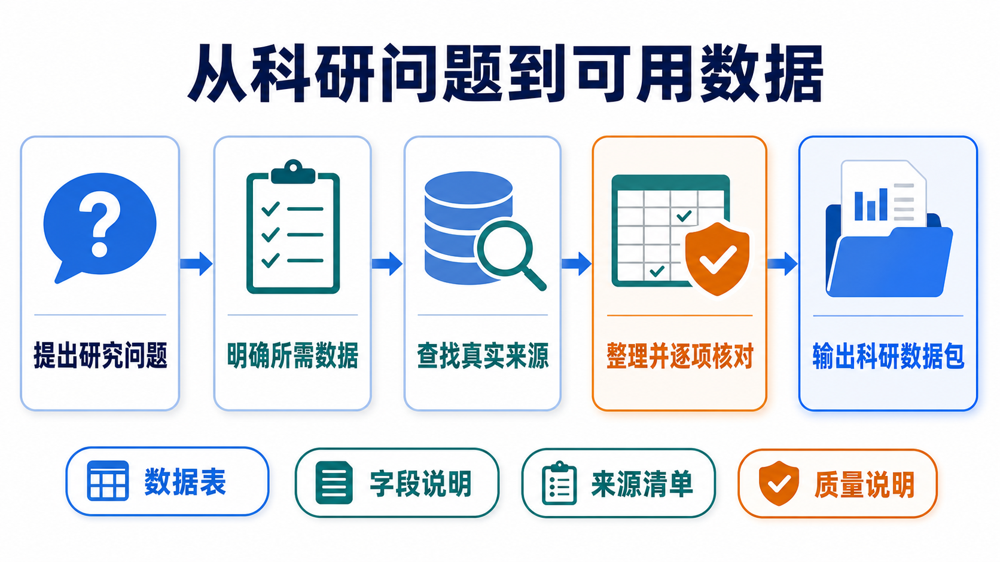

*图 1 一个科研问题依次经过需求明确、来源查找、逐项核对和结果输出，最终形成数据表、字段说明、来源清单与质量说明。*

从图 1 可以看出，系统并不是“搜到资料后直接生成答案”，而是让每一步都为下一步提供依据：问题决定需要哪些数据，所需数据决定去哪里查找，真实记录决定如何整理，逐项核对又决定结果能否进入分析。由此，本文将系统目标定义为：输入乳腺癌科研需求，输出带有明确每行对象、真实来源、处理说明、质量状态和复用范围的结构化数据。

### 1.2 完成代表分析至少需要哪些数据

为了让设计和结果都能够落到具体任务，本文选择以下问题贯穿全文：

> **研究 HER2 阳性乳腺癌中 PIK3CA 突变与新辅助治疗疗效的关系，并整理患者级科研数据集。**

其中，HER2 是乳腺癌分型的重要指标，PIK3CA 是乳腺癌中常见的变异基因；新辅助治疗是手术前进行的治疗，疗效则表示患者经过治疗后达到的效果。分析这一问题时，HER2 阳性限定研究对象，PIK3CA 突变构成分子变量，新辅助治疗限定治疗阶段，疗效构成结果变量。只有这四项信息落在同一研究、同一患者上，才能进一步分析它们之间的关系。

因此，本文把一行数据定义为“同一研究中的一名患者及其可追溯样本”，并形成表 1 所示的所需数据清单。

**表 1 代表问题的所需数据与核对依据**

| 要回答的问题 | 必要内容 | 每行如何理解 | 为什么必须核对 |
|---|---|---|---|
| 记录来自哪项研究 | 研究编号、数据库编号 | 患者编号只在所属研究中解释 | 防止不同研究使用相同编号时误认患者 |
| 记录对应谁、哪份样本 | 患者编号、样本编号 | 一名患者可能对应多份样本 | 识别同患者多样本，避免重复统计 |
| 是否属于目标人群 | 乳腺癌、HER2 状态和检测方法 | HER2 阳性患者 | 保证研究对象与问题一致 |
| 是否具有目标分子变量 | PIK3CA 突变状态和位点 | 同患者或同样本检测结果 | 保证分子变量能够与患者对应 |
| 接受了什么治疗 | 治疗名称、阶段和时间点 | 手术前治疗 | 保证治疗阶段与问题一致 |
| 疗效是什么 | 疗效类型、疗效结果 | 患者临床疗效 | 防止患者疗效与细胞实验结果混用 |
| 一个值如何回查 | 来源编号、原字段、原值和链接 | 标准值能够返回原始表达 | 便于核对清洗和转换是否正确 |

分析表 1 可知，行数和列数并不能单独证明数据可以使用。只要人群、分子变量、治疗、疗效或患者身份缺少一项，后续关联分析就失去依据。因此，这七项条件既是查找清单，也是建表清单和验收清单，三者使用同一口径，避免前后阶段各说各话。

### 1.3 查找资料后发现：多源数据必须经过三道判断

根据表 1 查找美国国家生物技术信息中心基因表达数据库（GEO）[3]、癌症基因组数据平台（cBioPortal）[4]、美国国家癌症研究所基因组数据中心（GDC）[5]及相关论文后发现，资料并不是完全找不到，而是不同来源分别满足不同条件。随着来源增加，系统必须依次判断变量是否齐全、字段含义是否一致、患者身份是否可靠。

1）**先判断每个来源能提供什么。** GSE76360 提供 HER2 阳性患者的术前疗效[7]；阿培利司治疗研究同时提供 PIK3CA 与疗效[8]；METABRIC 和 TCGA 乳腺癌项目提供临床与基因等分子层面的资料。由于每个来源回答问题的一部分，系统先确定主数据表和补充数据表，而不是按数据库数量机械拼接。

2）**再判断名称相近的字段是否真的同义。** HER2 免疫组化检测（用染色观察肿瘤组织中的蛋白）、荧光原位杂交（FISH，一种检测 HER2 基因变化的方法）与 HER2 对应的基因名称 ERBB2 的拷贝数（细胞中该基因数量的变化），都与 HER2 有关，但检测对象和医学解释并不相同；患者病理完全缓解与细胞药敏指标（在实验室观察细胞对药物的反应）也不是同一种疗效。为保留原意，系统把能够比较的值统一成中文标准值，同时记录检测方法；在已接入原始说明的来源上，再保存原字段和原值。含义不同的内容则分别保存。

3）**最后判断记录能否认定为同一患者。** 即使两个研究都出现编号“119”，也不能据此认定它们属于同一人，因为患者编号只有放在所属研究中才有意义。只有两条记录来自同一研究且编号一致，或者原始来源明确提供可靠的身份对应关系时，系统才允许连接。

*图 2 不同来源分别补充患者疗效、PIK3CA、临床和分子资料；系统按研究分别建表，使资料可以互补而不会被误写为同一患者。*

由图 2 可以看出，多源数据的价值不是“把所有内容塞进一张大表”，而是让每个来源在合适的位置发挥作用。先确认来源作用，才能确定主表与补充表；确认字段含义后，才能比较变量；确认患者身份后，才能建立连接。由此，三个判断不是彼此独立的检查项，而是一条由“找到资料”走向“可以分析”的递进路径。

### 1.4 由上述问题确定研究目标

根据上述分析，系统需要完成五项连续工作：先把自然语言问题变成所需数据清单，再取得真实记录；记录取得后按研究整理，随后核对字段与患者身份，最后判断数据能否回答当前问题。前一项为后一项提供依据，最后的质量判断又把缺项反馈给下一轮查找。

**表 2 研究目标、系统任务与验收证据**

| 研究目标 | 系统实际任务 | 验收证据 | 条件待补时的动作 |
|---|---|---|---|
| 明确需要什么 | 形成研究条件清单 | 人群、变量、治疗、疗效、每行对象和必要字段齐全 | 补充或修正清单 |
| 取得真实数据 | 通过固定接口读取公开记录 | 真实地址、数据库编号、来源编号和原始文件 | 按明确条件继续查找 |
| 整理多源记录 | 按研究建主表和补充表 | 字段说明和行级来源登记；已接入原始说明的来源保留原值 | 修正字段整理结果后重查 |
| 安全关联记录 | 核对研究、患者和样本编号 | 同研究编号一致或有可靠身份对应 | 分开保存并进入人工核对 |
| 判断研究用途 | 连续回答四个质量问题 | 导出、补查或人工核对结论 | 把缺项写成下一轮任务 |

分析表 2 可知，系统的特色不在于模块多，而在于五项任务使用同一份条件清单和同一条来源链。只有上一层证据成立，下一层判断才有依据；如果最后仍有待补条件，系统也能指出缺什么、去哪里继续查，从而形成可执行闭环。

---

## 2 系统设计：让模型负责理解，让程序负责证明

### 2.1 总体架构

研究问题需要灵活理解，而患者数据需要逐项核对。由于两类工作的要求不同，系统让千问负责理解问题和安排查找顺序，让固定数据接口负责读取真实记录，让规则程序负责整理、核对和质量判断。这样，模型负责“想清楚要找什么”，程序负责“证明实际找到了什么”。

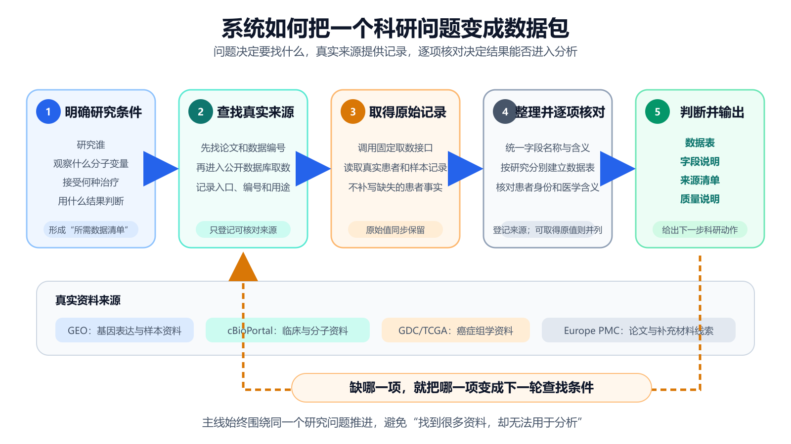

*图 3 系统先明确研究条件，再查找真实来源、取得原始记录、整理核对并输出；发现缺项后，系统把缺项变成下一轮查找条件。*

从图 3 可以看出，主线始终围绕同一个研究问题推进。输入端把问题整理成所需数据清单；真实来源层连接论文和公开数据库；整理层统一字段、登记行级来源，并在已接入原始说明的来源上保存原值，同时核对患者身份；输出端交付数据表、字段说明、来源清单和质量说明。当条件尚未满足时，橙色回路把缺项送回来源查找，而不是让模型猜出缺失的患者事实。

### 2.2 研究条件清单：先说清楚“需要什么”

一条自然语言问题往往同时包含研究人群、分子变量、治疗阶段和疗效，但这些条件在数据库中不会自动落到同一张表。为避免检索范围越查越宽，系统先形成一份研究条件清单：

> **研究条件清单 = 研究人群 + 分子变量 + 治疗 + 疗效 + 每行代表的对象 + 必要字段**

以代表问题为例，清单把“HER2 阳性”“PIK3CA 突变”“新辅助治疗”“患者疗效”“一行代表同一研究的一名患者”固定下来。随后，每个候选来源都按这份清单逐项核对。这样，文献查找、数据库取数、建表和质量判断拥有共同标准，系统不会因为某个数据库数据量大就偏离原问题。

查找文献在本系统中具有明确目的：论文帮助发现可信的数据编号、研究设计和补充材料线索；找到编号后，系统再到原数据库取得患者和样本记录。因此，文献负责“定位入口并解释研究背景”，数据库负责“提供可逐行核对的事实”，两类信息相互衔接但不相互替代。文献辅助检索的作用也由此变得清楚：它减少盲目搜索，并用真实来源约束模型生成，而不是把论文摘要当作患者数据。

### 2.3 真实取数与来源分工

研究条件明确后，下一步是把“可能相关”推进到“实际取得”。系统通过固定数据接口访问 GEO、cBioPortal、GDC 等公开来源，并为每次取数记录数据库编号、真实地址、来源编号和原始文件。任何患者或样本事实都必须由接口返回；模型只决定调用顺序，不直接填入患者行。

**表 3 代表任务中的来源分工**

| 来源 | 本次实际取得的内容 | 在任务中的作用 | 如何保留来源关系 |
|---|---|---|---|
| GEO 数据库 GSE76360 | 50 名 HER2 阳性且治疗前已有记录的患者及疗效记录 | 描述术前疗效，并提供继续补查同一研究分子附件的编号依据 | 保留 GSE 编号、样本编号、官方链接和原始样本说明 |
| 阿培利司治疗队列 | 115 行、31 列、42 名患者，含 PIK3CA 与疗效 | 形成分子—疗效主数据表 | 保留研究编号、患者/样本编号和来源编号 |
| METABRIC 队列 | 86 行、48 列的临床与分子资料 | 提供独立临床和分子补充 | 作为补充表独立保存 |
| TCGA 乳腺癌项目 | 60 行、94 列的临床和分子资料 | 提供独立分子资料补充 | 绑定项目和文件来源，不跨研究拼接患者 |

分析表 3 可知，四类来源分别承担不同任务。阿培利司队列在当前已取得资料中同时覆盖 PIK3CA 与疗效，因此形成主数据表；GSE76360 对应目标 HER2 阳性术前治疗人群，因此成为疗效构成描述和下一轮补查的重点；其余来源用于补充临床与分子资料。通过这一分工，多来源的互补价值得到保留，同时每个统计结果仍能回到所属研究。

### 2.4 统一中文字段，同时完整保留原始写法

同一个意思在不同数据库里可能有不同写法。如果不统一，统计时会被拆成多个类别；如果只看名称强行合并，又可能改变医学含义。因此，系统先把可以比较的内容写成统一中文并登记每行来源；对于已经接入原始样本说明的来源，再把原始字段和原始值一同保留。

以 GSE76360 的疗效字段为例，系统把数据库原值 `pcr` 解释为“病理完全缓解”，把 `NOR` 解释为“未达到客观缓解”，同时保留原始字符用于核对。对于 HER2，系统分别保存免疫组化、荧光原位杂交和 ERBB2 拷贝数结果，不把“HER2 免疫组化 2+”直接判为 HER2 阳性，也不把 ERBB2 拷贝数扩增当作临床 HER2 阳性。对于疗效，患者临床疗效、试验结局和细胞药敏分别记录，避免名称相近却含义不同的数据进入同一统计。

这一步的结果不是得到一张“看起来更整齐”的表，而是让“统一后怎样分析”和“为什么这样转换”分别有据可查。当前代表任务先对所有数据表完成行级来源登记；在 GSE76360 等已接入原始样本说明的来源上，系统进一步建立中文标准值与原始值的逐项对应。研究者发现新的命名差异时，可以修改转换规则并重新生成，而不需要重新猜测原始数据；其他主表与补充表的关键值将沿同一规则继续贯通到原字段和原值。

### 2.5 患者与样本编号核对

字段含义统一后，变量能否进入同一行还取决于记录是否属于同一患者。本文采用一条简单而严格的连接规则：

> **只有两条记录属于同一研究且患者编号一致，或原始来源明确提供可靠身份对应时，才连接为同一患者；其余记录分别保存。**

如果用 1 表示“可以连接”、0 表示“不能自动连接”，则判断可写为：

> **连接结果 = 1：同研究且编号一致，或存在可靠身份对应；其他情况 = 0。**

这条规则使患者编号始终与研究编号共同解释。对于 GSE76360、METABRIC、TCGA 乳腺癌项目和阿培利司队列，系统分别建表，把来源之间的互补关系保留在数据包层，而不是写进同一患者行。由此，完成字段统一并不意味着可以跨研究连接；只有编号证据成立后，患者级联合分析才有基础。

### 2.6 四层质量检查：从“表能生成”推进到“问题能回答”

记录完成整理和编号核对后，还需要判断它是否适合当前研究。为此，系统连续回答四个问题：数据从哪里来，关键内容够不够，记录是不是同一个人，能不能回答当前问题。

*图 4 来源、字段、患者身份和研究条件依次核对；每层结果都会转化为导出、继续补查或人工复核动作。*

主要字段完整度采用同一口径计算：

> **主要字段完整度 = 已填写的主要字段数 ÷ 主要字段总数。**

这一比例只回答“字段是否有值”，不能代替来源和医学含义判断。因此，四层检查按表 4 的顺序执行。

**表 4 四层质量检查的判断依据**

| 层次 | 核心问题 | 主要依据 | 形成的结果 |
|---|---|---|---|
| 第一层：来源 | 数据从哪里来 | 官方地址、数据库编号、来源编号 | 来源可回查 |
| 第二层：字段 | 关键内容够不够 | 必要字段、非空情况、行级来源及可取得的原始说明 | 数据表可以形成 |
| 第三层：身份 | 记录是不是同一患者 | 研究编号、患者/样本编号、可靠身份对应 | 可以安全关联或分开保存 |
| 第四层：研究用途 | 能否回答当前问题 | 人群、分子变量、治疗和疗效是否同时满足 | 导出、补查或人工核对 |

从图 4 和表 4 可以看出，前三层解决“数据是否真实、表是否可靠”，第四层进一步解决“这张表能不能回答眼前的问题”。如果资料已满足条件，系统导出科研数据包；如果缺少关键资料，系统生成明确补查清单；如果患者身份或医学含义需要专家判断，则进入人工复核。由此，质量检查不只是给出一个分数，而是直接决定下一步工作。

### 2.7 双闭环流程：已有值可修正，缺少证据要补查

质量检查得到结果后，系统将问题分为两类。已有值如果只是大小写、确定性别名或精确重复等低风险问题，就返回整理环节修正；如果缺少目标人群、分子变量或真实来源，则返回查找环节补充证据。两条路径完成后都重新进行四层质量检查。

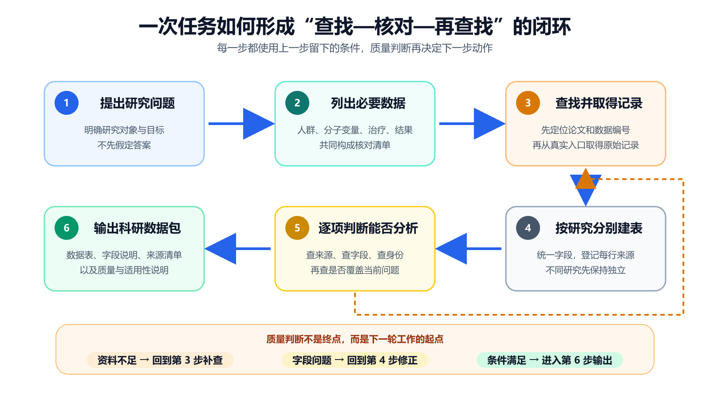

*图 5 六个步骤依次回答“需要什么、去哪里找、怎样整理、能否使用”；资料不足时返回来源查找，字段问题则返回整理环节。*

由图 5 可知，修正闭环处理的是“已有事实怎样表达得更准确”，补查闭环处理的是“还需要什么新证据”。两者不能互相替代：格式修正不能创造缺失的 PIK3CA 检测结果，继续询问模型也不能证明两个研究中的患者相同。正因为两种问题分别处理，系统才能在提高整理效率的同时守住真实来源和患者身份边界。

---

## 3 实验结果：从产出规模到质量效果

### 3.1 实验设计与验证问题

为了判断系统是否真正完成了方向 1A 的任务，实验依次回答三个问题：第一，能否从真实来源形成结构化数据包；第二，形成的数据是否可核对、可追溯并能指出研究用途；第三，当前版本和组件选择是否有量化依据。

本次代表任务关闭千问规划，采用固定规划流程，专门检验真实取数、分表、行级来源登记、已接入原始说明的回查和质量检查；千问的规划效果在后续单因素模型对照中单独验证。这样，代表任务中的数据规模不会被误写成千问单独带来的结果，规划模型的作用也不会与数据接口和规则程序混在一起。

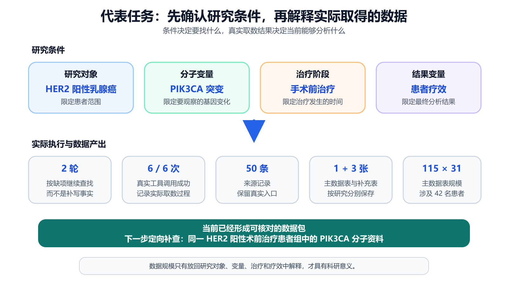

*图 6 研究对象、分子变量、治疗阶段和疗效共同限定取数范围；下半部分再用实际执行记录解释本次得到的数据包。*

从图 6 可以看出，系统先固定 HER2、PIK3CA、治疗阶段和疗效，再进入取数和建表。只有问题口径明确，115 行、31 列等规模数字才有解释依据。在此基础上，系统通过 2 轮、6/6 次真实工具调用登记 50 条来源记录，并形成表 5 所示的数据包。

### 3.2 代表任务形成 1 张主数据表和 3 张补充数据表

**表 5 代表任务的实际输出**

| 数据表 | 规模 | 患者范围 | 已覆盖内容 | 当前科研用途 |
|---|---:|---|---|---|
| 阿培利司治疗主数据表 | 115 行 × 31 列；42 名患者 | 激素受体阳性、HER2 阴性 | PIK3CA、样本和疗效 | 队列内 PIK3CA—疗效分析 |
| GSE76360 补充表 | 50 行 × 21 列；50 名患者 | HER2 阳性术前治疗 | 患者、样本和疗效 | 疗效构成描述；定向补查同队列 PIK3CA |
| METABRIC 补充表 | 86 行 × 48 列 | 独立乳腺癌研究 | 临床与分子资料 | 独立队列描述和变量参考 |
| TCGA 乳腺癌补充表 | 60 行 × 94 列 | 独立乳腺癌项目 | 临床和分子资料 | 独立分子资料描述和来源补充 |

分析表 5 得出，系统已经把分散资料转化为各自用途明确的数据表，而不是只返回数据库链接。主表支持 PIK3CA—疗效的队列内分析，GSE76360 对应目标 HER2 阳性术前治疗人群，另外两表补充临床和分子信息。由于四张表的研究编号和患者编号保持独立，数据可以分别分析，也可以作为下一轮来源发现依据。

### 3.3 由缺失值检查得到 48 条有效疗效记录

为了得到可用于比例分析的明确分母，本文进一步检查 GSE76360 的疗效字段。检查发现，缺失值会干扰比例计算和后续模型构建：如果把没有疗效记录的患者直接计入某一类别，疗效比例将被错误改变。因此，系统先保留全部 50 名患者，再把 2 条疗效缺失记录从疗效构成统计中单独列出。

> **有效疗效记录数 = 50 − 2 = 48。**

以下按 GEO 原始字段中的四类互斥标签统计。因此，33 条客观缓解与 9 条病理完全缓解在本表中分别计数，不存在重复：33 + 9 + 6 = 48 条有效疗效记录，48 + 2 = 50 名患者。

**表 6 GSE76360 疗效记录的统计构成**

| 系统识别的疗效类别 | 记录数 | 在本节中的用途 |
|---|---:|---|
| 客观缓解（原标签 OBJR） | 33 | 描述达到客观缓解标准的人群 |
| 病理完全缓解 | 9 | 单独保留更严格的疗效标签 |
| 未达到客观缓解 | 6 | 描述未达到疗效标准的人群 |
| 疗效记录缺失 | 2 | 保留在原表，不进入 48 条疗效构成统计 |

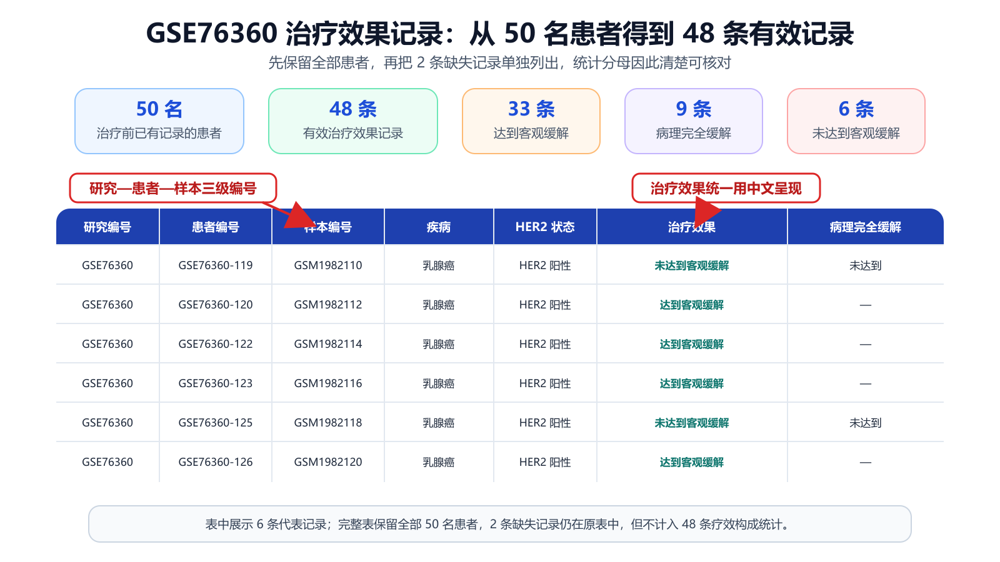

*图 7 系统按研究—患者—样本三级编号展示代表记录，并在 50 名患者中识别 48 条有效疗效记录；2 条缺失记录仍保留在原表中。*

从图 7 和表 6 可以发现，48 不是一个脱离样本的汇总数字，而是能够逐条返回患者记录的有效样本集。它可以直接用于描述该队列的疗效构成；同时，系统把 PIK3CA—疗效关系所需的同队列分子资料写成下一轮补查条件，使当前统计结果自然承接后续研究。

### 3.4 以 GSE76360 为例核对中文标准值与数据库原值

形成有效样本集后，还需要检验字段整理是否保持原义。由于 GSE76360 已接入 GEO 原始样本说明，系统可以把中文标准值与数据库原值并排展示。例如，原值 `baseline` 对应“治疗前基线”，`NOR` 对应“未达到客观缓解”，`Neg` 对应“阴性”。原始英文用于核对，中文标准值用于阅读和分析，两者各自承担清楚的作用。

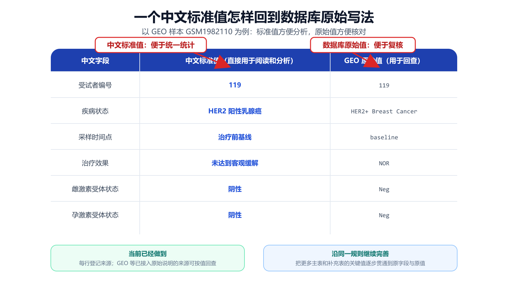

*图 8 样本 GSM1982110 的中文标准值与 GEO 原始值并排展示，使该来源中的字段转换可以逐项核对。*

从图 8 可以看出，字段统一没有覆盖 GSE76360 的原始样本说明。研究者既能直接使用中文字段进行统计，也能回到数据库原值检查转换是否合理。完成这一来源的单值回查后，系统把相同的字段和身份规则应用到整张表，并通过四层质量检查给出下一步动作；对其他数据表，当前先保留行级来源，关键值的原字段与原值将沿同一规则继续补齐。

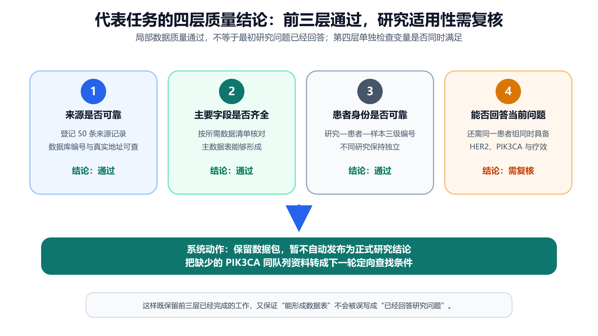

*图 9 当前任务已完成来源、字段和身份三层核对；第四层发现研究条件仍需补齐，因此保留数据包、暂不自动发布，并形成定向补查任务。*

分析图 9 可知，前三层分别证明来源可回查、主要字段能够形成数据表、患者与样本关系在研究内可以解释；第四层没有把这些局部结果直接等同于“已回答代表问题”，而是继续检查 HER2 阳性、新辅助治疗、PIK3CA 和疗效是否在同一患者层面同时具备。因此，当前结果进入“需复核、暂不自动发布”状态，同时得到明确改进路径：补查 GSE76360 同队列分子附件，或寻找三项变量同时覆盖的新队列。

### 3.5 五项指标共同评价“找得到、理得清、查得到来源”

代表任务说明了系统实际做成什么，版本复测进一步回答“当前版本是否整体改进”。为避免只用单一准确率评价，本文采用五项质量指标，并用科研数据可信整合指数进行综合。各指标均沿用项目冻结评价公式[6]。

**表 7 五项质量指标的含义与版本复测结果**

| 中文指标 | 它在检查什么 | 历史版本 | 当前版本 | 结果说明 |
|---|---|---:|---:|---|
| 检索综合值 | 同时考虑来源找得准和找得全 | 0.4490 | 0.6500 | 正确来源覆盖与误返回得到综合改善 |
| 字段忠实度 | 中文标准值是否保持原始医学含义 | 0.6538 | 1.0000 | 抽检 26 个关键字段均保持原义 |
| 来源可追溯率 | 关键非空字段能否回到有效来源 | 1.0000 | 1.0000 | 抽检 26 个关键字段均可追溯 |
| 错误识别综合值 | 应报错误是否检出、正常记录是否误报 | 0.6957 | 1.0000 | 15 个真实错误均检出，3 个正常样例无误报 |
| 自动修复正确率 | 允许自动修正的问题是否修对 | 0.5000 | 1.0000 | 这组审核样例中的 3 次自动修复均正确 |

可信整合指数采用五项指标的几何平均，使任何一项过低都会影响总分：

> **可信整合指数 = 100 ×（检索综合值 × 字段忠实度 × 来源可追溯率 × 错误识别综合值 × 自动修复正确率）的五次方根。**

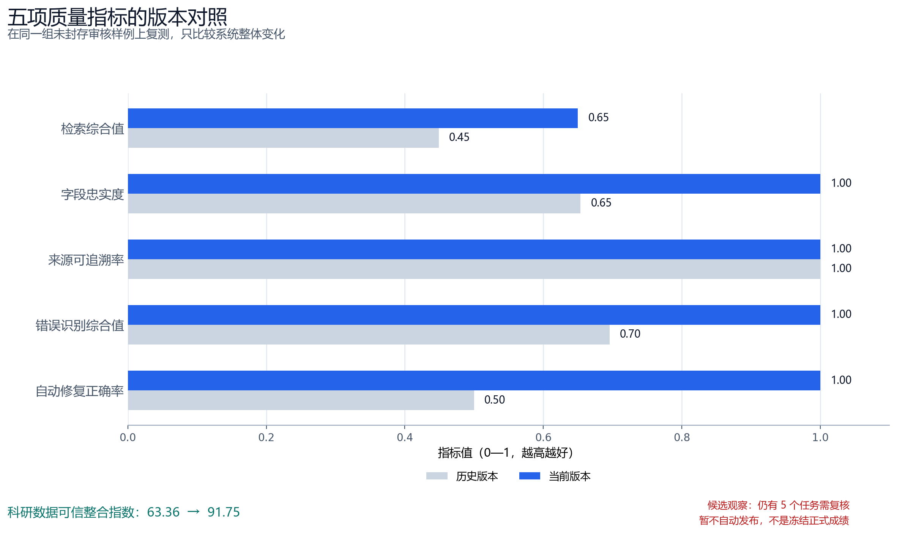

*图 10 在同一组审核样例上，当前版本综合表现提高：其中四项指标改善，来源可追溯率保持 1.0000；可信整合指数由 63.36 提升至 91.75。*

分析表 7 和图 10 得出，来源可追溯率保持 1.0000 的同时，字段忠实度、错误识别和自动修复达到 1.0000，检索综合值提高 0.2010，最终使可信整合指数提高 28.39。由于这一复测同时包含多个模块的更新，结论只用于说明候选版本的整体变化，不归因于某一个模型。进一步核对发布状态发现，这组样例仍有 5 个任务需要人工复核，系统明确给出“暂不允许自动发布”。因此，91.75 是未封存候选版本的观察值，不是冻结正式成绩；下一步将在未参与开发的题目上复验并封存结果。为了区分规划模型本身的作用，下面固定其他模块，只替换规划模型。

### 3.6 规划模型单因素对照：先保证来源选得准

规划模型决定问题怎样拆解、先查哪些来源和如何调用工具。为了公平比较千问 3.8-Max 与 DeepSeek，两组分别完成 3 道乳腺癌科研题，每题运行 3 次；数据接口、质量规则和调用上限保持一致，实际调用次数由每次规划结果决定。因此，两组差异主要反映问题理解和来源排序方式。

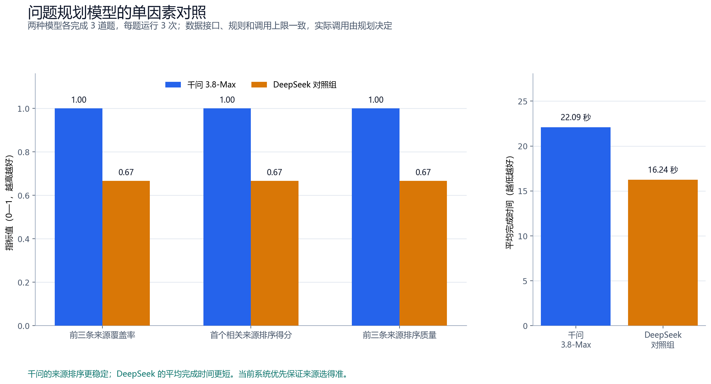

*图 11 千问在三项前三来源排序指标上为 1.000，DeepSeek 对照组为 0.667；DeepSeek 的平均完成时间更短。*

**表 8 规划模型对照结果**

| 指标 | 千问 3.8-Max | DeepSeek 对照组 | 选择依据 |
|---|---:|---:|---|
| 前三条来源覆盖率 | 1.0000 | 0.6667 | 目标来源进入前三名的稳定性 |
| 首个相关来源排序得分 | 1.0000 | 0.6667 | 正确来源是否更早出现 |
| 前三条来源排序质量 | 1.0000 | 0.6667 | 前三名相关性与位置的综合质量 |
| 平均完成时间 | 22.09 秒 | 16.24 秒 | 工程效率参考 |

从图 11 和表 8 可以看出，两种模型各有明确特点：千问在当前小样本中更稳定地把正确来源排在前面，DeepSeek 平均完成时间更短。本系统首先要求找对真实来源，因为来源选择错误会传递到取数和建表阶段；因此当前采用千问作为主要规划模型，同时保留 DeepSeek 作为扩大样本后的效率对照。该实验属于工程单因素对照，不替代独立封存测试集的正式评价。

### 3.7 公开检索对照：语义检索提供更稳的候选结果

规划模型决定“要查什么”，检索方法决定“哪些材料先被找到”。为了判断关键词匹配和语义理解的作用，本文在 5 个公开数据集、3,677 条查询上比较三种方法：按关键词匹配的 BM25、按语义相近程度检索的 BGE，以及两者的简单组合。

*图 12 先在每个公开数据集分别计算再取平均后，语义检索在前十条排序质量、前 100 条召回率和首个相关结果排序得分三项指标上最高。*

**表 9 公开检索方法对照**

| 方法 | 前十条结果排序质量 | 前 100 条结果召回率 | 首个相关结果排序得分 | 平均用时 |
|---|---:|---:|---:|---:|
| 关键词检索（BM25） | 0.3147 | 0.5552 | 0.3629 | 54.57 毫秒 |
| 语义检索（BGE） | **0.3880** | **0.6554** | **0.4421** | **10.72 毫秒** |
| 简单组合（BM25+BGE） | 0.3791 | 0.6422 | 0.4277 | 62.73 毫秒 |

分析图 12 和表 9 可知，先在每个公开数据集分别计算再取平均后，语义检索在三项指标上均为最高，因此优先用于寻找语义相近的候选材料。该公开实验只证明语义检索值得保留为候选来源，未直接评价加入二次排序后的完整组合；因而，它不能替代乳腺癌完整系统的最终评价。当前实际运行的系统仍把关键词检索、语义检索和二次排序结合使用，再由研究条件清单和来源规则进行核对；完整组合的增益将在后续乳腺癌专用题目中通过独立对照验证。

### 3.8 查询表达对照：默认保证前排质量，必要时扩大覆盖

检索方法固定后，查询表达仍会影响结果。额外改写可以补充深层候选，也可能改变原问题中的关键限定。因此，本文固定语料和关键词检索方法，只改变查询写法，并在 75 条公开查询上比较“保留原问题”与“规则和千问组合补充”。

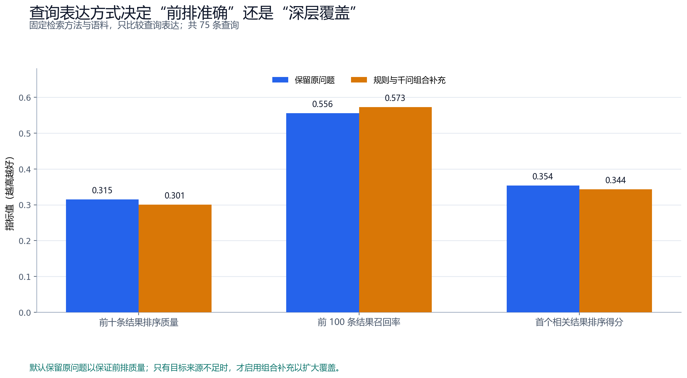

*图 13 保留原问题的前十条排序质量和首个相关结果得分更高；组合补充的前 100 条召回率更高。*

**表 10 查询表达方式的核心对照**

| 查询方式 | 前十条结果排序质量 | 前 100 条结果召回率 | 首个相关结果排序得分 | 使用方式 |
|---|---:|---:|---:|---|
| 保留原问题 | **0.3151** | 0.5557 | **0.3538** | 当前默认，保证前排质量 |
| 规则和千问组合补充 | 0.3007 | **0.5726** | 0.3436 | 目标来源不足时扩大覆盖 |

从图 13 和表 10 可以发现，两种策略解决的问题不同。保留原问题更有利于让前排结果紧贴研究限定，组合补充更有利于在较深位置发现更多候选。因此，系统形成明确使用规则：默认保留原问题；只有四层质量检查发现目标来源不足时，才启动组合补充。这样，实验结果直接决定查询何时保持原样、何时扩大覆盖，而不是简单选择“永远改写”或“永不改写”。

### 3.9 代表问题推进到哪一步

综合上述结果，当前阶段完成的是一份可以逐条核对的数据包：系统已经从真实来源形成主数据表和补充数据表，保留患者身份与行级来源，并在 GSE76360 等已接入原始说明的来源上提供中文标准值—数据库原值回查，同时说明每张表适合开展什么分析。GSE76360 的 48 条有效疗效记录可以支持队列内疗效构成描述，阿培利司队列可以支持其自身患者组内的 PIK3CA—疗效分析，METABRIC 与 TCGA 乳腺癌项目则作为独立临床和分子资料复用。

要完成最初的 HER2 阳性新辅助治疗代表问题，还需补齐一个明确条件：同一患者组同时包含 HER2、PIK3CA 和患者疗效。系统已把这个条件转化为两条可执行路径：优先查找 GSE76360 同队列的 PIK3CA 分子附件；如果该附件不提供所需变量，则继续查找三项条件同时覆盖的新队列。这样，当前结果不是停在“信息不够”，而是把下一步研究推进到可以直接执行的查找任务。

---

## 4 前端网页：让研究者沿证据链逐步核对

### 4.1 先核对问题，再查看数据

前端按照“核对问题—查看数据—回查原值—查看来源路径—判断研究用途”的顺序组织页面。用户不需要先理解数据库接口，只需先判断系统是否正确理解了研究对象、分子变量、治疗和疗效。图 6 已把研究条件与当前主数据表并列展示，使 115 行、31 列能够回到具体问题解释。

### 4.2 从患者表进入单条记录

确认问题后，用户进入患者/样本表，检查每一行属于哪项研究、哪名患者和哪份样本。图 7 以 GSE76360 为例展示 50 名患者及 48 条有效疗效记录；用户既能查看汇总，也能沿患者编号回到单条记录。这样的设计避免只看一个总数而不知道分母来自哪里。

### 4.3 从标准值回到原值，再回到整张表的来源路径

图 8 回答“一个值为什么这样写”，整表来源路径进一步回答“这张表由哪个入口发现”。系统把科研问题、数据库入口和最终数据表串成可查看路径，同时保留 50 条来源记录和 25 个入口。来源之间的连线只表示发现和引用关系，不代表患者已经跨研究合并。

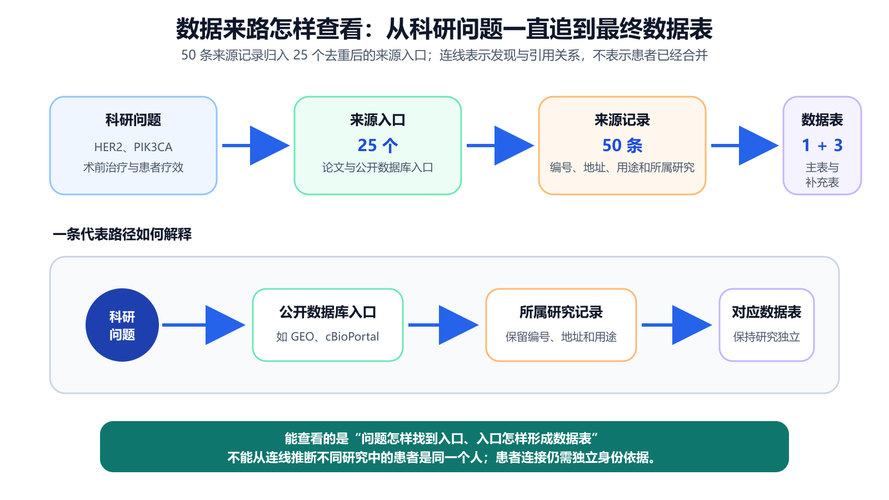

*图 14 系统把 50 条来源记录归入 25 个去重后的入口，并将科研问题、来源入口、所属研究记录和最终数据表依次连接。*

从图 14 可以看出，数据来源路径把“问题为什么指向这个数据库”与“最后形成哪张表”连接起来。由此，研究者不仅能理解整张表的来路和来源分工，也能明确连线只表示发现与引用关系；能否把记录连接为同一患者，仍须回到研究、患者和样本编号另行核对。

### 4.4 由质量结果决定分析、补查或复核

来源路径说明数据如何得到，研究用途视图进一步说明数据怎样使用。系统把数据规模、每张表已经覆盖的变量和适用范围放在同一视图中，并提示一名患者可能对应多份样本。下游建模时，应按患者划分训练集和测试集，避免同一患者的不同样本同时进入两组而使结果虚高。

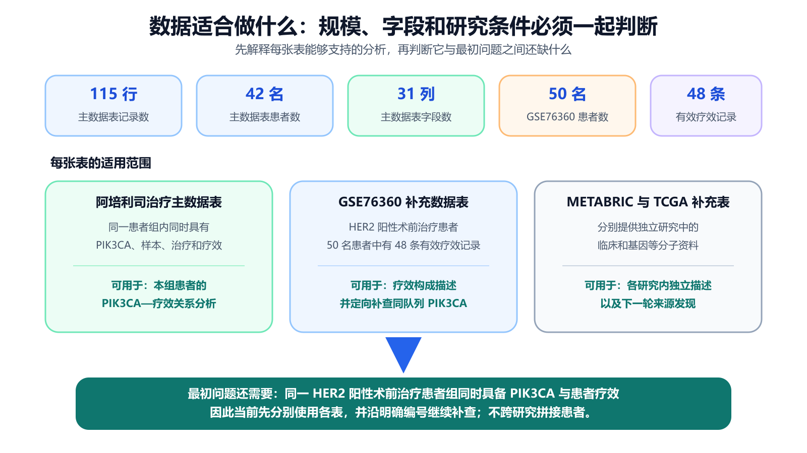

*图 15 数据规模只有与字段覆盖和研究条件一起解释，才能判断每张表适合开展什么分析。*

分析图 15 可以发现，不同数字对应不同对象：115 行表示主数据表的记录数，42 名表示主数据表中的患者数，50 名和 48 条则分别表示 GSE76360 的患者数与有效疗效记录数。把各表的分母和适用范围分别展示后，用户不会把“某张表能够独立分析”误解为“最初的跨变量研究问题已经完成”。

### 4.5 页面功能共同构成一条审查路径

**表 11 前端功能与科研作用**

| 页面功能 | 用户看到什么 | 能够作出的科研判断 |
|---|---|---|
| 任务摘要 | 研究对象、分子变量、治疗、疗效和必要字段 | 系统是否理解了正确问题 |
| 文献与来源 | 论文、数据库、来源编号和真实入口 | 数据编号依据是否可核对 |
| 主数据表与补充表 | 数据规模、患者/样本字段和表的用途 | 每张表适合什么分析 |
| 已接入原始说明的来源（如 GSE76360） | 中文标准值与数据库原始值 | 核对字段转换是否保持原义 |
| 数据来源路径 | 问题、入口和数据表之间的关系 | 数据如何被发现和选中 |
| 研究用途 | 字段覆盖、疗效匹配、每行对象和质量结论 | 进入分析、继续补查或人工复核 |
| 导出 | 常用表格文件、字段说明、来源和质量材料 | 如何进入后续统计或建模工具 |

由表 11 可知，前端并不是单纯展示图表，而是把后台处理顺序转换为用户能够执行的核对顺序。技术人员可以检查工具调用和来源，医学研究者可以核对字段含义与患者边界，其他读者也能回答“找到了什么、为什么这样整理、数据能够做什么”。

---

## 5 特殊性、科研价值与安全使用

### 5.1 特殊性来自一条连续的数据生产链

普通搜索能够找到网页入口，但研究者仍需自己判断字段、患者身份和数据用途；通用大模型擅长解释知识，却不能单独保证患者记录真实；普通数据整理程序能够处理已有文件，但前提是输入文件和目标字段已经确定。本系统的特殊性在于把这些分散能力连接到同一条患者/样本级数据生产链：先用研究条件清单限定要找什么，再从真实来源取数；随后按研究建表、核对字段与身份；最后把质量结果转化为导出、补查或人工复核动作。

前一步为后一步提供条件，最后一步又把缺项反馈给下一轮查找，因而形成闭环。正是这一连续约束，使系统既能利用模型理解模糊问题，又不会让模型替代真实来源；既能提高整理效率，又能保留患者身份和数据来路，并在已有原始说明的来源上提供值级回查。

### 5.2 不同工具各自适合什么任务

**表 12 常见工具与本系统的任务覆盖**

| 方案 | 最擅长的工作 | 怎样参与取数 | 怎样参与整理 | 怎样记录来路 | 适合承担的环节 |
|---|---|---|---|---|---|
| 搜索引擎 | 快速定位公开网页与数据库入口 | 把候选入口交给研究者或后续工具 | 帮助发现可能相关的字段说明 | 保留网页链接 | 发现候选来源 |
| 通用大模型 | 理解问题和解释专业知识 | 把自然语言问题转成后续查找计划 | 帮助解释字段含义与研究条件 | 生成便于阅读的来源说明 | 形成研究思路和查找顺序 |
| 普通数据整理程序 | 批量处理已知文件 | 读取用户指定的数据文件 | 按预设规则批量转换 | 记录处理日志 | 形成统一的分析格式 |
| 本系统 | 把三类能力连接成连续流程 | 固定接口取得真实记录 | 用研究、患者、样本编号和医学规则共同核对 | 行级来源和数据路径并存；已接入原始说明的来源可回查 | 从研究问题形成可核对的数据包 |

分析表 12 可知，四类工具各自承担一段必要工作：搜索引擎帮助发现入口，通用大模型帮助理解问题，普通数据整理程序帮助批量转换文件，本系统则把这些能力接到真实数据接口、患者身份核对和质量判断之后。正因为每一环都有明确输入和输出，研究者可以从一句自然语言问题出发，连续得到来源明确的数据表、字段说明和下一步动作。由此，本系统的特殊性不是某一个单点功能，而是把原本需要在多个工具之间反复搬运和人工对照的工作，固定成一条能够核对、修正和继续推进的链条。

### 5.3 实测证据怎样转化为科研收益

**表 13 已完成工作、实测证据与科研收益**

| 已完成工作 | 实测证据 | 对研究者的直接价值 |
|---|---|---|
| 真实来源查找 | 2 轮、6/6 次工具调用、50 条来源记录 | 把宽泛问题落实到可访问入口 |
| 多源建表 | 1 张主数据表、3 张补充数据表 | 利用不同患者组的互补信息，同时保留研究范围 |
| 有效样本集形成 | 50 名患者中得到 48 条有效疗效记录 | 给比例分析提供清楚分母 |
| 患者/样本核对 | 研究、患者和样本三层编号 | 防止不同研究中的相似编号被误连 |
| 原值回查 | 中文标准值与 GEO 原始说明并排 | 使清洗和医学解释能够逐条核对 |
| 规划模型选择 | 两组共 18 次同条件运行 | 用来源排序和用时说明系统选择依据 |
| 检索方法选择 | 5 个公开数据集、3,677 条查询 | 识别语义检索的候选价值 |
| 系统版本复测 | 可信整合指数 63.36 → 91.75；5 个任务需复核，暂不自动发布 | 量化候选版本变化，并同时保留发布边界 |

表 13 中的证据分别证明“找得到、理得清、查得到来源、知道能做什么”。研究者接手数据后，不需要重新猜测统计分母或来源路径，可以直接核对字段、患者和适用范围，从而把原本分散在搜索、清洗和审查中的工作固定为可重复流程。

### 5.4 安全使用与继续完善

系统面向公开科研数据整理，不输出临床诊断或个体治疗建议。不同研究的资料可以相互补充，但只有公开来源提供可靠身份对应时才建立患者级连接；高风险医学含义或关键来源需要人工确认时，系统保持需复核状态。上述规则保证数据在进入后续统计和建模前仍然能够被核对。

当前证据自然推出三步完善顺序。第一，让研究条件清单更直接参与来源排序，使正确人群、变量和疗效更早出现；第二，在现有行级来源登记基础上，为每个关键值统一记录原字段、原值、转换规则和来源，使更多数据表也能完成值级复核；第三，在未参与开发的独立题目上扩大模型对照并封存测试集，使版本效果能够独立验证。三项工作分别加强“找得准、查得清、证得稳”，都沿用现有闭环继续推进。

---

## 6 结论

本文围绕方向 1A 的科学数据场景，研究了自然语言科研问题如何转化为可分析、可追溯、可复用的数据包。查找论文和公开数据库后发现，乳腺癌精准治疗数据的关键不在于来源数量，而在于目标变量分散、相近字段医学含义不同、患者编号只在所属研究中有效。基于这些事实，本文把问题理解、文献和来源发现、真实取数、按研究建表、字段整理、身份核对、四层质量检查和结果导出组织为一条连续数据链。

代表任务完成 2 轮、6 次真实工具调用，登记 50 条来源记录，形成 1 张主数据表和 3 张补充数据表；GSE76360 得到 50 名治疗前已有记录的患者和 48 条可核对的有效疗效记录。系统已经完成数据包阶段，并把代表问题还需补齐的联合条件精确定位为“同一 HER2 阳性新辅助治疗患者组中的 PIK3CA 分子资料”。在这一条件补齐前，系统不作跨研究医学关联推断，而是将其转化为同队列附件补查或新队列检索任务。

版本复测进一步显示，检索综合值提高 0.2010，科研数据可信整合指数提高 28.39；但该组样例尚未封存，仍有 5 个任务需要人工复核，系统暂不允许自动发布，因此 91.75 只作为候选版本观察值。单因素模型对照、公开检索对照和查询表达对照又分别为千问规划、语义检索候选和按条件补充查询提供了选择依据。综上，本系统的核心价值不是替研究者猜测缺失事实，而是把“为什么找这些数据、实际取得了什么、哪些记录能够安全关联、已接入原始说明的值怎样回查、数据适合什么分析”固定为一条可以检查、可以修正、可以继续推进的科研数据链。

---

## 附录 A 中文术语与系统内部字段对照

正文统一使用中文。下表中的英文只用于开发者核对系统内部字段，阅读正文时无需记忆。

| 正文主称 | 技术名称或字段 | 通俗解释 |
|---|---|---|
| 研究条件清单 | ResearchSpec | 把研究对象、变量、治疗、疗效和必要字段写清楚的规则清单 |
| 固定数据接口 | Adapter | 按固定规则连接公开数据库并读取真实记录的程序 |
| 数据库编号 | accession | 数据库为研究、数据集或样本分配的可查询编号 |
| 可靠身份对应 | crosswalk | 来源明确提供的患者或样本编号对应关系 |
| 值级来源记录 | Evidence | 一个标准值对应的来源、原字段、原值和转换依据 |
| 疗效类型 | response_domain | 区分患者疗效、试验结果和细胞药敏的字段 |
| 四层质量检查 | Quality Gate | 依次检查来源、字段、患者身份和研究条件 |
| 缺口检查 | Critic / Gap | 把尚缺条件转化为下一轮查找任务 |
| 可信整合指数 | SDTI | 综合检索、忠实、追溯、错误识别和修复的五维指标 |

## 附录 B 当前代表任务的技术记录

| 项目 | 原始记录 | 中文说明 |
|---|---|---|
| 实测日期 | 2026-08-31 | 本文代表任务运行日期 |
| 系统版本 | `2.0.0-qwen-agent` | 当前系统版本号 |
| 任务编号 | `loop-5067e738f912:r1` | 本次闭环任务的内部编号 |
| 页面运行方式 | `use_qwen=false` | 关闭千问规划，只检验固定规则数据主流程 |
| 工具与来源 | 2 轮，6/6 次成功；50 条来源记录 | 真实接口执行情况 |
| 主数据表 | `breast_alpelisib_2020`，115×31，42 名患者 | 阿培利司治疗队列 |
| 补充数据表 | GSE76360 50×21；METABRIC 86×48；TCGA-BRCA 60×94 | 三张保持研究范围的补充表 |
| 质量状态 | Gate 1—3 `PASS`；Gate 4 `REVIEW` | 前三层通过，第四层需复核 |
| 发布状态 | `publish_allowed=false` | 暂不自动发布为正式研究结论 |
| 下一查找条件 | 同一 HER2 阳性新辅助治疗队列中的患者级 PIK3CA | 当前闭环生成的直接下一步 |

## 附录 C 项目内证据与复现索引

1. [当前实际运行主线](CURRENT_MAINLINE.md)
2. [分层数据与指标报告](DATA_REPORT_20260829.md)
3. [系统设计报告](FINAL_SYSTEM_DESIGN_REPORT_20260830.md)
4. [前端功能说明](FRONTEND_COMPLETE.md)
5. [医学安全规则](05_医学安全规则.md)
6. [冻结评价指标与可信整合指数公式](06_评测指标与SDTI.md)
7. [当前版本候选指标](../goldset/breast_cancer/official_candidate/evaluation_runs/official-candidate-qwen-live-audited-final-20260830/metrics.json)
8. [规划模型替换与检索对照报告](../evaluation/reports/qwen38_20260829/FINAL_EVALUATION_REPORT_ZH.md)
9. [公开检索的各数据集平均结果](../evaluation/vnext_retrieval_calibrated_macro_20260828.json)
10. [中文结果图生成脚本](../scripts/build_chinese_paper_figures.py)
11. [中文系统架构图源文件](images/system-architecture-cn-20260831.svg)
12. [中文闭环流程图源文件](images/closed-loop-workflow-cn-20260831.svg)

## 参考文献

[1] Wilkinson M D, Dumontier M, Aalbersberg I J, et al. [The FAIR Guiding Principles for scientific data management and stewardship](https://doi.org/10.1038/sdata.2016.18). *Scientific Data*, 2016, 3:160018.

[2] W3C. [PROV-DM: The PROV Data Model](https://www.w3.org/TR/prov-dm/). W3C Recommendation, 2013.

[3] Edgar R, Domrachev M, Lash A E. [Gene Expression Omnibus: NCBI gene expression and hybridization array data repository](https://pubmed.ncbi.nlm.nih.gov/11752295/). *Nucleic Acids Research*, 2002, 30(1):207–210.

[4] Cerami E, Gao J, Dogrusoz U, et al. [The cBio Cancer Genomics Portal: An Open Platform for Exploring Multidimensional Cancer Genomics Data](https://pubmed.ncbi.nlm.nih.gov/22588877/). *Cancer Discovery*, 2012, 2(5):401–404.

[5] Grossman R L, Heath A P, Ferretti V, et al. [Toward a Shared Vision for Cancer Genomic Data](https://pmc.ncbi.nlm.nih.gov/articles/PMC6309165/). *New England Journal of Medicine*, 2016, 375:1109–1112.

[6] 项目冻结文档. [评测指标与科研数据可信整合指数](06_评测指标与SDTI.md).

[7] NCBI GEO. [GSE76360: Trastuzumab preoperative trial of early-stage HER2-positive breast cancer](https://www.ncbi.nlm.nih.gov/geo/query/acc.cgi?acc=GSE76360).

[8] Razavi P, Dickler M N, Shah P D, et al. [Alterations in PTEN and ESR1 promote clinical resistance to alpelisib plus aromatase inhibitors](https://www.nature.com/articles/s43018-020-0047-1). *Nature Cancer*, 2020, 1:382–393.
