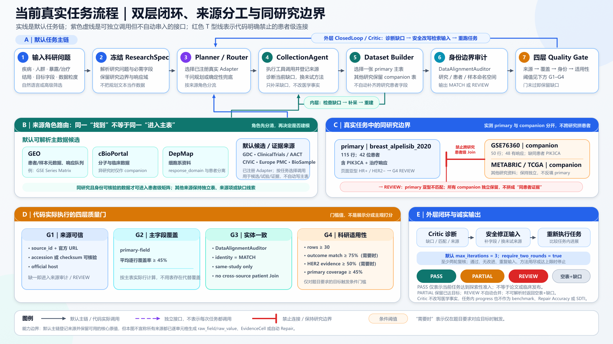
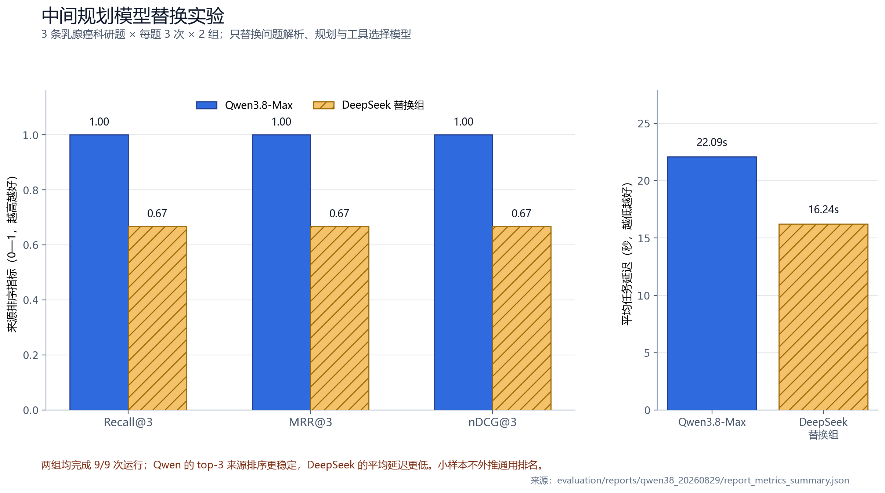
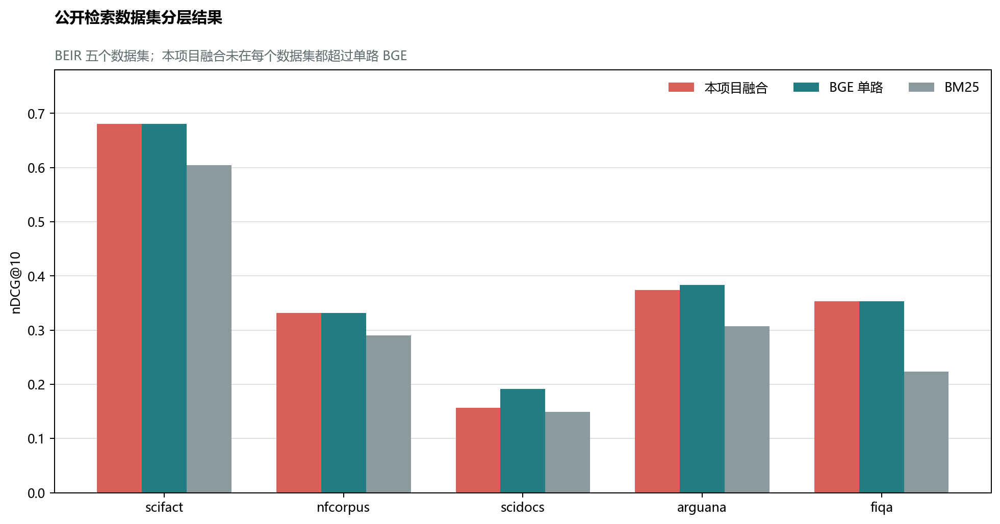
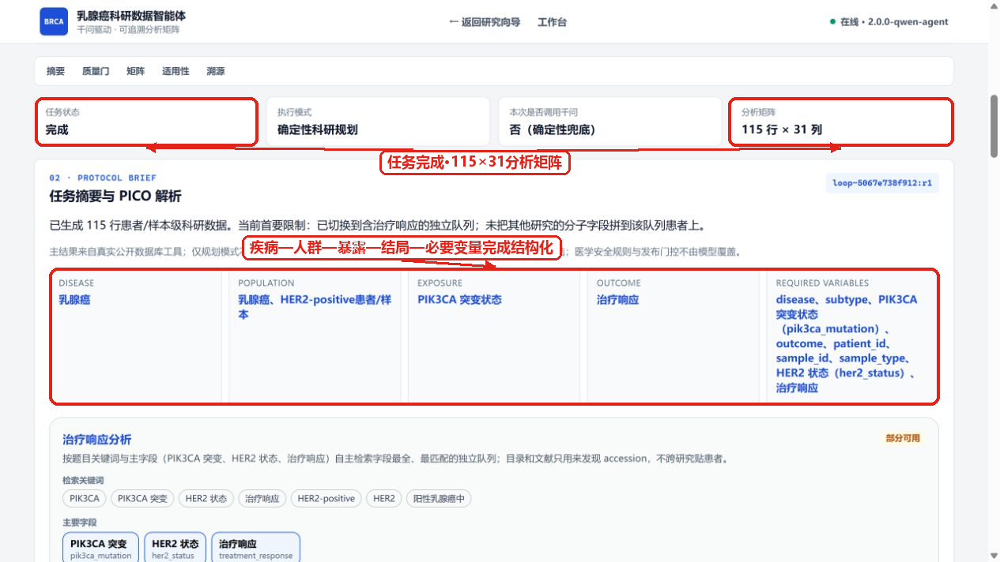
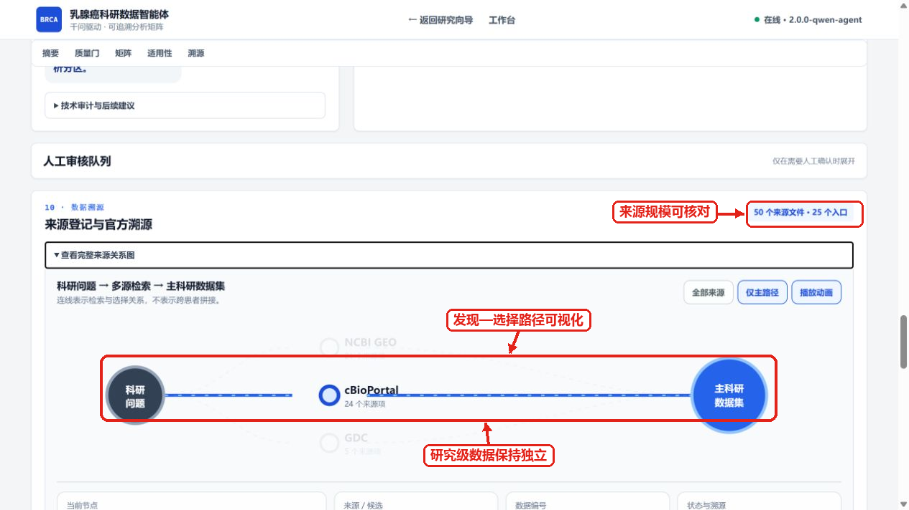
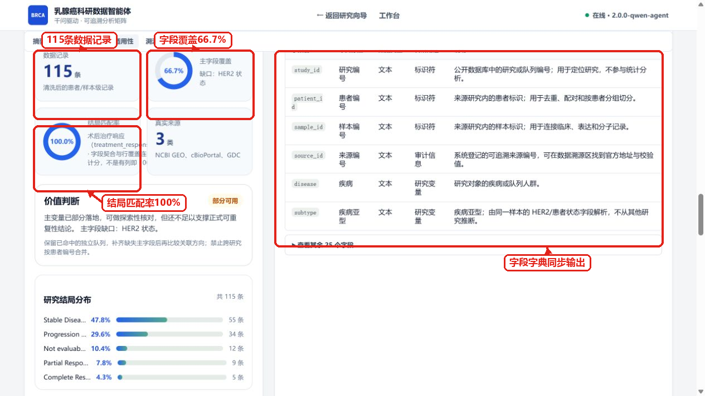

# 从科研问题到可用数据：乳腺癌精准治疗科研数据智能体的设计与验证

> 参赛方向：方向 1“科学数据整合与影响力分析应用”·A“科学数据查找、解析与整合”  
> 项目名称：乳腺癌精准治疗科研数据智能体  
> 数据场景：乳腺癌精准治疗公开科研数据的查找、异构解析、安全整合与质量审计  
> 文档版本：2026-08-31（国赛逻辑强化版）  
> 结果口径：当前任务实测、同卷系统回归、模型替换实验和公开模块基准分别报告。

## 参赛作品简介（300 字内）

乳腺癌精准治疗研究需要联合患者、分子变异、治疗与疗效数据，但资料分散在论文和多个数据库中，字段含义与患者编号也不统一。本作品将自然语言研究问题拆解为人群、分子变量、治疗、结局和分析单位，由受控程序查找并解析 GEO、cBioPortal、GDC 等真实来源，在同一研究边界内整理患者/样本记录，并保留来源、原始信息和质量状态。当前代表任务完成 2 轮、6 次真实工具调用，登记 50 个来源，形成 1 张主表和 3 张伴随表；GSE76360 构建出 50 名基线患者、48 条有效响应记录。系统最终交付数据表、字段字典、来源清单和质量报告，为后续统计分析提供可核对的数据基础。

## 摘要

本研究面向方向 1A“从科学问题到可用数据”的真实科研场景。以“研究 HER2 阳性乳腺癌中 PIK3CA 突变与新辅助治疗响应的关系”为例，研究者需要的并非一段医学知识，而是一份在人群、分子变量、治疗、结局和患者身份上口径一致的数据集。预查公开资料后发现，GSE76360 提供 HER2 阳性术前治疗响应，METABRIC 提供 PIK3CA 与临床信息，alpelisib 队列同时提供 PIK3CA 与治疗响应。三类资料具有互补价值，但研究人群、结局定义和患者命名空间不同，不能仅凭关键词或列名直接拼接。

针对上述问题，本文构建“问题结构化—文献与数据源发现—真实记录获取—异构解析—同研究整合—身份审计—质量判断—结果导出”的数据生产链。千问负责理解问题和规划工具，真实患者记录由已注册 Adapter 获取，确定性程序完成字段整理、来源登记、患者/样本边界检查和四层质量判断。系统按来源角色形成主表与伴随表，并将标准值、可取得的原始信息和来源凭证共同交付，使研究者能够追溯每张表的形成依据。

2026 年 8 月 31 日的当前版本实测完成 2 轮、6/6 次工具调用，登记 50 个来源，形成 4 张保持研究边界的数据表。主表 `breast_alpelisib_2020` 含 115 行、31 列及 42 名患者，GSE76360 伴随表含 50 名基线患者和 48 条有效响应记录。四层质量判断进一步把“表结构完整”与“适合当前问题”分开，使各队列在其真实适用范围内使用。同一未封存审核卷的系统版本回归中，Retrieval F1 从 0.4490 提升至 0.6500，Faithfulness、Traceability、Error F1 和 Repair Accuracy 均达到 1.0000，SDTI 从 63.36 提升至 91.75。规划模型替换实验和 3,677 条公开查询对照进一步给出了模型选择与检索路线的量化依据。结果表明，本系统已形成一套能够查找、解析、整合、追溯并判断科研适用性的科学数据应用。

**关键词：** AI for Science；科学数据整合；乳腺癌；异构数据；患者—样本关联；数据溯源；质量门；系统检验

---

## 1 背景与研究问题

### 1.1 AI for Science 面向可复核、可复用的科研证据

AI for Science 的价值在于让计算方法参与问题提出、数据发现和证据分析。落实到方向 1A，作品需要回答一个可验收的问题：用户提出研究目标后，系统能否找到真实资料，将其整理为可分析、可追溯、可复用的数据，并为后续研究说明适用条件。

FAIR 原则将科学数据的核心要求概括为可发现、可访问、可互操作和可复用[1]；W3C PROV 进一步要求记录数据实体、处理活动和责任主体之间的关系[2]。据此，本文将系统输出定义为一份完整的科研数据包：

> **输入乳腺癌科研需求，输出带有分析单位、真实来源、处理说明、质量状态和复用说明的结构化数据；不同研究之间缺少可靠身份映射时，以独立数据表保存其互补价值。**

这一目标把赛题要求落实为四个常识问题：数据从哪里来，经历了什么处理，记录为什么可以放在一起，最终能够支持哪项分析。

### 1.2 将医学问题转化为数据条件

本文选择以下问题作为贯穿系统设计与实验验证的代表任务：

> **研究 HER2 阳性乳腺癌中 PIK3CA 突变与新辅助治疗响应的关系，并整理患者级科研数据集。**

发现题目中的“HER2 阳性”“PIK3CA 突变”和“治疗响应”分别描述研究人群、分子暴露和临床结局。要分析三者关系，首先必须确定一行数据代表谁。本文将目标分析单位定义为“同一研究中的一名患者及其可追溯样本”，因此三项变量需要在同一患者或经可靠 crosswalk 证明的记录中关联。

**表 1 代表问题的数据条件与检验依据**

| 研究问题 | 必要数据 | 分析口径 | 检验依据 |
|---|---|---|---|
| 记录属于哪项研究 | `study_id`、accession | 研究级命名空间 | 患者编号和字段定义可定位到原研究 |
| 记录对应谁、哪份样本 | `patient_id`、`sample_id` | 患者级/样本级 | 同患者多样本能够识别，跨研究身份保持隔离 |
| 是否属于目标人群 | 疾病、HER2 状态、检测方法 | HER2 IHC/FISH 等临床维度 | 人群条件与检测维度均可核对 |
| 是否存在目标分子变量 | PIK3CA 突变、变异位点 | 同患者或同样本检测 | 分子变量与患者身份属于同一研究空间 |
| 接受了什么治疗 | 治疗名称、阶段和时间点 | 新辅助治疗口径 | 治疗阶段与代表问题一致 |
| 结局是什么 | `response_domain`、pCR/临床响应 | 患者临床响应 | 结局类型、时间点和研究粒度一致 |
| 一个值如何复核 | `source_id`、URL、原字段/原值 | 来源与处理过程 | 标准值能够回到真实来源和原始表达 |

分析表 1 可得，代表问题的关键不在于收集多少列，而在于同时满足**同研究、同患者、同语义、可追溯**四项条件。表 1 因而成为来源选择、字段整理、身份关联和质量判断的共同依据。

### 1.3 数据预查发现三类关键矛盾

为验证公开数据能否直接满足表 1，本文查找 GEO[3]、cBioPortal[4]、GDC[5] 及相关论文，并比较各来源能够提供的数据角色。预查结果显示，多源资料的价值主要表现为互补，而整合难点集中在以下三个层面。

#### 1）任务变量分散在不同研究中

GSE76360 记录 HER2 阳性乳腺癌术前治疗响应[7]；METABRIC 提供丰富的临床与 PIK3CA 信息；`breast_alpelisib_2020` 同时包含 PIK3CA 和治疗响应[8]。三类数据分别覆盖目标问题的一部分，因此系统既要发现多个来源，也要判断哪一来源适合作为主表、哪些来源应保留为伴随表。

#### 2）相近字段具有不同医学含义

HER2 IHC、FISH 与 ERBB2 拷贝数均涉及 HER2/ERBB2，但检测维度和临床解释不同；患者 pCR、临床响应与细胞系 AUC/IC50 也属于不同响应域。由此可知，字段标准化需要同时保留检测方法和响应域，仅依靠字符串相似度无法完成医学语义对齐。

#### 3）患者身份受研究命名空间约束

GSE76360 与 METABRIC 都使用患者/样本编号，但两项研究没有公开、可靠的患者 crosswalk。患者级整合因此必须先证明“同人”，再合并变量；研究间的主题相关性只能用于来源互补，不能直接生成联合患者记录。

三类矛盾分别推出三项设计约束：问题口径由研究需求固定，医学语义由标准化规则约束，患者身份由研究命名空间和 crosswalk 验证。在此基础上，系统还需用质量指标判断最终数据是否满足当前任务。

### 1.4 研究目标与验收依据

**表 2 研究目标、实现任务与验收证据**

| 研究目标 | 系统任务 | 验收证据 | 反馈动作 |
|---|---|---|---|
| 明确数据需求 | 识别人群、暴露、治疗、结局、分析单位和必要字段 | 结构化 ResearchSpec/任务摘要 | 待确认项进入补充输入 |
| 获取真实记录 | 由受控 Adapter 访问公开来源 | accession、`source_id`、官方 URL 和工具状态 | 来源覆盖不足时补搜或换队列 |
| 整理异构数据 | 按来源解析并统一常用字段 | 主表、伴随表、字段字典、原始信息 | 未统一内容保留原值与独立字段 |
| 安全关联身份 | 在同研究或可靠 crosswalk 内连接 | study/patient/sample 命名空间与审计状态 | 低置信度关系进入复核 |
| 判断科研适用性 | 分层检查来源、字段、身份和任务变量 | Gate 状态、指标分母、缺口和复用建议 | 依据缺口补搜、复核或导出 |

表 2 将“做了什么”与“如何证明”一一对应。下一步的系统设计不再从技术名词出发，而是围绕这五项可验证任务组织输入、处理与输出。

---

## 2 系统设计

### 2.1 系统架构：模型负责规划，程序负责事实

自然语言研究问题具有表达灵活性，患者事实则要求确定和可核查。考虑到两类任务的风险不同，系统采用分工式架构：千问识别研究对象、变量、结局和候选工具；已注册 Adapter 访问真实来源；确定性程序完成字段整理、身份审计、来源登记和质量判断；医学安全规则独立控制高风险语义与发布状态。

*图 1 当前系统架构。输入层接收科研方向与研究问题，中间主链完成规划、取数、建表、身份审计和质量判断，输出层交付科研数据包、来源材料、质量结论与可复用导出。*

从图 1 可以看出，系统不是“大模型直接连接数据库”的黑箱。底层由 GEO、cBioPortal、GDC 等真实来源和解析接口提供记录，上层通过 ResearchSpec、主表/伴随表、DataAlignmentAuditor 和 Quality Gate 形成完整处理体系。模型的计划会影响调用哪个工具，但不会改写来源记录、患者身份和医学规则。这一职责边界使系统既能理解模糊问题，又能保持科研数据的确定性。

### 2.2 端到端处理流程

*图 2 当前任务流程。外层闭环根据数据缺口调整来源，内层闭环处理允许自动修复的低风险字段；两类反馈都需要重新执行质量判断。*

图 2 所示流程具有明确先后依赖，具体过程如下。

**Step 1：结构化研究需求。** 从自然语言中抽取疾病、人群、分子变量、治疗、结局、分析单位和必要字段，形成 ResearchSpec。

**Step 2：规划文献与数据来源。** 根据必要字段查找论文、研究编号和数据库入口，并区分患者事实来源、试验来源和知识证据来源。

**Step 3：获取并解析真实记录。** 调用受控 Adapter，解析 API 返回、GEO Series Matrix 样本元数据及独立接口支持的结构化材料，同时登记来源状态。

**Step 4：分层建表与字段整理。** 在各研究内部统一常用字段，按任务变量覆盖选择主表，其他有价值来源保留为伴随表。

**Step 5：执行身份与质量审计。** 检查 study/patient/sample 命名空间、主要字段覆盖、响应域和目标人群条件，形成分层质量状态。

**Step 6：输出与反馈。** 导出数据表、字段字典、来源清单和质量报告；发现关键变量缺口时，Critic 将缺口改写为下一轮来源检索条件。

比较两类反馈可知，关键变量缺失触发补搜或换队列；低风险别名则在保留原值后受控修复。这样，系统不会把“再问一次模型”当作统一解决方案，而是根据问题类型选择不同动作。

### 2.3 文献检索与数据源发现

自然语言问题不能直接对应数据库字段。本文先将研究需求表示为：

$$
R=\{P,E,T,O,U,F\}.
$$

其中，$P$ 表示研究人群，$E$ 表示暴露或分子变量，$T$ 表示治疗，$O$ 表示结局，$U$ 表示分析单位，$F$ 表示必要字段集合。对于代表问题，$P$ 为 HER2 阳性乳腺癌，$E$ 为 PIK3CA 突变，$T$ 为新辅助治疗，$O$ 为患者临床响应，$U$ 为患者/基线样本。

字段集合 $F$ 回答“需要找什么”，文献与来源规划进一步回答“这些字段应从哪里取得”。Planning RAG 从 Europe PMC 等入口检索相关论文、开放全文与 accession 线索；其作用是帮助收束研究问题和发现数据编号[6]。随后，Adapter 根据已登记入口重新获取患者/样本事实，使“基于文献”与“患者数据取数”形成前后衔接，而不是由生成文本替代数据库记录。

### 2.4 多源解析与来源分工

不同来源承担不同科研角色。系统先按角色分层，再决定如何建表。

**表 3 主要来源、解析内容与整合规则**

| 来源 | 当前取得的主要内容 | 数据角色 | 进入结果的方式 |
|---|---|---|---|
| NCBI GEO | Series Matrix 中的 `!Sample_*` 元数据、characteristics、accession | 同研究患者/样本与响应队列 | 建立独立样本表，保留原始 characteristics |
| cBioPortal | 同一 study 内的临床、突变、CNA 和样本标识 | 患者/样本候选主表或伴随表 | 仅在 study 命名空间内建立关系 |
| GDC/TCGA | 癌症项目、文件、临床与组学候选 | 来源发现与独立伴随层 | 记录项目和文件来源，按任务字段选择 |
| ClinicalTrials.gov/AACT | 试验设计、干预和结局登记 | 试验层 | 用于解释研究设计和发现试验编号 |
| CIViC | 变异—药物—疾病证据 | 知识证据层 | 作为变异解释和来源线索 |
| Europe PMC | 论文、摘要、开放全文和 accession | 文献规划层 | 支撑问题收束与数据集发现 |
| CSV/Excel/HTML/JATS/PDF 文本 | 已提供的表格与文本材料 | 独立解析侧链 | 输出解析状态、原始记录与结构化字段 |

分析表 3 可知，多源整合的第一步是确定数据角色。患者事实来源进入候选主表或伴随表，试验与文献来源用于解释设计和发现编号，知识库用于补充证据。角色分工让系统既能扩大信息覆盖，又能保持不同数据粒度之间的边界。

### 2.5 字段标准化与医学语义隔离

来源分层避免了不同层级资料混用，但同层记录仍存在字段别名和医学语义差异，因此还需进行受控标准化。

#### 1）字段标准化

系统保留原字段和原值，再生成用于分析的标准值。以 GSE76360 为例，`NOR` 可映射为“未达客观缓解”，`Neg` 可映射为“阴性”，原始字符串继续保存在 `raw_characteristics` 中。标准值用于统计分组，原值用于来源核查，两者共同构成可复用数据。

#### 2）医学语义隔离

对于看似相近但含义不同的医学概念，系统冻结以下规则：HER2 IHC 2+ 保留为待复核/Equivocal；ERBB2 CNA 与 HER2 IHC 分维度保存；患者临床响应、试验结局和细胞系药敏通过 `response_domain` 区分；高权威来源冲突和低置信度身份关系进入人工复核。由此，标准化统一的是可比较内容，语义隔离保留的是研究边界。

### 2.6 患者/样本关联

字段含义统一后，变量能否进入同一行还取决于记录是否属于同一患者。设两条记录分别为 $r_i$ 和 $r_j$，患者级连接规则为：

$$
\operatorname{Join}(r_i,r_j)=
\begin{cases}
1, & \mathrm{study}_i=\mathrm{study}_j \land \mathrm{id}_i=\mathrm{id}_j,\\
1, & \operatorname{crosswalk}(i,j)=\mathrm{verified},\\
0, & \text{其他情况}.
\end{cases}
$$

式中，第一种取值为 1 的情况表示两条记录位于同一研究命名空间且标识一致；第二种情况表示来源提供了已核验的跨表映射。其余情况保持独立并记录 Gap。该规则使 patient/sample 编号始终与 `study_id` 共同解释，避免不同研究使用相似编号时发生患者错配。对于代表任务，GSE76360、METABRIC、TCGA-BRCA 和 alpelisib 队列分别建表，来源之间的互补性保留在数据包层，而不是写入同一患者行。

### 2.7 四层质量判断

身份关联成立只说明记录可以连接，还需进一步检验主表是否具备当前任务所需变量。设主表共有 $n$ 行，主要字段集合为 $F_p$，字段 $f_j$ 的非缺失覆盖率为 $c_j$，则主要字段平均行覆盖为：

$$
C_f=\frac{1}{\lvert F_p\rvert}\sum_{f_j\in F_p}c_j.
$$

**表 4 四层质量判断及其科研作用**

| 质量层 | 核心检查 | 当前规则/输出 | 科研作用 |
|---|---|---|---|
| Gate 1 来源可信 | `source_id`、官方 URL、accession/校验状态 | 来源可登记后进入下一层 | 说明数据来自哪里 |
| Gate 2 字段质量 | 已识别主要字段的平均行覆盖 | 当前探索阈值 $C_f\ge 0.45$ | 判断表结构能否形成 |
| Gate 3 实体一致性 | study/patient/sample 命名空间与身份状态 | 同研究连接，低置信度进入复核 | 说明记录为何可以关联 |
| Gate 4 科研适用性 | 样本量、任务变量、结局同域和目标人群证据 | 按研究问题触发对应条件 | 判断表能支持哪项分析 |

Gate 2 验证表结构，Gate 4 进一步核验任务变量，因此“已有字段的完整率”和“科研问题的覆盖率”不会被混为一谈。系统由此形成可执行的数据生产链，其有效性将在当前任务、同卷回归和公开基线中分别验证。

---

## 3 结果输出与系统检验

### 3.1 实验设置与数据产出

本文于 2026 年 8 月 31 日运行当前仓库版本 `2.0.0-qwen-agent`，以相同代表问题检查数据主链。当前页面任务采用 `use_qwen=false` 的确定性规划，用于隔离生成式补值影响并验证真实取数、分表和质量判断；千问模型效果由同卷系统回归与独立模型替换实验另行检验。

任务编号为 `loop-5067e738f912:r1`。系统完成 2 轮采集和 6/6 次工具调用，登记 50 个来源，形成 1 张主表和 3 张伴随表。

**表 5 当前实测形成的数据表及科研用途**

| 数据表 | 当前规模 | 关键内容 | 科研用途 | 系统处理 |
|---|---:|---|---|---|
| `breast_alpelisib_2020` 主表 | 115 行 × 31 列；42 名患者 | PIK3CA、alpelisib 治疗响应、样本信息 | 支持该队列内部的分子—响应探索 | 作为当前字段覆盖最完整的主表展示 |
| GSE76360 伴随表 | 50 行 × 21 列；50 名患者 | HER2 阳性、术前曲妥珠单抗、治疗响应 | 支持 HER2 阳性队列的响应构成分析 | 以独立患者/样本表保存 |
| METABRIC 伴随表 | 86 行 × 48 列 | 临床、PIK3CA、部分受体/分子信息 | 支持分子与临床变量探索 | 保持原研究命名空间 |
| TCGA-BRCA 伴随表 | 60 行 × 94 列 | 临床及多类组学/病理字段 | 提供乳腺癌临床与组学候选 | 作为独立伴随数据保存 |

分析表 5 可以发现，四张表形成了三类互补数据角色：PIK3CA 与响应、HER2 阳性与响应、PIK3CA 与丰富临床信息。系统据此保留各研究的分析单位和来源关系，使研究者既获得多源数据覆盖，又能够清楚判断每张表适合回答什么问题。

### 3.2 GSE76360 响应样本集的构建与用途

GSE76360 官方条目表明，该研究围绕早期 HER2 阳性乳腺癌术前治疗开展基因表达研究，并记录 pCR、客观缓解和未达客观缓解等结局[7]。系统从 Series Matrix 样本注释中识别基线样本，得到 50 名患者：客观缓解 33 名、病理完全缓解 9 名、未达客观缓解 6 名、响应缺失 2 名。

为统一响应构成的统计分母，本文保留 2 条缺失状态，并在响应分析集中排除，得到：

$$
D_{\mathrm{response}}
=\left\{i\in D_{\mathrm{GSE76360}}\mid \mathrm{response}_i\neq \mathrm{missing}\right\},
\qquad
\left\lvert D_{\mathrm{response}}\right\rvert=48.
$$

由此形成的 48 条有效记录可直接用于计算该队列的响应分布。与此同时，系统将 PIK3CA 识别为列级研究缺口，使下一轮检索能够转向同队列分子附件或同时覆盖两类变量的新队列，而不是对缺失列进行无依据插补。

*图 3 GSE76360 基线患者样本表。研究、患者、样本和治疗响应字段在同一页面呈现，50 名患者中形成 48 条有效响应记录。*

从图 3 可以看出，`study_id`、`patient_id` 和 `sample_id` 共同限定每条记录的身份，治疗响应和 pCR 字段则给出结局。该表不仅提供统计值，还保留了分析单位，因此 48 这一数字能够回到具体患者记录核查。

### 3.3 标准值与原值形成双层审计

*图 4 样本 GSM1982110 的标准值与 GEO 原始特征并排展示。*

分析图 4，左侧为便于统计分组的中文标准值，右侧为 GEO 原始 characteristics，包括患者编号 `119`、`HER2+ Breast Cancer`、`baseline`、`NOR` 和 `Neg`。两类信息一一对应，说明字段整理没有覆盖原始表达。研究者既可以使用标准值进行分组，也可以沿原值回查字段含义和来源。

### 3.4 三类质量指标回答不同问题

当前页面同时给出字段行覆盖、核心变量覆盖和全表完整率。三类指标的分母不同：字段行覆盖衡量已进入主表的主要字段在 115 行中的非缺失程度；核心变量覆盖衡量代表问题要求的 PIK3CA、治疗响应和 HER2 是否进入当前主表；全表完整率衡量 31 列展示字段的总体非缺失情况。

*图 5 四层质量判断把来源、字段、实体与科研适用性分开呈现。*

从图 5 可以看出，Gate 1—3 已完成来源、字段和身份核验，Gate 4 进一步识别当前数据的人群适用范围。该分层设计使 115 行数据规模、较高字段完整度和目标人群条件分别接受检验，研究者能够据此选择适合的分析任务，而不是被单一百分比替代判断。

### 3.5 模型与系统效果的分层对照

代表任务说明系统能够完成取数和审计；相对效果还需通过同卷前后对照、模型替换和公开基线进行检验。为避免指标堆叠，本文先说明各指标回答的问题：Retrieval F1 同时衡量目标来源是否找准和找全；Faithfulness 检查标准化是否保持原始医学语义；Traceability 检查关键字段能否回到来源；Error F1 检查错误是否被准确发现；Repair Accuracy 检查允许自动修复的值是否修对；SDTI 采用五项指标的几何平均，体现任一短板对总体可信度的影响。

#### 1）同一审核卷的系统版本回归

历史基线与严格千问 LIVE 候选使用同一组 50 条检索判断、26 条字段样本和 18 条错误样本。两次运行不仅规划模型不同，字段规则、错误检测和修复逻辑也经历了系统迭代，因此该实验用于检验“当前系统版本相对历史版本”的整体变化，不将全部增益归因于单一模型。

*图 6 历史基线与严格千问 LIVE 候选在五维质量指标上的同卷回归。*

**表 6 同卷系统回归结果**

| 指标 | 历史基线 | 当前严格 LIVE 候选 | 绝对变化 | 结果说明 |
|---|---:|---:|---:|---|
| Retrieval Precision | 0.3548 | 0.5909 | +0.2361 | 返回来源的相关性提高 |
| Retrieval Recall | 0.6111 | 0.7222 | +0.1111 | 目标来源覆盖提高 |
| Retrieval F1 | 0.4490 | 0.6500 | +0.2010 | 检索准确与覆盖同步改善 |
| Faithfulness | 0.6538 | 1.0000 | +0.3462 | 26/26 个字段样本保持预期语义 |
| Traceability | 1.0000 | 1.0000 | 0 | 26/26 个字段样本保留来源锚点 |
| Error F1 | 0.6957 | 1.0000 | +0.3043 | 18 条错误样本均被正确识别 |
| Repair Accuracy | 0.5000 | 1.0000 | +0.5000 | 3 次允许自动修复均正确 |
| SDTI | 63.36 | 91.75 | +28.39 | 五维综合质量明显提高 |

分析图 6 和表 6 可得，系统版本回归的主要增益来自字段忠实、错误检测、修复正确率和检索 F1。Traceability 在两版中均保持 1.0000，说明来源锚点是较稳定的基础能力。当前候选卷尚未封存，因此上述结果用于版本验证；正式提交仍需在独立测试集复验。

#### 2）Qwen3.8-Max 与 DeepSeek 的规划模型替换实验

为判断生产规划模型的选择是否有依据，实验固定真实 Adapter、医学规则、工具预算和后续处理，仅替换问题解析、规划与工具选择模型。3 条乳腺癌科研题按每题 3 次运行，每组共 9 次。

*图 7 Qwen3.8-Max 与 DeepSeek 替换组的来源排序指标和平均任务延迟。*

**表 7 规划模型同条件对照**

| 指标 | Qwen3.8-Max | DeepSeek 替换组 | 设计判断 |
|---|---:|---:|---|
| 完成运行 | 9/9 | 9/9 | 两组均可完成受控工具流程 |
| Recall@3 | 1.0000 | 0.6667 | Qwen 的目标来源进入前三更稳定 |
| MRR@3 | 1.0000 | 0.6667 | Qwen 的首个相关来源位置更靠前 |
| nDCG@3 | 1.0000 | 0.6667 | Qwen 的前三来源排序质量更高 |
| 平均延迟 | 22.09 s | 16.24 s | DeepSeek 具有速度优势 |
| Analysis Ready | 3/9 | 5/9 | DeepSeek 在该口径下更易形成分析候选 |

从图 7 和表 7 可以发现，两种模型各有优势：Qwen3.8-Max 的 top-3 来源排序更稳定，DeepSeek 的平均延迟更低且 Analysis Ready 比例更高。考虑到系统首先需要把有限工具预算用于正确来源，生产主链继续选择 Qwen3.8-Max，同时保留 DeepSeek 适配器用于后续扩大样本后的复验。该实验样本量为每组 9 次，只用于解释当前工程选择。

#### 3）BM25、BGE 与融合检索对照

为检验语义检索是否优于词法检索，项目在 SciFact、NFCorpus、SciDocs、ArguAna 和 FiQA 五个公开数据集的 3,677 条查询上进行同协议比较。

*图 8 五个公开检索数据集上的 nDCG@10 对照。*

**表 8 公开检索宏平均结果**

| 方法 | 查询数 | nDCG@10 | Recall@100 | MRR@10 | 平均延迟 |
|---|---:|---:|---:|---:|---:|
| 调参 BM25 | 3,677 | 0.3147 | 0.5552 | 0.3629 | 54.57 ms |
| BGE-small-en-v1.5 | 3,677 | **0.3880** | **0.6554** | **0.4421** | **10.72 ms** |
| BM25+BGE 融合 | 3,677 | 0.3791 | 0.6422 | 0.4277 | 62.73 ms |

BGE 在五个数据集上的 nDCG@10 均高于 BM25，宏平均提高 0.0733，Recall@100 提高 0.1002。融合没有进一步超过 BGE，因此当前路线选择 BGE 作为语义检索主候选，并保留 BM25 作为低依赖回退。该结果说明模型复杂度需要由同条件指标验证，而不是默认“组合越多越好”。

#### 4）查询改写消融

在 75 条固定公开查询上，本文进一步比较原始查询、规则扩展、Qwen 单查询、Qwen 多查询及“规则 + Qwen”组合，只改变检索前的查询构造。

**表 9 查询理解消融结果**

| 方法 | nDCG@10 | Recall@100 | MRR@10 | 设计结论 |
|---|---:|---:|---:|---|
| A 原始查询 | **0.3151** | 0.5557 | **0.3538** | 当前稳定默认 |
| B 规则扩展 | 0.3117 | 0.5490 | 0.3480 | 未形成整体增益 |
| C Qwen 单查询 | 0.2916 | 0.5520 | 0.3234 | 部分查询召回改善，前排排序下降 |
| D Qwen 多查询 | 0.2913 | 0.5449 | 0.3218 | 多查询未带来稳定提升 |
| E 规则 + Qwen | 0.3007 | **0.5726** | 0.3436 | 适合作为条件式召回增强 |

分析表 9 可以发现，E 组将 Recall@100 从 0.5557 提高到 0.5726，但 nDCG@10 下降 0.0144。由此，系统没有全局开启查询扩展，而是将其保留为短查询或召回不足场景的候选策略。该消融把“是否使用 Qwen 改写”转化为可检验决策，并说明模型组件只有在匹配具体指标目标时才具有价值。

### 3.6 代表问题的完成度

综合当前任务和三层对照，系统已经完成真实来源发现、异构记录解析、主表/伴随表构建、研究命名空间审计、原值回查和质量状态输出。代表任务共登记 50 个来源，形成 4 张可分别复用的数据表，其中 GSE76360 得到 48 条有效响应记录；四层质量判断进一步把每张表限定在其真实研究人群和结局范围内。

当前数据把目标关联分析的剩余条件准确定位为“同一 HER2 阳性新辅助治疗队列中的患者级 PIK3CA 联合变量”。这一定位使下一步工作具有明确方向：优先查找 GSE76360 的同队列分子附件，或寻找同时提供 HER2、PIK3CA 与临床响应的新队列。换言之，系统不仅交付已有数据，还把后续检索从宽泛搜索收束为可执行的数据条件。

---

## 4 前端网页设计

### 4.1 页面围绕研究决策组织，而非围绕数据库组织

前端将科研工作分为“提出方向—明确问题—准备数据—核对结果”四类任务。用户不需要先掌握 GEO、cBioPortal 或 GDC 的接口差异，而是先说明研究对象和结局，再由系统展示字段需求、来源、数据表和质量判断。

*图 9 同一 PIK3CA 代表任务的页面摘要。自然语言问题被拆解为疾病、人群、暴露、结局和必要变量，并形成 115 行 × 31 列分析矩阵。*

从图 9 可以看出，页面首先呈现结构化任务摘要，再呈现数据结果。这样，研究者能够直接检查系统是否理解了正确的人群、分子变量和结局；后续每张表和每个指标也都可以回到这份需求进行解释。

### 4.2 数据表与原值审计支撑逐条核对

图 3 展示患者/样本表，图 4 展示标准值与 GEO 原值。两级页面分别回答“得到了哪些记录”和“一个值为什么这样写”。表格视图保留 study/patient/sample 身份，详情抽屉保留原始 characteristics，使非技术研究者既能浏览结果，也能对关键样本进行来源核查。

### 4.3 来源血缘展示数据如何被发现和选择

*图 10 来源页展示 50 个来源文件、25 个入口及当前主表的发现路径。*

分析图 10，页面从科研问题连接到数据库入口，再连接到最终数据集，同时显示来源规模和状态。该视图的作用是把“查找过程”转化为可检查路径：研究者可以看到数据由哪个来源发现、哪一项被选为主表、其他来源如何保留为伴随材料。来源关系与患者关联分别展示，因而不会把数据库连线误读为患者合并关系。

### 4.4 适用性页面把数据规模、覆盖和复用建议放在一起

*图 11 适用性页面同时展示数据规模、结局匹配、核心变量覆盖、患者/样本粒度和字段用途。*

从图 11 可以看出，页面没有用单一总分概括所有质量。115 行说明数据规模，100% 结局匹配说明当前主表中的响应字段完整，核心变量覆盖说明任务条件的满足程度；34 名患者对应多个样本则提醒下游分析按患者分组划分训练集和测试集。字段字典进一步标明标识列、分析列和来源列，使研究者能够把数据安全导入 Python、R 或其他统计工具。

### 4.5 前端的实际作用

**表 10 前端功能与科研作用**

| 页面功能 | 用户看到什么 | 支持的科研判断 |
|---|---|---|
| 任务摘要 | 人群、暴露、治疗、结局和必要字段 | 系统是否理解了正确问题 |
| 文献与来源 | 论文条目、provider、`source_id`、真实入口 | 问题和数据编号依据是否可核对 |
| 主表/伴随表 | 数据规模、分析单位、患者/样本字段 | 每张表分别适合什么分析 |
| 原值审计 | 标准值与原始 characteristics | 字段转换是否保持原义 |
| 来源血缘 | 来源入口、发现路径和数据集关系 | 数据如何被找到和选中 |
| 科研适用性 | 字段覆盖、结局匹配、粒度和复用说明 | 数据是否可进入下一步分析 |
| 导出 | CSV、Excel、Parquet/JSON 及质量材料 | 数据如何在后续科研工具中复用 |

分析表 10 可得，前端并非单纯展示结果，而是把问题、来源、数据和质量之间的逻辑关系显式化。Qwen 工作人员可以据此检查模型规划与工具调用，团委教师也可以沿页面顺序理解“提出什么问题—找到什么数据—为什么这样整理—最终可以做什么”。

---

## 5 特殊性与科研价值

### 5.1 特殊性来自四项机制协同

#### 1）研究问题直接约束数据字段

系统先识别人群、暴露、治疗、结局和分析单位，再查找来源。由此，“找到了乳腺癌数据”被进一步细化为“是否找到同一患者层面的目标变量”。

#### 2）多源数据先分角色，再做整合

GEO、cBioPortal、GDC、试验库、知识库和论文库分别承担患者事实、候选数据、试验设计或证据发现角色。系统不以数据库数量作为成果，而以每个来源是否进入正确数据层作为整合依据。

#### 3）患者身份与医学语义共同约束连接

普通字段拼接只判断字符串是否相同，本系统同时检查 study 命名空间、crosswalk、HER2 检测维度和 response domain。由此得到的表不仅列名统一，而且分析单位与医学含义一致。

#### 4）质量结果能够改变下一步行动

四层质量判断把问题定位到来源、字段、身份或科研适用性，并将缺口转化为补搜、换队列、复核或导出动作。系统因此形成“发现问题—定位原因—调整来源—重新检验”的科研闭环。

### 5.2 与常见方案的能力对照

**表 11 常见工具与本系统的能力覆盖**

| 方案 | 自然语言理解 | 真实患者/样本取数 | 医学语义与身份边界 | 原值与来源追溯 | 科研适用性判断 |
|---|---|---|---|---|---|
| 搜索引擎 | 关键词检索 | 提供网页入口 | 依赖人工判断 | 可回网页，缺少统一过程 | 依赖研究者手工完成 |
| 通用大模型 | 较强 | 无法单独保证记录真实性 | 主要依赖提示词 | 可生成引用说明 | 适合解释知识，不直接交付患者表 |
| 普通 ETL | 依赖预设规则 | 可处理已提供文件 | 擅长格式转换，需额外领域规则 | 可记录作业日志 | 通常不理解研究问题 |
| 本系统 | 结构化研究需求 | 受控 Adapter 获取 | study/crosswalk + 医学规则 | 来源、原值、血缘和质量材料 | 四层质量判断与反馈动作 |

表 11 表明，本系统的不可替代性并非来自某一个模型或数据库，而是把问题理解、真实取数、领域约束、来源追溯和科研适用性判断连接成一条可执行流程。对于只需要医学背景知识的场景，通用大模型已经足够；对于需要患者/样本级公开数据并准备进入统计分析的任务，上述组合机制能够减少人工跨库查找和错误整合。

### 5.3 实测证据对应的科研收益

**表 12 已完成工作、实测证据与科研收益**

| 已完成工作 | 实测证据 | 科研收益 |
|---|---|---|
| 真实来源查找 | 2 轮、6/6 次工具调用、50 个来源 | 将宽泛问题落实到可访问的数据入口 |
| 多源结构化 | 1 张主表、3 张伴随表 | 同时利用多个队列并保留研究边界 |
| 响应分析集构建 | GSE76360 50 名患者、48 条有效响应 | 为队列内部描述与后续研究提供明确分母 |
| 患者/样本审计 | study/patient/sample 三层标识 | 降低重复计数和跨研究错配风险 |
| 原值回查 | 标准值与 GEO characteristics 并排 | 使字段清洗可以复核 |
| 模型选择 | Qwen/DeepSeek 18 次同条件运行 | 用来源排序和延迟解释工程选择 |
| 检索路线选择 | 3,677 条公开查询 | 用跨数据集指标选择 BGE 主路和 BM25 回退 |
| 系统质量回归 | SDTI 63.36 → 91.75 | 量化版本迭代对五维质量的影响 |

### 5.4 下一阶段工作由实验结果直接推出

1. 将冻结 Research Contract 中的人群、变量和结局作为来源排序与主表选择的硬条件，使任务适配在取数前生效。

2. 将 Canonical Schema、逐字段 Evidence 与灵活宽表主链进一步收束，使每个关键值都能统一记录原字段、原值、转换规则和置信度。

3. 建立新的封存测试集，在未参与开发的乳腺癌问题上重复检索、字段标准化、错误检测和修复评测，并扩大 Qwen/DeepSeek 模型替换实验的题目数量。

上述三项工作分别对应当前检索、人群适配和独立泛化证据，是由表 5—表 9 的实测结果自然推出的改进顺序。

---

## 6 结论

本文围绕方向 1A 的科学数据场景，构建了一套从自然语言科研问题到结构化数据包的乳腺癌精准治疗科研数据智能体。系统将人群、分子变量、治疗、结局和分析单位结构化，由受控 Adapter 获取真实记录，再完成来源分工、字段整理、患者/样本身份审计、四层质量判断和多格式输出。模型负责问题理解与工具规划，患者事实、医学规则和发布状态由确定性程序控制。

当前代表任务完成 2 轮、6 次真实工具调用，登记 50 个来源，形成 115 行主表和 3 张独立伴随表；GSE76360 得到 50 名基线患者和 48 条有效响应记录。结果说明，系统已经把分散的公开资料整理为具有明确分析单位、来源和适用范围的数据材料，并能够把后续检索收束到“同一目标队列中的患者级联合变量”。

系统效果由三类对照共同支持：同卷版本回归显示 Retrieval F1 提升 0.2010、SDTI 提升 28.39；Qwen3.8-Max 与 DeepSeek 的同条件替换实验解释了来源排序与延迟之间的选择；3,677 条公开查询表明 BGE 的 nDCG@10、Recall@100 和 MRR@10 均优于 BM25。由此可见，本项目的价值不在于用 AI 生成乳腺癌结论，而在于把“为什么找这些数据、实际取得了什么、哪些记录能够安全整合、每个值如何核对、数据适合哪项分析”形成一条可检查、可复用的科研数据链。

---

## 附录 A 术语说明

| 术语 | 本文中的含义 |
|---|---|
| ResearchSpec/Research Contract | 将研究人群、变量、治疗、结局和分析单位固定为可执行需求 |
| Adapter | 连接特定公开数据库并返回真实记录的受控取数器 |
| accession | 数据库分配给研究、数据集或样本的可核对编号 |
| 主表/伴随表 | 当前任务最匹配的数据表，以及保持独立但具有互补价值的来源表 |
| crosswalk | 来源提供的可靠身份映射，用于证明两个编号对应同一患者/样本 |
| Evidence | 标准值背后的来源、原字段、原值和处理依据 |
| `response_domain` | 区分患者响应、试验结局、知识证据和细胞系药敏的字段 |
| Quality Gate | 在数据进入分析前分层检查来源、字段、身份和科研适用性的机制 |
| SDTI | 检索、忠实、追溯、错误检测和修复五项指标的几何平均指数 |

## 附录 B 当前实测记录

| 项目 | 本文记录 |
|---|---|
| 实测日期 | 2026-08-31 |
| 当前版本 | `2.0.0-qwen-agent` |
| 任务编号 | `loop-5067e738f912:r1` |
| 科研问题 | HER2 阳性乳腺癌中 PIK3CA 突变与新辅助治疗响应 |
| 当前页面运行方式 | `use_qwen=false`，用于检验确定性数据主链 |
| 工具与来源 | 2 轮，6/6 次工具成功；50 个来源；GEO/cBioPortal/GDC 三类 |
| 主表 | `breast_alpelisib_2020`，115 行 × 31 列，42 名患者 |
| 伴随表 | GSE76360 50×21；METABRIC 86×48；TCGA-BRCA 60×94 |
| 质量状态 | Gate 1—3 `PASS`；Gate 4 定位任务适用条件；`publish_allowed=false` |
| 下一检索条件 | 同一 HER2 阳性新辅助治疗队列中的患者级 PIK3CA 联合变量 |

## 附录 C 项目内证据与复现索引

1. [当前生产主链](CURRENT_MAINLINE.md)
2. [分层数据与指标报告](DATA_REPORT_20260829.md)
3. [系统设计报告](FINAL_SYSTEM_DESIGN_REPORT_20260830.md)
4. [前端当前功能说明](FRONTEND_COMPLETE.md)
5. [医学安全规则](05_医学安全规则.md)
6. [冻结指标与 SDTI 公式](06_评测指标与SDTI.md)
7. [严格千问 LIVE 候选指标](../goldset/breast_cancer/official_candidate/evaluation_runs/official-candidate-qwen-live-audited-final-20260830/metrics.json)
8. [Qwen3.8-Max 模型替换与消融报告](../evaluation/reports/qwen38_20260829/FINAL_EVALUATION_REPORT_ZH.md)
9. [公开检索宏平均结果](../evaluation/vnext_retrieval_calibrated_macro_20260828.json)
10. [公开同类方法对照结果](../evaluation/github_competitor_benchmark_20260830/results.json)
11. [当前系统架构 SVG](images/current-system-architecture-v4-20260831.svg)
12. [当前任务流程 SVG](images/current-task-workflow-v4-20260831.svg)

## 参考文献

[1] Wilkinson M D, Dumontier M, Aalbersberg I J, et al. [The FAIR Guiding Principles for scientific data management and stewardship](https://doi.org/10.1038/sdata.2016.18). *Scientific Data*, 2016, 3:160018.

[2] W3C. [PROV-DM: The PROV Data Model](https://www.w3.org/TR/prov-dm/). W3C Recommendation, 2013.

[3] Edgar R, Domrachev M, Lash A E. [Gene Expression Omnibus: NCBI gene expression and hybridization array data repository](https://pubmed.ncbi.nlm.nih.gov/11752295/). *Nucleic Acids Research*, 2002, 30(1):207–210.

[4] Cerami E, Gao J, Dogrusoz U, et al. [The cBio Cancer Genomics Portal: An Open Platform for Exploring Multidimensional Cancer Genomics Data](https://pubmed.ncbi.nlm.nih.gov/22588877/). *Cancer Discovery*, 2012, 2(5):401–404.

[5] Grossman R L, Heath A P, Ferretti V, et al. [Toward a Shared Vision for Cancer Genomic Data](https://pmc.ncbi.nlm.nih.gov/articles/PMC6309165/). *New England Journal of Medicine*, 2016, 375:1109–1112.

[6] Lewis P, Perez E, Piktus A, et al. [Retrieval-Augmented Generation for Knowledge-Intensive NLP Tasks](https://papers.neurips.cc/paper/2020/file/6b493230205f780e1bc26945df7481e5-Paper.pdf). *NeurIPS*, 2020.

[7] NCBI GEO. [GSE76360: 03-311 Trastuzumab preoperative trial of early-stage HER2-positive breast cancer](https://www.ncbi.nlm.nih.gov/geo/query/acc.cgi?acc=GSE76360).

[8] Razavi P, Dickler M N, Shah P D, et al. [Alterations in PTEN and ESR1 promote clinical resistance to alpelisib plus aromatase inhibitors](https://www.nature.com/articles/s43018-020-0047-1). *Nature Cancer*, 2020, 1:382–393.
