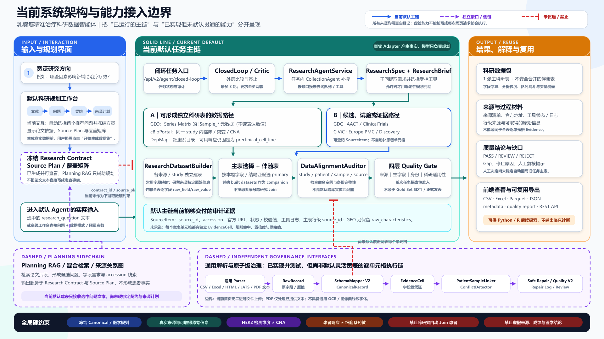
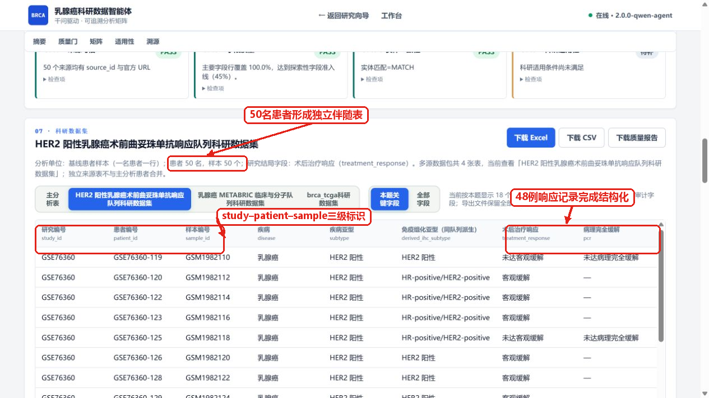
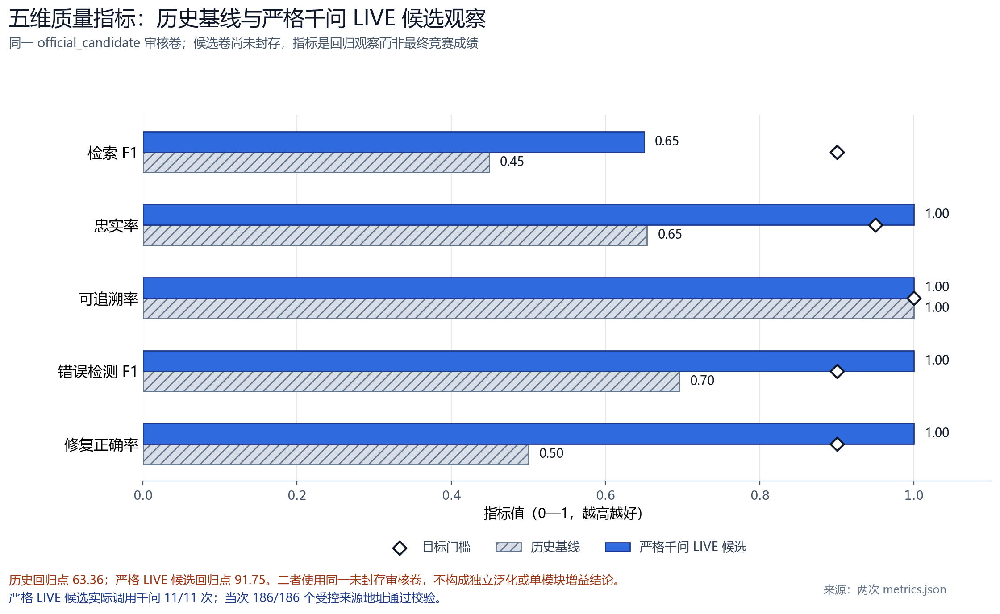

# 从科研问题到可用数据：乳腺癌精准治疗科研数据智能体的设计与验证

> 参赛方向：方向 1“科学数据整合与影响力分析应用”·A“科学数据查找、解析与整合”  
> 项目名称：乳腺癌精准治疗科研数据智能体  
> 数据场景：乳腺癌精准治疗公开科研数据的查找、异构解析、安全整合与质量审计  
> 文档版本：2026-08-31（完整论文版）  
> 结果口径：当前任务实测、同卷系统回归、规划模型替换实验和公开检索基准分别报告。

## 参赛作品简介（300 字内）

乳腺癌精准治疗研究需要联合患者、分子变异、治疗和疗效数据，但资料分散在论文及多个数据库中，字段含义和患者编号也不统一。本作品先将自然语言问题拆解为人群、分子变量、治疗、结局和分析单位，再由受控程序查找并解析 GEO、cBioPortal、GDC 等真实来源，在研究边界内建立患者/样本数据表，并保留原值、来源与质量状态。当前代表任务完成 2 轮、6 次真实工具调用，登记 50 条来源记录，形成 1 张主表和 3 张伴随表；GSE76360 得到 50 名基线患者和 48 条有效响应记录。系统交付数据表、字段字典、来源清单和质量报告，使研究者能够判断数据从哪里来、为何可以关联以及适合开展何种分析。

## 摘要

方向 1A 要求 AI 应用完成“从科学问题到可用数据”的转换。以“研究 HER2 阳性乳腺癌中 PIK3CA 突变与新辅助治疗响应的关系”为例，真正需要交付的并非一段医学知识，而是一份在人群、分子变量、治疗、结局和患者身份上口径一致的数据集。查找相关文献与公开数据登记条目后发现，GSE76360 提供 HER2 阳性术前治疗响应，METABRIC 提供 PIK3CA 与临床信息，alpelisib 队列同时提供 PIK3CA 与治疗响应。上述来源能够互相补充，却属于不同研究，其人群、结局定义和患者命名空间也不相同，因而不能依据主题相关性直接合并。

基于这一矛盾，本文构建“问题结构化—文献与来源发现—真实记录获取—异构解析—研究内建表—语义与身份审计—科研适用性判断—结果导出”的数据生产链。千问负责理解问题并规划工具，患者/样本事实由已注册 Adapter 从真实来源取得，确定性程序则负责字段标准化、来源登记、研究命名空间检查和医学安全约束。当前一步产生的证据不足以支持后一步时，系统不使用生成内容补齐，而是将缺失条件反馈为下一轮检索或人工复核任务。

2026 年 8 月 31 日的代表任务实测完成 2 轮采集和 6/6 次工具调用，登记 50 条来源记录，形成 1 张主表与 3 张保持研究边界的伴随表。主表 `breast_alpelisib_2020` 含 115 行、31 列和 42 名患者，提供 HR+/HER2- alpelisib 队列中的 PIK3CA 与响应；GSE76360 伴随表含 50 名 HER2 阳性基线患者，其中 48 条记录具有可用于队列描述的响应标签。进一步核对发现，两张表分别覆盖目标问题的一部分，却不能跨研究合并为患者级联合数据。由此，系统把宽泛的“继续找数据”收束为“补查同队列 PIK3CA 分子附件或寻找三项变量同时覆盖的新队列”。

在同一未封存审核卷的版本回归中，Retrieval F1 由 0.4490 提升至 0.6500，Faithfulness、Traceability、Error F1 和 Repair Accuracy 均达到 1.0000，SDTI 由 63.36 提升至 91.75。随后，通过 Qwen3.8-Max 与 DeepSeek 的同条件替换、BM25/BGE 检索对照以及查询改写消融，本文进一步解释了当前规划模型、检索器和查询策略的选择依据。结果表明，本系统的作用不是替代研究者给出医学结论，而是把分散资料转化为来源可查、处理可核、边界明确并可继续分析的科研数据包。

**关键词：** AI for Science；科学数据整合；乳腺癌；异构数据；患者—样本关联；数据溯源；质量审计

---

## 1 背景与研究问题

### 1.1 从 AI for Science 落到可验收的科研数据包

AI for Science 使计算方法能够参与问题提出、数据发现和证据分析。然而，对于科学数据整合方向而言，“能够回答问题”并不等同于“能够支撑研究”。如果系统只生成一段看似完整的医学说明，研究者仍无法确认数据来自哪里、经历了何种处理，也无法判断不同记录是否可以进入同一项分析。因此，方向 1A 的核心交付应当从文本回答进一步落到可复核的数据材料。

FAIR 原则将科学数据的基本要求概括为可发现、可访问、可互操作和可复用[1]；W3C PROV 则强调数据实体、处理活动和责任主体之间的来源关系[2]。结合上述要求，本文将系统目标定义为：

> **输入乳腺癌科研需求，输出带有明确分析单位、真实来源、处理说明、质量状态和复用边界的结构化数据；当不同研究缺少可靠身份映射时，以独立数据表保留其互补价值。**

该定义把宏观赛题转化为四个可以直接核验的问题：数据从哪里来，经历了什么处理，记录为什么能够放在一起，最终可以支持什么分析。为了同时检验这四项能力，还需要选择一个既包含医学限定又存在真实数据矛盾的代表任务。乳腺癌精准治疗数据中的人群、分子变量、治疗和结局通常分散在不同来源，患者编号也不能跨研究通用，因此能够作为多源科学数据整合的代表性检验场景。

### 1.2 代表问题及其数据闭合条件

基于上述考虑，本文选择以下问题贯穿系统设计与验证：

> **研究 HER2 阳性乳腺癌中 PIK3CA 突变与新辅助治疗响应的关系，并整理患者级科研数据集。**

对这一问题作变量拆解后发现，“HER2 阳性”限定研究人群，“PIK3CA 突变”描述分子暴露，“新辅助治疗”限定治疗阶段，“响应”则构成临床结局。上述变量只有落到同一分析单位，才可能进一步研究其关系。为此，本文将一行数据定义为“同一研究中的一名患者及其可追溯样本”，并据此整理表 1 所示的数据条件。

**表 1 代表问题的数据条件与核验依据**

| 研究问题 | 必要数据 | 分析口径 | 核验依据 |
|---|---|---|---|
| 记录属于哪项研究 | `study_id`、accession | 研究级命名空间 | 患者编号和字段定义可定位到原研究 |
| 记录对应谁、哪份样本 | `patient_id`、`sample_id` | 患者级/样本级 | 同患者多样本能够识别，跨研究身份保持隔离 |
| 是否属于目标人群 | 疾病、HER2 状态、检测方法 | HER2 IHC/FISH 等临床维度 | 人群条件与检测维度均可核对 |
| 是否存在目标分子变量 | PIK3CA 突变、变异位点 | 同患者或同样本检测 | 分子变量与患者身份位于同一研究空间 |
| 接受了什么治疗 | 治疗名称、阶段和时间点 | 新辅助治疗口径 | 治疗阶段与代表问题一致 |
| 结局是什么 | `response_domain`、pCR/临床响应 | 患者临床响应 | 结局类型、时间点和研究粒度一致 |
| 一个值如何复核 | `source_id`、URL、原字段/原值 | 来源与处理过程 | 标准值能够回到真实来源和原始表达 |

表 1 将一句自然语言问题转化为七项可核对的数据条件。分析这些条件可知，列数和样本量并不是数据可用性的充分依据；只有研究边界、患者身份、医学语义和来源证据同时成立，目标变量才可以进入同一项分析。由此，表 1 不仅规定了最终输出，也成为后续检索来源、建立数据表和设置质量规则的共同判据。

### 1.3 公开资料预查揭示三类递进矛盾

依据表 1 查找 GEO[3]、cBioPortal[4]、GDC[5] 及相关论文后发现，困难并非完全找不到乳腺癌数据，而是已有来源分别满足不同的数据条件。随着来源数量增加，变量覆盖、医学语义和患者身份三个问题依次出现，并共同决定了数据不能通过简单跨库拼表得到。

1）**目标变量分散在不同研究中。** GSE76360 记录 HER2 阳性乳腺癌术前治疗响应[7]；METABRIC 提供较丰富的临床资料与 PIK3CA 信息；`breast_alpelisib_2020` 同时包含 PIK3CA 和治疗响应[8]。这说明多源查找能够扩大变量覆盖，但单个来源覆盖的研究条件并不相同。因此，系统不能只统计“找到了几个数据库”，还必须判断哪一来源适合作为当前主表、哪些来源只能作为保持独立的伴随材料。

2）**相近字段并不必然具有相同医学含义。** HER2 IHC、FISH 与 ERBB2 拷贝数均涉及 HER2/ERBB2，但检测维度和临床解释不同；同样，患者 pCR、试验结局和细胞系 AUC/IC50 也分属不同响应域。若只依据列名相似度统一字段，后续分析可能把不同医学概念当作同一变量。基于此，字段标准化必须与检测方法、响应域和原始表达同时保存。

3）**字段可比仍不能证明患者相同。** GSE76360 与 METABRIC 都提供患者/样本编号，但两项研究之间不存在公开且可靠的患者 crosswalk。由此可知，主题相关只能说明来源具有互补价值，不能证明两条记录属于同一患者。患者级整合必须先限定研究命名空间；只有来源提供可靠身份映射时，跨表连接才可成立。

上述三类矛盾具有明确的前后关系：变量分散促使系统寻找多个来源，来源增多又带来语义差异；即使语义完成统一，患者身份仍需独立证明；完成安全连接后，还要判断联合结果是否真正覆盖当前研究问题。因此，本文把系统任务组织为“需求固定—真实取数—来源分工—语义整理—身份审计—适用性判断”的连续过程，而不是将若干数据库机械汇总。

### 1.4 由数据矛盾确定研究目标与验证路线

根据上述分析，系统需要解决的不是一个笼统的“数据整合”问题，而是五项具有依赖关系的任务：先确定需要什么数据，再取得真实记录；记录取得后完成异构整理，随后核验患者身份，最后判断所得数据能够回答什么问题。表 2 将每项任务与验收证据和反馈动作一一对应。

**表 2 研究目标、系统任务与验收证据**

| 研究目标 | 系统任务 | 验收证据 | 证据不足时的动作 |
|---|---|---|---|
| 明确数据需求 | 识别人群、暴露、治疗、结局、分析单位和必要字段 | 结构化 ResearchSpec/任务摘要 | 待确认项返回用户补充 |
| 获取真实记录 | 由受控 Adapter 访问公开来源 | accession、`source_id`、官方 URL 和工具状态 | 来源覆盖不足时补搜或换队列 |
| 整理异构数据 | 按来源解析并统一可比较字段 | 主表、伴随表、字段字典和原始信息 | 不可安全统一的内容保留原值与独立字段 |
| 安全关联身份 | 在同一研究或可靠 crosswalk 内连接 | study/patient/sample 命名空间与审计状态 | 低置信度关系进入人工复核 |
| 判断科研适用性 | 分层检查来源、字段、身份和任务变量 | Gate 状态、指标分母、数据缺口和复用建议 | 按缺口补搜、复核或导出 |

表 2 给出的并非五项并列功能。ResearchSpec 产生的字段集合决定来源搜索范围，真实来源返回的记录决定建表边界，建表结果又构成身份与质量审计的输入。只有上一层证据成立，下一层判断才有依据。综上，系统各模块的职责和接口应由这条证据依赖链确定。

---

## 2 系统设计

### 2.1 总体架构：一个数据瓶颈对应一项系统职责

自然语言研究问题具有表达灵活性，而患者事实、身份关系和医学规则要求确定、可查。若让同一生成模型同时承担理解问题、填写数据和决定发布，问题理解中的不确定性会传递到患者记录。考虑到这种风险，系统将“规划”与“事实”分开：千问识别研究对象、变量与候选工具；已注册 Adapter 获取真实记录；确定性程序完成字段整理、身份审计、来源登记和质量计算；医学规则则独立控制高风险语义及发布状态。

*图 1 系统按照“问题理解—真实取数—数据整理—安全审计—科研交付”组织输入、底层来源、中间处理和上层输出。*

图 1 的数据流显示，底层 GEO、cBioPortal、GDC 等来源负责提供记录，ResearchSpec 把自然语言约束转化为机器可执行条件，主表/伴随表承接异构解析结果，DataAlignmentAuditor 与 Quality Gate 再决定记录能否连接、数据能否进入分析。模型的计划会影响调用哪个工具，却不能改写来源记录或绕过医学规则。因而，该架构解决的是“谁有权决定什么”，并为后续处理过程建立了清晰的责任边界。

职责边界一经确定，各模块仍须按照数据依赖协同工作；某一层发现缺口时，也必须回到能够补充相应证据的环节。因此，系统继续沿数据产生顺序规定各模块的输入、处理和输出。

### 2.2 从研究问题到来源角色：ResearchSpec、文献发现与来源分工

自然语言不能直接对应数据库字段。若不先固定人群、变量和结局，检索容易退化为宽泛的“乳腺癌数据”搜索，所得来源也无法按同一标准比较。因此，系统首先将研究需求表示为：

$$
R=\{P,E,T,O,U,F\}.
$$

其中，$P$ 表示研究人群，$E$ 表示暴露或分子变量，$T$ 表示治疗，$O$ 表示结局，$U$ 表示分析单位，$F$ 表示必要字段集合。对于代表问题，$P$ 为 HER2 阳性乳腺癌，$E$ 为 PIK3CA 突变，$T$ 为新辅助治疗，$O$ 为患者临床响应，$U$ 为患者/基线样本。由此形成的字段集合 $F$ 既回答“需要找什么”，也为后续判断某个来源覆盖了哪些条件提供统一尺度。

字段条件确定后，系统再查找相关论文、开放全文和 accession 线索。Planning RAG 借助 Europe PMC 等入口收束研究问题并发现数据编号[6]；但文献中的生成式摘要只作为来源规划依据，不直接写入患者事实。取得 accession 和数据库入口后，Adapter 重新访问已登记来源并获取结构化记录。这样，“基于文献发现数据”与“根据数据库取得事实”前后衔接，同时避免把文献解释误当作患者数据。

然而，同一字段可能同时出现在患者数据库、试验登记、知识库和论文附件中。来源数量本身并不能保证结果可用，如果不先判断资料所处的科研层级，试验设计、知识证据和患者记录就可能被混入同一张表。因此，系统在取得入口后先确定来源角色，再决定解析和建表方式。

**表 3 主要来源、解析内容与整合规则**

| 来源 | 当前取得的主要内容 | 数据角色 | 进入结果的方式 |
|---|---|---|---|
| NCBI GEO | Series Matrix 中的 `!Sample_*` 元数据、characteristics、accession | 同研究患者/样本与响应队列 | 建立独立样本表，保留原始 characteristics |
| cBioPortal | 同一 study 内的临床、突变、CNA 和样本标识 | 患者/样本候选主表或伴随表 | 仅在 study 命名空间内建立关系 |
| GDC/TCGA | 癌症项目、文件、临床与组学候选 | 来源发现与独立伴随层 | 记录项目和文件来源，按任务字段选择 |
| ClinicalTrials.gov/AACT | 试验设计、干预和结局登记 | 试验层 | 用于解释研究设计和发现试验编号 |
| CIViC | 变异—药物—疾病证据 | 知识证据层 | 作为变异解释和来源线索 |
| Europe PMC | 论文、摘要、开放全文和 accession | 文献规划层 | 支撑问题收束与数据集发现 |
| CSV/Excel/HTML/JATS/PDF 文本 | 已提供的表格与文本材料 | 独立解析侧链 | 输出解析状态、原始记录和结构化字段 |

结合表 3 可以发现，患者事实来源进入候选主表或伴随表，试验与文献资料用于解释研究设计和发现编号，知识库则补充分子证据。这样的角色划分先解决“哪些资料可以进入同一数据层”，随后才讨论同层字段如何统一。由此既扩大了来源覆盖，又防止不同数据粒度因主题相似而被错误合并。

### 2.3 从异构记录到可比较字段：标准化与语义隔离

来源分工确定了建表边界，但同一数据层中的字段仍可能使用不同列名、编码和结局表达。如果原始字符串直接进入统计分析，同义取值会被拆成多个类别；反之，如果只按字符串相似度强行归一，不同医学概念又可能被错误合并。因此，字段处理需要同时完成“统一可比较表达”和“保留不可混同边界”。

1）**生成标准值，同时保留原字段与原值。** 以 GSE76360 为例，`NOR` 可映射为“未达客观缓解”，`Neg` 可映射为“阴性”，以便进行分组统计；与此同时，原始字符串继续保存在 `raw_characteristics` 中，并与 `source_id` 共同构成回查依据。标准值解决计算口径，原值解决证据核验，二者缺一不可。

2）**对医学近义概念进行隔离。** HER2 IHC 2+ 不直接映射为 HER2 Positive，而是保留为待复核/Equivocal；ERBB2 CNA 与 HER2 IHC 分维度保存；患者响应、试验结局和细胞系药敏通过 `response_domain` 区分。上述规则说明，标准化统一的是可比较内容，而不是抹去检测方法、研究粒度和医学含义。

完成字段层面的可比性之后，数据仍不能据此进入同一患者行。字段语义回答“两个值是否描述同一概念”，患者关联则回答“两个值是否来自同一研究对象”。由于两类判断相互独立，系统需要在字段整理之后单独进行身份审计。

### 2.4 从可比较字段到安全患者关联

设两条记录分别为 $r_i$ 和 $r_j$。若二者位于同一研究命名空间且标识一致，或来源提供了已核验的跨表映射，则允许建立患者级连接；否则保留为独立记录。该规则表示为：

$$
\operatorname{Join}(r_i,r_j)=
\begin{cases}
1, & \mathrm{study}_i=\mathrm{study}_j \land \mathrm{id}_i=\mathrm{id}_j,\\
1, & \operatorname{crosswalk}(i,j)=\mathrm{verified},\\
0, & \text{其他情况}.
\end{cases}
$$

第一种取值为 1 的情况说明两条记录能够在同一研究内部通过标识对应；第二种情况说明来源已经提供可靠的身份映射。若两项条件均不满足，系统记录 Gap 而不自动合并。根据这一规则，patient/sample 编号必须与 `study_id` 共同解释，从而阻止不同研究中的同号记录被自动合并。

对于代表任务，GSE76360、METABRIC、TCGA-BRCA 和 alpelisib 队列分别建表。它们在乳腺癌主题上相互关联，但没有足够证据证明患者相同，因此互补性保留在数据包层而不是写入同一患者行。完成上述审计后，系统能够回答“记录是否可以安全连接”，但仍不能回答“连接后的表是否足以研究当前问题”。这一区别进一步推动了科研适用性判断。

### 2.5 从“能够建表”到“能够分析”：四层质量判断

身份规则只能证明记录之间没有越界连接，却不能保证主表包含目标人群、分子变量和结局。例如，一张表可能患者编号完整、已有字段缺失率也较低，但仍缺少 HER2 阳性或新辅助治疗条件。为了区分“表能够形成”和“表能够回答当前问题”，系统在身份审计之后设置来源、字段、实体和科研适用性四层质量判断。

设主要字段集合为 $F_p$，字段 $f_j$ 的非缺失覆盖率为 $c_j$，则主要字段平均行覆盖定义为：

$$
C_f=\frac{1}{\lvert F_p\rvert}\sum_{f_j\in F_p}c_j.
$$

**表 4 四层质量判断及其科研作用**

| 质量层 | 核心检查 | 当前规则/输出 | 科研作用 |
|---|---|---|---|
| Gate 1 来源可信 | `source_id`、官方 URL、accession/校验状态 | 来源可登记后进入下一层 | 说明数据来自哪里 |
| Gate 2 字段质量 | 已识别主要字段的平均行覆盖 | 当前探索阈值 $C_f\ge 0.45$ | 判断数据表能否稳定形成 |
| Gate 3 实体一致性 | study/patient/sample 命名空间与身份状态 | 同研究连接，低置信度进入复核 | 说明记录为什么可以关联 |
| Gate 4 科研适用性 | 样本量、任务变量、结局同域和目标人群证据 | 根据研究问题触发对应条件 | 判断数据能够支持哪项分析 |

表 4 的前 3 层依次检查来源是否可信、表结构是否形成以及身份是否一致；只有这些基础条件成立后，Gate 4 才核验数据是否覆盖当前研究问题。由此，“已有字段较完整”与“目标变量已闭合”被明确区分。当 Gate 4 发现缺少人群或关键变量时，结果不会被包装成可发布结论，而是转化为补搜、换队列或人工复核任务。

### 2.6 端到端流程与两类反馈闭环

图 1 明确了各模块的职责，图 2 进一步给出数据如何依次产生。流程中的六个步骤不是并列功能，而是前一环节持续为后一环节提供约束。

*图 2 外层闭环补充缺失来源或更换队列，内层闭环修正允许自动处理的低风险字段；两类反馈完成后均重新执行质量判断。*

**Step 1：固定研究需求。** 系统从自然语言中抽取疾病、人群、分子变量、治疗、结局、分析单位和必要字段，形成 ResearchSpec。该结果决定下一步搜索什么，而不直接生成医学事实。

**Step 2：规划文献与数据来源。** 系统根据必要字段查找论文、研究编号和数据库入口，并区分患者事实、试验设计与知识证据来源。得到的 accession 和入口成为 Adapter 的取数地址。

**Step 3：获取并解析真实记录。** Adapter 访问已登记来源，解析 API 返回、GEO Series Matrix 样本元数据及其他受支持材料，同时记录调用状态和来源信息。原始记录由此进入受控数据层。

**Step 4：分层建表并整理字段。** 系统依据研究边界和变量覆盖选择主表，其他具有互补价值的来源保留为伴随表；标准值用于计算，原始值和来源字段用于复核。

**Step 5：执行身份与质量审计。** study/patient/sample 命名空间先决定记录能否连接，字段覆盖、响应域和目标人群条件再决定数据适合哪项分析。

**Step 6：导出结果并触发反馈。** 当记录已经满足研究条件时，系统导出数据表、字段字典、来源清单和质量报告；当关键变量缺失时，Critic 将缺口改写为下一轮检索条件。

若审计只发现大小写或精确别名等低风险问题，系统在保留原值后进行受控修复；若缺少目标人群、同域结局或患者级联合变量，则回到来源规划重新检索。前者修正已有记录，后者补充缺失证据，因而不能用“再次询问模型”统一替代。至此，系统形成了可执行的数据生产链；其效果需要由数据产出、证据审计和对照实验分别检验。

---

## 3 结果输出与系统检验

### 3.1 验证问题与实验口径

系统设计说明了数据如何形成，但尚未回答三项关键问题：代表任务能否真实取数并形成数据包，当前系统相对历史版本是否发生改善，规划与检索组件为什么采用现有选择。由于三类问题的实验对象和分母不同，当前任务实测、同卷系统回归和组件替换/公开检索基准需要分层报告，避免把单次运行、版本变化和模型贡献混为同一结论。

2026 年 8 月 31 日，本文运行仓库版本 `2.0.0-qwen-agent`。为了把数据主链的效果与生成式规划的影响分开，当前页面代表任务采用 `use_qwen=false` 的确定性规划，专门核验真实取数、分表、原值保留和质量判断；千问的规划效果则通过后续严格 LIVE 候选回归与独立模型替换实验另行检验。该设置使“数据链能否工作”和“规划模型如何选择”分别获得证据。

任务编号为 `loop-5067e738f912:r1`。系统完成 2 轮采集和 6/6 次真实工具调用，登记 50 条来源记录，形成 1 张主表和 3 张伴随表。

**表 5 当前实测形成的数据表及科研用途**

| 数据表 | 当前规模 | 关键内容 | 可支持的科研用途 | 系统处理 |
|---|---:|---|---|---|
| `breast_alpelisib_2020` 主表 | 115 行 × 31 列；42 名患者 | HR+/HER2- 队列中的 PIK3CA、alpelisib 响应和样本信息 | 支持该队列内部的分子—响应探索 | 作为当前字段覆盖最完整的主表展示 |
| GSE76360 伴随表 | 50 行 × 21 列；50 名患者 | HER2 阳性、术前曲妥珠单抗、治疗响应 | 支持 HER2 阳性队列的响应构成分析 | 以独立患者/样本表保存 |
| METABRIC 伴随表 | 86 行 × 48 列 | 临床、PIK3CA、部分受体/分子信息 | 支持分子与临床变量探索 | 保持原研究命名空间 |
| TCGA-BRCA 伴随表 | 60 行 × 94 列 | 临床及多类组学/病理字段 | 提供乳腺癌临床与组学候选 | 作为独立伴随数据保存 |

分析表 5 可得，四张数据表分别承担 PIK3CA—响应、HER2 阳性—响应以及临床/组学补充三类角色。若把这些来源直接合并，变量覆盖看似增加，患者身份和研究人群却会失去依据；系统选择分表保存后，每张表的分析单位和适用范围得以保留。因此，当前任务首先证明了多源资料可以被组织为可分别复用的数据材料，而不是被压缩成一张来源不明的宽表。

不过，数据表已经形成并不意味着其中每一条记录都可以直接进入统计分析。以 GSE76360 为例，响应变量仍存在缺失，需要先确定分析分母，再判断该队列能够回答什么问题。

### 3.2 GSE76360 有效响应样本集的形成

GSE76360 官方条目表明，该研究围绕早期 HER2 阳性乳腺癌术前治疗开展基因表达研究，并记录 pCR、客观缓解和未达客观缓解等结局[7]。系统从 Series Matrix 样本注释中识别基线记录，共得到 50 名患者，其中客观缓解 33 名、病理完全缓解 9 名、未达客观缓解 6 名、响应缺失 2 名。

缺失响应会改变比例计算的分母，并进一步干扰队列间比较。因此，本文不把缺失状态补写为任一疗效类别，而是在保留 50 条原始记录的同时，为响应构成分析建立非缺失子集：

$$
D_{\mathrm{response}}
=\left\{i\in D_{\mathrm{GSE76360}}\mid \mathrm{response}_i\neq \mathrm{missing}\right\},
\qquad
\left\lvert D_{\mathrm{response}}\right\rvert=48.
$$

由此得到的 48 条记录具有统一统计分母，可用于描述该 HER2 阳性队列的响应构成。与此同时，PIK3CA 并未在当前 GSE76360 表中形成患者级联合变量，因此该子集不被用于推断 PIK3CA 与响应之间的关系。系统将这一缺口写入质量结果，使下一轮检索能够转向同队列分子附件或同时覆盖三项条件的新队列。

*图 3 研究、患者、样本和治疗响应字段在同一页面呈现；50 名基线患者中形成 48 条有效响应记录。*

图 3 中的 `study_id`、`patient_id` 与 `sample_id` 共同限定每条记录的身份，治疗响应和 pCR 字段则给出结局。正因为统计数值能够回到具体患者记录，48 才不仅是一个汇总数字，也是一组可以逐条核对的分析样本。然而，记录可定位仍不足以证明字段转换保持原义，因而还需沿单条样本继续核查标准值与 GEO 原始表达之间的对应关系。

### 3.3 从单值回查到整表适用性判断

*图 4 样本 GSM1982110 的标准值与 GEO 原始 characteristics 并排展示。*

图 4 中，左侧中文标准值用于统计分组，右侧保留患者编号 `119`、`HER2+ Breast Cancer`、`baseline`、`NOR` 和 `Neg` 等 GEO 原始 characteristics。两侧信息逐项对应，说明 `NOR` 等编码被转换为可读类别时，原始表达并未被覆盖。由此，研究者既可以使用标准值计算，也可以沿 `source_id` 和原值检查转换是否符合原研究语境。

图 4 以 GSE76360 伴随表中的单条记录验证值级证据；为了进一步检验一张候选主表是否覆盖当前任务，图 5 转向 115 行的 `breast_alpelisib_2020` 主表进行表级判断。系统据此把字段行覆盖、核心变量覆盖和全表完整率分开计算：字段行覆盖描述已进入主表的主要字段在 115 行中的非缺失程度；核心变量覆盖核验 PIK3CA、治疗响应及目标人群条件是否闭合；全表完整率则反映 31 个展示字段的总体非缺失情况。三个指标分母不同，不能用单一百分比相互替代。

*图 5 来源、字段、实体与科研适用性分别接受检验，主表规模与目标问题覆盖不再混为同一指标。*

图 5 的 Gate 状态显示，来源、字段和身份已通过当前 Gate 1—3 核验，Gate 4 则继续比较主表与代表问题的人群、治疗和结局条件。主表的 115 行和较高字段完整度说明表结构已经形成，但其队列人群与代表问题并不完全一致，因此最终状态保持 `REVIEW`，`publish_allowed=false`。这一结果表明，质量判断的作用不是给数据贴一个笼统分数，而是指出哪些内容已经可复用、哪些条件仍需补充。

当前任务至此证明了系统能够产生数据并说明其边界，但仍无法判断这种能力是否相对历史版本改善，也不能解释各组件为何保留。因此，后续对照按照“整体系统—规划模型—检索器—查询构造”的顺序逐层缩小变量。

### 3.4 同卷系统回归检验整体变化

系统整体效果由 Retrieval F1、Faithfulness、Traceability、Error F1、Repair Accuracy 和 SDTI 共同描述。其中，Retrieval F1 衡量目标来源是否兼顾找准与找全；Faithfulness 检查标准化是否保持原始医学语义；Traceability 检查关键字段能否回到来源；Error F1 检查错误是否被准确识别；Repair Accuracy 检查允许自动修复的值是否修正；SDTI 对五项核心指标采用几何平均，以反映任一短板对总体可信度的限制。

历史基线与严格 Qwen LIVE 候选使用同一组 50 条检索判断、26 条字段样本和 18 条错误检测题。需要说明的是，两次运行期间规划、字段规则、错误检测和修复逻辑均发生迭代，因此该对照检验的是“当前系统版本相对历史版本”的整体变化，而不是单独估计千问的贡献。

*图 6 历史基线与严格 Qwen LIVE 候选在五维质量指标上的同卷回归。*

**表 6 同卷系统回归结果**

| 指标 | 历史基线 | 当前严格 LIVE 候选 | 绝对变化 | 结果说明 |
|---|---:|---:|---:|---|
| Retrieval Precision | 0.3548 | 0.5909 | +0.2361 | 返回来源的相关性提高 |
| Retrieval Recall | 0.6111 | 0.7222 | +0.1111 | 目标来源覆盖提高 |
| Retrieval F1 | 0.4490 | 0.6500 | +0.2010 | 检索准确与覆盖同步改善 |
| Faithfulness | 0.6538 | 1.0000 | +0.3462 | 26/26 个字段样本保持预期语义 |
| Traceability | 1.0000 | 1.0000 | 0 | 26/26 个字段样本保留来源锚点 |
| Error F1 | 0.6957 | 1.0000 | +0.3043 | 15 个应报错案例全部检出，3 个阴性案例无误报 |
| Repair Accuracy | 0.5000 | 1.0000 | +0.5000 | 3 次允许自动修复均正确 |
| SDTI | 63.36 | 91.75 | +28.39 | 五维综合质量明显提高 |

结合图 6 和表 6 可知，当前版本的主要增益来自字段忠实、错误识别、修复正确率和 Retrieval F1；Traceability 在两个版本中均保持 1.0000，说明来源锚点是相对稳定的基础能力。上述结果支持“当前系统整体质量提高”这一判断，但由于多项规则同步变化，不能据此认定所有提升均由规划模型产生。此外，该候选卷尚未封存，因此结果用于版本验证，正式提交仍需在独立测试集复验。

同卷回归回答了系统是否整体改善，却没有回答生产规划模型应如何选择。为单独考察规划模型的作用，下一组实验固定 Adapter、医学规则、工具预算和后处理，只替换问题解析、规划与工具选择模型。

### 3.5 组件选择的递进对照

#### 1）规划模型替换：在来源排序与运行效率之间取舍

Qwen3.8-Max 与 DeepSeek 分别在 3 条乳腺癌科研题上运行 3 次，每组共 9 次。由于后端取数和质量规则保持一致，两组差异主要反映规划模型对来源排序、工具选择和任务节奏的影响。该实验使用 provisional 目标进行工程消融，结果元数据中的正式指标状态为 `NOT_EVALUATED_without_frozen_breast_cancer_goldset`，因此只用于解释当前工程选择，不构成冻结测试集上的正式模型排名。

*图 7 Qwen3.8-Max 与 DeepSeek 替换组的来源排序指标和平均任务延迟。*

**表 7 规划模型同条件对照**

| 指标 | Qwen3.8-Max | DeepSeek 替换组 | 设计判断 |
|---|---:|---:|---|
| 完成运行 | 9/9 | 9/9 | 两组均可完成受控工具流程 |
| Recall@3 | 1.0000 | 0.6667 | Qwen 的目标来源进入前三更稳定 |
| MRR@3 | 1.0000 | 0.6667 | Qwen 的首个相关来源位置更靠前 |
| nDCG@3 | 1.0000 | 0.6667 | Qwen 的前三来源排序质量更高 |
| 平均延迟 | 22.09 s | 16.24 s | DeepSeek 具有速度优势 |
| Analysis Ready | 3/9 | 5/9 | DeepSeek 在该内部口径下形成更多分析候选 |

表 7 显示，两种模型并非简单的全面优劣关系。Qwen3.8-Max 在 Recall@3、MRR@3 和 nDCG@3 上均达到 1.0000，说明有限工具预算下，目标来源进入前三更稳定；DeepSeek 的平均延迟低 5.85 s，Analysis Ready 数量也更高。考虑到生产主链首先需要把调用机会分配给正确来源，当前版本选择 Qwen3.8-Max 作为主规划模型，同时保留 DeepSeek 适配器用于扩大题量后的复验。两组最终质量状态均为 `REVIEW`，因此 Analysis Ready 不能解释为允许自动发布。

规划模型替换确定了“正确来源优先”的工程取舍，但来源能否排在前列还会受到检索表示方法影响。为判断语义检索是否真正优于词法匹配，项目进一步在相同公开数据集和评价协议下比较 BM25、BGE 与融合方案。

#### 2）检索器对照：复杂组合并不必然带来增益

实验使用 SciFact、NFCorpus、SciDocs、ArguAna 和 FiQA 五个公开数据集，共 3,677 条查询，并以 nDCG@10、Recall@100、MRR@10 和平均延迟评价前排排序、深层召回、首个相关结果位置及运行效率。

*图 8 五个公开检索数据集上的 nDCG@10 对照。*

**表 8 公开检索宏平均结果**

| 方法 | 查询数 | nDCG@10 | Recall@100 | MRR@10 | 平均延迟 |
|---|---:|---:|---:|---:|---:|
| 调参 BM25 | 3,677 | 0.3147 | 0.5552 | 0.3629 | 54.57 ms |
| BGE-small-en-v1.5 | 3,677 | **0.3880** | **0.6554** | **0.4421** | **10.72 ms** |
| BM25+BGE 融合 | 3,677 | 0.3791 | 0.6422 | 0.4277 | 62.73 ms |

图 8 与表 8 的对照显示，BGE 在五个数据集上的 nDCG@10 均高于 BM25，宏平均提高 0.0733；Recall@100 和 MRR@10 也分别提高 0.1002 和 0.0792。值得注意的是，该公开对照中的 BM25+BGE 融合没有超过 BGE 单路，平均延迟反而升至 62.73 ms。因此，BGE 是这三种公开对照方案中的语义检索主候选。由于五个公开数据集并非乳腺癌来源发现专用测试集，该结论只用于模块级诊断；当前生产链仍采用 BM25+BGE+RRF+Reranker 的 `hybrid_rerank` 路线，并需在乳腺癌来源发现集和生产协议下继续验证各路贡献。

公开对照回答了检索表示的模块级表现，但查询构造是另一项独立变量。查询改写可能补充召回，也可能改变原问题中的关键限定。为避免把两类作用混在一起，下一项消融固定调参 BM25 与语料，只改变检索前的查询表达；其结果不被解释为在 BGE 上继续叠加改写。

#### 3）查询改写消融：召回增益不能替代前排相关性

在 75 条固定公开查询上，实验比较原始查询、规则扩展、Qwen 单查询、Qwen 多查询及“规则 + Qwen”组合。各组使用相同评价数据、调参 BM25 和后续检索流程，因而能够直接判断额外改写是否带来稳定收益。

**表 9 查询理解消融结果**

| 方法 | nDCG@10 | Recall@100 | MRR@10 | 设计结论 |
|---|---:|---:|---:|---|
| A 原始查询 | **0.3151** | 0.5557 | **0.3538** | 当前稳定默认 |
| B 规则扩展 | 0.3117 | 0.5490 | 0.3480 | 未形成整体增益 |
| C Qwen 单查询 | 0.2916 | 0.5520 | 0.3234 | 部分查询召回改善，前排排序下降 |
| D Qwen 多查询 | 0.2913 | 0.5449 | 0.3218 | 多查询未带来稳定提升 |
| E 规则 + Qwen | 0.3007 | **0.5726** | 0.3436 | 适合作为条件式召回增强 |

表 9 中，E 组将 Recall@100 从 0.5557 提高到 0.5726，却使 nDCG@10 从 0.3151 降至 0.3007；其余改写方案也未同时改善排序与召回。这表明查询扩展能够补充深层候选，但不适合作为全局默认。根据该结果，生产配置保持兼容模式，不全局启用额外改写；“规则 + Qwen”仅保留为后续条件式策略候选。

三层组件对照由此形成完整证据链：在固定后端的 provisional 实验中，Qwen 更符合当前“正确来源优先”的规划取向；在固定公开查询集时，BGE 单路优于该实验中的 BM25 和融合方案；在固定检索协议时，全局查询扩展未同时改善排序与召回。上述结果为组件选择和下一轮生产消融提供依据，但不替代冻结测试集评测，也不把公开单路结果直接等同于当前 `hybrid_rerank` 生产配置。

### 3.6 代表问题的完成度与下一检索条件

综合当前任务与分层实验，系统已经完成四项工作：把自然语言问题转化为数据条件，从真实来源形成主表与伴随表，保留患者身份和原值证据，并判断每张表适合开展什么分析。GSE76360 形成 48 条有效响应记录，alpelisib 队列提供 PIK3CA—响应主表，METABRIC 与 TCGA-BRCA 则补充临床和组学候选。由此可以确认，多源数据已经被找到、解析并在各自研究边界内整理。

与此同时，完整的代表问题还要求 HER2 阳性、新辅助治疗、PIK3CA 和患者响应在同一队列、同一患者层面闭合。当前四张表分别覆盖其中不同部分，尚不足以据此给出 PIK3CA 与新辅助治疗响应的医学关联结论。质量门定位出的剩余条件因而成为下一轮的直接输入：优先查找 GSE76360 同队列分子附件，或寻找同时包含 HER2、PIK3CA 和患者响应的新队列。

由此，一个宽泛科研问题被推进为可执行、可验证的下一步。上述判断只有被研究者看见并能够逐条核查，数据包才真正具有复用价值；这也决定了前端不能只展示表格和图形，而必须呈现同一条证据链。

---

## 4 前端网页：把后台证据链转化为复核路径

### 4.1 先核对问题，再查看数据结果

前端按照“核对问题—查看记录—回查原值—追溯来源—判断适用性”的顺序组织页面，而不是要求用户先理解 GEO、cBioPortal 或 GDC 的接口差异。用户提交研究问题后，页面首先展示人群、暴露、治疗、结局和必要字段；只有问题口径得到确认，后续数据表和质量指标才有统一解释依据。

*图 9 自然语言问题被拆解为疾病、人群、暴露、结局和必要变量，并与当前 115 行 × 31 列主表并列呈现。*

图 9 中，任务摘要与数据结果位于同一页面，使用户可以先判断系统是否理解了正确的人群、分子变量和结局，再检查当前主表覆盖了哪些条件。由此，115 行不再是孤立的数据规模，而是能够回到 ResearchSpec 解释的结果。确认问题口径之后，用户再进入图 3 所示的患者/样本表，核对每一行属于哪项研究、哪名患者和哪份样本。

### 4.2 从标准值回到原值，再回到来源

患者表回答“取得了哪些记录”，图 4 的详情审计进一步回答“一个值为什么这样写”。当标准值与原始 characteristics 能够逐项对应后，用户还需要知道整张表由哪些入口发现、为什么被选为主表或伴随表。来源血缘页因此承接记录级审计，将单值证据扩展为数据集级发现路径。

*图 10 页面展示 50 条来源记录、25 个入口以及当前主表从问题到数据库再到数据集的发现路径。*

图 10 的路径从科研问题连接到数据库入口，再连接到最终数据集，同时标明来源规模和状态。用户由此能够核对数据由哪个入口发现、哪一项被选作主表、其他来源如何保留为伴随材料。需要特别区分的是，来源之间存在发现关系并不表示患者已经合并；页面将来源血缘与患者身份分别展示，避免把数据库连线误读为同一患者关系。

### 4.3 由质量结果决定分析、补搜或复核

来源路径说明了数据如何得到，但研究者最终还需判断数据能否进入下一步分析。为此，适用性页面把数据规模、结局匹配、核心变量覆盖、患者/样本粒度和字段用途放在同一视图中，使不同质量结论能够回到各自分母。

*图 11 数据规模、结局匹配、核心变量覆盖、患者/样本粒度和字段用途共同构成复用判断。*

图 11 将三个不同分母并列呈现：115 行对应当前主表规模，100% 结局匹配对应主表内已识别响应字段的非缺失情况，核心变量覆盖则继续核验代表问题所需条件。页面同时提示患者与样本并非一一对应，因此下游建模需要按患者分组划分训练集和测试集，避免同一患者的多个样本跨集合泄漏。字段字典进一步区分标识列、分析列和来源列，使导出后的 CSV、Excel 或 Parquet 能够被安全复用。

### 4.4 页面功能共同构成一条科研审查链

**表 10 前端功能与科研作用**

| 页面功能 | 用户看到什么 | 支持的科研判断 |
|---|---|---|
| 任务摘要 | 人群、暴露、治疗、结局和必要字段 | 系统是否理解了正确问题 |
| 文献与来源 | 论文条目、provider、`source_id`、真实入口 | 问题和数据编号依据是否可核对 |
| 主表/伴随表 | 数据规模、分析单位、患者/样本字段 | 每张表分别适合什么分析 |
| 原值审计 | 标准值与原始 characteristics | 字段转换是否保持原义 |
| 来源血缘 | 来源入口、发现路径和数据集关系 | 数据如何被找到和选中 |
| 科研适用性 | 字段覆盖、结局匹配、粒度和复用说明 | 数据应进入分析、补搜还是复核 |
| 导出 | CSV、Excel、Parquet/JSON 及质量材料 | 数据如何进入后续科研工具 |

表 10 给出的功能依次对应问题理解、数据取得、值级回查、来源追溯和适用性判断。技术人员可以沿这条路径检查规划与工具执行，医学研究者则能够核对数据含义和分析边界；即使用户不了解后端代码，也可以回答“找到了什么、为什么这样整理、哪些内容可以使用”。不过，页面只是证据链的呈现载体，真正使结果区别于普通搜索或表格工具的，仍是后台各项机制之间的连续约束。

---

## 5 特殊性、科研价值与适用边界

### 5.1 特殊性来自连续约束，而非模块数量

本系统的差异不在于接入了多少数据库，也不在于单独使用了某个大模型，而在于四项机制构成了前后依赖的闭环。

1）研究问题先决定必须寻找的人群、变量、治疗和结局，避免检索退化为泛化的乳腺癌资料收集；2）取得多源资料后，来源角色决定患者事实、试验设计和知识证据进入不同数据层；3）在患者事实层内，医学语义与研究命名空间共同决定哪些字段可以比较、哪些记录可以连接；4）质量门再把尚未满足的条件转化为补搜、换队列、人工复核或导出动作。

上述机制并非简单串联。ResearchSpec 为来源排序提供条件，来源分工为字段整理确定边界，语义与身份审计为质量判断提供证据，质量缺口又反向修改下一轮 ResearchSpec。若缺少其中任何一环，系统都会分别退化为宽泛搜索、无边界拼表或只有完整率而没有科研适用性的普通数据处理流程。

### 5.2 与常见方案的能力边界比较

表 11 比较的是不同方案在本任务链上的功能覆盖，而不是基于同一测试集的性能排名。搜索引擎、通用大模型和普通 ETL 分别擅长入口查找、知识解释和格式处理；本系统的目标则是把这些局部能力连接到患者/样本级数据交付，并由统一的来源、语义、身份和质量规则约束。

**表 11 常见工具与本系统的能力覆盖**

| 方案 | 自然语言理解 | 真实患者/样本取数 | 医学语义与身份边界 | 原值与来源追溯 | 科研适用性判断 |
|---|---|---|---|---|---|
| 搜索引擎 | 关键词检索 | 提供网页入口 | 依赖人工判断 | 可回网页，缺少统一处理链 | 依赖研究者手工完成 |
| 通用大模型 | 较强 | 无法单独保证记录真实性 | 主要依赖提示词 | 可生成引用说明 | 适合解释知识，不直接交付患者表 |
| 普通 ETL | 依赖预设规则 | 可处理已提供文件 | 擅长格式转换，需额外领域规则 | 可记录作业日志 | 通常不理解研究问题 |
| 本系统 | 结构化研究需求 | 受控 Adapter 获取 | study/crosswalk + 医学规则 | 来源、原值、血缘和质量材料 | 四层质量判断与反馈动作 |

由表 11 可知，如果任务只是查找网页或解释医学概念，搜索引擎与通用大模型已经能够提供帮助；如果输入文件和目标字段均已确定，普通 ETL 也更直接。当任务需要从自然语言出发，跨多个真实来源取得患者/样本记录，并同时保留研究边界、原值证据和适用性结论时，本系统把这些分散能力连接为同一受控数据链，由此体现出组合机制的差异化价值。

### 5.3 实测证据如何转化为科研收益

**表 12 已完成工作、实测证据与科研收益**

| 已完成工作 | 实测证据 | 对应的科研收益 |
|---|---|---|
| 真实来源查找 | 2 轮、6/6 次工具调用、50 条来源记录 | 将宽泛问题落实到可访问的数据入口 |
| 多源结构化 | 1 张主表、3 张伴随表 | 利用多个队列的互补信息，同时保留研究边界 |
| 响应分析集构建 | GSE76360 50 名患者、48 条有效响应 | 为队列内部描述提供明确、可复核的统计分母 |
| 患者/样本审计 | study/patient/sample 三层标识 | 阻止无可靠 crosswalk 的跨研究自动拼接 |
| 原值回查 | 标准值与 GEO characteristics 并排 | 使字段清洗和语义转换能够逐条复核 |
| 规划模型选择 | Qwen/DeepSeek 共 18 次同条件运行 | 用来源排序与延迟解释工程取舍 |
| 检索路线诊断 | 3,677 条公开查询 | 将 BGE 识别为三种公开对照中的语义检索主候选 |
| 系统质量回归 | SDTI 由 63.36 提升至 91.75 | 量化当前版本在五维质量上的整体变化 |

表 12 中，各项证据分别对应“能否找到、能否整理、能否核对、为何这样选”四类问题。其机制价值在于把原本散落在检索、清洗和核验中的判断固定为可重复流程。研究者接手数据后，可以直接看到统计分母、来源锚点和适用边界，为后续核查与分析保留完整依据。

### 5.4 适用边界与扩展顺序

当前系统面向公开科研数据整理，不输出临床诊断或个体治疗建议；跨研究资料用于来源互补，只有可靠 crosswalk 才能建立患者级连接；当高风险语义或关键 Evidence 尚未核验时，系统保持 `REVIEW` 并禁止自动发布。这些边界不是附加限制，而是保证数据能够被复核和安全复用的前提。

后续工作由当前证据中的三项问题自然推出。1）表 7 与表 9 表明来源排序和查询扩展存在目标权衡，因此需要把冻结的人群、变量和结局进一步前置为来源排序硬条件；2）图 4 已验证原值可以回查，下一步需将逐字段 Evidence 更完整地统一到 Canonical Schema，使关键值稳定记录原字段、原值、转换规则和置信度；3）表 6 的候选卷尚未封存，表 7 的样本量也仅为每组 9 次，因此需要在未参与开发的问题上建立封存测试集，并扩大规划模型替换实验。

综上，三项工作依次加强任务约束、字段证据和独立泛化验证。它们并非另起一套系统，而是在现有闭环已经定位出的薄弱环节上继续推进。

---

## 6 结论

本文围绕方向 1A 的科学数据场景，研究了自然语言科研问题如何转化为可分析、可追溯和可复用的数据包。公开资料预查表明，乳腺癌精准治疗数据的主要困难不是来源稀缺，而是目标变量分散、医学概念相近但不等同、患者编号受研究命名空间约束。基于这些事实，本文将问题理解、真实取数、来源分工、字段标准化、语义隔离、身份审计和科研适用性判断组织为一条连续数据链。

当前代表任务完成 2 轮和 6 次真实工具调用，登记 50 条来源记录，形成 1 张主表与 3 张独立伴随表；GSE76360 得到 50 名基线患者和 48 条可核对的有效响应记录。上述结果说明，系统已经能够把分散资料整理为具有明确分析单位、来源和适用范围的数据材料。与此同时，现有来源尚未在同一 HER2 阳性新辅助治疗队列中同时覆盖患者级 PIK3CA 与响应，因此本文不据此作医学关联推断，而是把剩余条件转化为同队列附件补查或新队列检索任务。

同卷回归进一步显示，当前系统版本的 Retrieval F1 提升 0.2010，SDTI 提升 28.39；规划模型替换、公开检索对照和查询消融又分别为 Qwen 的工程选择、BGE 的语义检索候选地位及查询扩展的使用边界提供了依据。由此得到的核心结论是：AI 在该场景中的价值不是猜测缺失的科研事实，而是把“为什么找这些数据、实际取得了什么、哪些记录能够安全关联、每个值如何回查、数据适合哪项分析”固化为可检查的科研数据链。正是这条从问题到证据、再由证据推动下一步的数据链，使系统能够服务后续分析而不越过真实来源与医学安全边界。

---

## 附录 A 术语说明

| 术语 | 本文中的含义 |
|---|---|
| ResearchSpec/Research Contract | 将研究人群、变量、治疗、结局和分析单位固定为可执行需求 |
| Adapter | 连接特定公开数据库并返回真实记录的受控取数器 |
| accession | 数据库分配给研究、数据集或样本的可核对编号 |
| 主表/伴随表 | 当前任务字段覆盖较完整的数据表，以及保持独立但具有互补价值的来源表 |
| crosswalk | 来源提供的可靠身份映射，用于证明两个编号对应同一患者/样本 |
| Evidence | 标准值背后的来源、原字段、原值和处理依据 |
| `response_domain` | 区分患者响应、试验结局、知识证据和细胞系药敏的字段 |
| Quality Gate | 在数据进入分析前分层检查来源、字段、身份和科研适用性的机制 |
| SDTI | 检索、忠实、追溯、错误检测和修复五项指标的几何平均指数 |

## 附录 B 当前实测记录

| 项目 | 本文记录 |
|---|---|
| 实测日期 | 2026-08-31 |
| 当前版本 | `2.0.0-qwen-agent` |
| 任务编号 | `loop-5067e738f912:r1` |
| 科研问题 | HER2 阳性乳腺癌中 PIK3CA 突变与新辅助治疗响应 |
| 当前页面运行方式 | `use_qwen=false`，用于检验确定性数据主链 |
| 工具与来源 | 2 轮，6/6 次工具成功；50 条来源记录；GEO/cBioPortal/GDC 三类 |
| 主表 | `breast_alpelisib_2020`，115 行 × 31 列，42 名患者 |
| 伴随表 | GSE76360 50×21；METABRIC 86×48；TCGA-BRCA 60×94 |
| 质量状态 | Gate 1—3 `PASS`；Gate 4 `REVIEW`；`publish_allowed=false` |
| 下一检索条件 | 同一 HER2 阳性新辅助治疗队列中的患者级 PIK3CA 联合变量 |

## 附录 C 项目内证据与复现索引

1. [当前生产主链](CURRENT_MAINLINE.md)
2. [分层数据与指标报告](DATA_REPORT_20260829.md)
3. [系统设计报告](FINAL_SYSTEM_DESIGN_REPORT_20260830.md)
4. [前端当前功能说明](FRONTEND_COMPLETE.md)
5. [医学安全规则](05_医学安全规则.md)
6. [冻结指标与 SDTI 公式](06_评测指标与SDTI.md)
7. [严格千问 LIVE 候选指标](../goldset/breast_cancer/official_candidate/evaluation_runs/official-candidate-qwen-live-audited-final-20260830/metrics.json)
8. [Qwen3.8-Max 模型替换与消融报告](../evaluation/reports/qwen38_20260829/FINAL_EVALUATION_REPORT_ZH.md)
9. [公开检索宏平均结果](../evaluation/vnext_retrieval_calibrated_macro_20260828.json)
10. [公开同类方法对照结果](../evaluation/github_competitor_benchmark_20260830/results.json)
11. [当前系统架构 SVG](images/current-system-architecture-v4-20260831.svg)
12. [当前任务流程 SVG](images/current-task-workflow-v4-20260831.svg)

## 参考文献

[1] Wilkinson M D, Dumontier M, Aalbersberg I J, et al. [The FAIR Guiding Principles for scientific data management and stewardship](https://doi.org/10.1038/sdata.2016.18). *Scientific Data*, 2016, 3:160018.

[2] W3C. [PROV-DM: The PROV Data Model](https://www.w3.org/TR/prov-dm/). W3C Recommendation, 2013.

[3] Edgar R, Domrachev M, Lash A E. [Gene Expression Omnibus: NCBI gene expression and hybridization array data repository](https://pubmed.ncbi.nlm.nih.gov/11752295/). *Nucleic Acids Research*, 2002, 30(1):207–210.

[4] Cerami E, Gao J, Dogrusoz U, et al. [The cBio Cancer Genomics Portal: An Open Platform for Exploring Multidimensional Cancer Genomics Data](https://pubmed.ncbi.nlm.nih.gov/22588877/). *Cancer Discovery*, 2012, 2(5):401–404.

[5] Grossman R L, Heath A P, Ferretti V, et al. [Toward a Shared Vision for Cancer Genomic Data](https://pmc.ncbi.nlm.nih.gov/articles/PMC6309165/). *New England Journal of Medicine*, 2016, 375:1109–1112.

[6] Lewis P, Perez E, Piktus A, et al. [Retrieval-Augmented Generation for Knowledge-Intensive NLP Tasks](https://papers.neurips.cc/paper/2020/file/6b493230205f780e1bc26945df7481e5-Paper.pdf). *NeurIPS*, 2020.

[7] NCBI GEO. [GSE76360: 03-311 Trastuzumab preoperative trial of early-stage HER2-positive breast cancer](https://www.ncbi.nlm.nih.gov/geo/query/acc.cgi?acc=GSE76360).

[8] Razavi P, Dickler M N, Shah P D, et al. [Alterations in PTEN and ESR1 promote clinical resistance to alpelisib plus aromatase inhibitors](https://www.nature.com/articles/s43018-020-0047-1). *Nature Cancer*, 2020, 1:382–393.
