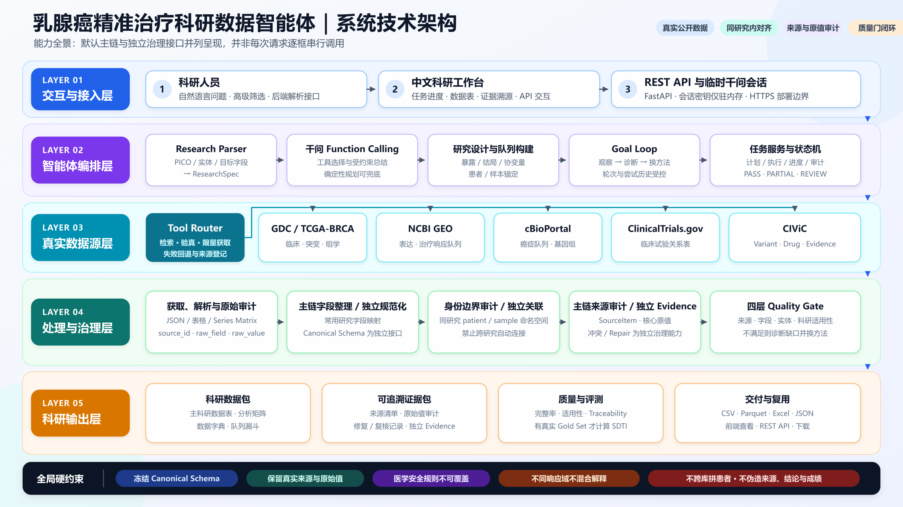
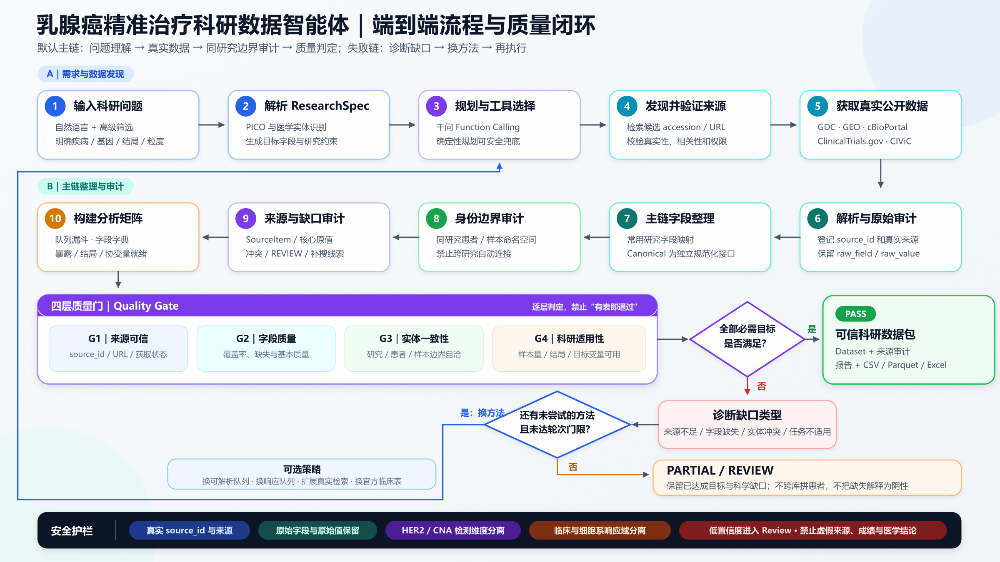
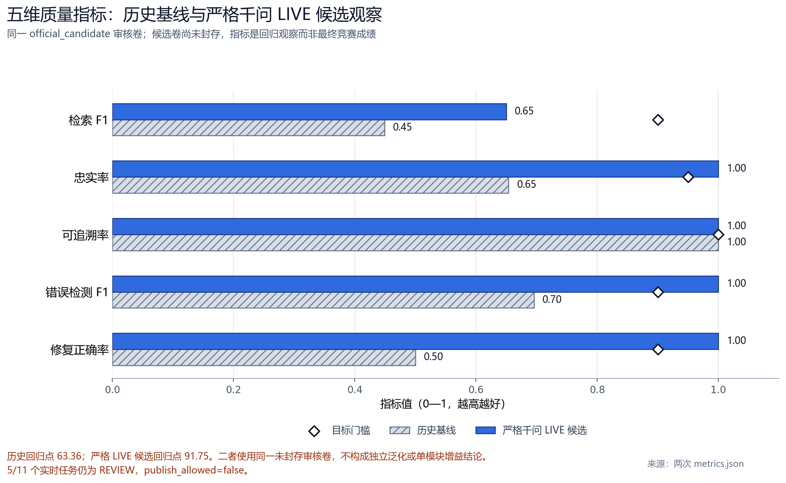
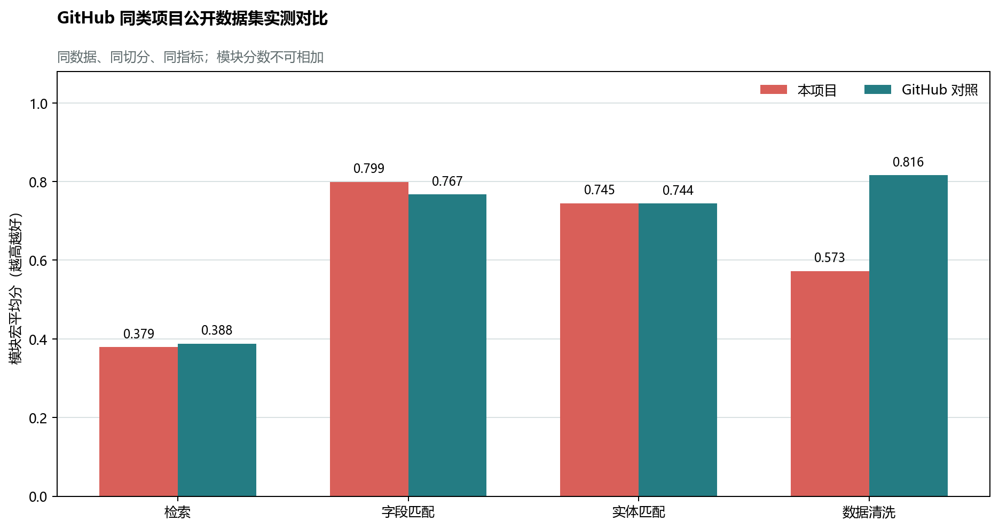
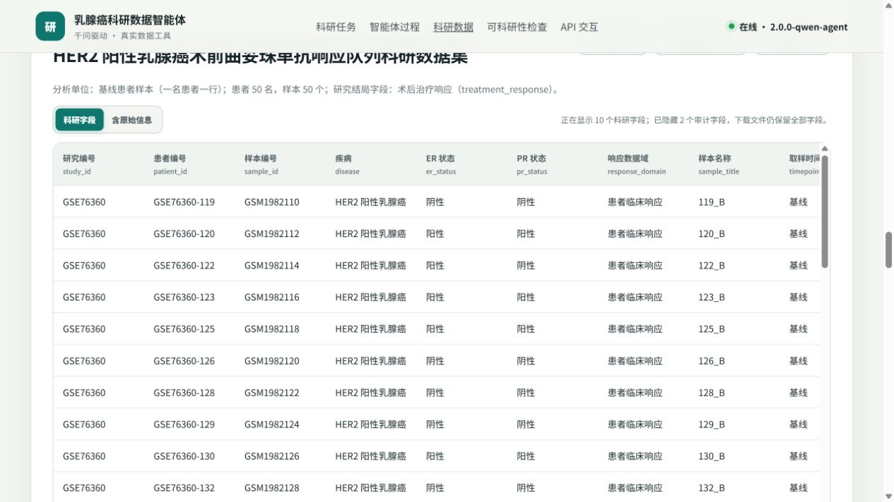
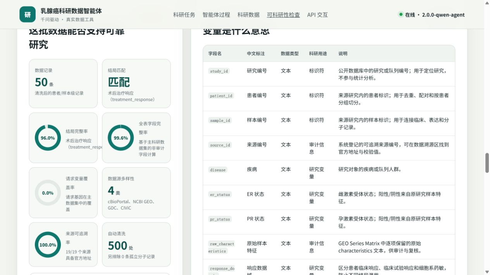
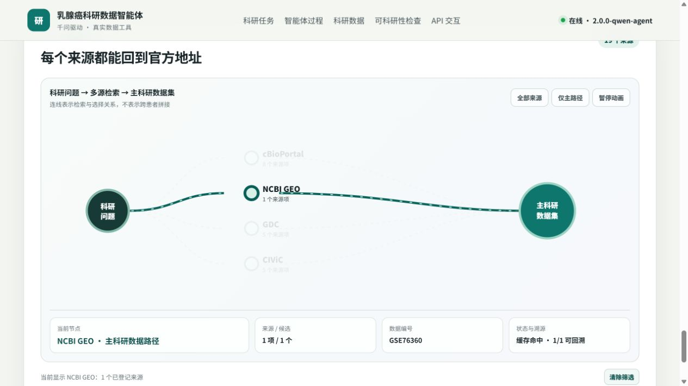

# 从科研问题到可信数据：乳腺癌精准治疗科研数据智能体的设计与验证

> 参赛方向：赛道二·方向 1A——科学数据查找、解析与整合  
> 项目名称：乳腺癌精准治疗科研数据智能整合系统  
> 文档版本：2026-08-31  
> 结果口径：所有数字均来自仓库内机器可读评测文件；候选观察分不作为冻结赛题最终成绩。

## 参赛作品简介（300 字内）

乳腺癌科研数据分散在临床队列、组学数据库和治疗响应研究中，字段口径与患者/样本编号不一致，普通搜索很难直接得到可分析、可复核的数据。本作品以自然语言问题为入口：千问负责拆解研究需求和选择工具，受控程序从 GDC、GEO、cBioPortal 等官方来源取数，再统一主字段、限制患者关联、保留原值与来源，并用质量门拦截证据不足的结果。系统交付数据表、字段说明、来源清单和质量报告。同一未封存审核卷的候选回归中，字段忠实率和可追溯率均为 26/26，检索 F1 为 0.65，11 个任务中 5 个仍需复核，因此系统不自动发布结论。

## 摘要

乳腺癌精准治疗研究往往需要同时使用患者临床信息、分子变异、治疗方案、疗效结局、临床试验和知识证据。然而，这些信息分散在不同公开数据库中，同一概念可能使用不同字段名、检测方法和编码；更危险的是，不同研究中的患者编号看似相同，却未必代表同一个人。传统人工整理耗时且难以复核，通用大模型可以解释问题，却不能把未经核验的生成内容直接当作患者事实，普通检索或 ETL 工具也无法同时处理医学语义、身份边界和来源证据。

为解决上述矛盾，本研究构建了一套从自然语言科研问题到可分析数据包的五层系统。系统将概率模型与确定性治理分工：千问负责问题理解、研究规划、工具选择和缺口反思；真实数据由受控数据连接器（Adapter）从官方公开来源获取；患者/样本命名空间、来源审计、医学规则和四层质量门决定当前主表能否使用。统一字段规范（Canonical Schema）和逐字段 Evidence 管线也已作为独立接口实现，正在与当前灵活宽表主链进一步收束。当关键字段、结局或同患者关联不足时，缺口反馈循环（Goal Loop）依据问题换队列、补来源或停止，并以 `REVIEW` 明确保留问题，而不是生成一个表面完整但不可用的数据集。

严格千问 LIVE 在同一审核卷上的候选回归观察为 SDTI 91.75，Faithfulness、Traceability、Error F1 和 Repair Accuracy 均为 1.00，186/186 个当次来源地址通过官方 HTTPS 主机校验；但 Retrieval F1 仅为 0.65，11 个任务中仍有 5 个处于 `REVIEW`，且评测卷尚未封存，因此 `publish_allowed=false`。结果说明，本系统的价值不只是“回答得像”，而是能把可用数据、不可用数据及其原因清楚地区分。系统当前可服务于科研数据发现、整理、审计和探索性分析，不提供临床诊疗建议，也不自动发布科研结论。

**关键词：** AI for Science；乳腺癌；科研数据整合；多智能体；数据溯源；医学安全；质量闭环；SDTI

## 1 背景与研究问题

### 1.1 AI for Science 真正缺少的不是答案，而是可信的研究材料

科学研究中的很多问题不是“模型是否知道一个结论”，而是“能否找到支持分析的真实数据，并说明每个数据从哪里来”。以“HER2 阳性乳腺癌中 PIK3CA 突变是否与新辅助治疗响应有关”为例，研究者至少需要同时知道：研究对象是谁、样本属于谁、HER2 用什么方法检测、PIK3CA 是否突变、患者接受了什么治疗、疗效在什么时间点判定，以及这些信息来自哪一个公开研究。

这些信息通常不会整齐地放在同一张表里。GDC/TCGA-BRCA 更擅长提供临床与组学数据，GEO 中常见表达矩阵和治疗响应队列，cBioPortal 提供癌症队列的临床与基因组数据，ClinicalTrials.gov/AACT 描述试验设计，CIViC 提供变异—药物—疾病证据，Europe PMC 和 BioSample 则更适合补充文献线索和样本元数据。数据源越多，覆盖面可能越广，但错误拼接、概念混用和来源丢失的风险也随之增加。

因此，本研究没有把目标设定为“让大模型生成一个医学回答”，而是把目标重新定义为：

> **把一个科研问题转化为一份真实、结构化、可追溯、带质量状态的数据包，并能说明哪些分析现在可以做、哪些还不能做。**

### 1.2 医学研究的难点：数据多、口径多、身份边界也多

医学研究很少靠一张表完成。研究者通常要把“患者是什么情况”“取了什么样本”“测到了什么分子特征”“接受了什么治疗”“最后出现什么结局”连成一条证据链。困难不只在于数据分散，更在于每项数据都有自己的研究对象、检测方法和适用边界。乳腺癌精准治疗把这些一般困难集中到三个关键矛盾上。

第一，**找到数据不等于找到能回答问题的数据**。一张表可以有几百行、几十列，但如果研究问题要的是治疗响应，表里只有生存时间，那么数据量再大也不能直接回答该问题。

第二，**字段相似不等于医学含义相同**。HER2 IHC、HER2 FISH 和 ERBB2 拷贝数扩增描述的是不同检测维度；细胞系的 AUC/IC50 也不等于患者的 pCR 或临床响应。只按字符串相似度统一字段，可能得到格式整齐但医学含义错误的数据。

第三，**编号相同不等于患者相同**。`patient_id` 只在所属研究的命名空间内有意义。不同数据库中的“P001”不能仅凭名字一样就当作同一个人，否则会把甲研究患者的突变贴到乙研究患者的疗效上。

这三个矛盾决定了系统不能只做检索，也不能只做清洗。它必须同时回答“找什么、去哪里找、能否安全合并、证据是否完整、结果能否发布”五个问题。

### 1.3 乳腺癌科研数据智能体到底解决什么问题

本系统以乳腺癌精准治疗研究为验证场景，完成从科研问题理解到科研数据交付的闭环。系统的直接用户是需要查找、整理和复核公开科研数据的研究人员，而不是接受诊疗建议的患者。

系统要解决的核心问题不是“替研究者回答乳腺癌结论”，而是“替研究者准备一份能够支撑后续分析、并且经得起复核的数据材料”。这一总目标可拆成五个可检验的问题：

| 必须回答的问题 | 达标表现 | 不达标时的正确行为 |
|---|---|---|
| 找到的数据是否与科研问题相关 | 人群、分子变量、治疗和结局与问题一致 | 继续检索或说明缺口，不用相近主题代替 |
| 数据是否来自真实公开来源 | 有 accession、官方地址和 `source_id` | 来源不明时不进入正式结果 |
| 标准化是否保持原始医学含义 | 标准值与 `raw_field`、`raw_value` 并存 | 语义含混时保留原值并进入复核 |
| 患者和样本能否安全关联 | 只在同研究命名空间或可靠 crosswalk 内连接 | 低置信度进入 `unresolved/review` |
| 当前数据能否支持目标分析 | 身份、结局域、分子覆盖和 Evidence 均通过质量门 | 输出 `PARTIAL/REVIEW`，说明还缺什么 |

因此，系统的“完成”不是页面成功生成一张表，而是上述五个问题都获得可核查答案。即使最终答案是“当前公开数据仍不足”，只要系统能说明不足发生在哪一环、为什么不能强行补齐，以及下一步应找什么，这也是有效的科研数据交付。

系统能做的工作包括：

- 把宽泛研究方向或具体科研问题整理成结构化研究要求；
- 从真实公开数据库和文献入口发现候选数据；
- 通过后端解析器处理 API JSON、GEO Series Matrix、CSV、Excel、HTML 和可访问的开放全文 XML/文本表格；当前首页不提供通用科研文件上传入口；
- 通过独立规范化接口将支持路径中的字段对齐到统一结构，同时保留原始字段和原始值；
- 在同一研究内部建立患者—样本关系，隔离低置信度关联；
- 为关键字段绑定来源证据，检测冲突、缺失和响应域错配；
- 输出数据集、字典、来源清单、质量报告、修复记录和下载文件。

系统不做的工作包括：

- 不输出临床诊断或用药建议；
- 不把文献摘要或大模型生成文本当作患者事实；
- 不在没有可靠 crosswalk 时跨研究合并患者；
- 不把生存结局、临床响应、试验结局和细胞系药敏相互替代；
- 不宣称具备通用 PDF/OCR 或从图片像素读取所有图表数字的能力；
- 不在证据不足或高风险冲突未解决时自动发布科研结论。

### 1.4 一项研究实际需要什么数据

以“HER2 阳性乳腺癌中 PIK3CA 突变与新辅助治疗响应的关系”为例，系统需要的不是一串字段名，而是一套能回答研究问题的证据结构。

| 要回答的常识问题 | 对应数据 | 通俗解释 |
|---|---|---|
| 这条记录来自哪项研究 | `study_id` | 相当于档案柜编号，先确定记录属于哪个研究 |
| 研究中的对象是谁 | `patient_id` | 研究内部的受试者编号，不是跨数据库通用身份证 |
| 这份材料是哪一个样本 | `sample_id` | 同一患者可能有多个组织或多个时间点的样本 |
| 研究的是哪类乳腺癌 | `disease`、`subtype`、`stage` | 界定研究人群，避免把不同疾病阶段混在一起 |
| HER2/ER/PR 状态如何得到 | `er_status`、`pr_status`、`her2_status`、`her2_assay`、`her2_raw_value` | 不只保留“阳性/阴性”，还保留检测方法和原始结果 |
| 是否有目标基因变异 | `gene`、`variant`、`mutation_status` | 描述 PIK3CA 等基因是否发生目标变异 |
| 接受了什么干预 | `drug`、`treatment` | 区分具体药物和治疗方案 |
| 观察的结果是什么 | `response_domain`、`response_type`、`response` | 先区分患者、细胞系、临床试验或知识证据，再记录具体结局 |
| 这个值能不能核对 | `source_id`、`raw_field`、`raw_value`、`confidence` | 给标准化结果保留“原始票据”，说明出处、原值和把握程度 |

最终交付不是一个孤立的 CSV，而是“数据表 + 字段说明 + 来源凭证 + 质量结论”的组合。研究者可以继续用 Python、R、SPSS 或 Stata 做统计分析，也能回到原始来源复核某个字段为何被这样解释。

## 2 系统设计

### 2.1 设计判断：让模型负责思考，让程序负责事实和边界

科研问题具有开放性，同一句话可能包含人群、暴露、治疗、结局和数据粒度等多层含义，完全依靠固定规则很难覆盖；但患者事实、来源校验和医学安全又不能交给概率模型自由生成。系统因此采用“双轨分工”：

- **千问负责不确定性工作**：理解问题、形成研究规格（ResearchSpec）、选择已注册工具、比较候选来源、诊断缺口并规划下一轮；
- **确定性程序负责可核验工作**：真实取数、字段解析、标准化、身份对齐、来源登记、规则执行、发布门控和指标计算。

这不是简单地“给大模型外挂几个工具”。模型每一次数据访问都必须通过已注册工具；标准化治理链要求关键值保留原始值和来源，质量门也不接受模型自行宣布“通过”。当前任务宽表已提供行级来源和核心字段原值审计，但尚未做到每一个展示单元格都拥有完全一致的独立 Evidence 结构，这仍是主链统一工作的重点。

### 2.2 系统输入、处理与输出

| 系统入口 | 中间处理 | 系统出口 |
|---|---|---|
| 自然语言科研问题 | 理解研究对象、变量和结局 | 研究规格（ResearchSpec）/研究契约（Research Contract） |
| 可选高级筛选与指定来源 | 发现并验证真实数据库、论文和样本入口 | 候选数据源与 Source Plan |
| 后端受控文件解析任务（非当前首页上传入口） | 解析、字段统一、实体关联、医学规则检查 | 患者/样本级分析矩阵 |
| 系统自动选定并冻结首个推荐方案；用户可查看方案，并在生成数据前点击执行 | Evidence、冲突、缺口、四层质量门 | 数据字典、来源清单、质量报告、修复日志 |
| 下载或 API 请求 | 格式转换与审计打包 | 页面可下载 Excel/CSV/质量报告；后端另支持 Parquet、JSON、metadata 与 REST API |



*图 1 乳腺癌精准治疗科研数据智能体五层技术架构（能力全景；默认主链与独立治理接口并列）*

**图 1 的核心不是模块数量，而是责任分层。** 上层接收研究问题并组织任务，中层连接真实数据，底层完成标准化、审计和发布判断；任何一层都不能越权替代另一层。模型不能伪造数据，Adapter 不能决定医学含义，标准化程序不能绕过质量门，综合分也不能覆盖安全红线。

图 1 是“总体能力架构”，不能误读为当前每个网页请求都会逐框调用全部模块。仓库中存在一条默认任务主链和两组已实现但尚未完全接入默认主链的能力侧链：

| 实现状态 | 当前路径 | 作用与边界 |
|---|---|---|
| 默认任务主链 | 科研问题 → Research Agent → 千问/受控工具 → 真实 Adapter → GEO/cBioPortal/DepMap 数据构建器 → 主表选择与独立伴随表 → 身份边界审计 → 四层质量门 → 前端/导出 | 当前工作台实际执行；其他来源可进入候选、试验或证据层，但不会全部拼成同一患者表 |
| 规划能力侧链 | 研究方向 → 文献扫描 → 候选问题 → Research Contract → Source Plan → Planning RAG/证据关系图 | 接口和测试已实现；当前生成数据集时主要传递选中问题文本，尚未把 `contract_id/source_plan_id` 作为强约束贯穿后续取数 |
| 规范化治理侧链 | RawRecord → SchemaMapper → CanonicalRecord → EvidenceCell → PatientSampleLinker → 冲突检测与安全修复 | 独立接口和测试已实现；尚未成为当前 Research Agent 灵活宽表的逐单元格默认执行链 |

这种区分并不削弱总体设计，反而说明当前成果处于什么阶段：默认主链已经能完成真实取数、主表选择、边界审计、质量门和导出；Planning RAG 与原子级 Canonical/Evidence 能力已经可运行，但下一步仍需把研究契约、Source Plan 和逐字段治理收束成一条完整实线。

### 2.3 五层架构及各层作用

| 层级 | 解决的现实问题 | 核心机制 | 主要输出 |
|---|---|---|---|
| 交互与接入层 | 研究者只有一个方向，不知道应填哪些技术参数 | 中文研究向导、高级筛选、REST API、临时模型会话 | 科研问题、任务状态、导出请求 |
| 智能体编排层 | 自然语言问题不能直接变成数据库查询 | 问题解析、研究契约、受控工具调用、缺口反馈循环 | 结构化需求、工具调用、补搜计划 |
| 真实数据源层 | 一个数据库很难同时覆盖临床、组学、响应、试验和证据 | 来源组合规划器（Source Broker）与受控数据连接器 | 带 accession/URL 的原始记录 |
| 处理与治理层 | 字段异构、患者可能错配、医学概念可能混用 | Canonical Schema、实体关联、Evidence、冲突隔离、Quality Gate | 标准记录、关联决策、冲突和 Gap |
| 科研输出层 | 一张表无法说明数据能否使用和如何复核 | 数据包、字典、来源清单、质量报告、评测与导出 | 可分析数据及完整审计材料 |

不同来源在系统中承担的职责并不相同，不能因为都被“检索到”就全部拼进患者主表。

| 真实来源 | 主要提供什么 | 在系统中的使用边界 |
|---|---|---|
| GDC / TCGA-BRCA | 临床、突变、表达、拷贝数等官方癌症数据 | 当前任务可用于来源与组学候选；不代表每次 Agent 运行都下载完整文件 |
| NCBI GEO | 表达矩阵、样本注释和部分治疗响应队列 | 可由 Series Matrix 构建患者/样本主数据，但仍需检查结局和分子变量是否同队列 |
| cBioPortal | 癌症队列、临床表、突变和 CNA | 可在同一研究内部以 sample/patient 标识构建主数据；跨研究仍禁止直接 Join |
| ClinicalTrials.gov / AACT | 试验登记、干预、条件和结局关系 | 作为临床试验层，不当作患者级疗效表 |
| CIViC | Variant–Drug–Disease–Evidence | 作为知识证据层，不替代真实患者队列 |
| Europe PMC | 论文、摘要、开放全文 XML、数据编号线索 | 用于研究语境和 accession 发现，不把摘要写成患者事实 |
| NCBI BioSample | 样本组织、物种和元数据线索 | 用于样本核验，不直接参与患者表拼接 |
| DepMap | 乳腺癌细胞系目录及可选药敏信息 | 目前主要完成目录级增强；真实 AUC/IC50 药敏矩阵尚未稳定进入默认主链，即使获得也固定属于 `preclinical_cell_line`，不得解释为患者 pCR |

在当前 Research Agent 中，GEO、cBioPortal，以及细胞系任务中的 DepMap 更直接地形成建模数据表；其他来源常用于候选发现、关系证据、临床试验或伴随信息。这样的角色区分可以避免把“来源数量多”误写成“患者表已经被多库安全合并”。

### 2.4 从科研问题到质量结论的端到端流程



*图 2 默认任务主链及按实际代码口径绘制的四层质量门*

当前默认任务先把自然语言问题解析为研究规格，明确疾病、亚型、基因、治疗、结局和分析粒度；随后由千问通过受控工具调用选择数据连接器，发现并登记真实来源。Adapter 结果保留 `SourceItem`，可构建主表的 GEO、cBioPortal 和 DepMap 路径进一步生成灵活科研宽表；主链再对 `study_id`、`patient_id`、`sample_id` 和 `source_id` 做身份边界审计，明确禁止跨研究自动合并。独立规范化治理接口还能把原始记录映射为 CanonicalRecord，并逐字段生成 `raw_field`、`raw_value` 与 EvidenceCell，但这条原子级管线尚未默认覆盖当前宽表的每个单元格。

构建分析矩阵后，当前主链的四层质量门依次判断：

1. **G1 来源可信**：是否保留可核查的 `source_id`、官方来源和获取状态；
2. **G2 字段质量**：主字段覆盖、缺失和基本数据质量是否达到任务准入线；
3. **G3 实体一致性**：患者、样本、研究和来源边界是否自洽，是否发生不允许的跨研究连接；
4. **G4 科研适用性**：样本量、目标结局、目标基因/HER2 等请求变量是否足以支持本次研究。

图 2 已按当前运行代码呈现四层质量门：G1 检查来源登记和获取状态，G2 检查字段覆盖、缺失和基本质量，G3 检查研究—患者—样本边界是否自洽，G4 综合判断样本量、结局同域、目标变量和 HER2 证据是否足以支撑当前任务。HER2 IHC 2+、ERBB2 CNA、跨响应域和无证据关键字段等医学安全规则贯穿各层，模型不能覆盖这些规则。工作台质量门是单次任务的探索性准入判断，不等同于正式 Gold Set 的 Traceability 或 SDTI。

四层全部满足才进入可信数据包。若不满足，系统不会机械重复同一个查询，而是先判断缺的是患者主表、治疗响应、分子变量、临床协变量还是来源证据，再选择尚未尝试的队列或工具。方法用尽后仍不能满足条件时，输出当前最佳数据包及 `PARTIAL/REVIEW`，把“缺什么、为什么缺、下一步需要什么”一并交付。

### 2.5 核心模块为何必须这样设计

| 瓶颈 | 系统设计 | 为什么不能省略 |
|---|---|---|
| 问题表达宽泛 | 问题解析器将自然语言转为人群、暴露/治疗、结局、目标字段和研究约束 | 不先明确研究对象和结局，后续会出现“找了很多但答非所问” |
| 来源多且能力不同 | Source Broker 按字段覆盖、权威性、数据粒度和 Join Policy 组合来源 | 单一数据库通常不能同时提供同患者的全部变量 |
| 外部接口和文件格式不同 | Adapter/Parser 统一处理 API、Series Matrix、表格和开放全文结构 | 只做网页搜索无法形成患者/样本级分析矩阵 |
| 同义词与编码不一致 | 冻结 Canonical Schema 与独立规范化管线定义统一字段；当前 Agent 构建器同步映射常用研究字段 | 只统一格式会丢失 HER2 检测方式等关键医学含义；当前仍需继续统一两条实现路径 |
| 患者/样本容易误拼 | `study_id` 命名空间与 LinkDecision 限制关联范围 | 错合并比缺失更危险，会制造不存在的患者事实 |
| 标准化过程难复核 | 独立 Evidence 模块可为字段绑定来源、原值、规则和置信度；任务页提供来源级和核心字段审计 | 没有字段级证据，研究者无法复核和复现；当前仍需提高全表 Evidence 覆盖一致性 |
| 第一轮常有关键缺口 | Goal Loop 根据缺口换队列、补来源或停止 | 仅重复搜索不能解决“结局错域”或“同患者变量缺失” |
| 总分可能掩盖风险 | 四层质量门与 SDTI 分离 | 即使综合分较高，高风险未决或未封存仍必须阻止发布 |

### 2.6 受控检索与治理：RAG 只为规划提供外部证据

Planning RAG 是已经实现的规划扩展接口，它综合语义相似、关键词、论文章节优先级和关系图四类信号检索论文证据，为问题形成和字段规划提供材料。当前默认事实主链仍是“千问规划—已注册 Adapter 真实取数—确定性规则治理”。因此，RAG 不写入患者事实，也不能单独证明幻觉率下降。下表描述的是整条受控检索与治理链，不是四个 RAG 层：

| 层 | 输入 | 做什么 | 输出 |
|---|---|---|---|
| 词法与实体层 | 自然语言科研问题 | 识别疾病、基因、药物、结局和 accession 线索 | 候选关键词与医学实体 |
| 千问规划层 | 候选实体、研究约束 | 生成 ResearchSpec，选择已注册工具和参数 | 结构化研究计划、工具调用 |
| 结构化规则层 | 工具返回的真实记录 | 校验 Schema、来源、医学规则、响应域和关联边界 | 合规记录、冲突和 Gap |
| 图谱与 Evidence 层 | 来源、数据集、字段和质量结果 | 建立“问题—来源—字段—证据”的关系并保留原值 | 可追溯数据包与复核路径 |

默认主链的实际顺序见图 2；Planning RAG 与独立规范化接口的接入状态以 2.2 节的实现状态表为准。

这套设计减少幻觉的关键并不是 RAG 这个名称，也不是要求模型“更谨慎”，而是把事实生产权从模型手中拿走。模型可以建议搜索 `GSE25066`，但只有 Adapter 真实取得并登记该来源后，记录才能进入后续流程；模型可以解释一个缺口，却不能自行补出患者的 PIK3CA 状态。来源地址、字段语义和自动修复还要分别经过来源校验、Faithfulness、Traceability、Error F1 和 Repair Accuracy 检查。因此，正文使用“降低无来源生成和标准化篡义风险”，而不使用“RAG 彻底消灭幻觉”这一无法验证的表述。

### 2.7 来源关系图与 Evidence：看见关系，也保留原始票据

仓库中有两类图结构：Planning Scientific Graph MVP 连接研究主题、论文、数据集、候选问题、研究契约、变量和证据片段；当前页面真正可见的是科研问题—候选来源—主数据集的 lineage（来源血缘）图。正文把后者概括为面向科研数据整合的**来源—数据集—字段—质量反馈关系图**。二者都不是已经覆盖全部乳腺癌知识的患者诊疗知识图谱，也不凭图关系自动推导临床结论；它们回答的是“这份材料为什么被找到、来自哪里、与研究问题是什么关系”。

| 图谱对象 | 例子 | 关系含义 |
|---|---|---|
| 科研问题 | HER2 阳性乳腺癌、PIK3CA、新辅助治疗响应 | 定义本次任务要找什么 |
| 工具与来源 | `search_geo`、GSE76360、cBioPortal、CIViC | 表示由哪个工具发现、由哪个官方来源提供 |
| 数据集与字段 | 主科研数据集、`response`、`source_id` | 表示哪些记录和字段实际进入输出 |
| Evidence | 原始字段、原始值、URL、置信度 | 表示标准值如何回到原始材料 |
| 质量反馈 | 结局错域、缺 PIK3CA、低置信度关联 | 表示为什么继续补搜、进入复核或停止 |

图中的边只表示“发现、选择、归属、解释和反馈”，不表示两个来源中的患者已经被合并。它把“与问题相关的来源”和“可安全进入患者主表的来源”显式分开；当前没有消融实验支持把这种展示解释为关联性指标提升。字段级追溯链可概括为：

```text
官方来源 / accession
        ↓
source_id + raw_field + raw_value
        ↓
Canonical 字段 + 标准值 + confidence
        ↓
规则命中 / 冲突状态 / Evidence
        ↓
页面、导出文件与质量报告
```

研究者看到标准值后，仍能沿这条链回到原字段和官方来源，判断转换是否合理。当前任务页已经提供行级来源和核心字段原值审计，独立治理模块也能构建 `EvidenceCell`；但不同主链尚未完全收束为“每个展示单元格都使用同一套完整 Evidence 结构”。因此，本项目能证明核心链路可追溯，不能宣称所有任务、所有单元格都已完成同等深度的内容级核验。

### 2.8 同研究关联与医学质量门：宁可留缺口，也不制造“同患者”

系统把以下规则作为不可被模型覆盖的硬约束：

- HER2 IHC 2+ 不直接映射为 HER2 Positive，而是保留检测方法、原值，并进入 Equivocal/Review；
- ERBB2 CNA amplification 不等同于 HER2 IHC positive；
- 低置信度患者/样本关联进入 `unresolved`，不自动合并；
- 两个高权威来源出现不可解释冲突时保留双方 Evidence，不自动选边；
- 无 Evidence 的关键字段不得进入正式发布数据；
- 患者临床响应、临床试验结局、知识证据和细胞系 AUC/IC50 必须用 `response_domain` 隔离。

这些规则使系统的“拒绝”同样有价值。对于科研数据生产而言，诚实地说明“当前不能合并”比输出一张错误但完整的表更可靠。

### 2.9 为什么不能直接使用其他单一工具

| 替代方式 | 能解决什么 | 在本项目场景中的关键缺口 |
|---|---|---|
| 通用大模型或千问单独问答 | 理解问题、生成解释和检索建议 | 生成内容不是患者事实；不能独立承担来源校验、患者关联和发布门控 |
| 普通 RAG | 从文献或网页中找到相关文本 | 文本相关不等于获得同患者、同结局域的结构化数据 |
| 单一数据库 | 在本库内查询高质量数据 | 很难同时覆盖分子变异、患者响应、试验和知识证据 |
| 通用 ETL/数据仓库 | 对固定来源做稳定搬运和格式转换 | 难以从新科研问题动态决定需要哪些变量、来源和补搜策略 |
| 通用表格清洗工具 | 处理缺失、格式、重复和简单别名 | 不知道 IHC、FISH、CNA、pCR 与 AUC/IC50 的医学边界 |
| 人工复制粘贴 | 专家可做高质量个案判断 | 时间成本高、过程难复现，字段来源和修复历史容易丢失 |

本项目并不声称某一个算法绝对不可替代。其特殊性在于用默认任务主链与独立治理接口共同覆盖“问题理解、真实取数、同研究关联、字段证据、医学隔离、缺口换方法和发布门控”，并为这些能力提供测试和审计材料；当前仍需把它们进一步收束为单次任务的完整实线。**难以被单一产品替代的不是某一个模型，而是这套受约束的科研数据生产机制。** 若缺少其中任何一环，系统就只能回答部分问题：能找到但不能分析，能整理但不能追溯，能生成但不能相信，或能得到高分却不能保证医学安全。

### 2.10 可扩展性：可迁移的是框架，不是未经验证的医学结论

系统通过三类接口实现扩展：新增 Adapter 可连接新的官方数据源；新增 Schema 与字段词典可支持新的数据结构；新增规则包和 Gold Set 可迁移到其他疾病或科研领域。ResearchSpec、Source Broker、Evidence、Quality Gate 和评测框架不需要整体重写。

但扩展不等于直接复制。迁移到肺癌、罕见病或其他 AI for Science 场景时，仍需由领域人员重新冻结关键字段、医学规则、权威来源、实体关联边界和独立评测集。系统提供的是一条可复用的“科研问题到可信数据”生产范式，而不是一套可以绕过领域验证的万能答案。

## 3 结果输出与系统效果

### 3.1 系统最终交付什么

| 交付物 | 内容 | 研究者能用它做什么 |
|---|---|---|
| 科研数据集 | 患者/样本级标准记录或分层逻辑表 | 进入统计分析、分组、关联和探索 |
| 数据字典 | 字段中文名、数据类型、研究用途和限制 | 弄清每列代表什么，避免误用编号或审计字段 |
| 来源登记与清单 | 数据库、accession、URL、获取状态和校验信息 | 核对数据是否真的来自官方来源 |
| Evidence 与原值审计 | 字段原值、标准值、来源和转换依据 | 对核心关键单元格进行回溯，并逐步扩展至一致的全表覆盖 |
| 质量报告 | 身份、结局域、分子覆盖、证据和安全状态 | 判断当前结果能否支持目标研究 |
| Gap/Review 清单 | 未满足变量、冲突、低置信度关联和停止原因 | 知道下一步应补数据还是人工复核 |
| 修复与审核记录 | 修复前后值、命中规则、复核决定和再验证结果 | 区分自动修复与待确认修改 |
| CSV/Parquet/Excel/JSON/metadata/质量 JSON | 面向分析、交换、查看和 API 使用的多种格式 | 与现有科研软件和分析脚本衔接 |

上述内容是系统的数据与审计产物集合，不代表当前页面会把每一项都打包成独立文件。当前可见按钮提供 Excel、CSV 和质量报告；Parquet、JSON、metadata 与质量 JSON 由后端导出接口提供，来源、Evidence 和审核信息也会进入页面或 Excel/API 结果。

### 3.2 代表性任务：数据多不等于问题被解决

代表问题为：

> 研究 HER2 阳性乳腺癌中 PIK3CA 突变与新辅助治疗响应的关系。

系统在真实来源中观察到三类互补但不能随意拼接的证据：

| 数据观察 | 表面上得到什么 | 系统实际判断 |
|---|---|---|
| METABRIC/cBioPortal 宽表 | 848 行 × 46 列，含临床和 PIK3CA 等分子信息 | 主要是生存/临床结局，治疗响应分析集为 0；“有大表”不等于能回答本题 |
| GSE76360 | 50 个基线样本，其中 48 个有治疗响应注释 | 结局与问题同域，但公开矩阵中没有同患者 PIK3CA |
| 两个队列共同使用 | 一边有突变，一边有响应 | 没有可靠患者 crosswalk，禁止把突变贴到另一队列患者上 |

这项结果看似没有生成一张“完美大表”，却证明了系统最关键的能力：它能区分“缺字段”和“不能合并”。普通拼表工具容易把两个半成品队列横向连接，得到不存在的患者联合记录；本系统保留两个 cohort 独立，将结局和分子缺口标为 `REVIEW`，并告诉研究者需要寻找同队列同时含 PIK3CA 与治疗响应的数据，或接受分队列验证设计。

### 3.3 两轮闭环改善了什么

在一次真实千问两轮任务中，第二轮读取第一轮缺口后补充验证来源：

| 指标 | 第一轮 | 第二轮 | 正确解读 |
|---|---:|---:|---|
| Progress score | 0.915 | 0.960 | 任务内进展更好，不是 SDTI |
| Target match | 0.82 | 1.00 | 补充来源使目标验证更完整 |
| Required field coverage | 1.00 | 1.00 | 组合来源有字段，不代表字段属于同患者 |
| 任务内 Traceability | 1.00 | 1.00 | 两轮都保留来源审计 |
| 来源登记数 | 63 | 68 | 新增 5 个验证来源 |
| 数据行数 | 141 | 141 | 没有用复制或伪造记录制造“增长” |
| 未决 Gap | 2 | 2 | 核心跨队列缺口仍被诚实保留 |

第二轮的价值不是无条件增加数据量，而是让问题与证据更对齐。未决缺口没有下降，因此结果只能表述为“目标匹配改善”，不能表述为“所有问题已经解决”。

### 3.4 指标为何这样设计

数据处理质量可由六个基本问题分别衡量：

| 常识问题 | 指标 | 指标说明 |
|---|---|---|
| 返回的数据里有多少是真的相关 | Retrieval Precision | 衡量“找得准” |
| 应该找到的数据中找回了多少 | Retrieval Recall | 衡量“找得全” |
| 标准化后是否改变了原始医学含义 | Faithfulness | 衡量“整得真” |
| 每个关键值能否回到完整来源 | Traceability | 衡量“查得回” |
| 系统能否准确、完整地识别错误 | Error F1 | 衡量“错找得准” |
| 自动执行的修改有多少改对了 | Repair Accuracy | 衡量“改得对” |

为避免某一项高分掩盖另一项严重短板，系统采用冻结的科研数据可信整合指数：

$$
SDTI=
100\sqrt[5]{
F_{1,r}\times F_a\times T\times F_{1,e}\times A_r
}
$$

其中，$F_{1,r}$ 为检索 F1，$F_a$ 为忠实率，$T$ 为可追溯率，$F_{1,e}$ 为错误检测 F1，$A_r$ 为修复正确率。几何平均体现“木桶短板”：任一环节接近 0，综合分都会被明显拉低。与此同时，系统仍逐项检查门槛和安全红线，因此 SDTI 达标不等于每个单项达标，更不等于可以自动发布。

### 3.5 同一审核卷的两次回归观察：数值变化及其边界

审核卷包含 50 条检索判断、26 条字段标准化样本和 18 条错误样本。历史基线未调用千问；后续严格 LIVE 流程在 11 个检索问题上实际调用 `qwen3.8-max` 11/11 次，确定性兜底 0 次。由于同一审核卷已经用于多轮系统迭代，91.75 只能作为“同卷候选回归观察”，不能再解释为模型从未见过的独立泛化成绩。



*图 3 同一未封存审核卷上的两个回归观察点；不构成独立泛化或单模块增益结论*

| 指标 | 历史基线 | 严格 LIVE 候选 | 目标 | 当前判断 |
|---|---:|---:|---:|---|
| Retrieval Precision | 0.3548（11/31） | 0.5909（13/22） | 0.90 | 无关返回减少，但仍未达标 |
| Retrieval Recall | 0.6111（11/18） | 0.7222（13/18） | 0.90 | 仍漏掉 5 个应命中来源 |
| Retrieval F1 | 0.4490 | 0.6500 | 0.90 | 检索仍是最明显短板 |
| Faithfulness | 0.6538（17/26） | 1.0000（26/26） | 0.95 | 本卷 26 个字段映射与预期一致 |
| Traceability | 1.0000（26/26） | 1.0000（26/26） | 1.00 | 当前观察器口径下来源锚点完整 |
| Error F1 | 0.6957 | 1.0000 | 0.90 | 15 条应检错样本全部命中，3 条干净对照未误报 |
| Repair Accuracy | 0.5000（1/2） | 1.0000（3/3） | 0.90 | 3 次允许自动修复均正确，样本仍很小 |
| **SDTI** | **63.36** | **91.75** | **90** | 综合回归观察达标，不等于可以发布 |
| Safety Gate | FAIL | REVIEW | PASS | 两次均 `publish_allowed=false` |

这组结果支持三项有限而明确的判断。第一，检索 F1 从 0.449 提高到 0.650，但 Precision、Recall 和 F1 仍未达到 0.90，不能宣称“高召回”或“检索问题已经解决”。第二，Faithfulness、Error F1 和 Repair Accuracy 在候选卷上达到 1.00，说明当前字段规则和可自动修复样本的表现明显改善；但字段与错误观察由确定性评测程序完成，千问只直接参与 11 个检索问题，因此 28.39 分差值不能全部归因于千问。第三，Repair Accuracy 的分母只有 3，Error F1 也只覆盖 18 条小型错误卷，不能外推为系统已经能处理全部真实医学数据错误。

Traceability 的 26/26 表示在当前评测观察器口径下，关键字段具备 `source_dataset/raw_field/raw_value` 等来源锚点；它不能替代对每条 Evidence 内容的专家审定。当次运行登记的 186 个唯一来源中，虚假来源计数为 0，即 186/186 具备受控 `source_id`、允许名单内官方 HTTPS 主机且 Adapter 未报失败；这证明来源地址受控，不证明 186 项研究内容都已被医学专家核实。

关于“幻觉”，本次只能报告三项可观测事实：检查的 186 个来源定位符均通过官方主机和 Adapter 状态规则；26 个字段映射与审核卷预期一致；5 个高风险任务被质量门保留为 `REVIEW`。这些结果说明当前运行具备来源和发布约束，不能据此计算“幻觉减少率”，也不能证明系统在所有问题上零幻觉。当前 11 个实时任务中仅 6 个 `PASS`，审核卷又处于 `frozen=false`，所以最终状态仍为 `gate=REVIEW`、`publish_allowed=false`。

背景问题与结果之间的闭环如下。

| 背景问题 | 系统机制 | 当前证据 | 结论 |
|---|---|---|---|
| 找到的内容是否与问题相关 | ResearchSpec、受控检索、Source Broker | Retrieval F1 0.650 | 有改善，尚未解决 |
| 数据是否来自真实公开来源 | Adapter、`source_id`、官方主机校验 | 0/186 虚假来源计数 | 地址层已受控，内容仍需复核 |
| 标准化是否保持医学含义 | 原值保留、规则、Faithfulness | 26/26 | 本卷通过，不能外推全部字段 |
| 患者/样本是否安全关联 | 同研究命名空间、响应域隔离、实体一致性门 | 代表案例拒绝跨队列拼接 | 安全边界生效，可靠 crosswalk 缺失仍无法自动解决 |
| 当前数据是否支持目标分析 | 科研适用性门、Gap/Review | 6 PASS / 5 REVIEW；代表案例仍缺同患者 PIK3CA 与响应 | 任务可用性尚未全部达标 |
| 关键字段能否查回来源 | Evidence、来源关系图、Traceability | 26/26 | 当前评测口径通过，全表一致性仍待收束 |

### 3.6 公开模块对照：不是全面领先，短板在哪里

先用一句话概括：在相同公开数据和指标下，本项目的字段匹配略高于对照，实体匹配基本持平，检索融合略低，通用错误检测明显落后。下面的技术指标用于定位模块强弱，不代表乳腺癌诊疗效果，也不能合成新的项目总分。



*图 4 四个独立模块的公开同条件对照；各指标不可相加，也不代表临床效果*

| 能力 | 本项目 | 同条件公开对照 | 结论 |
|---|---:|---:|---|
| 科学检索 nDCG@10 | 0.3791 | BGE 0.3880 | 融合略低于单路 BGE，不能把复杂度当作收益 |
| 字段匹配 F1 | 0.7994 | COMA 0.7670 | 字段匹配取得明确但有限的优势 |
| 实体匹配 F1 | 0.7449 | RecordLinkage 0.7440 | 宏平均基本持平，不能宣称显著领先 |
| 错误单元检测 F1 | 0.5726 | Raha 子集 0.8159 | 通用清洗仍是明显短板 |

四项指标来自不同公开任务，只能逐项比较，不能相加为项目总分，也不能解释为乳腺癌临床效果。它们的作用是定位工程强弱：字段对齐较强，实体匹配接近对照，检索融合需要继续调优，跨列和语义型错误检测仍需补强。


*图 5 五个公开检索数据集上的词法检索、语义检索与融合方案结果*

在 5 个 BEIR 数据集、3,677 条查询上，BGE 的宏平均 nDCG@10 为 0.3880，高于 BM25 的 0.3147；Recall@100 为 0.6554，高于 BM25 的 0.5552；MRR@10 为 0.4421，高于 BM25 的 0.3629。五个数据集上 BGE 的 nDCG 均高于 BM25，说明语义表示的收益不是由单一数据集造成。但融合结果 0.3791 没有超过 BGE 单路，因此系统保留 BM25 作为低依赖回退，不把“模块更多”误写成“效果一定更好”。NFCorpus 上的增益最小，也说明生物医学检索仍是需要重点优化的场景。

### 3.7 工程可复现性

项目保存了冻结配置、Gold Set manifest/checksum、评测 JSON、运行审计、测试和绘图脚本。本次文档复核实际收集 487 项后端测试，全量 `python -m pytest -q` 退出码为 0，其中 8 项因真实外部服务条件跳过；`node --check frontend/app.js` 通过。既有浏览器验收记录显示 FastAPI 首页和 `/health` 可访问，控制台无 error/warning。测试覆盖数据 Adapter、Schema、实体关联、Evidence、质量门、修复、评测和 API，不以单纯返回 HTTP 200 作为业务正确性的证明。

工程通过不等于研究结论通过。代码测试回答“系统是否按规则运行”，Gold Set 回答“系统结果是否正确”，质量门回答“当前任务是否可以使用”，三者分别保留，不能相互替代。

## 4 前端网页与使用流程

### 4.1 前端不是聊天窗口，而是科研任务工作台

前端采用“左侧阶段导航—中间研究向导—右侧证据详情”的三栏结构。默认流程分为五个阶段：提出方向、扫描依据、明确问题、确认方案、生成数据。用户可以从一句宽泛方向开始，也可以直接输入具体科研问题。当前实现会自动选定首个推荐问题并冻结相应方案，用户可以查看研究依据与方案，生成真实数据前仍需主动点击；如果方向不合适，可以新建研究重新规划。该交互已经把研究口径显性展示出来，但“逐项比较并人工确认多个候选”仍是后续需要加强的能力。


*图 6 面向非技术研究者的中文科研规划工作台*

| 页面功能 | 用户看到什么 | 实际作用 |
|---|---|---|
| 研究方向输入 | 示例问题、自由输入框、高级筛选 | 降低使用门槛，不要求研究者先会写数据库查询式 |
| 论文与来源扫描 | 真实论文、候选 accession、官方链接 | 为问题形成提供依据，不把 seed 线索冒充已采集数据 |
| 候选问题与 Research Contract | 人群、暴露、结局、协变量、字段要求 | 显式记录研究口径；当前后续步骤主要继承问题文本，合同 ID 尚未贯穿取数主链 |
| Agent 过程 | 调用的工具、参数、状态、记录数和失败原因 | 让模型规划过程可观察，而不是黑箱运行 |
| 科研数据页 | 患者/样本表、中文字段名、原始信息入口 | 直接查看可分析记录及其上下文 |
| 可科研性检查 | 身份、结局、字段、来源、缺口和质量门 | 回答“这批数据现在到底能不能支持研究” |
| 来源关系图 | 科研问题、候选来源和主数据集之间的路径 | 支持来源复核，并明确连线不代表跨患者拼接 |
| 导出与技术接口 | 页面下载 Excel、CSV 和质量报告；后端提供 Parquet/JSON 等 API | 接入现有分析流程并支持复现 |

当前实现是一个单页应用中的两种工作视图：默认科研规划工作台面向非技术研究者，“查看技术详情”切换到高级数据工作台，供需要核查实现细节的用户查看模型配置、工具日志、身份对齐、质量门、闭环、审核和 Evidence。两种视图共用同一任务状态，不是两个互相割裂的系统。

### 4.2 科研数据表：把机器字段翻译成人能读懂的研究材料



*图 7 患者/样本级科研数据表（早期高级视图功能示意；当前导航样式已更新）*

数据表同时展示稳定机器字段和中文解释。`study_id`、`patient_id`、`sample_id` 用于定位研究、患者和样本；疾病、受体状态、响应域和时间点用于研究分析；`source_id`、原始字段等审计列默认可折叠，但下载文件会完整保留。页面明确显示分析单位、样本数和结局字段，避免用户把“50 个样本”误解成“50 个可用于任意问题的患者”。

### 4.3 质量看板：不仅告诉用户有多少数据，还告诉用户能否使用



*图 8 某次任务的可科研性检查与字段字典（早期高级视图功能示意；页面数值不是正式 SDTI）*

质量看板将记录数、结局完整率、全表字段完整率、请求变量覆盖率、来源可追溯率、数据源多样性和自动清洗计数分开显示。其设计目的不是制造一个好看的总分，而是让研究者看到短板位于哪里。例如结局完整率高但请求变量覆盖不足，说明数据本身整齐，却缺少当前问题需要的关键变量；此时系统应换来源或进入 `REVIEW`，而不是用其他字段补出一个结论。当前版本在指标不可评测时给出文字原因，不再用一个容易误读的“0 分圆环”代替缺少证据。

图 8 展示的是一次具体任务的页面诊断值，只用于说明前端如何呈现记录数、完整率、覆盖率和来源情况，不能把截图中的百分比当作正式 Gold Set 或通用系统成绩。

右侧字段字典解释每列的中文含义、数据类型、科研用途和限制。它把 `study_id`、`source_id` 等容易混淆的技术字段翻译为研究者能理解的概念，也避免审计字段被错误地纳入统计分析。

### 4.4 原始值审计：标准化不是覆盖，而是并排保留


*图 9 标准值与可取得原始信息的并排审计（早期高级视图功能示意）*

用户点击普通单元格后，可以查看页面当前保存的标准值、行级来源编号和可取得的原始信息；点击原始特征列可以看到中文值与原始值并排展示。例如原始 `Neg` 可显示为“阴性”，原始 `baseline` 可显示为“基线”，但底层原始记录不会被覆盖。当前抽屉尚未返回逐单元格的实际规则命中、置信度和统一 EvidenceCell，高风险字段仍需结合质量门与审核区复核。因此，图 9 能证明页面具备标准值—原始值对照能力，不能据此宣称每个显示单元格都已生成独立、完整的字段证据。

### 4.5 来源链路：连线表示选择关系，不表示跨患者拼接



*图 10 科研问题—候选来源—主数据集的追溯关系（早期高级视图功能示意）*

来源页把科研问题、多数据库候选和最终主科研数据集的选择关系可视化，并显示来源数量、数据编号和可回溯状态。页面特别区分“检索到了某来源”和“该来源的患者记录进入了主表”。图中的连线表示发现与选择路径，不表示不同数据库中的患者已被横向合并。这一说明直接防止了多源可视化最常见的误读。

### 4.6 系统演示流程

1. 输入“HER2 阳性乳腺癌中 PIK3CA 突变与新辅助治疗响应的关系”；
2. 展示系统如何把自然语言问题拆成人群、基因、治疗、结局和数据粒度；
3. 展示系统如何查询和登记 GEO、cBioPortal、GDC、ClinicalTrials.gov/AACT、CIViC 等真实来源，并指出哪些来源进入主表、哪些只提供规划或证据；
4. 打开科研数据表、质量门和某个字段的原始值/来源信息，说明“数据如何被统一，又如何被保真”；
5. 展示 GSE76360 有响应但缺 PIK3CA、跨队列不自动 Join 的 `REVIEW` 结果，最后再展示指标和导出包。

这套演示顺序先呈现问题，再呈现设计，随后展示数据和证据，最后用指标说明系统的效果与边界。核心流程可以概括为：**找得准、找得全、整得真、查得回、错能改，危险时不乱合。**

## 5 特殊性、不可替代性与适用边界

### 5.1 项目的特殊性

本项目最特殊的地方不是接入数据库数量，也不是使用了某个大模型，而是将“科研可用性”设为系统最终目标。系统不是问“有没有一张表”，而是连续追问：这张表是否包含目标人群？结局是否同域？分子变量是否属于同一批患者？关键字段能否回到原始来源？冲突是否已经解释？这些问题共同决定数据是否可以进入分析集。

这些特征并不靠口号成立，而要逐项对应机制和证据。

| 特征 | 本项目如何实现 | 当前能证明什么 | 不能夸大的地方 |
|---|---|---|---|
| 能处理较模糊的科研方向 | 千问把方向拆为人群、变量、治疗、结局和粒度，再形成 ResearchSpec | 11 个候选回归问题均实际调用千问并形成受控检索任务 | 尚无独立“问题理解准确率”证明所有模糊表达都能正确解析 |
| 面向乳腺癌专业语义 | 冻结 Canonical Schema、HER2/ER/PR 规则、`response_domain` 隔离 | 本卷 26/26 字段映射与预期一致，高风险语义由规则守门 | 不能由此推断已覆盖全部肿瘤学概念 |
| 能接入真实专业数据 | GDC、GEO、cBioPortal、ClinicalTrials.gov/AACT、CIViC、Europe PMC、BioSample 等 Adapter/入口分工协作 | 候选运行 186/186 个来源地址通过受控官方主机检查 | 不等于所有来源都进入同一患者主表，也不等于内容已由专家逐条审定 |
| 结果可追溯 | `source_id`、原字段、原值、来源图和 Evidence 联动 | 当前评测观察器口径下 Traceability 为 26/26 | 尚不能宣称所有任务的每个展示单元格都已完成同深度 Evidence 验证 |
| 质量失败会改变行动 | 四层质量门把 Gap 送回 Goal Loop，决定换队列、补来源或停止 | 代表案例拒绝跨队列拼接；11 个任务中 5 个被保留为 REVIEW | REVIEW 说明系统会守门，也说明问题尚未全部解决 |
| 指标可见且不混口径 | SDTI、单项指标、任务级质量门和公开模块基准分开展示 | 既能看到 91.75，也能同时看到 Retrieval F1 0.65 和 `publish_allowed=false` | 不能只拿综合分代替单项短板或安全结论 |
| 流程可复用 | 自动完成规划、真实取数、主字段整理、身份边界审计和多格式导出 | 默认任务主链可重复执行，独立治理模块也有稳定接口与测试 | 主链与逐字段治理侧链尚未完全贯通；也未进行人工工时、运行时延和成本的严格对照，不能量化宣称“效率提高多少倍” |

这些机制最终收敛为四条原则：真实来源与生成模型隔离；标准值和原始值双轨保留；同研究优先、安全关联；质量失败必须进入下一轮行动，而不是藏在报告末尾。

### 5.2 为什么在目标场景中难以被单一产品替代

研究者当然可以组合搜索引擎、数据库网页、Excel、脚本和大模型完成相似工作，但需要人工维护问题口径、患者命名空间、医学规则、来源证据和修复历史。一旦研究问题改变，这套临时流程往往要重新搭建。本系统将这些约束固化为可执行接口和测试，使同一套执行主链与治理接口可以处理不同乳腺癌研究问题，并以统一方式输出数据、证据、缺口和质量状态。

因此，它面向的不是某一个搜索框或某一个清洗脚本，而是研究者在多个网站和表格之间反复复制、核对、改名、追溯和解释的全过程。对于只需要一段背景知识的用户，通用大模型已经足够；对于需要患者/样本级真实数据、字段证据和安全边界的研究任务，本系统体现出区别于单一问答、检索或清洗工具的组合价值。

### 5.3 当前限制

- 严格千问 LIVE 候选卷尚未 sealed，不能作为最终冻结成绩；
- Retrieval Precision、Recall 和 F1 均未达到 0.90 目标，数据查找仍是主要短板；
- Repair Accuracy 1.00 仅对应 3 次自动修复，样本量不足以证明普遍修复能力；
- 11 个实时任务中仍有 5 个 `REVIEW`，说明高综合分不能替代任务级可用性判断；
- 跨研究患者级 crosswalk 受公开数据限制，系统只能隔离而不能凭空解决；
- 通用数据清洗公开对照落后于 Raha，尤其跨列和语义型错误需要继续增强；
- DepMap 目前主要完成细胞系目录级增强，真实 AUC/IC50 药敏矩阵尚未稳定进入默认主链；即使后续接入，也必须隔离为 `preclinical_cell_line`，不能充当患者疗效；
- 独立的 Normalization/Integration/Safety 模块和当前 Research Agent 宽表主链已分别实现，但尚未完全收束为同一条逐单元格治理调用链；因此不能宣称每个任务宽表单元格都已通过同一个 Canonical/Evidence Pipeline；
- Planning RAG 与知识检索 API 已实现，但当前默认页面没有独立的 RAG/知识图谱操作区；页面可见的是来源—数据集血缘图，不能把它描述成完整生物医学知识图谱产品；
- 当前本地内存会话和单实例状态更适合演示，生产部署仍需 HTTPS、访问控制和共享状态存储；
- 浏览器数据表为保证交互性能最多预览前 100 行，完整数据应以导出文件为准；规划历史只保存在本机浏览器，最多 8 条；
- 当前页面没有通用 API 控制台、模型评价中心或科研 PDF 上传入口，这些后端或历史能力不能作为现有前端功能展示；
- 迁移到其他疾病时必须重新冻结领域字段、规则和 Gold Set。

这些限制不是系统失败的附注，而是系统可信设计的一部分。项目不以删除失败任务、放宽医学规则或硬编码 benchmark 答案换取更高分。

## 6 结论

本研究已实现从科研问题到可审计数据包的可运行主链，但“相关数据均找全、全部任务可分析”这一目标尚未完全解决：来源与字段审计在本卷表现稳定，检索和任务级可用性仍未达标。围绕乳腺癌精准治疗科研数据分散、语义不一、身份难对齐和来源难追溯的问题，系统还配套了科研规划 RAG、证据关系图和安全规范化等独立治理能力。千问负责研究理解和受控规划，真实 Adapter 负责获取公开数据，同研究身份命名空间和四层质量门控制主链输出；Canonical Schema、逐字段 Evidence、冲突检测与安全合并已作为独立接口实现并通过测试，下一步仍需与默认取数链进一步贯通。Goal Loop 根据字段缺口和质量状态决定继续补搜、进入复核或输出当前可用结果。

实验说明，系统在严格千问 LIVE 候选卷回归中得到 1.00 的 Faithfulness、Traceability、Error F1 和 Repair Accuracy，候选 SDTI 观察值为 91.75；与此同时，0.65 的 Retrieval F1、5 个 `REVIEW` 任务和未封存评测卷也清楚表明系统尚不能自动发布科研结论。代表案例进一步说明，本系统真正恢复的不是“表格数量”，而是研究问题、患者身份、变量语义和来源证据之间的一致关系。

面向 AI for Science，本项目给出的核心方法不是让 AI 代替研究者判断，而是让 AI 组织复杂搜索，让程序守住事实和规则，让证据支持复核，让缺口成为下一轮行动依据。其可推广价值在于：任何需要跨来源科学数据整合的领域，都可以沿用“问题契约—真实取数—统一语义—安全关联—字段证据—质量闭环”的框架，再由领域专家重新定义本领域的 Schema、规则和评测集。

## 附录 A：通俗术语表

| 术语 | 本文中的通俗含义 |
|---|---|
| AI for Science | 用 AI 帮助科学研究提出问题、寻找材料、组织实验或数据，而不是让 AI 代替证据 |
| ResearchSpec / Research Contract | 把一句研究问题固定成“研究谁、看什么变量、观察什么结局、需要什么数据”的任务清单 |
| Adapter | 连接某个官方数据库的受控取数器，作用类似不同规格插座之间的转换头 |
| accession | 公开数据库分配给研究、数据集或样本的唯一编号，可用来准确回到原始条目 |
| cohort（队列） | 按共同条件纳入并被观察的一组研究对象；不同队列的患者编号不能直接互认 |
| Join（连接） | 按可靠共同标识把两张表的记录对到一起；本文禁止无 crosswalk 的跨研究患者连接 |
| RAG | 先检索外部材料，再让模型据此规划或生成；本项目主要用于研究证据和来源规划，不生成患者事实 |
| Canonical Schema | 全项目统一使用的字段规范，相当于不同表格共同遵守的“标准表头” |
| Evidence | 标准值背后的来源、原字段、原值和转换依据，相当于可复核的原始票据 |
| 来源关系图 / lineage | 展示科研问题、候选来源和主数据集的发现与归属路径，不代表跨数据库患者已经合并 |
| crosswalk | 由来源提供的可靠身份对照表，用于证明两个编号确实指向同一患者或样本 |
| `response_domain` | 先区分患者临床响应、细胞系药敏、临床试验和知识证据，防止不同层级结果混用 |
| Quality Gate | 在数据进入分析或发布前逐层检查来源可信度、字段质量、实体一致性和科研任务适用性的门禁 |
| Gold Set | 由人工确认预期答案和规则的评测样本，用来检验系统是否真的做对 |
| sealed / frozen | 评测卷已经封存、不能再用于调参；本文候选卷尚未封存，所以只报告回归观察 |
| BEIR / nDCG | BEIR 是公开检索任务集合；nDCG 衡量相关结果是否排在靠前位置，越高越好 |
| BM25 / BGE | BM25 按关键词匹配，BGE 按语义相似度检索；二者是不同检索路线 |
| SDTI | 用五个质量维度的几何平均衡量整条数据链；必须与单项指标和安全门一起阅读 |

## 附录 B：项目内证据与复现索引

1. [当前生产主链](CURRENT_MAINLINE.md)
2. [分层数据与指标报告](DATA_REPORT_20260829.md)
3. [系统设计报告](FINAL_SYSTEM_DESIGN_REPORT_20260830.md)
4. [结果报告](FINAL_RESULTS_REPORT_20260830.md)
5. [指标检测报告](FINAL_METRICS_VALIDATION_REPORT_20260830.md)
6. [前端功能说明](FRONTEND_COMPLETE.md)
7. [数据统一与患者/样本身份对齐](DATA_ALIGNMENT.md)
8. [医学安全规则](05_医学安全规则.md)
9. [冻结指标与 SDTI 公式](06_评测指标与SDTI.md)
10. [候选卷 Manifest（明确 not_frozen_test）](../goldset/templates/MANIFEST.json)
11. [历史审核卷基线 metrics.json](../goldset/breast_cancer/official_candidate/evaluation_runs/official-candidate-20260829T132222Z/metrics.json)
12. [严格千问 LIVE 候选 metrics.json](../goldset/breast_cancer/official_candidate/evaluation_runs/official-candidate-qwen-live-audited-final-20260830/metrics.json)
13. [严格千问 LIVE 候选 AUDIT.json](../goldset/breast_cancer/official_candidate/evaluation_runs/official-candidate-qwen-live-audited-final-20260830/AUDIT.json)
14. [公开同类方法实测结果](../evaluation/github_competitor_benchmark_20260830/results.json)
15. [五维指标对照图生成脚本](../scripts/build_sdti_component_comparison.py)
16. [五维指标对照图](images/sdti-component-comparison-20260830.png)
