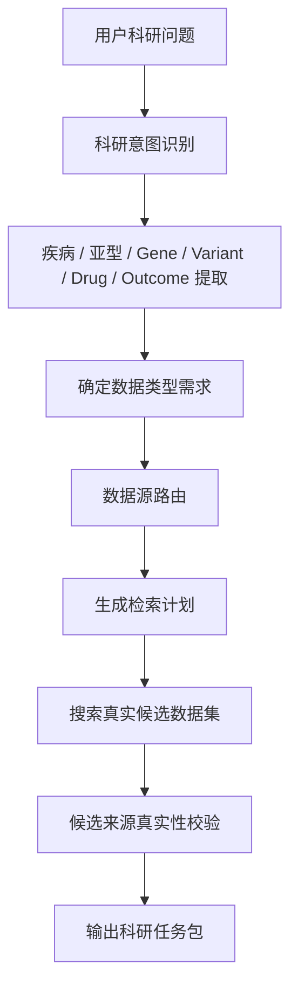
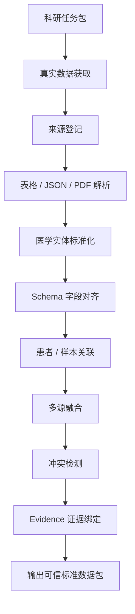
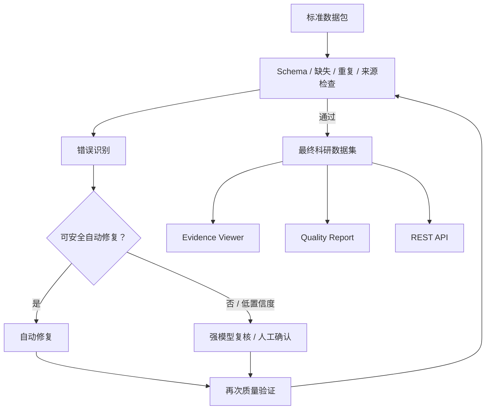
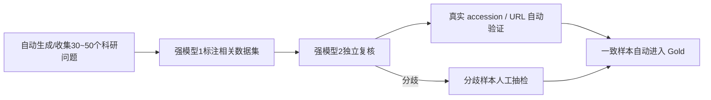

# 乳腺癌精准治疗科研数据智能整合系统
## Codex 单人闭环开发任务书 v1.0

> **用途**：本文件直接交给 Codex 作为项目总任务说明。  
> **开发模式**：单人负责人 + Codex 全栈实现，不再拆分多人职责。  
> **核心原则**：人负责定义“什么是对的”，Codex 负责把规则实现成可运行、可测试、可复现的系统。  
> **项目记忆点**：**找得全、找得准、整得真、查得回、错能改。**

---

# 1. 项目一句话目标

构建一个面向**乳腺癌精准治疗与药物反应**的科研数据智能整合系统。

用户输入一个自然语言科研问题，例如：

> HER2 阳性乳腺癌中 PIK3CA 突变是否与新辅助治疗响应有关？

系统自动完成：

```text
理解科研问题
→ 判断需要什么数据
→ 查找真实公开数据源
→ 下载并解析表格
→ 医学实体标准化
→ 字段 Schema 对齐
→ 多源融合
→ 来源证据绑定
→ 错误检测
→ 自动修复或人工确认
→ 输出可下载科研数据集 + 证据链 + 质量报告
```

系统重点不是生成长篇医学回答，而是：

> **把科研问题转化为真实、结构化、可追溯的科研数据。**

---

# 2. 第一版功能范围

## 2.1 必须完成

第一版必须支持：

```text
自然语言科研问题输入
+
高级筛选条件
+
公开数据库检索
+
真实表格下载
+
多源字段标准化
+
统一数据 Schema
+
数据融合
+
字段级来源证据
+
异常检测
+
自动修复
+
低置信度人工确认
+
CSV / Parquet 下载
+
质量报告
+
前端证据查看
+
REST API
+
Docker 一键启动
```

---

## 2.2 第一版暂不作为主链硬要求

以下功能允许保留扩展接口，但不要阻塞主版本：

```text
复杂医学影像模型
WSI 病理模型训练
大规模知识图谱
全医学领域泛化
所有乳腺癌数据集一次性全接入
所有 PDF 图表都达到完美 OCR
自动生成完整科研论文
```

---

# 3. 用户使用方式

系统同时提供两种输入方式。

## 3.1 自然语言输入

首页主要入口：

```text
请输入您的科研问题：
[                                                   ]
```

例如：

```text
研究 HER2 阳性乳腺癌中 PIK3CA 突变与新辅助治疗响应的关系
```

---

## 3.2 高级筛选表单

用户可选填：

```text
疾病
乳腺癌亚型
基因
变异
药物
治疗方式
研究结局
时间范围
指定数据库
目标字段
```

自然语言是主要展示方式，高级表单用于：

> **提高系统稳定性和比赛现场可控性。**

---

# 4. 第一版核心数据源

第一版先稳定支持 5 类核心来源：

| 来源 | 主要数据 |
|---|---|
| GDC / TCGA-BRCA | 临床、突变、表达、拷贝数 |
| GEO | 表达、临床信息、治疗响应 |
| cBioPortal | 癌症临床与基因组队列 |
| AACT / ClinicalTrials.gov | 临床试验关系表 |
| CIViC | 基因变异—药物—疾病—证据 |

正式比赛增强版增加：

```text
DepMap / PRISM / GDSC
```

用于：

```text
细胞系
突变
表达
药物敏感性
AUC / IC50 / viability
```

---

# 5. 第一批固定测试数据集

第一版至少预先支持和测试：

```text
TCGA-BRCA
METABRIC
SCAN-B / GSE96058
GSE25066
GSE76360
AACT Breast Cancer Trials
CIViC Breast Cancer Evidence
```

增强版：

```text
DepMap breast cancer cell lines
PRISM
GDSC
```

其中：

- `GSE25066` 用于新辅助化疗响应测试；
- `GSE76360` 用于 HER2 靶向治疗响应测试；
- `TCGA-BRCA` 用于多组学患者数据；
- `METABRIC` 用于独立乳腺癌队列；
- `AACT` 用于复杂多关系表测试；
- `CIViC` 用于变异—药物—证据关系测试。

---

# 6. 系统功能分层

系统固定为三层。


---

# 7. 第一层：科研需求与数据发现

## 7.1 输入

```text
自然语言科研问题
+
可选高级筛选条件
+
可选用户上传 CSV / Excel / PDF
```

第一版允许用户上传：

```text
CSV
Excel
PDF
```

并把用户数据作为一个额外 `SourceItem` 进入后续处理。

---

## 7.2 处理流程



---

## 7.3 第一层正式输出

### `research_spec.json`

```json
{
  "task_id": "task_001",
  "research_goal": "研究HER2阳性乳腺癌中PIK3CA突变与治疗响应的关系",
  "disease": "Breast Cancer",
  "subtype": "HER2-positive",
  "genes": ["ERBB2", "PIK3CA"],
  "variants": [],
  "drugs": [],
  "outcomes": ["treatment_response"],
  "required_data_types": [
    "clinical",
    "mutation",
    "expression",
    "treatment_response",
    "clinical_trial",
    "evidence"
  ],
  "target_fields": []
}
```

### `search_plan.json`

```json
{
  "task_id": "task_001",
  "plans": [
    {
      "source": "GDC",
      "goal": "获得乳腺癌临床和突变数据",
      "priority": 1
    },
    {
      "source": "GEO",
      "goal": "获得治疗响应表达队列",
      "priority": 2
    }
  ]
}
```

### `candidate_sources.csv`

至少包含：

```text
dataset_id
dataset_name
source_database
data_type
sample_count
has_treatment
has_response
public_access
relevance_score
url
accession
```

默认返回：

> **Top 5～10 个候选数据集。**

---

# 8. 第二层：多源数据处理与融合

## 8.1 输入

只读取：

```text
research_spec.json
search_plan.json
candidate_sources.csv
```

不得依赖第一层内部 Prompt。

---

## 8.2 流程



---

# 9. 统一数据结构设计

不要将所有数据暴力拼成一张超级表。

系统内部固定保留四类逻辑表。

---

## 9.1 患者临床与组学表

```text
study_id
patient_id
sample_id
disease
subtype
stage
age
sex

er_status
pr_status
her2_status
her2_assay

gene
variant
mutation_status

os_status
os_months
dfs_status
dfs_months
```

---

## 9.2 治疗响应表

```text
study_id
patient_id
sample_id
drug
treatment
response_domain
response_type
response
response_timepoint
```

---

## 9.3 药物实验表

增强版：

```text
cell_line
gene
variant
drug
response_domain
AUC
IC50
viability
```

`response_domain` 必须区分：

```text
clinical
preclinical_cell_line
clinical_trial
```

禁止将细胞系药敏 AUC 直接当成患者治疗响应。

---

## 9.4 临床试验与证据表

```text
trial_id
disease
gene
variant
drug
phase
outcome
evidence_level
publication
source_id
```

---

# 10. Canonical Schema v0.1

第一版只冻结约 20～30 个核心字段。

核心必须包含：

```text
study_id
patient_id
sample_id

disease
subtype
stage

er_status
pr_status
her2_status
her2_assay
her2_raw_value

gene
variant
mutation_status

drug
treatment

response_domain
response_type
response

source_id
raw_field
raw_value
confidence
```

---

# 11. 医学高风险规则

以下规则由人冻结，Codex 不得自行修改。

## 11.1 HER2

禁止：

```text
HER2 IHC 2+
→ 自动直接映射 Positive
```

必须保留：

```text
her2_assay = IHC
her2_raw_value = 2+
```

必要时状态：

```text
Equivocal
```

---

## 11.2 ERBB2

```text
ERBB2 copy-number amplification
```

不能直接等同：

```text
HER2 IHC positive
```

必须保留不同检测维度。

---

## 11.3 患者匹配

低置信度患者/样本关联：

```text
禁止自动合并
```

---

## 11.4 来源

没有 Evidence 的关键数据：

```text
禁止进入正式发布数据集
```

---

## 11.5 高权威来源冲突

如果两个高可信来源对同一字段存在不可解释冲突：

```text
禁止自动选择其中一个
→ unresolved
→ 人工确认
```

---

# 12. 冲突处理原则

所有原始信息首先保留。

例如：

```text
HER2 IHC = 2+
HER2 FISH = Amplified
ERBB2 CNA = Amplified
```

禁止：

```text
大模型投票 → HER2 Positive
```

正确方式：

```text
her2_ihc
her2_fish
erbb2_cnv
```

分别保存。

只有真正属于：

> **同一语义字段、同一检测维度、同一对象**

的不同来源值，才进入冲突仲裁。

---

# 13. 第三层：质量闭环与科研输出

## 13.1 输入

```text
canonical_dataset.parquet
evidence.jsonl
source_manifest.json
```

---

## 13.2 流程



---

# 14. 最终输出

固定输出目录：

```text
output/{task_id}/

├── final_dataset.csv
├── final_dataset.parquet
├── data_dictionary.json
├── source_manifest.json
├── evidence.jsonl
├── quality_report.json
├── quality_report.html
├── repair_log.jsonl
└── task_summary.json
```

---

# 15. 前端必须实现的页面

Codex 负责完整前端。

---

## 15.1 首页

展示：

```text
科研问题输入框
高级筛选
开始任务按钮
```

首页重点不是聊天，而是：

> **科研任务入口 + 执行流程。**

---

## 15.2 执行过程页

显示：

```text
当前任务
已识别科研实体
正在检索的数据源
找到多少候选数据集
正在下载什么
当前处理步骤
```

---

## 15.3 结果页

必须重点展示四个区域：

```text
① 最终数据表
② 数据来源列表
③ 核心评测指标
④ Evidence 字段点击溯源
```

不优先做：

```text
长篇 AI 报告
大量统计图
复杂知识图谱
```

---

# 16. 评测体系

## 16.1 数据检索

### Precision

\[
P_r=\frac{TP}{TP+FP}
\]

### Recall

\[
R_r=\frac{TP}{TP+FN}
\]

### F1

\[
F_{1,r}
=
\frac{2P_rR_r}{P_r+R_r}
\]

---

# 17. 数据整合

## 17.1 数据忠实率 Faithfulness

\[
F_a=
\frac{N_{\text{忠实保持原始医学语义的字段}}}
{N_{\text{抽检关键字段}}}
\]

目标：

```text
≥ 95%
```

---

## 17.2 字段可追溯率 Traceability

\[
T=
\frac{N_{\text{存在完整有效 Evidence 的关键非空字段}}}
{N_{\text{全部关键非空字段}}}
\]

目标：

```text
100%
```

---

# 18. 错误检测与修复

## Error Precision

\[
P_e=\frac{TP_e}{TP_e+FP_e}
\]

## Error Recall

\[
R_e=\frac{TP_e}{TP_e+FN_e}
\]

## Error F1

\[
F_{1,e}
=
\frac{2P_eR_e}{P_e+R_e}
\]

## Repair Accuracy

\[
A_r
=
\frac{N_{\text{修复后正确}}}
{N_{\text{自动执行修复}}}
\]

---

# 19. 创新总指标：科研数据可信整合指数

正式命名：

> **科研数据可信整合指数**

英文：

```text
Scientific Data Trust & Integration Index
SDTI
```

定义：

\[
SDTI
=
100
\sqrt[5]{
F_{1,r}
\times
F_a
\times
T
\times
F_{1,e}
\times
A_r
}
\]

采用几何平均的原因：

```text
不需要主观设置权重
+
任何一个环节明显偏低都会拖累总分
+
符合科研数据“整条链都必须可靠”的直觉
```

---

# 20. 三条安全红线

无论 SDTI 多高，只要触发以下任意一条，本次任务不得自动发布。

```text
红线 1：
虚假来源率 > 1%

红线 2：
Faithfulness < 90%

红线 3：
Traceability < 95%
```

正式目标：

```text
Traceability = 100%
```

---

# 21. 比赛首页核心指标

只展示：

```text
Retrieval Precision
Retrieval Recall
Faithfulness
Traceability
Repair Accuracy
SDTI
```

评委记忆：

```text
找得准
找得全
整得真
查得回
改得对
总体可信
```

---

# 22. Gold Set 设计：低人工模式

人工标注工作量尽量降到最低。

不要求团队手工逐条制作大规模 Gold Set。

采用：

> **强模型初标 → 独立强模型复核 → 规则自动校验 → 人只抽检高风险样本。**

---

# 23. Gold Set A：科研问题—数据集

目标：

```text
测 Retrieval Precision / Recall / F1
```

流程：



---

# 24. Gold Set B：字段标准化

目标：

```text
Faithfulness
Schema Mapping
```

自动从真实数据集中抽取：

```text
300 左右字段/值 pair
```

由：

```text
强模型 1：提出标准化结果
强模型 2：反向审核是否改变医学含义
规则系统：检查枚举 / assay / gene / drug
人：只检查低置信度/模型冲突样本
```

---

# 25. Gold Set C：错误集

目标：

```text
Error Precision
Error Recall
Error F1
Repair Accuracy
```

错误案例由 Codex 自动构造：

```text
重复记录
缺失字段
Gene 别名
Drug 别名
Schema 错误映射
HER2 assay 错误
来源缺失
Patient ID 冲突
```

强模型负责：

```text
判断错误类型
给出标准修复结果
```

人只抽检：

```text
高风险医学语义错误
模型之间不一致案例
患者级关联案例
```

---

# 26. Gold Set 不能完全依赖 AI 的原则

强模型可以大幅减少人工工作，但：

```text
AI 输出 ≠ 天然 Ground Truth
```

所以最终 Gold Set 必须有：

```text
真实来源验证
规则校验
模型间一致性检查
高风险人工抽检
```

比赛中表述：

> **采用“双模型交叉标注 + 确定性规则校验 + 高风险人工审定”的半自动 Gold Set 构建机制。**

这比声称：

> “全部 Gold 都由 AI 自动生成”

更可信。

---

# 27. 推荐技术栈

第一版尽量简单。

## 后端

```text
Python 3.11+
FastAPI
Pydantic
LangGraph
Qwen API
DuckDB
Pandas / Polars
PyArrow
```

## 数据

```text
Parquet
JSON / JSONL
CSV
SQLite（仅任务状态可选）
```

## 数据获取

```text
GDC Client
GEOparse
cBioPortal API/Datahub
AACT / ClinicalTrials API
CIViC API/data releases
BioMCP（增强检索）
```

## 医学标准化

```text
scispaCy
OncoTree
本地规则字典
```

## 数据质量

```text
Pandera
自研错误规则
```

## 文档增强

后期：

```text
GROBID
MinerU
```

---

# 28. 推荐 GitHub 项目

| 项目 | 用途 | 链接 |
|---|---|---|
| Qwen-Agent | LLM 工具调用参考 | https://github.com/QwenLM/Qwen-Agent |
| LangGraph | 工作流与修复闭环 | https://github.com/langchain-ai/langgraph |
| BioMCP | 生物医学数据与证据检索 | https://github.com/genomoncology/biomcp |
| GDC Client | TCGA/GDC 下载 | https://github.com/NCI-GDC/gdc-client |
| GEOparse | GEO 下载和解析 | https://github.com/guma44/GEOparse |
| cBioPortal Datahub | 癌症数据与 Schema 参考 | https://github.com/cBioPortal/datahub |
| cBioPortal Curation Tools | 癌症数据清洗规则 | https://github.com/cBioPortal/datahub-study-curation-tools |
| scispaCy | 生物医学实体处理 | https://github.com/allenai/scispacy |
| OncoTree | 癌症类型标准化 | https://github.com/cBioPortal/oncotree |
| DuckDB | 多表融合和查询 | https://github.com/duckdb/duckdb |
| Pandera | DataFrame Schema 校验 | https://github.com/unionai-oss/pandera |
| Label Studio | Gold Set 人工抽检界面（可选） | https://github.com/HumanSignal/label-studio |
| DVC | Gold Set / benchmark 数据版本（增强） | https://github.com/iterative/dvc |

---

# 29. 一个人需要做什么

项目不再进行多人职责拆分。

**一个负责人全程掌握业务逻辑和产品连贯性。**

人主要负责：

```text
1. 冻结项目范围
2. 冻结数据源
3. 冻结 Canonical Schema
4. 冻结医学规则
5. 决定哪些错误属于高风险
6. 冻结指标公式
7. 审核 AI Gold Set 的高风险样本
8. 查看 Codex Diff
9. 运行最终验收
10. 设计答辩 Demo 故事
```

人不需要手工完成：

```text
全部数据 Adapter
大量 ETL
重复 API 代码
前端页面编码
大量单元测试
Docker 配置
常规 Bug 修复
```

这些交给 Codex。

---

# 30. Codex 工作范围

Codex 负责：

> **从仓库骨架到前后端可运行 Demo 的完整软件工程实现。**

包括：

```text
后端
前端
数据库访问
数据 Adapter
ETL
Schema Mapper
Entity Normalizer
Conflict Detector
Evidence Builder
Quality Validator
Repair Pipeline
Gold Set 生成工具
Metric Runner
SDTI
REST API
测试
Docker
README
开发文档
```

---

# 31. Codex 禁止事项

Codex 不得：

```text
自行改变项目子领域
自行增加新的医学结论
自行修改冻结 Schema
自行降低安全红线
伪造 accession / DOI / 数据集
把模型猜测当 Ground Truth
把细胞系药敏当患者疗效
把 HER2 IHC / FISH / CNA 混成一个原始字段
低置信度患者匹配自动合并
无 Evidence 数据直接发布
```

如果需要改变冻结接口：

```text
必须先生成 CHANGE_REQUEST.md
```

包含：

```text
为什么要改
影响哪些模块
兼容性影响
迁移方法
测试修改
```

不得自行直接改。

---

# 32. Codex 项目目录

```text
breast-research-data-agent/
│
├── AGENTS.md
├── README.md
├── docker-compose.yml
├── .env.example
│
├── backend/
│   ├── app/
│   │   ├── main.py
│   │   ├── api/
│   │   ├── workflow/
│   │   ├── schemas/
│   │   ├── sources/
│   │   │   ├── gdc/
│   │   │   ├── geo/
│   │   │   ├── cbioportal/
│   │   │   ├── aact/
│   │   │   └── civic/
│   │   ├── normalization/
│   │   ├── integration/
│   │   ├── evidence/
│   │   ├── quality/
│   │   ├── repair/
│   │   └── evaluation/
│   │
│   └── tests/
│
├── frontend/
│   ├── src/
│   │   ├── pages/
│   │   ├── components/
│   │   └── api/
│   └── tests/
│
├── data/
│   ├── cache/
│   ├── raw/
│   ├── normalized/
│   ├── gold/
│   └── output/
│
├── configs/
│   ├── canonical_schema.yaml
│   ├── medical_rules.yaml
│   ├── quality_rules.yaml
│   └── sources.yaml
│
├── scripts/
│
└── docs/
    ├── ARCHITECTURE.md
    ├── SCHEMA.md
    ├── METRICS.md
    ├── DATA_SOURCES.md
    └── DEMO.md
```

---

# 33. AGENTS.md 必须写入的核心规则

```text
1. 阅读 docs/ 和 configs/ 后再修改业务代码。
2. canonical_schema.yaml 为冻结接口，不得未经变更申请修改。
3. 所有外部数据必须记录来源。
4. 任何 key normalization 都必须保留 raw_value。
5. 所有关键模块必须有测试。
6. 修改后必须执行对应测试。
7. 新增依赖必须解释必要性。
8. 禁止伪造医学数据、来源或评测结果。
9. 无法确认的医学语义输出 unresolved。
10. 不得为了通过测试硬编码 benchmark 答案。
```

---

# 34. Codex 开发顺序

## 阶段 0：仓库骨架

Codex 先完成：

```text
项目目录
FastAPI
前端基础框架
Docker
pytest
环境变量
AGENTS.md
README
```

验收：

```text
docker compose up 可启动
backend health API 返回 200
frontend 可打开
pytest 可执行
```

---

## 阶段 1：冻结 Schema 和 Mock 流程

先不接真实数据。

实现：

```text
ResearchSpec
SearchPlan
SourceItem
CanonicalRecord
EvidenceCell
QualityReport
```

使用 Mock 数据贯通：

```text
输入问题
→ Mock 候选来源
→ Mock 数据
→ 标准化
→ Evidence
→ Quality
→ 前端结果页
```

---

## 阶段 2：真实数据 Adapter

依次实现：

```text
GDC
GEO
cBioPortal
AACT
CIViC
```

每个 Adapter 必须独立测试。

允许：

```text
实时查询
+
本地缓存
```

比赛现场优先读取缓存，必要时实时刷新。

---

## 阶段 3：标准化与融合

实现：

```text
gene_normalizer
drug_normalizer
biomarker_normalizer
schema_mapper
patient_sample_linker
merge_engine
conflict_detector
evidence_builder
```

---

## 阶段 4：评测系统

实现：

```text
retrieval_precision
retrieval_recall
retrieval_f1

faithfulness
traceability

error_precision
error_recall
error_f1
repair_accuracy

sdti
```

---

## 阶段 5：AI 辅助 Gold Set

实现：

```text
gold_question_generator
gold_retrieval_labeler
gold_field_labeler
gold_error_generator
second_model_reviewer
rule_validator
human_review_queue
```

---

## 阶段 6：质量闭环

实现：

```text
error_classifier
repair_policy
repair_executor
revalidator
repair_log
```

---

## 阶段 7：前端完整化

实现：

```text
科研问题输入
高级筛选
执行进度
候选来源
最终数据表
指标面板
Evidence Viewer
错误与修复记录
CSV 下载
```

---

## 阶段 8：Demo 与性能优化

固定 Demo：

### Demo A

```text
HER2 阳性乳腺癌
+
PIK3CA
+
治疗响应
```

### Demo B

错误修复演示两个案例：

```text
1. HER2 IHC 2+ 被错误映射为 Positive
2. Herceptin / trastuzumab 药物别名
```

---

# 35. Codex 自动测试要求

必须至少覆盖：

```text
Schema 单元测试
每个 Adapter 测试
实体标准化测试
字段 Mapping 测试
Evidence 完整性测试
错误检测测试
Repair 测试
SDTI 计算测试
API 测试
前端关键页面 smoke test
```

不得只测试：

```text
HTTP 200
```

必须验证业务值。

---

# 36. 关键验收指标

第一版验收目标：

| 能力 | 指标 | 目标 |
|---|---|---:|
| 数据查找 | Precision | ≥90% |
| 数据查找 | Recall | ≥90% |
| 数据查找 | F1 | ≥90% |
| 数据整合 | Faithfulness | ≥95% |
| 来源证据 | Traceability | 100% |
| 错误检测 | Error F1 | ≥90% |
| 自动修复 | Repair Accuracy | ≥90% |
| 总体 | SDTI | 建议 ≥90 |

注意：

> 未跑真实 Gold Set 前，禁止在 UI、README、PPT 中写虚构成绩。

---

# 37. 比赛 Demo 的最终故事

整个展示控制成五步。

## 第一步：提问题

```text
研究 HER2 阳性乳腺癌中
PIK3CA 突变与治疗响应
```

---

## 第二步：找数据

页面出现：

```text
TCGA
GEO
cBioPortal
AACT
CIViC
```

对应：

```text
Precision / Recall
```

评委理解：

> 找得准、找得全。

---

## 第三步：统一数据

展示：

```text
HER2 / ERBB2
Herceptin / Trastuzumab
不同 response
```

对应：

```text
Faithfulness
```

评委理解：

> 没把医学语义整坏。

---

## 第四步：点字段查看来源

点击：

```text
PIK3CA = Mutated
```

显示：

```text
来源
accession
原始字段
原始值
标准化过程
```

对应：

```text
Traceability
```

评委理解：

> 数据查得回。

---

## 第五步：错误修复

系统发现：

```text
HER2 IHC 2+ → Positive
```

属于高风险错误。

系统：

```text
拦截
→ 重新映射
→ 标记 Equivocal / 保留 assay
→ 再验证
```

另一个：

```text
Herceptin → Trastuzumab
```

可确定性自动修复。

对应：

```text
Repair Accuracy
```

评委理解：

> 错了能改，而且危险错误不会乱改。

---

# 38. 给 Codex 的第一条总任务 Prompt

将下面内容作为项目初始化任务：

```text
你将实现一个“乳腺癌精准治疗科研数据智能整合系统”。

首先完整阅读仓库根目录的：
- AGENTS.md
- docs/
- configs/

不得自行改变 canonical schema、医学安全规则和评测指标。

你的第一阶段任务不是一次性实现整个系统，而是：

1. 建立完整项目目录；
2. 创建 FastAPI 后端；
3. 创建前端应用；
4. 配置 Docker Compose；
5. 建立 Pydantic Schema：
   - ResearchSpec
   - SearchPlan
   - CandidateSource
   - SourceItem
   - CanonicalRecord
   - EvidenceCell
   - QualityReport
6. 使用 Mock 数据跑通：
   用户问题
   → ResearchSpec
   → CandidateSource
   → CanonicalDataset
   → Evidence
   → QualityReport
   → 前端结果页。
7. 为上述链路写自动测试。
8. 创建 README，说明启动和测试方法。
9. 不接真实医学数据库，真实 Adapter 留到下一阶段。
10. 完成后运行所有测试并报告结果。

任何需要修改冻结 Schema 的地方，不直接修改，先创建 CHANGE_REQUEST.md。
```

---

# 39. Codex 的后续任务原则

每一个 Codex 任务都必须包含：

```text
任务目标
输入
输出
允许修改的目录
禁止修改内容
验收标准
测试要求
```

不要再发：

> “继续完善项目。”

而应该发：

> “实现 GEOAdapter，输入 SearchPlan，输出 SourceItem[]，以 GSE25066 为集成测试，必须支持 Series Matrix 和 Supplement，写 pytest，不修改 Canonical Schema。”

---

# 40. 最终开发原则

整个项目只坚持六件事：

```text
1. 范围不要继续扩。
2. Schema 不要随意改。
3. 任何数字都不能丢原始来源。
4. 指标必须来自 Gold Set，不能自己报成绩。
5. AI 可以辅助做 Gold，但不能把 AI 输出直接当真值。
6. Codex 负责工程，人负责最终正确性。
```

最终向评委讲的不是：

> “我们接了很多 GitHub 和 AI。”

而是：

> **我们建立了一条从科研问题到可信科研数据的自动生产流水线，并通过 Precision、Recall、忠实率、可追溯率和修复正确率对整条流水线进行可量化评价，最终形成一个具有短板约束的科研数据可信整合指数。**
