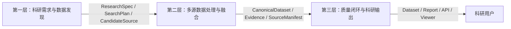

# 02 系统架构

## 第一层输出

- `research_spec.json`
- `search_plan.json`
- `candidate_sources.csv`

## 第二层输出

- `canonical_dataset.parquet`
- `evidence.jsonl`
- `source_manifest.json`

## 第三层输出

- `final_dataset.csv`
- `final_dataset.parquet`
- `data_dictionary.json`
- `quality_report.json`
- `quality_report.html`
- `repair_log.jsonl`
- REST API
