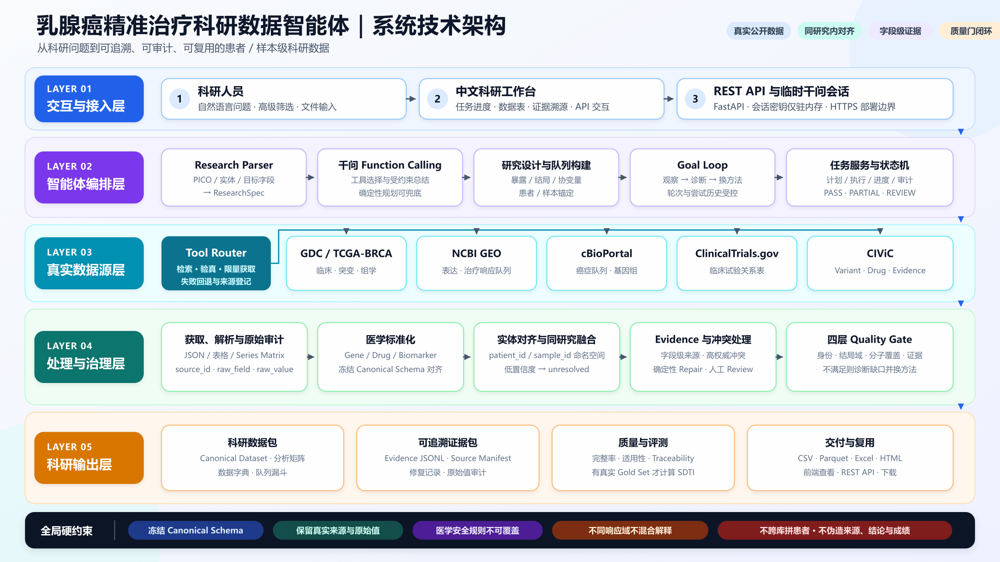
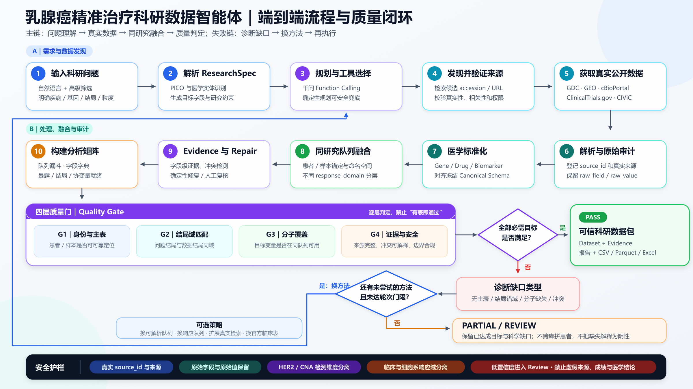

# 02 系统架构

完整架构图与流程图保留在本文件；面向汇报的中文讲解图见[中文智能体工作流](AGENT_WORKFLOW_CN.md)。系统运行时仍按图中闭环换方法，直到主目标达成或合法方法用尽。

三层流水线把科研问题变成可审计数据集；内层 Agent 在质量门失败时更换尚未尝试的方法。

## Agent 架构定性

本系统是**有边界的混合式多 Agent 编排系统**，不是单一大 Prompt，也不是无总控的完全去中心化集群。`ResearchAgentService` 是任务级主 Agent，负责统一推进；`ResearchIntentAgent`、`ResearchFormulationAgent`、`FieldPlanningAgent`、`MetricPlanningAgent` 负责规划子任务；`CollectionAgent` 负责缺口诊断和换方法；`CriticAgent` 负责独立批评；`QualityAgent` 与冻结 `medical_rules.yaml` 负责最终准入；`ClosedLoopService` 负责轮次控制。GDC/GEO/cBioPortal/AACT/CIViC/DepMap Adapter、Schema/Entity Matcher 和数据集构造器属于确定性事实处理模块，不冒充 Agent。

### 上下文、并行与校验边界

- 上下文按 `task_id`、闭环轮次、`study_id/patient_id/sample_id` 和来源命名空间隔离；规划建议不能直接写入患者事实。
- 独立只读来源查询可以并行表达；共享数据集写入、实体合并、闭环决策和医学裁决必须串行汇合。当前生产运行采用受控串行工具执行，保留并行工具意图以保证审计可复现。
- Adapter/Schema、Critic、Quality/Medical Gate 形成独立校验链，模型不能用自评替代校验。
- 单来源查询、格式转换、确定性去重、严格离线基线和低延迟小请求不引入多 Agent。

将所有职能塞入一个 Agent 会导致上下文污染、权限混杂、无法独立质疑、失败难隔离、并行边界不清和评测无法归因，因此本系统采用“复杂研究任务多 Agent，局部确定性任务单模块”。

## 第一层输出

- `research_spec.json`
- `search_plan.json`
- `candidate_sources.csv`

## 第二层输出

- `canonical_dataset.parquet`
- `evidence.jsonl`
- `source_manifest.json`

## 第三层输出

- `final_dataset.csv`
- `final_dataset.parquet`
- `data_dictionary.json`
- `quality_report.json`
- `quality_report.html`
- `repair_log.jsonl`
- REST API
