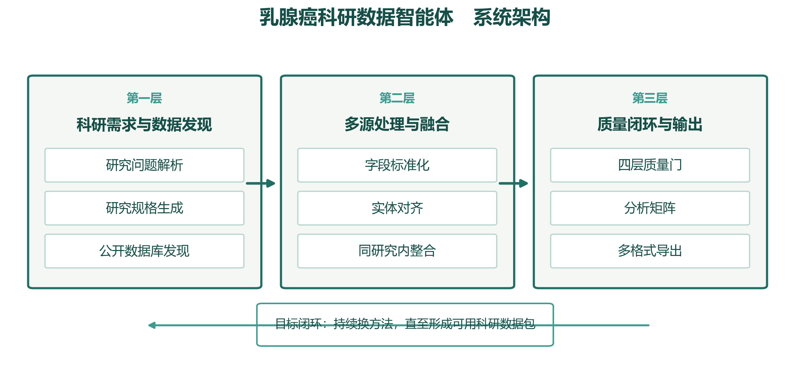
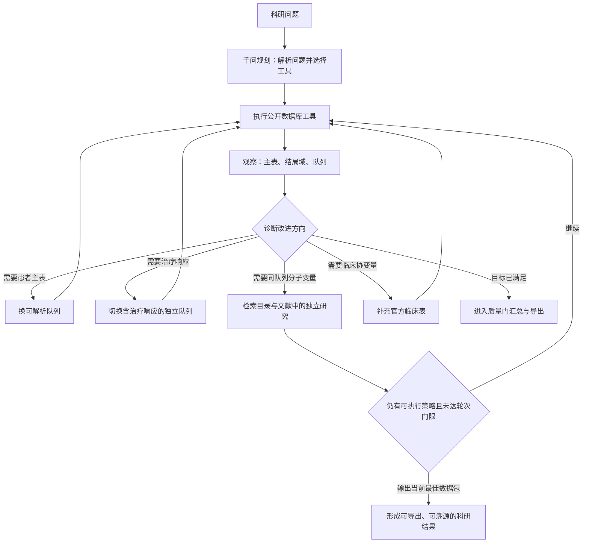

# 02 系统架构

架构图与流程图只放在本文件中，不在前端页面展示。系统运行时仍按图中闭环换方法，直到主目标达成或合法方法用尽。

三层流水线把科研问题变成可审计数据集；内层 Agent 在质量门失败时更换尚未尝试的方法。

## 智能体换方法闭环

代表案例：METABRIC 有 PIK3CA、无治疗响应 → 诊断为结局域失败 → 切换 GSE76360 响应队列。该队列没有同患者 PIK3CA 时停止，不把 METABRIC 突变贴到 GEO 患者上。

## 第一层输出

- `research_spec.json`
- `search_plan.json`
- `candidate_sources.csv`

## 第二层输出

- `canonical_dataset.parquet`
- `evidence.jsonl`
- `source_manifest.json`

## 第三层输出

- `final_dataset.csv`
- `final_dataset.parquet`
- `data_dictionary.json`
- `quality_report.json`
- `quality_report.html`
- `repair_log.jsonl`
- REST API
