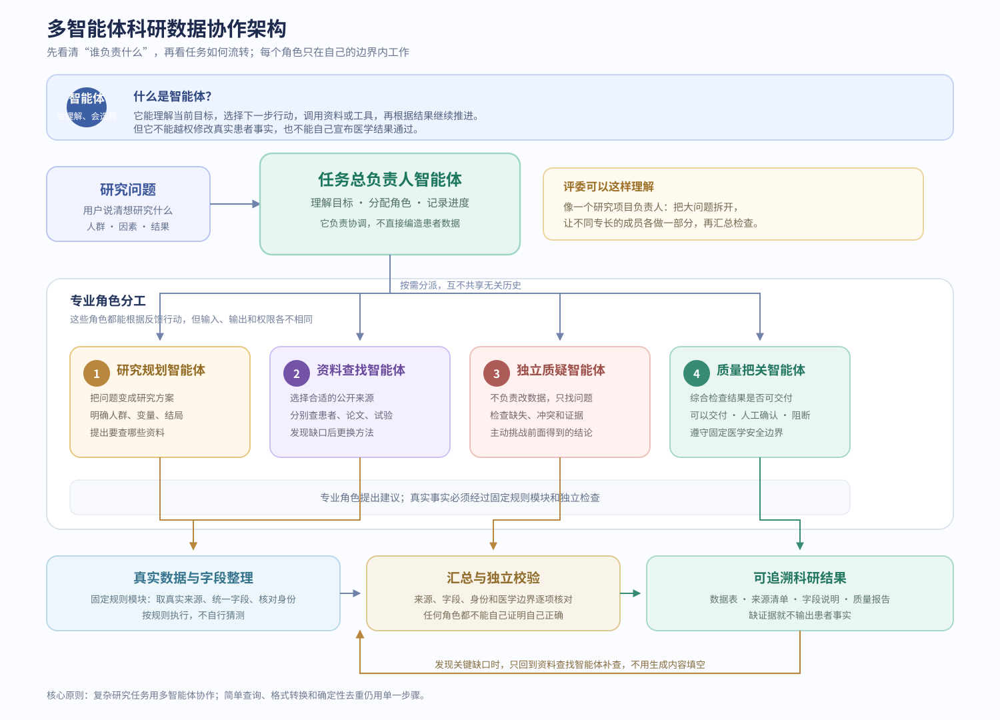

# 中文智能体工作流（讲解版）

## 一句话讲法

这是一个“一个总负责人，多个专业角色协作”的科研数据工作流。总负责人安排任务，专业角色分别负责规划、查找、整理和检查；最后由质量把关决定结果能不能交付。

## 先讲清楚：什么是智能体

智能体不是一个只会回答问题的聊天窗口，也不是把几个程序名字并排放在一起。它是一个有明确目标和权限的工作角色：先理解当前任务，再选择下一步行动，调用资料或工具，读取结果后继续推进。它可以根据反馈调整行动，但必须遵守自己的边界，不能把猜测当成患者事实。

本系统有一个**任务总负责人智能体**，负责拆分问题、分派工作、记录进度和汇总结果；还有多个**专业智能体**，分别负责研究规划、资料查找、独立质疑和质量把关。真实数据获取、字段统一、身份核对和医学禁用规则属于**固定规则模块**，它们按确定性规则执行，不让模型自由编造。

## 按图讲解

1. **研究问题**：用户先说清楚想研究的疾病、人群、因素和结果。
2. **任务统筹**：系统把大问题拆成可以执行的小步骤，并记录每一步的状态。
3. **研究规划**：明确要找哪些人、哪些变量、哪些结局，以及需要什么公开资料。
4. **多源查找**：分别查找患者资料、论文证据和临床试验信息。彼此独立的查找可以同时进行，但不会把不同研究的患者硬拼在一起。
5. **数据整理**：把不同来源的字段整理成统一的科研数据，同时保留原始内容和来源。
6. **独立检查**：专门找字段缺失、来源不清、身份对不上和研究结局不匹配等问题。
7. **质量把关**：按照固定的医学安全规则判断结果是可以交付、需要人工确认，还是必须阻断。
8. **缺口补查**：如果发现缺少关键字段或证据，系统只针对缺口重新查找，直到达到目标或没有合法方法可用。
9. **结果交付**：输出科研数据、来源清单、字段说明和质量报告，不输出没有证据的患者事实或诊疗建议。

## 为什么要多个角色

如果让一个角色同时负责“想办法、找资料、改数据、自己检查、自己宣布通过”，它很容易把推测带进事实，也无法真正质疑自己的结论。现在每个角色都有清楚的边界：能提出计划的不能直接改事实，能查资料的不能决定医学安全，负责检查的不能偷偷修数据。这样才能做到上下文隔离、关注点分离、失败可定位、结果可复核。

## 哪些步骤可以同时做

同一轮中互不依赖的公开资料查找可以同时进行，例如分别查患者资料、论文证据和试验信息。数据写入、身份对应、缺口补查和医学安全判断必须等资料汇总后按顺序进行，确保来源和判断可追溯。

## 哪些场景不用多个角色

已知一个资料编号的简单查询、格式转换、去重、大小写统一和严格复现的离线评测，不需要多个角色。此时单一确定性处理更快、更省资源，也更容易复现。
