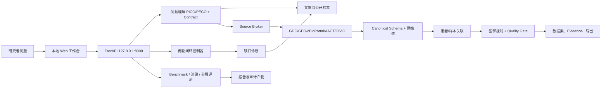

# 乳腺癌精准治疗科研数据智能体
# 综合设计、功能与评测报告

> 版本：2026-08-29  
> 仓库：`breast-cancer-research-agent`  
> 说明：本报告整合系统设计、功能接口、公开基准、模块对照、查询理解消融、两轮闭环和模型探测结果。不同层级指标保持分开，不把检索分数、任务诊断分或内部 smoke 分数冒充正式 SDTI 或临床效果。

## 一、执行摘要

本项目要解决的问题，是把研究者的宽泛想法转化为可执行的研究方案、真实可追溯的数据集和可复核的研究报告。系统采用“模型理解、程序取数、规则核验、质量门控”的职责分工：Qwen-plus 负责研究问题结构化和工具规划；GDC、GEO、cBioPortal、ClinicalTrials.gov/AACT、CIViC 等适配器负责数据获取；标准化、患者/样本关联、医学安全规则和发布判定由程序执行。

当前最有证据的结果来自公开检索层。本轮在 SciFact、NFCorpus、SciDocs、ArguAna 上重跑 3,029 个测试查询，BGE-small-en-v1.5 的 nDCG@10 宏平均为 **0.3966**，tuned BM25 为 **0.3376**，相对提升 **17.5%**。该结果说明 BGE 是公开检索诊断中的强候选，不等同于乳腺癌临床效果。

Qwen-plus 已完成本机网络、鉴权、模型可用性和 Function Calling 探测。DeepSeek、GLM 本轮没有独立凭据，因此没有生成同条件横向排名。正式乳腺癌 Gold Set 尚未冻结，故 Retrieval F1、Faithfulness、Traceability、Error F1、Repair Accuracy 和 SDTI 仍为 `NOT_EVALUATED`。

## 二、系统目标与责任边界

### 2.1 输入与输出

给定研究问题 `q`，系统交付三类结果：

1. **Research Contract**：研究人群、暴露/变量、比较对象、结局、时间窗口、分析单位和字段需求；
2. **可分析数据集**：标准字段、`raw_field`、`raw_value`、`source_id`、置信度和 Evidence；
3. **审计报告**：数据来源、处理动作、质量门、冲突、未决问题、指标和复现命令。

### 2.2 模型与程序的分工

| 层级 | 主要职责 | 不能越过的边界 |
|---|---|---|
| Qwen/兼容模型 | 理解中文科研问题、生成结构化检索计划、选择工具 | 不能直接写入患者事实或绕过安全层 |
| 数据适配器 | 调用官方公开接口并登记来源 | 不能用猜测填补不存在的记录 |
| 标准化与关联 | 字段映射、原始值保留、患者/样本匹配 | 低置信度不得自动合并 |
| 医学安全层 | HER2、response_domain、冲突和发布门控 | 不能用模型自评代替确定性规则或 Gold Set |
| 评测层 | 统一脚本、公开 benchmark、消融和分层统计 | 不能读取 test qrels 调参或伪造成绩 |

### 2.3 医学安全硬规则

- HER2 IHC 2+ 不得直接自动判为 HER2 Positive；
- ERBB2 CNA amplification 不等同于 HER2 IHC positive；
- 低置信度患者/样本关联进入 `unresolved/review`；
- 高权威来源发生不可解释冲突时不自动选边；
- 细胞系 `AUC/IC50` 与患者 `pCR/response` 通过 `response_domain` 分开。

## 三、系统架构与两轮闭环



闭环流程固定保留第一轮输入、输出、工具调用和哈希。第二轮读取第一轮的字段缺口、证据缺口、结局覆盖和安全诊断，生成补充检索请求；若无可验证改进、输入重复或触发安全门，则停止并保留 `REVIEW`。

## 四、评测体系与指标口径

### 4.1 正式 SDTI 指标

正式指标来自冻结文档 `docs/06_评测指标与SDTI.md`，包括 Retrieval Precision/Recall/F1、Faithfulness、Traceability、Error Precision/Recall/F1、Repair Accuracy。SDTI 使用冻结几何平均公式：

```text
SDTI = 100 * (Retrieval F1 * Faithfulness * Traceability * Error F1 * Repair Accuracy)^(1/5)
```

任一组件没有经审核的 Gold Set 结果时，指标必须是 `NOT_EVALUATED/null`；不得用公开检索分数或内部 smoke 分数填充。

### 4.2 外部公开 benchmark

| 能力层 | 数据集/来源 | 主指标 | 当前用途 |
|---|---|---|---|
| 数据清洗 | Hospital、Flights、Beers、Rayyan、Movies、Tax | Cell-level F1、Repair Accuracy | 通用清洗诊断 |
| 科学检索 | BEIR SciFact、NFCorpus、SciDocs、ArguAna、FiQA | nDCG@10、Recall@100、MRR@10 | 检索横向对比 |
| Schema Matching | Valentine 官方任务 | Precision、Recall、F1 | 字段对齐诊断 |
| Entity Matching | DeepMatcher 官方任务 | Precision、Recall、F1 | 实体关联诊断 |

### 4.3 任务级诊断与质量门

任务适用度由 Research Relevance、Analytical Adequacy、Traceability & Reliability、Reusability 四个维度构成；质量门只输出 `PASS`、`REVIEW`、`REJECT`，不等价于一个总分。高风险医学字段、患者身份、关键 Evidence 缺失或不可解释冲突必须进入复核或阻断。

## 五、公开检索层：本轮重跑与历史对照

### 5.1 本轮分层结果

本轮完成 4 个数据集、4 种方法，共 **3,029 个 test queries**。FiQA（648 个查询）因资源窗口未完成，没有计入本轮宏平均。

| 数据集 | 查询数 | Project BM25 tuned v2 nDCG@10 | VNext BGE nDCG@10 | BGE Recall@100 | BGE MRR@10 |
|---|---:|---:|---:|---:|---:|
| SciFact | 300 | 0.6044 | **0.6803** | **0.9383** | **0.6499** |
| NFCorpus | 323 | 0.2902 | **0.3315** | **0.2975** | **0.5257** |
| SciDocs | 1,000 | 0.1490 | **0.1910** | **0.4312** | **0.3351** |
| ArguAna | 1,406 | 0.3067 | **0.3836** | **0.9687** | **0.2601** |

### 5.2 本轮宏平均

| 方法 | nDCG@10 | Recall@100 | MRR@10 | 平均延迟 ms/查询 | 相对 tuned BM25 |
|---|---:|---:|---:|---:|---:|
| Project BM25 tuned v2 | 0.3376 | 0.5729 | 0.3847 | 23.51 | 基线 |
| **VNext BGE-small-en-v1.5** | **0.3966** | **0.6589** | **0.4427** | **8.29** | **+17.5%** |
| VNext BM25+BGE fusion | 0.3856 | 0.6424 | 0.4247 | 32.58 | +14.2% |

逐数据集看，BGE 的 nDCG@10 均高于 tuned BM25；融合在 SciDocs 低于纯 BGE，且平均延迟更高。因此 BGE 作为公开检索诊断候选，BM25 继续作为低成本生产默认，直到完成更大规模资源评测和乳腺癌 Gold Set 验证。

### 5.3 历史五任务对照

历史完整运行覆盖五个 BEIR 任务：BGE nDCG@10 宏平均 **0.3880**，tuned BM25 **0.3147**，校准融合 **0.3791**。该结果与本轮四任务重跑方向一致，但两轮数据范围不同，不能直接拼接为一个新的五任务成绩。

## 六、数据清洗、Schema 与 Entity 分层

### 6.1 数据清洗公开基准

| 数据集 | 不修复 F1 | 列众数 F1 | 项目格式画像 F1 | Repair Accuracy |
|---|---:|---:|---:|---:|
| HoloClean Hospital | 0.0000 | 0.0667 | 0.0000 | 0.0000 |
| Raha Beers | 0.0000 | 0.0000 | **0.9837** | **1.0000** |
| Raha Flights | 0.0000 | 0.0000 | 0.0515 | 0.6500 |
| Raha Movies-1 | 0.0000 | 0.0002 | **0.8916** | **0.9701** |
| Raha Rayyan | 0.0000 | 0.0000 | 0.0000 | 0.0000 |
| Raha Tax | 0.0000 | 0.0000 | **0.9868** | **0.9951** |

这些是本项目在公开数据上的重跑，不是 Raha、HoloClean 或 Cocoon 的官方 leaderboard 分数；Hospital、Flights、Rayyan 的语义错误和缺失恢复不能仅凭格式画像安全推断。

### 6.2 Schema Matching

Valentine 单任务 `valentine_education_covid_meals`：V2 baseline Precision/Recall/F1 为 **1.0000/1.0000/1.0000**；V3 为 **1.0000/0.6000/0.7500**。十任务宏平均中，V2 F1 **0.8451**，V3 F1 **0.7994**。因此 V3 保留为实验路径，默认仍使用 V2。

### 6.3 Entity Matching

五个官方 DeepMatcher 测试集宏平均：

| 方法 | Precision | Recall | F1 |
|---|---:|---:|---:|
| Project learned entity rule v2 | 0.7259 | 0.7668 | **0.7408** |
| Entity matcher v3 fixed threshold | 0.5860 | 0.4514 | 0.4883 |
| Entity matcher v3 train/valid calibrated | 0.5251 | 0.6229 | 0.5579 |

V3 校准后相对固定阈值的 F1 提升 **0.0697**、Recall 提升 **0.1715**，但仍低于 V2，因此不切换默认。公开 Entity benchmark 不是乳腺癌患者身份 Gold Set；真实患者关联仍由 `PatientSampleLinker` 和安全门决定。

## 七、查询理解消融与模型整合

### 7.1 查询理解 A/B 消融

同一 tuned BM25、同一语料和 test qrels 下：

| 方案 | nDCG@10 | Recall@100 | MRR@10 | 平均延迟 |
|---|---:|---:|---:|---:|
| **A 原始 query** | **0.314678** | **0.555205** | **0.362859** | 54.30 ms |
| B 规则 + RRF | 0.314664 | 0.553234 | 0.361934 | 115.79 ms |

B 相对 A 的 nDCG@10 变化为 **-0.000014**，延迟增加 **61.49 ms**，未达到部署门槛。C 单改写、D 多查询、E 完整 Qwen 方案因没有全量有效结构化计划缓存，保持 `NOT_EVALUATED`，不是以零分替代。

### 7.2 Qwen-plus 真实探测

产物 `evaluation/model_integration_probe_20260828.json` 记录：网络可达、鉴权成功、模型可用、Function Calling 可用、结构化 Agent 探测通过。查询计划缓存只读取 `queries.jsonl`，不读取 qrels 或 corpus；5 条 SciFact 查询中 2 条 `VALID`、3 条安全 `FALLBACK`、0 条错误。

### 7.3 多模型对比边界

会话接口支持 `qwen`、`deepseek` 和 `openai_compatible` provider，但本机本轮只有 Qwen 凭据。因而不存在 Qwen、DeepSeek、GLM 的同条件端到端排名。要完成该排名，必须冻结同一题集、数据源、工具预算、医学规则和 Evaluation Contract，并对每个模型重复至少 3 次，再报告均值、波动和人工 Gold Set 结果。

## 八、两轮闭环与任务级结果

### 8.1 历史真实数据模式

`evaluation/closed_loop/live_two_round_smoke_20260828.json`：两轮各 8 次工具调用，输入哈希不同，progress score **0.96 → 0.96**。这证明第二轮确实基于第一轮结果执行复核，但不代表 Gold Set 指标提升。

### 8.2 本轮计划模式安全诊断

`evaluation/closed_loop/two_round_final_20260828.json` 在没有真实数据输入时得到 progress score **0.00 → 0.00**，质量门保持 **`REVIEW`**，变量覆盖为 0。该结果验证了系统不会把空计划包装成“已完成”或虚构改进。

### 8.3 任务适用度与内部诊断

历史任务生成 50 行、21 列数据，Task-Adaptive Fitness **88.41%**，质量门为 `REVIEW`：

| 维度 | 结果 |
|---|---:|
| 研究相关性 | 78.82% |
| 分析充分性 | 80.61% |
| 来源可追溯性 | **98.00%** |
| 结果可复现性 | **98.11%** |

另有内部候选数据诊断：清洗后已知残留问题清除率 100%、检索排序 nDCG@10 98.96%、数据整合平均 F1 83.33%。这些分数只用于开发诊断，不是公开 benchmark 或正式 SDTI。

## 九、分层结论与对比说明

### 9.1 按能力层

- **检索层**：BGE 在本轮四个 BEIR 数据集均超过 tuned BM25，且宏平均提升 17.5%；融合没有超过纯 BGE。
- **清洗层**：项目格式画像在 Beers、Movies-1、Tax 上表现较高，但在 Hospital、Rayyan 上为 0，说明格式规则不能覆盖语义错误。
- **Schema 层**：V2 在现有公开任务和宏平均上优于 V3，V3 需要更多领域校准。
- **Entity 层**：V3 校准提升了自身 Recall，但仍低于 V2；公开实体数据不能代替乳腺癌患者身份验证。
- **模型层**：Qwen-plus 已通过真实连接探测；其他模型没有同条件数据，不能排名。
- **闭环层**：两轮执行和审计链路可运行；没有真实输入时保持 REVIEW，体现的是安全性而非分数提升。

### 9.2 按证据强度

| 证据级别 | 代表结果 | 可以说明什么 | 不能说明什么 |
|---|---|---|---|
| 高：公开 test qrels 重跑 | BEIR BGE/BM25 | 通用检索层差异 | 临床效果、SDTI |
| 中：公开 matching/cleaning 重跑 | Valentine、DeepMatcher、Raha/HoloClean 数据 | 模块级通用能力 | 乳腺癌领域真实表现 |
| 中：真实接口探测 | Qwen-plus probe | 连接和结构化调用可用 | 模型端到端质量排名 |
| 低到中：任务 smoke/内部诊断 | Fitness、progress、内部 F1 | 工程链路和缺口 | Gold Set 正式成绩 |
| 待补：冻结乳腺癌 Gold Set | SDTI 五组件 | 项目正式可信度 | 当前尚未生成 |

### 9.3 对比方法的正确解读

对比结果不应只看最高分。BGE 的优势是公开检索层排序质量和延迟；BM25 的优势是依赖少、成本低、可解释，适合作为生产回退。V3 matcher 的校准提升说明阈值会影响 Recall，但其绝对 F1 仍低于 V2。规则+RRF 没有带来可验证提升，且增加延迟，因此没有被强行设为默认。

## 十、当前缺口、风险与下一步

1. **正式 Gold Set 缺失**：需要独立初标、复核、冻结 checksum 的 Retrieval、Field、Error 三类 Gold Set，才能计算 SDTI。
2. **多模型同条件对比缺失**：补齐 DeepSeek、GLM 或其他兼容模型凭据，在同一题集和工具预算下重复运行。
3. **乳腺癌领域分层不足**：应按 HER2、TNBC、HR+/HER2-、数据源、`response_domain`、证据等级和匹配置信度报告 worst stratum。
4. **交叉编码器完整成绩缺失**：接口和回归测试已存在，但大规模公开运行未完成，暂不报告成绩。
5. **数据充分性仍是短板**：当前可追溯性接近 98%，但研究相关性和分析充分性约 79%–81%，下一步优先补齐关键字段覆盖和结局可用性。

## 十一、复现、端口与 GitHub 数据恢复

### 11.1 本地启动

```powershell
Copy-Item .env.example .env
# 填写 DASHSCOPE_API_KEY；可保留默认 QWEN_BASE_URL 与 QWEN_MODEL
python -m uvicorn backend.app.main:app --host 127.0.0.1 --port 8000
```

- Web/API：`http://127.0.0.1:8000/`
- Swagger：`http://127.0.0.1:8000/docs`
- 健康检查：`GET /health`
- 临时模型会话：`POST /api/agent/qwen-sessions`
- 两轮闭环：`POST /api/v2/agent/closed-loop`

配置写入被 Git 忽略的 `.env` 后，同一台本机的请求无需重复输入 API Key；临时会话只返回 `session_id`，服务重启后失效，最长保留两小时。Docker 前端默认端口为 `8888`，后端仍为 `8000`。

### 11.2 GitHub 不提交的数据

`.env`、API Key、凭据 CSV、BEIR 原始语料、逐运行目录、患者级导出、缓存和日志均不进入 GitHub。仓库保留脚本、数据来源 URL、SHA-256、run ID、汇总 JSON/Markdown 和恢复命令；重新部署后按各报告中的命令下载或通过 API 重新生成。

## 十二、最终结论

系统已经形成可运行的“问题理解 → 数据源选择 → 真实取数 → 标准化与关联 → 医学安全 → 两轮闭环 → 可追溯导出 → 分层评测”链路。公开检索重跑支持 BGE 作为强候选，Qwen-plus 真实探测支持其作为当前规划模型；但正式乳腺癌 Gold Set 和多模型同条件排名尚未完成。

因此，当前最准确、可被证据支持的结论是：**系统工程链路已完成，公开模块级评测已形成，BGE 在本轮公开检索层优于 tuned BM25；正式临床科研可信度和不同大模型优劣仍需 Gold Set 与同条件重复实验确认。**

## 参考产物

- `docs/FINAL_SYSTEM_ARCHITECTURE.md`
- `docs/FINAL_DESIGN_REPORT_20260828.md`
- `docs/FINAL_FUNCTION_REPORT_20260828.md`
- `evaluation/FINAL_EVALUATION_REPORT_20260828.md`
- `evaluation/PUBLIC_BENCHMARK_STRATIFIED_REPORT_20260828.md`
- `evaluation/model_integration_probe_20260828.json`
- `evaluation/query_understanding/qwen_plan_probe_20260828.json`
- `evaluation/query_understanding/ablation_20260828.json`
- `evaluation/closed_loop/live_two_round_smoke_20260828.json`
- `evaluation/closed_loop/two_round_final_20260828.json`
