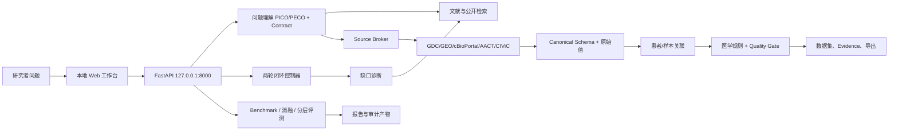

# 乳腺癌精准治疗科研数据智能体
# 综合设计、功能与评测报告

> 版本：2026-08-29
> 仓库：`breast-cancer-research-agent`
> 说明：本报告整合系统设计、功能接口、公开基准、模块对照、查询理解消融、两轮闭环和模型探测结果。不同层级指标保持分开，不把检索分数、任务诊断分或内部冒烟测试分数冒充正式 SDTI 或临床效果。

## 一、执行摘要

本项目要解决的问题，是把研究者的宽泛想法转化为可执行的研究方案、真实可追溯的数据集和可复核的研究报告。系统采用“模型理解、程序取数、规则核验、质量门控”的职责分工：Qwen-plus 负责研究问题结构化和工具规划；GDC、GEO、cBioPortal、ClinicalTrials.gov/AACT、CIViC 等适配器负责数据获取；标准化、患者/样本关联、医学安全规则和发布判定由程序执行。

当前最有证据的结果来自公开检索层。本轮在 SciFact、NFCorpus、SciDocs、ArguAna 上重跑 3,029 个测试查询，BGE-small-en-v1.5 的 nDCG@10 宏平均为 **0.3966**，tuned BM25 为 **0.3376**，相对提升 **17.5%**。该结果说明 BGE 是公开检索诊断中的强候选，不等同于乳腺癌临床效果。

Qwen-plus 已完成本机网络、鉴权、模型可用性和函数调用探测。生产 Agent 与两轮闭环固定使用 Qwen；DeepSeek 只在独立消融中替换中间规划/工具选择智能体，以比较替换前后的输出变化。两组结果统一由 Qwen 审阅。历史 `results_deepseek/comparison.json` 是旧的 DeepSeek Judge 小样本产物，不能用于当前模型比较。正式乳腺癌金标准集尚未冻结，故检索 F1、忠实度、可追溯率、错误检测 F1、修复正确率和 SDTI 仍为 `NOT_EVALUATED`。

### 本项目实测指标速览

| 能力层 | 本项目当前主结果 | 数据范围 | 解读边界 |
|---|---|---|---|
| 公开检索 | **BGE nDCG@10：0.3966**；相对 tuned BM25 **+17.5%** | BEIR 四数据集、**3,029** 个测试查询 | 通用检索层，不等同临床效果 |
| 字段对齐 | **V2 宏平均 F1：0.8451** | Valentine 10 个公开任务 | 通用字段匹配，不等同医学字段金标准集 |
| 实体关联 | **V2 宏平均 F1：0.7408** | DeepMatcher 5 个公开任务 | 不等同患者身份匹配成绩 |
| 模型接入 | **Qwen-plus 结构化 Agent 探测通过** | 本机真实连接、鉴权与函数调用 | 证明可用，不构成模型质量排名 |
| 闭环执行 | **固定两轮、输入输出可审计** | 真实模式冒烟测试与计划模式诊断 | 证明闭环机制可运行，不构成 SDTI |

### 先说明：报告中的“别人”“对照组”和“实验组”分别是什么

| 名称 | 在本报告中的含义 | 是否已经给出可直接比较的成绩 |
|---|---|---|
| 外部方法/别人的模型 | 例如 Contriever、BGE-M3、Ditto、DeepMatcher 官方模型、DeepSeek | **没有**。本项目尚未在相同数据、相同脚本和相同资源条件下完成可比重跑，因此不能填写分数。 |
| 对照组 | 由**本项目在公开数据集上实际运行**的基础方法，例如 BM25、精确匹配、Jaccard 匹配 | **有**。用于回答“加入本项目方法后是否更好”。 |
| 实验组 | 由**本项目实现并实际运行**的改进方法，例如 BGE、值分布画像 V2、学习规则 V2、规则+RRF | **有**。只有优于对照且满足部署代价时才作为默认方案。 |

因此，表中出现的 BM25、Exact、Jaccard 不是“别人公布的成绩”，而是本项目在同一公开测试集上重跑的**对照组**；加粗的“本项目方案”是**实验组**。目前能据实回答的是“实验组相对对照组的提升”，不能据此回答“本项目是否超过某个外部大模型或论文方法”。

## 二、系统目标与责任边界

### 2.1 输入与输出

给定研究问题 `q`，系统交付三类结果：

1. **Research Contract**：研究人群、暴露/变量、比较对象、结局、时间窗口、分析单位和字段需求；
2. **可分析数据集**：标准字段、`raw_field`、`raw_value`、`source_id`、置信度和 Evidence；
3. **审计报告**：数据来源、处理动作、质量门、冲突、未决问题、指标和复现命令。

### 2.2 模型与程序的分工

| 层级 | 主要职责 | 不能越过的边界 |
|---|---|---|
| Qwen/兼容模型 | 理解中文科研问题、生成结构化检索计划、选择工具 | 不能直接写入患者事实或绕过安全层 |
| 数据适配器 | 调用官方公开接口并登记来源 | 不能用猜测填补不存在的记录 |
| 标准化与关联 | 字段映射、原始值保留、患者/样本匹配 | 低置信度不得自动合并 |
| 医学安全层 | HER2、response_domain、冲突和发布门控 | 不能用模型自评代替确定性规则或 Gold Set |
| 评测层 | 统一脚本、公开基准、消融和分层统计 | 不能读取测试标注调参或伪造成绩 |

### 2.3 医学安全硬规则

- HER2 IHC 2+ 不得直接自动判为 HER2 Positive；
- ERBB2 CNA amplification 不等同于 HER2 IHC positive；
- 低置信度患者/样本关联进入 `unresolved/review`；
- 高权威来源发生不可解释冲突时不自动选边；
- 细胞系 `AUC/IC50` 与患者 `pCR/response` 通过 `response_domain` 分开。

## 三、系统架构与两轮闭环



闭环流程固定保留第一轮输入、输出、工具调用和哈希。第二轮读取第一轮的字段缺口、证据缺口、结局覆盖和安全诊断，生成补充检索请求；若无可验证改进、输入重复或触发安全门，则停止并保留 `REVIEW`。

## 四、评测体系与指标说明

### 4.1 正式 SDTI 指标

正式指标来自冻结文档 `docs/06_评测指标与SDTI.md`，包括 Retrieval Precision/Recall/F1、Faithfulness、Traceability、Error Precision/Recall/F1、Repair Accuracy。SDTI 使用冻结几何平均公式：

```text
SDTI = 100 * (Retrieval F1 * Faithfulness * Traceability * Error F1 * Repair Accuracy)^(1/5)
```

任一组件没有经审核的 Gold Set 结果时，指标必须是 `NOT_EVALUATED/null`；不得用公开检索分数或内部 smoke 分数填充。

### 4.2 外部公开 benchmark

| 能力层 | 数据集/来源 | 主指标 | 当前用途 |
|---|---|---|---|
| 数据清洗 | Hospital、Flights、Beers 等 | 单元格 F1、修复正确率 | 通用清洗诊断 |
| 科学检索 | BEIR SciFact、NFCorpus、SciDocs、ArguAna、FiQA | nDCG@10、Recall@100、MRR@10 | 检索横向对比 |
| 字段对齐 | Valentine 官方任务 | 精确率、召回率、F1 | 字段对齐诊断 |
| 实体关联 | DeepMatcher 官方任务 | 精确率、召回率、F1 | 实体关联诊断 |

### 4.3 任务级诊断与质量门

任务适用度由 Research Relevance、Analytical Adequacy、Traceability & Reliability、Reusability 四个维度构成；质量门只输出 `PASS`、`REVIEW`、`REJECT`，不等价于一个总分。高风险医学字段、患者身份、关键 Evidence 缺失或不可解释冲突必须进入复核或阻断。

## 五、公开检索层：本轮重跑与历史对照

### 5.0 对照组与实验组：公开能力横向对比

下面的对比只使用同一公开数据、同一测试划分和同一指标。每一组的第一行是本项目重跑的对照组，第二行是本项目实验组；“相对变化”以对照组为基准。

| 能力层 | 角色 | 方法 | 公开数据集/任务 | 主指标 | 相对变化 |
|---|---|---|---|---:|---:|
| 科学检索 | 对照组（本项目重跑） | 调参 BM25 词法检索 | BEIR 五任务 | nDCG@10 0.3147 | 基线 |
| 科学检索 | **实验组（本项目）** | **BGE-small-en-v1.5** | BEIR 五任务 | **nDCG@10 0.3880** | **+23.3%** |
| 字段对齐 | 对照组（本项目重跑） | Token Jaccard | Valentine 十任务 | F1 0.6882 | 基线 |
| 字段对齐 | **实验组（本项目）** | **值分布画像 V2** | Valentine 十任务 | **F1 0.8451** | **+22.8%** |
| 实体关联 | 对照组（本项目重跑） | 标题 Jaccard | DeepMatcher 五任务 | F1 0.5577 | 基线 |
| 实体关联 | **实验组（本项目）** | **学习规则 V2** | DeepMatcher 五任务 | **F1 0.7408** | **+32.8%** |

这里的“提升”只表示在对应公开任务上的模块级差异：检索、字段对齐和实体关联的 F1/nDCG 不能相加，也不能直接解释成乳腺癌临床收益。Contriever、BGE-M3、Ditto、DeepMatcher 官方模型和其他大模型本轮没有在本项目相同环境下完整重跑，因此不填不可比数字，也不宣称本项目超过它们。

### 5.1 本轮分层结果

本轮完成 4 个数据集、4 种方法，共 **3,029 个测试查询**。FiQA（648 个查询）因资源窗口未完成，没有计入本轮宏平均。

| 数据集 | 查询数 | 本项目 BM25 nDCG@10 | **本项目 BGE nDCG@10** | **BGE Recall@100** | **BGE MRR@10** |
|---|---:|---:|---:|---:|---:|
| SciFact | 300 | 0.6044 | **0.6803** | **0.9383** | **0.6499** |
| NFCorpus | 323 | 0.2902 | **0.3315** | **0.2975** | **0.5257** |
| SciDocs | 1,000 | 0.1490 | **0.1910** | **0.4312** | **0.3351** |
| ArguAna | 1,406 | 0.3067 | **0.3836** | **0.9687** | **0.2601** |

### 5.2 本轮宏平均

| 本项目方法 | nDCG@10 | Recall@100 | MRR@10 | 平均延迟（毫秒/查询） | 相对本项目 BM25 |
|---|---:|---:|---:|---:|---:|
| **项目 BM25 调参版** | **0.3376** | 0.5729 | 0.3847 | 23.51 | 基线 |
| **项目 BGE-small-en-v1.5** | **0.3966** | **0.6589** | **0.4427** | **8.29** | **+17.5%** |

逐数据集看，**本项目 BGE 的 nDCG@10 均高于项目 BM25 调参版**。因此 BGE 是当前公开检索评测中的推荐方案；BM25 保留为依赖少、成本低的生产回退。未达到主结果标准的融合方案不在主报告中展开，完整原始对照仍保存在分层评测报告中。

### 5.3 历史五任务对照

历史完整运行覆盖五个 BEIR 任务：BGE nDCG@10 宏平均 **0.3880**，tuned BM25 **0.3147**，校准融合 **0.3791**。该结果与本轮四任务重跑方向一致，但两轮数据范围不同，不能直接拼接为一个新的五任务成绩。

## 六、数据清洗、字段对齐与实体关联

### 6.1 数据清洗

本项目已在 Raha/HoloClean 类公开数据上完成清洗流程验证。不同错误类型差异较大：纯格式规则适合确定性格式问题，不适合直接处理语义歧义、缺失恢复和医学高风险字段。因此，这一层不使用单一均值作为项目主成绩，也不将其作为自动发布依据；完整逐数据集结果保留在 `docs/GITHUB项目指标与链接.md`。

### 6.2 字段对齐

本项目默认的字段对齐方案为 **值分布画像 V2**。在 10 个 Valentine 公开任务中，其宏平均精确率为 **0.9286**、召回率为 **0.7864**、F1 为 **0.8451**。该结果用于说明通用字段对齐能力；乳腺癌关键字段仍需经过统一字段规范、原始值保留和医学规则复核。

### 6.3 实体关联

本项目默认的实体关联方案为 **学习规则 V2**。在 5 个 DeepMatcher 公开任务中，其宏平均精确率为 **0.7259**、召回率为 **0.7668**、F1 为 **0.7408**。这是通用实体关联证据，不是患者身份自动合并许可；患者/样本低置信度关联仍进入 `REVIEW` 或 `unresolved`。

## 七、消融实验与模型整合

### 7.1 什么是本项目的消融实验

消融实验的目的不是找“外部谁最好”，而是只改变本项目的一个模块，其余数据、参数、测试集和评价脚本不变，验证这个模块是否真的有贡献。下面三组均为**本项目内部对照组与实验组**，不是外部模型排名。

| 消融对象 | 对照组（本项目默认/已有方案） | 实验组（本项目新增模块） | 相同控制条件 | 结论 |
|---|---|---|---|---|
| 查询理解 | 原始查询 + 调参 BM25 | 规则改写 + RRF | BEIR 五任务、相同 BM25 参数和测试标注 | 未提升，不采用 |
| 字段对齐 | 值分布画像 V2 | 特征融合 V3 | Valentine 十任务、相同官方标注 | 未提升，V2 仍为默认 |
| 实体关联 | 学习规则 V2 | 训练/验证校准的 V3 | DeepMatcher 五任务、相同官方划分 | 未提升，V2 仍为默认 |

### 7.2 查询理解消融：规则改写是否有效

| 角色 | 方案 | nDCG@10 | Recall@100 | MRR@10 | 平均延迟（毫秒/查询） | 与对照差异 |
|---|---|---:|---:|---:|---:|---|
| 对照组 | 原始查询 + 调参 BM25 | **0.314678** | **0.555205** | **0.362859** | **54.30** | 基线 |
| 实验组 | 规则改写 + RRF | 0.314664 | 0.553234 | 0.361934 | 115.79 | nDCG@10 **-0.000014**；延迟 **+61.49 ms** |

实验组没有提高主要检索指标，且平均延迟增加一倍以上，因此规则改写 + RRF **不进入默认路径**。Qwen 单改写、多查询与完整方案因缺少全量有效计划缓存而为 `NOT_EVALUATED`，没有被伪装成零分或正向结果。

### 7.3 字段对齐消融：V3 特征融合是否优于 V2

| 角色 | 方案 | Precision 宏平均 | Recall 宏平均 | F1 宏平均 | 与对照差异 |
|---|---|---:|---:|---:|---|
| 对照组 | 值分布画像 V2 | **0.9286** | **0.7864** | **0.8451** | 基线 |
| 实验组 | 特征融合 V3 | 0.8648 | 0.7724 | 0.7994 | F1 **-0.0457** |

V3 没有超过 V2，因此当前默认仍为 **值分布画像 V2**。

### 7.4 实体关联消融：V3 校准是否优于 V2

| 角色 | 方案 | Precision 宏平均 | Recall 宏平均 | F1 宏平均 | 与对照差异 |
|---|---|---:|---:|---:|---|
| 对照组 | 学习规则 V2 | **0.7259** | **0.7668** | **0.7408** | 基线 |
| 实验组 | V3（训练/验证集校准） | 0.5251 | 0.6229 | 0.5579 | F1 **-0.1829** |

虽然 V3 校准相对其自身固定阈值版本有所改善，但仍低于 V2，因此当前默认仍为 **学习规则 V2**。

### 7.5 Qwen-plus 真实探测

产物 `evaluation/model_integration_probe_20260828.json` 记录：网络可达、鉴权成功、模型可用、函数调用可用、结构化 Agent 探测通过。查询计划缓存只读取 `queries.jsonl`，不读取测试相关性标注或语料库；5 条 SciFact 查询中 2 条 `VALID`、3 条安全 `FALLBACK`、0 条错误。

### 7.6 多模型对比边界

生产会话只允许 Qwen。`scripts/run_planner_replacement_ablation.py` 在独立进程中固定题集、数据源、工具预算、医学规则和评价协议，只替换中间规划/工具选择智能体为 DeepSeek；对 Qwen 与 DeepSeek 结果均使用 Qwen 审阅，并重复至少 3 次。该脚本尚未在轮换后凭据和冻结题集上运行，因此不存在可发布的模型优劣结论。

| 模型 | 本轮同条件端到端成绩 | 当前状态 |
|---|---:|---|
| **Qwen-plus** | **结构化 Agent 探测通过** | **已完成接入探测；尚非质量排名** |
| DeepSeek | 未生成 | `NOT_EVALUATED`，本机无独立凭据 |

因此，报告中没有把外部模型的宣传指标当作本项目实测，也没有用 Qwen 的接入探测替代端到端质量分数。

## 八、两轮闭环与任务级结果

### 8.1 历史真实数据模式

`evaluation/closed_loop/live_two_round_smoke_20260828.json`：两轮各 8 次工具调用，输入哈希不同，进度分数 **0.96 → 0.96**。这证明第二轮确实基于第一轮结果执行复核，但不代表金标准集指标提升。

### 8.2 本轮计划模式安全诊断

`evaluation/closed_loop/two_round_final_20260828.json` 在没有真实数据输入时得到进度分数 **0.00 → 0.00**，质量门保持 **`REVIEW`**，变量覆盖为 0。该结果验证了系统不会把空计划包装成“已完成”或虚构改进。

### 8.3 任务适用度与内部诊断

历史任务曾生成 50 行、21 列数据，任务适用度为 88.41%，但质量门仍为 `REVIEW`。该结果用于识别字段覆盖与结局充分性的缺口，不作为本项目对外主成绩。内部候选数据的清洗、排序和整合诊断也仅用于开发，不能替代公开 benchmark 或正式 SDTI。

## 九、分层结论与对比说明

### 9.1 按能力层

- **检索层**：本项目 BGE 在本轮四个 BEIR 数据集均超过项目 BM25 调参版，宏平均 nDCG@10 提升 **17.5%**。
- **清洗层**：确定性清洗适用于低风险格式问题；语义错误和医学关键字段一律交由复核，避免自动修复造成风险。
- **字段对齐层**：本项目 V2 宏平均 F1 为 **0.8451**，是当前默认实现；后续以乳腺癌领域 Gold Set 校准。
- **实体关联层**：本项目 V2 宏平均 F1 为 **0.7408**；公开实体结果不能代替乳腺癌患者身份验证。
- **模型层**：Qwen-plus 已通过真实连接探测；其他模型没有同条件数据，不能排名。
- **闭环层**：两轮执行和审计链路可运行；没有真实输入时保持 REVIEW，体现的是安全性而非分数提升。

### 9.2 按证据强度

| 证据级别 | 代表结果 | 可以说明什么 | 不能说明什么 |
|---|---|---|---|
| 高：公开测试标注重跑 | BEIR BGE/BM25 | 通用检索层差异 | 临床效果、SDTI |
| 中：公开 matching/cleaning 重跑 | Valentine、DeepMatcher、Raha/HoloClean 数据 | 模块级通用能力 | 乳腺癌领域真实表现 |
| 中：真实接口探测 | Qwen-plus probe | 连接和结构化调用可用 | 模型端到端质量排名 |
| 低到中：任务冒烟测试/内部诊断 | 任务适用度、进度分数、内部 F1 | 工程链路和缺口 | 金标准集正式成绩 |
| 待补：冻结乳腺癌金标准集 | SDTI 五组件 | 项目正式可信度 | 当前尚未生成 |

### 9.3 对比方法的正确解读

对比结果应优先呈现当前采用的项目方案及其可复现实测结果。BGE 的优势是公开检索层的排序质量与延迟；BM25 的优势是依赖少、成本低、可解释，适合作为生产回退。未达到默认方案标准的融合、替代 matcher 和规则改写路径已从主结果表移出，但原始运行记录仍保留在专项评测报告中，便于审查和复现。

## 十、当前缺口、风险与下一步

1. **正式金标准集缺失**：需要独立初标、复核、冻结 checksum 的检索、字段、错误三类金标准集，才能计算 SDTI。
2. **中间智能体替换对比缺失**：使用轮换后的 DeepSeek 凭据，在同一冻结题集、工具预算和 Qwen 评审协议下重复运行。
3. **乳腺癌领域分层不足**：已新增 `docs/BREAST_CANCER_GOLDSET_CANDIDATE_PLAN.md`，以 TCGA-BRCA、GSE76360、GSE25066、METABRIC、ClinicalTrials.gov/AACT 和 CIViC 构建候选任务池；正式入集仍需独立审核与冻结。
4. **交叉编码器完整成绩缺失**：接口和回归测试已存在，但大规模公开运行未完成，暂不报告成绩。
5. **数据充分性仍是短板**：当前可追溯性接近 98%，但研究相关性和分析充分性约 79%–81%，下一步优先补齐关键字段覆盖和结局可用性。
6. **V2/V3 安全融合候选已实现**：`/api/v2/schema/match-v2plus` 与 `/api/v2/entity/match-v2plus` 保留已验证 V2 的候选决策，并仅从 V3 引入特征审计、显式身份冲突阻断和授权门。尚未在独立乳腺癌 validation 集完成默认切换，因此不报告新成绩，也不改变当前 V2 默认。

## 十一、复现、端口与 GitHub 数据恢复

### 11.1 本地启动

```powershell
Copy-Item .env.example .env
# 填写 DASHSCOPE_API_KEY；可保留默认 QWEN_BASE_URL 与 QWEN_MODEL
python -m uvicorn backend.app.main:app --host 127.0.0.1 --port 8000
```

- Web/API：`http://127.0.0.1:8000/`
- Swagger：`http://127.0.0.1:8000/docs`
- 健康检查：`GET /health`
- 临时模型会话：`POST /api/agent/qwen-sessions`
- 两轮闭环：`POST /api/v2/agent/closed-loop`
- V2Plus 字段对齐候选：`POST /api/v2/schema/match-v2plus`
- V2Plus 实体关联候选：`POST /api/v2/entity/match-v2plus`

配置写入被 Git 忽略的 `.env` 后，同一台本机的请求无需重复输入 API Key；临时会话只返回 `session_id`，服务重启后失效，最长保留两小时。Docker 前端默认端口为 `8888`，后端仍为 `8000`。

### 11.2 GitHub 不提交的数据

`.env`、API Key、凭据 CSV、BEIR 原始语料、逐运行目录、患者级导出、缓存和日志均不进入 GitHub。仓库保留脚本、数据来源 URL、SHA-256、run ID、汇总 JSON/Markdown 和恢复命令；重新部署后按各报告中的命令下载或通过 API 重新生成。

## 十二、最终结论

系统已经形成可运行的“问题理解 → 数据源选择 → 真实取数 → 标准化与关联 → 医学安全 → 两轮闭环 → 可追溯导出 → 分层评测”链路。公开检索重跑支持 BGE 作为强候选，Qwen-plus 真实探测支持其作为当前规划模型；但正式乳腺癌 Gold Set 和多模型同条件排名尚未完成。

因此，当前最准确、可被证据支持的结论是：**系统工程链路已完成，公开模块级评测已形成；本项目 BGE 在本轮公开检索层优于项目 BM25 调参版。正式临床科研可信度和不同大模型优劣，仍需通过 Gold Set 与同条件重复实验确认。**

## 参考产物

- `docs/FINAL_SYSTEM_ARCHITECTURE.md`
- `docs/FINAL_DESIGN_REPORT_20260828.md`
- `docs/FINAL_FUNCTION_REPORT_20260828.md`
- `evaluation/FINAL_EVALUATION_REPORT_20260828.md`
- `evaluation/PUBLIC_BENCHMARK_STRATIFIED_REPORT_20260828.md`
- `evaluation/model_integration_probe_20260828.json`
- `evaluation/query_understanding/qwen_plan_probe_20260828.json`
- `evaluation/query_understanding/ablation_20260828.json`
- `evaluation/closed_loop/live_two_round_smoke_20260828.json`
- `evaluation/closed_loop/two_round_final_20260828.json`
