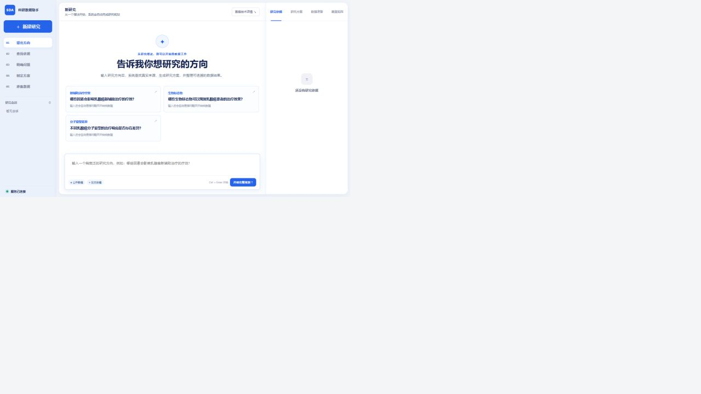

# 系统框图、流程图与截图索引（2026-08-30）

本页汇总最终交付中的视觉证据。图像均为仓库本地文件，可直接在 GitHub 预览；SVG 版本便于后续编辑，PNG 版本用于报告和演示。

## 1. 系统技术架构

- PNG：[system-architecture-v3.png](images/system-architecture-v3.png)
- SVG：[system-architecture-v3.svg](images/system-architecture-v3.svg)
- 内容：交互接入、智能体编排、真实数据源、处理治理和科研输出五层架构。

## 2. 端到端流程与质量闭环

- PNG：[system-workflow-v3.png](images/system-workflow-v3.png)
- SVG：[system-workflow-v3.svg](images/system-workflow-v3.svg)
- 内容：科研问题、ResearchSpec、工具选择、真实取数、标准化、实体融合、Evidence、四层质量门与 Gap 反馈。

## 3. 当前版本首页

该图在 2026-08-30 从本地 `127.0.0.1:8010` 实际运行页面截取。页面包含五阶段导航、研究方向示例、输入框、完整规划按钮和右侧详情区；截图时浏览器控制台无 error/warning。

## 4. 核心功能截图

| 截图 | 说明 |
|---|---|
| [01-planning-workspace.png](images/01-planning-workspace.png) | 科研规划工作台 |
| [02-qwen-connection.png](images/02-qwen-connection.png) | Qwen 临时会话与连接 |
| [03-api-console.png](images/03-api-console.png) | FastAPI/接口交互 |
| [04-research-dataset.png](images/04-research-dataset.png) | 患者/样本级科研数据表 |
| [05-quality-dashboard.png](images/05-quality-dashboard.png) | 质量看板与数据字典 |
| [06-raw-audit.png](images/06-raw-audit.png) | 原始字段审计 |
| [07-lineage.png](images/07-lineage.png) | 来源与 Evidence 追溯 |
| [02-user-workflow-mobile.png](images/02-user-workflow-mobile.png) | 移动端布局 |

## 5. 评测图表

图表由评测 `results.json` 生成，不在绘图脚本里手填成绩。四个模块使用不同数据与指标，只能逐行比较。

## 6. 图像验收

| 检查 | 结果 |
|---|---|
| 架构图 | 2400 x 1350，PNG/SVG 均存在，文字可读 |
| 流程图 | 2400 x 1350，PNG/SVG 均存在，闭环箭头完整 |
| 核心桌面截图 | 1265 x 712 或 1600 x 1050，页面内容完整 |
| 移动端截图 | 390 x 844，无关键内容重叠 |
| 当前首页截图 | 1280 x 720，与本次未提交前端版本一致 |
| 评测图表 | 数据标签与报告数字一致 |
