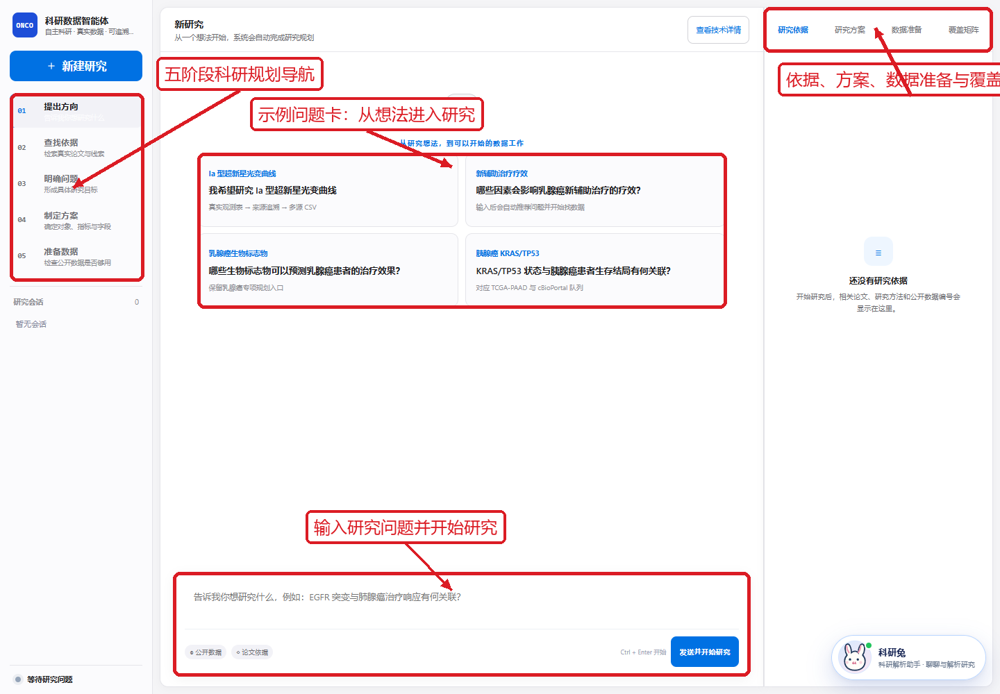
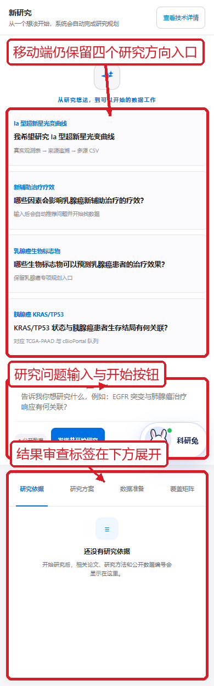

# 前端恢复与验收分析报告

检查时间：2026-09-06（Asia/Shanghai）

## 1. 结论

本次按“恢复以前的研究工作台”处理：根地址 `/` 默认打开用户截图中的原有“新研究 / 提出方向”规划首页，保留熟悉的三栏科研工作台形态；不协调的 v31 自主运行工作区从当前产品导航撤下：

- 左侧：ONCO 品牌、新建研究、当前研究阶段与研究会话
- 中间：新研究、研究问题输入、方向示例与开始研究入口
- 右侧：研究依据、研究方案、数据准备、覆盖矩阵

原有报告、CSV、Metadata、Quality、Evidence Graph、Source Lineage 和后端科研能力均保留。根目录不再自动跳转到 v31，默认首页也不主动请求健康检查接口；用户提交研究问题后才沿用已有规划接口。v31 页面及其后端能力暂不删除，但不再从当前前端导航暴露入口。

## 1.1 当前入口截图

以下截图按恢复后的根地址重新采集（2026-09-06），红框、箭头和中文说明用于标出页面分区；它们只说明当前前端入口，不代表已经完成一次真实数据运行。





## 2. 本次变更范围

已调整：

1. `frontend/index.html`
   - 移除根地址自动跳转到 `/v31/#/workspace` 的脚本，让原有规划首页成为默认入口。
   - 保留原根目录工作台源码；移除进入 v31 的导航入口，首页加载不执行健康检查请求。
   - 保留原有单句研究输入、自动推进视觉、许愿兔和数据血缘相关源码，避免无必要删除能力。

2. `frontend/app.js`
   - 保留根目录兼容工作台的运行逻辑。

3. `frontend/v31/index.html`
   - 恢复旧工作台顶部副标题为“自主研究 · 真实数据 · 可追溯证据”。

4. 测试契约
   - 入口测试明确默认规划首页、无根地址重定向、无“蓝色后台”/“返回蓝色工作台”残留和 v31 导航入口。

未调整：

- `backend/app/` 生产业务代码
- 现有 API 路由和接口字段
- `configs/canonical_schema.yaml`
- `configs/medical_rules.yaml`
- `configs/quality_rules.yaml`
- 报告内容、真实数据资产和后端 session 设计

## 3. 已验证的功能路径

### 根入口与页面形态

- `http://127.0.0.1:8891/` HTTP 200。
- 浏览器实际打开根地址后停留在原有规划首页，不再自动跳转到 v31。
- 页面展示“新研究”、五阶段规划导航、研究示例卡片和“发送并开始研究”输入入口。
- 首页初始加载不请求 `/health`；只有提交研究问题后才进入已有后端规划流程。
- 直接访问 v31 的路由能力和历史资产未删除，但默认首页及其他当前导航不再提供入口。
- 没有删除报告、数据资产或旧页面源码。

### 单句自主运行

使用“我想研究 Ia 型超新星光变曲线”示例：

- 不进入连续确认流程。
- 可直接创建 Research Run。
- 预览运行显示“研究预览完成 · 尚未生成数据”。
- 预览态没有冒充真实数据资产。
- 运行页面保留原始问题、研究结果、数据血缘区域和追问入口。

### 追问与上下文隔离

- “为什么选择这个来源？”可以在当前 Run 内提交。
- 回复仍显示在当前研究窗口，URL、研究简报和运行结果不漂移。
- 新建 HER2 研究后，HER2 运行结果区不包含 Ia 型超新星内容。
- 切回 Ia 研究后，结果区不包含 HER2 内容。
- 技术详情为折叠区域，展开后可查看 `research_id`、`run_id`、`session_id`、`status`、`result_level`、`execution_mode`、`model_mode`、`constraints` 和 `route`。

### 真实数据资产与血缘

已有真实运行实际检查到：

- 观测数据 CSV：5,485 行。
- Evidence Graph：可渲染 SVG，包含 `derived_from` 关系。
- Source Lineage：显示官方来源入口、访问信息和 SHA-256。
- 真实运行结果中保留 CSV、Metadata、Quality、Evidence Graph、Source Lineage 资产入口。

另外通过后端下载接口逐个做了资产级校验：5 个资产均返回 HTTP 200，实际字节数与 Metadata 一致，SHA-256 全部匹配；CSV 实际为 5,485 行、37,782,341 bytes。

## 4. 测试结果

### 前端 Node 测试

执行：

```text
node --test frontend/tests/kernel-lab.test.cjs frontend/tests/planner-sessions.test.cjs frontend/tests/astronomy.test.cjs frontend/v31/tests/research-lineage.test.mjs frontend/v31/tests/run-view.test.mjs frontend/v31/tests/legacy-isolation.test.mjs
```

结果：`33 passed, 0 failed`。

覆盖内容包括：

- 截图所示规划首页默认入口
- 单句自主运行与 fallback
- 研究历史和运行上下文隔离
- 并发/迟到响应不能覆盖其他研究
- 空资产不显示虚假成功状态
- Evidence Graph 与 Source Lineage 渲染
- 原始字段、原始值和溯源保留
- 外部链接安全过滤
- 医学独立数据表不被错误合并

### v31 壳层测试

执行：

```text
pytest -q backend/tests/v31_frontend/test_phase0_shell.py
```

结果：`8 passed`。

### 后端全量回归

执行：

```text
pytest --override-ini addopts="" -q
```

结果：

```text
746 passed, 10 skipped, 2 warnings
```

耗时约 160.46 秒。两个警告均为依赖/运行时弃用提醒，不是本次页面改动造成的功能失败：

- Starlette TestClient 对 `httpx` 的弃用提示。
- Python `load_module()` 的弃用提示。

### 浏览器验收

仓库原有 Playwright 脚本起初因 Node 环境缺少 `playwright` 模块无法启动。为完成验收，本次仅在 `tmp/playwright-test-runtime` 临时安装测试运行时，没有写入项目依赖或生产代码。

自动化浏览器验收全部通过：

- 首页静态入口 smoke test：规划首页可见、5 个阶段可见、问题输入和“发送并开始研究”可见，未发生 v31 重定向，首屏 API 请求数为 0。
- `workspace-browser.cjs`：9 个检查通过，页面错误 0；覆盖根入口、单句预览、追问、研究隔离、反馈修正、迟到响应隔离、旧导航移除和 390px 无横向溢出。
- `asset-browser.cjs`：3 个检查通过，覆盖键盘跳转、Metadata 原始文件下载与哈希、HER2 独立表格和复核状态。
- `materials-browser.cjs`：6 个检查通过，覆盖真实 PDF 上传、20/43 页读取边界、论文/图像关联、未勾选图像分析、材料隔离和页面错误 0。

因此，桌面主流程、移动端宽度、交互路径、材料页面和资产下载完整性均已验证。下载字节级断言同时通过独立 HTTP 校验完成。

## 5. 风险与漏洞分析

以下是本次检查发现的风险，按影响排序。它们不都属于本次引入的回归。

### P1：当前工作区是本机/进程级边界，不是多用户权限边界

后端 workspace 目前依赖本地目录和进程内 session。若直接部署到多用户环境，需要额外的认证、授权和租户隔离；否则不同用户可能共享可访问的研究历史或临时模型会话。

建议：正式部署前增加用户身份到 `research_id/session_id` 的授权校验，并对下载资产、研究历史和模型连接分别做权限测试。本次未修改后端，也未声称已经具备多用户安全隔离。

### P1：模型凭据生命周期依赖进程内存

当前产品约定是模型凭据临时保存在后端内存、服务重启失效，不写入结果文件。该策略降低了持久化泄露风险，但也意味着重启后需要重新配置，且部署层日志、反向代理和错误追踪系统仍需确认不会记录敏感字段。

建议：上线前做日志脱敏、请求体审计和凭据回收测试。

### P2：保留的旧页面需要单独退役评估

当前根地址只暴露截图所示的规划首页；v31 文件和后端能力暂时保留，但没有从当前导航进入。这样不会破坏已有报告、数据资产和测试，同时避免用户在主产品中看到不协调的第三套页面。

这属于产品导航风险，不是权限绕过或数据安全问题。若未来确认 v31 永久下线，应另行删除路由、静态资源和对应测试；本次没有做不可逆删除。

### P2：研究历史列表增长后的可用性风险

当前左侧历史列表会显示大量运行记录。数据量继续增长后，用户会遇到查找困难、页面变长和重复研究难以区分的问题。

建议：增加搜索、按研究对象过滤、按最近运行/数据资产状态排序、归档和版本标签。应复用现有接口，不先复制一套新状态系统。

### P2：自动化浏览器验收依赖未声明

本次通过临时目录安装 Playwright 后已完成自动化验收，但仓库没有正式的 Node `package.json`/锁文件来声明该测试依赖。若换机器直接执行浏览器脚本，仍可能遇到模块缺失。

建议：后续将 Playwright 作为明确的开发测试依赖，锁定浏览器版本并在 CI 中执行；本次临时安装没有写入项目依赖。

### P3：真实数据发布仍需要来源新鲜度检查

已有资产带有来源和哈希，能支持可追溯复核；但公开数据源可能更新、限流或暂时不可用。缓存回放必须持续显示原始采集时间，不能被误解为本次实时联网。

建议：增加来源健康检查、最后成功获取时间和失败原因展示，并把实时获取与缓存回放继续严格区分。

### 已检查的前端安全边界

- 当前不再从根首页暴露 v31 入口；v31 Research Run 主路径仍未调用旧 `/api/v30/` 业务接口。仓库保留旧的 Copilot/Graph 页面和 API 模块源码，后续如需彻底下线应单独做退役评估。
- 用户可见原始字段、原始值和外部来源链接经过展示层处理。
- Evidence Graph 和 Source Lineage 对不安全链接、HTML 文本有单元测试覆盖。
- 空结果、预览结果、失败结果不会使用真实数据成功样式。
- 本次没有修改冻结配置、医学规则或生产后端。

说明：以上是代码和主流程层面的风险检查，不等同于完整的 SAST、DAST、依赖漏洞扫描或多用户渗透测试。

## 6. 可改进功能预览（本次未实现）

### A. 旧版工作台上的轻量智能入口

在当前规划首页增加一条紧凑的“自动找真实数据”快捷入口，保持旧页面信息密度，不再引入新的主导航。示例问题、来源和运行模式直接复用现有 Research Run 创建逻辑。

### B. 血缘图高级查看

在当前 Source Lineage 卡片上增加：

- 来源、原始表、标准化数据集、输出资产的筛选
- 点击节点查看字段级证据
- 只显示影响某个 CSV 字段的路径
- 变化版本之间的 lineage diff

核心关系仍必须来自真实后端资产，不能在前端猜测 join。

### C. 研究运行版本对比

允许用户对比原运行和反馈修正版运行：

- 来源是否变化
- 字段映射是否变化
- 行数和质量检查是否变化
- 哪些风险被关闭、哪些风险仍未解决

### D. 数据资产交付中心

在现有资产页面上增加“交付包”视图，集中展示：

- CSV
- Metadata
- Quality Report
- Evidence Graph
- Source Lineage
- 引用与 acknowledgement 文本

下载前显示文件哈希和采集时间，方便比赛演示与科研复用。

### E. 运行可解释性与来源新鲜度

保留技术详情折叠原则，只在用户主动展开时显示 route、retrieval_status、constraints、evidence 等信息；普通用户看到简洁进展，评委和研究者可以进入技术审计层。

### F. 测试基础设施

补齐 Playwright 依赖后，固定执行：

- 桌面主流程
- 预览与实时运行分支
- 追问与反馈修正
- 多研究切换隔离
- 真实资产下载与 SHA-256
- Evidence Graph/Source Lineage
- 390px 移动端无横向溢出
- 页面错误和旧 API 禁止调用

## 7. 进入下一阶段的建议

当前页面恢复和既有能力衔接可以进入比赛演示准备阶段。下一步优先级建议为：

1. 将 Playwright 测试依赖正式化，避免换环境后浏览器验收不可复现。
2. 清理或归档验收过程中创建的本地测试研究，避免演示时历史列表过长。
3. 选定一个真实 Ia 光变曲线运行作为演示基线，固定 CSV、Metadata、Graph、Lineage 的哈希。
4. 再做一次部署环境的日志脱敏和多用户边界审计。
5. 最后再考虑历史搜索和血缘图增强，不改变当前旧版主布局。
