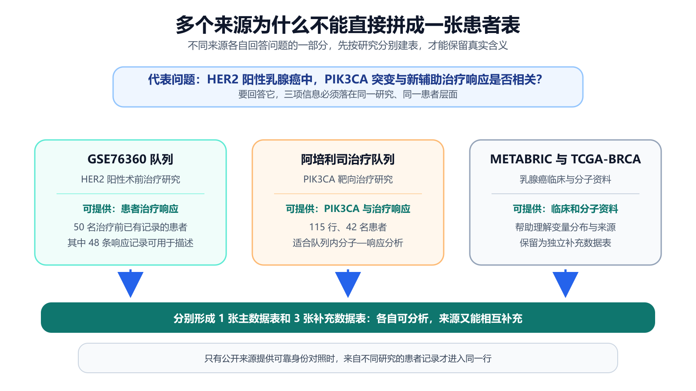
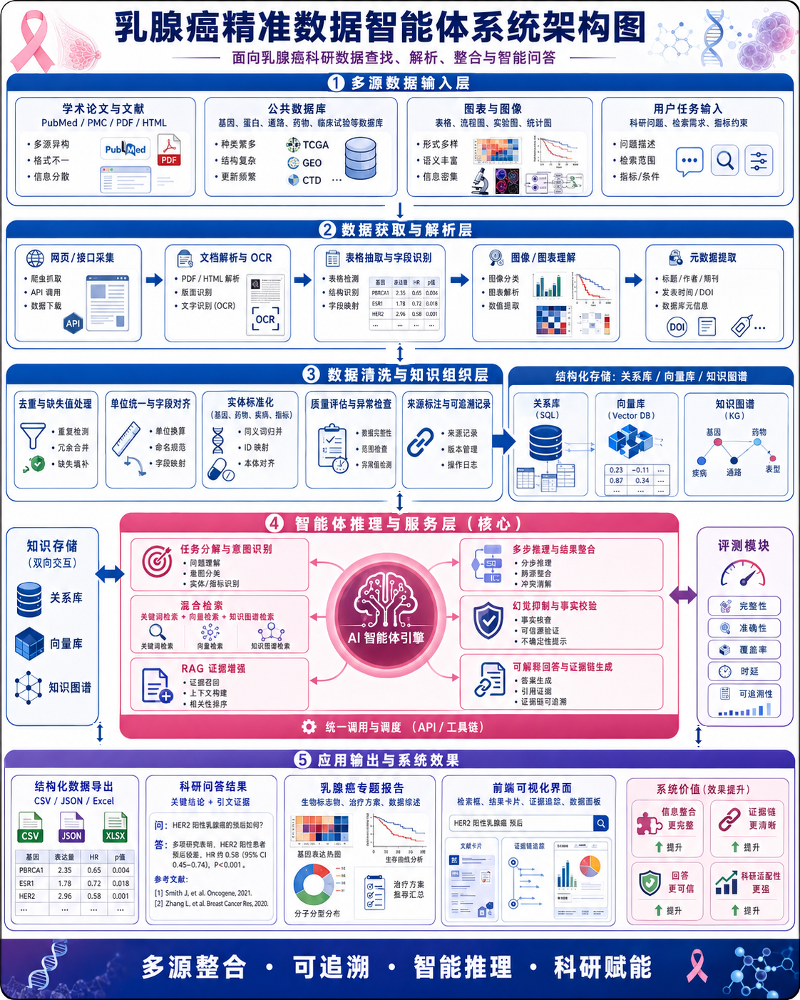
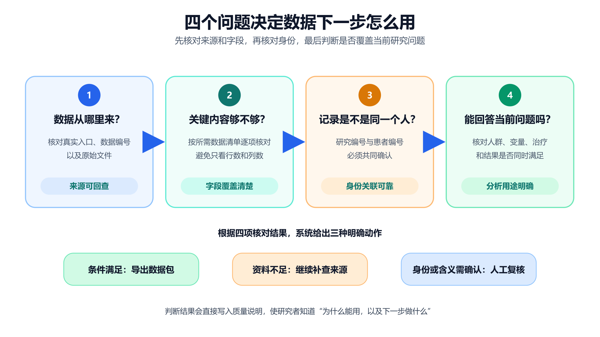
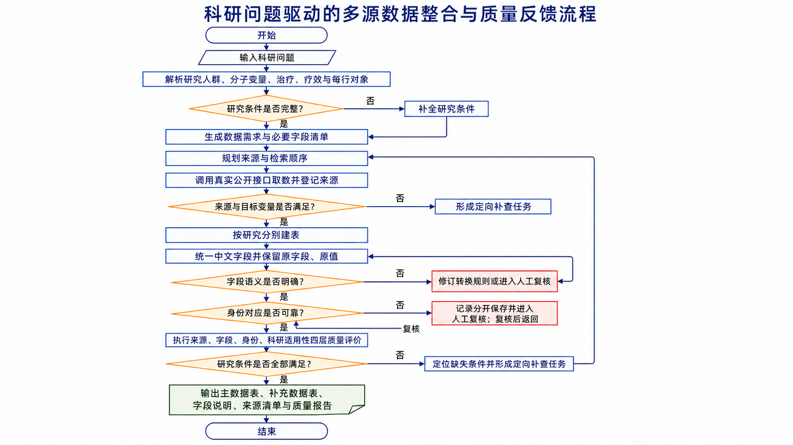
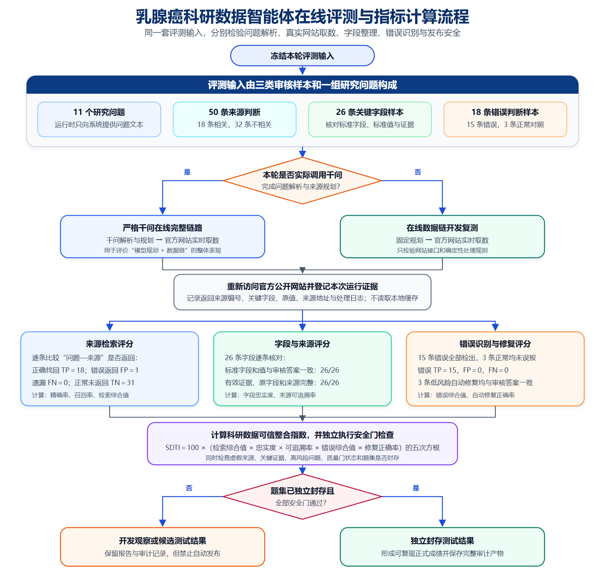
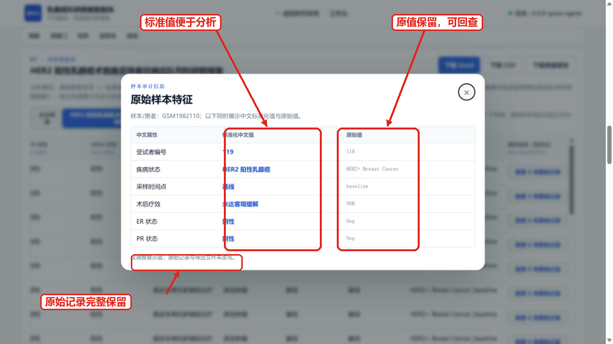
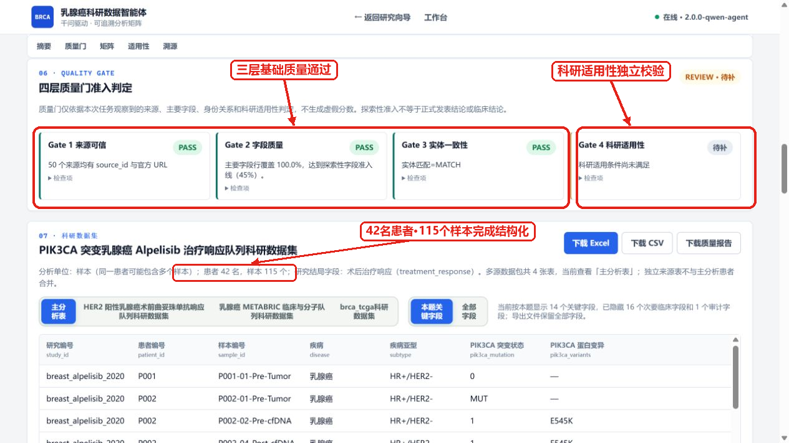
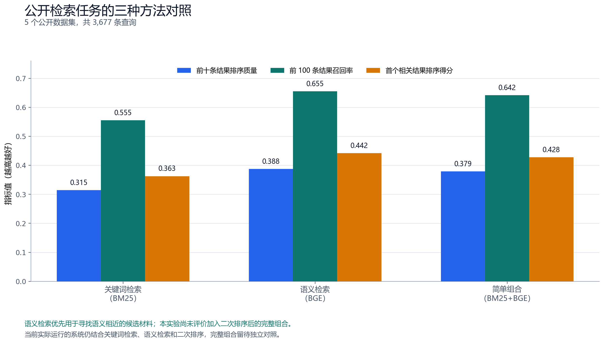
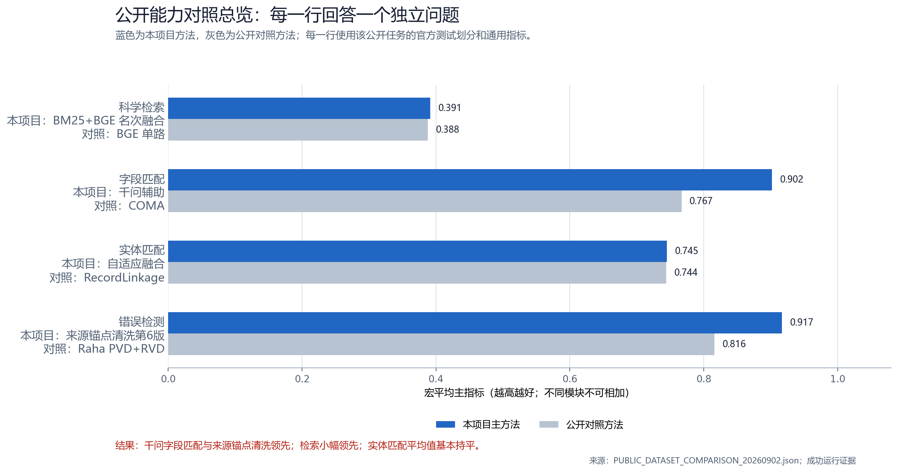
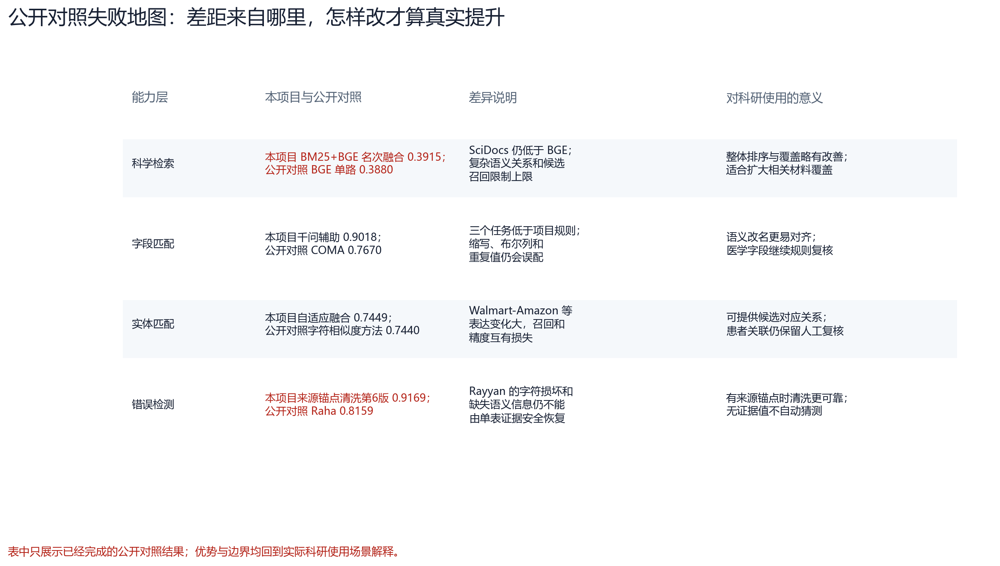

# 从科研问题到可用数据：乳腺癌精准治疗科研数据智能体的设计与验证

> 参赛方向：方向 1“科学数据整合与影响力分析应用”·A“科学数据查找、解析与整合”  
> 项目名称：乳腺癌精准治疗科研数据智能体  
> 数据场景：乳腺癌公开科研数据的查找、解析、整理、核对与复用  
> 文档版本：2026-09-03（在线架构与评测结果修订版）
> 结果口径：在线公开数据源验证、千问全链路验证、规则开发复测、单因素模型对照和公开检索对照分别报告，不将不同运行条件下的数值混作同一成绩。

## 参赛作品简介（300 字内）

乳腺癌精准治疗研究需要联合患者、基因变异、治疗和疗效数据，但资料分散在论文及多个公开数据库中，字段写法和患者编号也不统一。本作品先把自然语言问题整理成数据需求清单，再从真实来源取得记录并按研究分别建表。系统为每行记录登记来源，并在已接入原始说明的来源上同时展示中文标准值和原始值。代表任务完成 2 轮、6 次真实工具调用，登记 50 条来源记录，形成 1 张主数据表和 3 张补充数据表；在 GSE76360 研究中得到 50 名治疗前已有记录的患者和 48 条有效疗效记录。系统最终交付数据表、字段说明、来源清单和质量说明，使数据来源、处理依据、适用范围及后续补查条件均可核查。

## 摘要

方向 1A 要求参赛作品把科研人员提出的问题转化为可分析、可追溯、可复用的数据。以“研究 HER2 阳性乳腺癌中 PIK3CA 突变与手术前治疗效果（下文简称‘疗效’）的关系”为例，真正需要交付的不是一段医学知识，而是一份同时包含目标人群、基因变异、治疗、疗效和患者身份的数据表。查找论文和数据库登记信息后发现，GSE76360 研究提供 HER2 阳性患者的术前疗效，METABRIC 研究提供 PIK3CA 与临床资料，阿培利司（一种乳腺癌靶向药）治疗研究同时提供 PIK3CA 与疗效。虽然这些来源能够相互补充，但它们来自不同研究中的患者组（医学研究中称为“队列”），患者编号和疗效定义并不通用，因此不能只凭主题相近直接拼接。

基于这一发现，本文建立“明确所需数据—查找文献和数据编号—从真实入口取数—按研究建表—统一字段并登记来源—核对患者身份—判断能否回答问题—输出数据包”的完整流程。千问负责理解问题和安排查找顺序，固定数据接口（即按预先规则连接公开数据库的取数程序）负责取得真实记录，规则程序负责字段整理、编号核对、来源登记和医学安全检查。在已经取得原始样本说明的来源上，系统还把中文标准值和数据库原始值并排展示。当前证据不能支持下一步时，系统把缺少的条件写成新的查找任务，不用生成内容补写患者事实。

代表任务实测完成 2 轮采集和 6/6 次工具调用，登记 50 条来源记录，形成 1 张主数据表与 3 张补充数据表。主数据表含 115 行、31 列和 42 名患者；GSE76360 补充表含 50 名 HER2 阳性且治疗前已有记录的患者，其中 48 条疗效记录能够用于患者组内的疗效构成描述。逐项核对后，系统进一步把下一步工作收束为“查找同一 GSE76360 队列的 PIK3CA 分子附件，或寻找同时包含 HER2、PIK3CA 和患者疗效的新队列”。由此，代表任务先验证了系统能否形成可核对的数据包；在此基础上，版本复测和单因素对照再判断系统是否改进，以及为什么采用当前模型与检索组合。

进一步检查在线检索链发现，影响召回率的主要因素并非数据完全不存在，而是大型 GEO 文件超过原下载上限、DepMap 门户返回网页验证页，以及研究计划二次排序时遗漏了基础字段所需来源。针对上述问题，系统分别扩大经校验文件的下载范围、改用 DepMap 官方 Figshare 发布入口，并规定研究计划只能补充而不能删除基础字段覆盖来源。随后，在未读取本地缓存的实时网站检查中，GDC、GEO、cBioPortal、ClinicalTrials.gov 和 CIViC 五个结构化数据主链入口全部可访问；Europe PMC 当次返回 504，因其只承担文献发现而不提供患者级事实，故退出该轮必需来源，不影响结构化取数。基于 11 个问题、50 条来源判断的候选开发题集复测，在线数据链得到 18 个相关来源全部找回、1 个额外候选的结果，对应精确率 94.74%、召回率 100.00% 和检索综合值 97.30%。在此基础上，最新严格千问在线候选复测对 11 个问题全部实际调用千问且未使用确定性兜底，得到 15 个正确找回、0 个错误返回和 3 个遗漏，对应精确率 100.00%、召回率 83.33% 和检索综合值 90.91%；按五项核心质量指标计算的 SDTI 为 98.1118。该结果说明，规则保底负责守住问题所需来源，千问负责理解自然语言和安排补充检索，两者协同后既没有用无关来源换取覆盖，又将召回率保持在 80% 档以上；由于该候选题集参与过开发，后续仍需在新的封存题集上独立复验。

**关键词：** 人工智能驱动科学研究；科学数据整合；乳腺癌；患者与样本关联；数据来源追踪；质量检查

---

## 评审导读：先用三分钟看懂作品

### 我们面对的真实问题

乳腺癌精准治疗研究并不是“问模型一个问题、得到一段答案”这么简单。研究者往往需要同时找到目标人群、分子变异、治疗阶段和疗效记录，而这些内容分散在论文、公共数据库和不同格式的附件中。同一个字段可能有多种写法，同一个患者也可能有多份样本；如果只按关键词拼接，容易把不同研究中的患者误认为同一人，也容易把模型生成的解释误当成真实数据。

### 我们实际做了什么

本作品把一句自然语言科研问题变成一份可以执行的研究条件清单，再沿着“问题解析—来源查找—真实取数—数据清洗—字段统一—患者与样本核对—证据回查—研究用途判断”的顺序形成数据包。千问负责理解问题、安排查找顺序和辅助解释字段；知识图谱负责固定研究对象、基因、治疗、疗效和来源之间的关系；检索到的论文段落、数据库说明和字段原值会被带回后续整理，作为回答和判断的依据。固定接口和规则程序负责取得真实记录、保存原始值、检查医学边界，并阻止没有身份或来源依据的患者关联。这样，模型负责提高查找和整理效率，关键事实仍然回到公开来源和可核验记录。

### 我们做得怎么样

下表是本轮公开数据集统一复测的核心对照。每一行都明确写出测试数据、两种方法、结果和差值。五个公开数据集并不是同一个任务，因此不能把五个分数相加；但在每个任务内部，双方使用相同测试数据和同一评价方法，结果可以直接比较。

| 能力 | 测试数据与指标 | **本项目方法及结果** | **对照方法及结果** | 差值与直接结论 |
|---|---|---|---|---|
| 问题解析 | EBM-NLP 专业测试集；研究对象、干预、结局的平均片段 F1 | **序列特征解析（第4版）：0.5522** | 本项目词典方法（第2版）：0.4662 | **+0.0860**；更能找准研究条件的范围，但治疗方案边界仍不稳定 |
| 科学检索 | BEIR 五任务、3,677 条查询；前十条排序、前一百条召回、首个命中位置 | **BGE 初检索 + 交叉编码器重排：0.3920 / 0.6554 / 0.4504** | BGE 单路：0.3880 / 0.6554 / 0.4421 | **+0.0040 / 0 / +0.0083**；主要改善前排位置，没有扩大候选范围 |
| 字段匹配 | Valentine 十项任务；字段对齐 F1 | **千问辅助字段匹配：0.9018** | 项目原字段匹配：0.7994；公开 COMA：0.7670 | 相对项目原方法 **+0.1024**，相对 COMA **+0.1348**；语义改名场景提升明显 |
| 实体匹配 | DeepMatcher 五项测试任务；实体匹配 F1 | **本项目自适应融合：0.7449** | RecordLinkage：0.7440 | **+0.0009**；总体持平，不足以支持跨研究自动合并患者 |
| 数据清洗 | Raha/HoloClean 六项任务；错误单元 F1 | **来源锚点清洗（第6版）：0.9169**（六项） | Raha PVD+RVD：0.8159（五项共同任务） | 五项共同任务为 **0.9029 对 0.8159，+0.0870**；第六项无完整对照，另行列出 |

这些结果同时说明了作品的优势边界：字段语义改名、特定来源约束和表内可验证错误可以明显改善；通用复杂检索、干预 span 边界和缺少身份线索的实体匹配仍需要专门模型或人工复核。正式乳腺癌任务中的千问在线链路也单独记录，不与公开模块分数合并。

### 这些结果对科研工作有什么帮助

表中的分数不是一个笼统的“模型准确率”。每个指标只评价一段明确能力，只有把分数放回原始科研问题，才能判断系统是否真的有用。

| 结果 | 这个指标在检查什么 | 对本项目的实际意义 | 对乳腺癌科研工作的帮助 |
|---:|---|---|---|
| 问题解析平均片段 F1 **0.5522** | 研究对象、治疗和结局的文字范围是否找对 | 比第2版提高 **0.0860**，说明问题拆解更完整 | 减少把“治疗方案、治疗阶段、疗效”混在一起，让后续查找围绕正确条件展开 |
| 检索前十条排序 **0.3920** | 相关论文和数据说明是否排在前面 | 比 BGE 单路提高 **0.0040**；提升集中在排序，不是覆盖 | 研究者更快看到有用材料，但候选池遗漏仍要靠补充查找解决 |
| 字段对齐 F1 **0.9018** | 两张表中不同列名是否表达同一含义 | 比项目原方法提高 **0.1024**，千问对缩写和语义改名更有帮助 | 减少 HER2、ERBB2、疗效等字段因写法不同而漏配；检测方法不同仍不能强行合并 |
| 实体匹配 F1 **0.7449** | 两条记录是否可以认为属于同一实体 | 与 RecordLinkage 基本持平，说明只能提供候选 | 患者关联仍必须依靠研究编号、患者编号、样本编号和来源证据，低置信度进入复核 |
| 错误单元 F1 **0.9169** | 找出的错误和修复后的值是否正确 | 来源锚点对可由重复记录验证的错误效果明显 | 减少编号、重复记录和可验证缺失对统计的影响；无法从表内证明的字符损坏不自动猜测 |

因此，字段匹配和清洗中的高分，说明系统在“看懂列名”和“利用表内证据修复错误”方面已经具有较好的工程可用性；它不等于临床预测准确率，也不等于已经证明 PIK3CA 能预测某位患者的疗效。对本项目更重要的价值是：每条记录都能说明来自哪里、是否属于同一研究、哪些条件还没有在同一患者上同时成立，从而避免把数据整理错误写成医学结论。

### 这些能力怎样服务原始研究问题

代表问题要求在同一研究和同一患者范围内同时具备 HER2、PIK3CA、新辅助治疗和疗效。各指标在这条链上的作用不同：

| 原始问题中的风险 | 对应结果 | 能解决的实际问题 | 仍需注意的边界 |
|---|---|---|---|
| 不知道先找哪些来源 | 问题解析和检索结果 | 把“研究谁、看什么治疗、观察什么疗效”拆成可执行的查找条件，并把相关材料排到前面 | 不能证明不同来源中的患者属于同一人 |
| 字段名称和检测方法不一致 | 字段对齐 F1 **0.9018**，字段忠实度 **1.0000** | 不同数据库的列名更容易对齐，原始医学含义仍被保留 | HER2 IHC 2+ 不自动改成阳性；ERBB2 基因拷贝数变化也不等于 HER2 检测阳性 |
| 患者编号相同但研究不同 | 实体匹配 F1 **0.7449**，研究—患者—样本三级核对 | 找到可能对应的记录，同时把证据不足的记录挡在复核环节 | 通用实体匹配分数不能替代患者级身份对应证明 |
| 清洗时把真实值改错 | 错误单元 F1 **0.9169**，修复正确率和来源锚点 | 表内有重复来源依据时可以修复；没有依据时保留原值并标记待核对 | 字符损坏、缺失语义和真实时间变化仍需人工核对 |
| 回答看似完整但没有依据 | 字段忠实度、来源可追溯率均为 **1.0000** | 关键值能够回到来源编号、原字段、原值和链接 | 不能仅凭高分宣称临床有效性或因果关系 |

这就是本作品符合 AI for Data 的地方：人工智能参与“理解、发现、组织和解释”，而数据是否真实、是否可连接、是否适合研究，则由公开来源、结构化字段、来源记录和医学安全规则共同约束。最终交付的是可以继续统计、复核和补查的数据，而不是一段脱离证据的生成文本。

## 一、背景与问题（赛题理解）

### 1.1 AI for Science：从“生成答案”走向“形成证据”

人工智能驱动科学研究（AI for Science）能够辅助研究问题解析、资料发现与证据整理。然而，在科学数据整合场景中，文字回答并不能替代结构化科研数据：若缺少来源、处理过程和记录身份，所得内容既无法复核，也不能直接进入统计分析。因此，本方向的核心交付不是单次问答，而是能够被检查、复用和修正的结构化数据包。

已有研究把可复用科研数据的基本要求概括为找得到、取得到、看得懂和能再次使用[1]；数据来源追踪规范进一步指出，评价数据是否可信，需要记录数据、处理活动和责任主体之间的关系[2]。据此，本文将赛题要求转化为四项可审计判据：数据来源是否明确，处理过程是否保留，记录关联是否有身份依据，以及输出结果是否具有确定的分析范围。

*图 1 页面以疾病、研究人群、关键分子变量、疗效和必需字段界定取数范围，并显示代表任务采用确定性规划，形成 115 行 × 31 列分析矩阵。*

从图 1 可以看出，系统先将疾病、人群、分子变量、疗效和必需字段固定为统一任务条件，再进入取数与建表。由此，115 行、31 列能够返回具体研究问题解释，而不是脱离任务口径的数据规模。基于这一机制，本文将系统目标界定为：输入乳腺癌科研需求，输出每行对象明确、真实来源可查、处理过程可核、质量状态清楚且复用范围确定的结构化数据。

### 1.2 医学研究中的真实需求：结果必须落到患者和样本

乳腺癌精准治疗中的分子—疗效分析要求目标人群、分子变量、治疗阶段和疗效落在同一患者层面。基于这一条件，本文选取以下问题作为代表性研究任务：

> **研究 HER2 阳性乳腺癌中 PIK3CA 突变与新辅助治疗疗效的关系，并整理患者级科研数据集。**

其中，HER2 是乳腺癌分型的重要指标，PIK3CA 是乳腺癌中常见的变异基因；新辅助治疗是手术前进行的治疗，疗效则表示患者经过治疗后达到的效果。分析这一问题时，HER2 阳性限定研究对象，PIK3CA 突变构成分子变量，新辅助治疗限定治疗阶段，疗效构成结果变量。若任一条件缺失，所得记录只能支持局部描述，不能构成患者级分子—疗效关联分析。因此，四项信息必须同时落在同一研究、同一患者上。

据此，本文把一行数据定义为“同一研究中的一名患者及其可追溯样本”，并形成表 1 所示的数据需求清单。

**表 1 代表问题的所需数据与核对依据**

| 要回答的问题 | 必要内容 | 每行如何理解 | 为什么必须核对 |
|---|---|---|---|
| 记录来自哪项研究 | 研究编号、数据库编号 | 患者编号只在所属研究中解释 | 防止不同研究使用相同编号时误认患者 |
| 记录对应谁、哪份样本 | 患者编号、样本编号 | 一名患者可能对应多份样本 | 识别同患者多样本，避免重复统计 |
| 是否属于目标人群 | 乳腺癌、HER2 状态和检测方法 | HER2 阳性患者 | 保证研究对象与问题一致 |
| 是否具有目标分子变量 | PIK3CA 突变状态和位点 | 同患者或同样本检测结果 | 保证分子变量能够与患者对应 |
| 接受了什么治疗 | 治疗名称、阶段和时间点 | 手术前治疗 | 保证治疗阶段与问题一致 |
| 疗效是什么 | 疗效类型、疗效结果 | 患者临床疗效 | 防止患者疗效与细胞实验结果混用 |
| 一个值如何回查 | 来源编号、原字段、原值和链接 | 标准值能够返回原始表达 | 便于核对清洗和转换是否正确 |

由表 1 可知，数据规模并不是可用性的充分条件；真正决定记录能否进入分析的是七项条件能否在同一研究和同一患者层面同时成立。因此，该清单既限定来源查找范围，也统一建表与验收口径，从而使数据获取、字段整理和结果评价具有连续依据。

### 1.3 乳腺癌智能科研分析面临的难点

按照表 1 所列条件查找美国国家生物技术信息中心基因表达数据库（GEO）[3]、癌症基因组数据平台（cBioPortal）[4]、美国国家癌症研究所基因组数据中心（GDC）[5]及相关论文后发现，公开资料并非缺乏，而是所需变量分散在不同研究中。进一步比较来源覆盖可以发现，GSE76360 提供目标人群与疗效，阿培利司治疗研究同时覆盖 PIK3CA 与疗效，METABRIC 和 TCGA 乳腺癌项目则补充临床与分子资料。由于这些来源分别对应不同患者组，若仅依据主题相近直接合并，便会把来源互补误写为患者级关联。因此，系统首先按研究分表；在此基础上，再依次核验字段语义和患者身份。

1）**来源覆盖决定分表方式。** GSE76360 提供 HER2 阳性患者的术前疗效[7]；阿培利司治疗研究同时提供 PIK3CA 与疗效[8]；METABRIC 和 TCGA 乳腺癌项目提供临床与基因等分子层面的资料。由于每个来源只满足研究条件的一部分，系统据此确定主数据表和补充数据表，而不是按数据库数量机械拼接。

2）**语义一致决定变量能否比较。** HER2 免疫组化检测（用染色观察肿瘤组织中的蛋白）、荧光原位杂交（FISH，一种检测 HER2 基因变化的方法）与 HER2 对应的基因名称 ERBB2 的拷贝数（细胞中该基因数量的变化），都与 HER2 有关，但检测对象和医学解释并不相同；患者病理完全缓解与细胞药敏指标（在实验室观察细胞对药物的反应）也不是同一种疗效。为保留原意，系统把能够比较的值统一为中文标准值并记录检测方法；在已接入原始说明的来源上，再保存原字段和原值。含义不同的内容则分别保存。

3）**身份一致决定记录能否连接。** 即使两个研究都出现编号“119”，也不能据此认定它们属于同一人，因为患者编号只有放在所属研究中才有意义。只有两条记录来自同一研究且编号一致，或者原始来源明确提供可靠的身份对应关系时，系统才允许连接。

*图 2 不同来源分别补充患者疗效、PIK3CA、临床和分子资料；系统按研究分别建表，使资料可以互补而不会被误写为同一患者。*

由图 2 可以看出，多源数据的价值不是“把所有内容塞进一张大表”，而是让每个来源在合适的位置发挥作用。先确认来源作用，才能确定主表与补充表；确认字段含义后，才能比较变量；确认患者身份后，才能建立连接。由此，三个判断不是彼此独立的检查项，而是一条由“找到资料”走向“可以分析”的递进路径。

### 1.4 作品要解决的具体任务与亮点

根据上述分析，系统需要完成五项连续工作：先把自然语言问题变成所需数据清单，再取得真实记录；记录取得后按研究整理，随后核对字段与患者身份，最后判断数据能否回答当前问题。前一项为后一项提供依据，最后的质量判断又把缺项反馈给下一轮查找。

**表 2 研究目标、系统任务与验收证据**

| 研究目标 | 系统实际任务 | 验收证据 | 条件待补时的动作 |
|---|---|---|---|
| 明确需要什么 | 形成研究条件清单 | 人群、变量、治疗、疗效、每行对象和必要字段齐全 | 补充或修正清单 |
| 取得真实数据 | 通过固定接口读取公开记录 | 真实地址、数据库编号、来源编号和原始文件 | 按明确条件继续查找 |
| 整理多源记录 | 按研究建主表和补充表 | 字段说明和行级来源登记；已接入原始说明的来源保留原值 | 修正字段整理结果后重查 |
| 安全关联记录 | 核对研究、患者和样本编号 | 同研究编号一致或有可靠身份对应 | 分开保存并进入人工核对 |
| 判断研究用途 | 连续回答四个质量问题 | 导出、补查或人工核对结论 | 把缺项写成下一轮任务 |

分析表 2 可知，系统的特色不在于模块多，而在于五项任务使用同一份条件清单和同一条来源链。只有上一层证据成立，下一层判断才有依据；如果最后仍有待补条件，系统也能指出缺什么、去哪里继续查，从而形成可执行闭环。

---

## 二、我们的设计：语义规划与确定性核验的协同架构

### 2.1 总体架构：让模型理解问题，让规则守住事实

科研问题解析需要保留自然语言的语义灵活性，而真实取数、字段转换和患者关联要求规则稳定且结果可复现。若让大模型直接生成患者事实，回答虽然流畅，却无法保证每个值都来自真实记录；若只使用固定程序，又难以把研究者较为宽泛的问题转化为可执行的数据需求。考虑到两类方法各自解决的矛盾不同，系统将千问的问题理解能力、公开网站的真实数据和规则程序的确定性核验组织为五层架构。千问负责判断“需要什么、先查哪里”，网站接口负责回答“实际取得了什么”，规则程序再判断“这些记录能否比较、能否关联、能否用于当前研究”。由此，模型输出只影响检索计划，患者级事实仍由数据库原始记录和确定性规则共同确认。

*图 3 从多源输入、数据获取与解析、数据清洗与知识组织、智能推理到应用输出依次展开；关系库、向量库和知识图谱贯穿数据组织与智能推理，右侧评测模块则对最终结果进行持续核验。*

分析图 3 可以发现，五层并不是五组彼此独立的功能，而是一条由研究问题逐步收敛到可审计数据包的处理链。上一层形成的结构化结果构成下一层的输入；当质量检查发现条件缺失时，问题又返回相应环节重新查找或修正。各层作用具体如下。

**表 3 系统分层的输入、处理、输出与作用**

| 分层 | 输入 | 主要处理 | 输出 | 解决的实际问题 |
|---|---|---|---|---|
| 多源输入层 | 科研问题、论文、公共数据库、表格与图像 | 明确研究对象、变量、治疗阶段、结局和来源范围 | 任务条件与候选来源 | 把宽泛问题变成可执行的数据需求 |
| 数据获取与解析层 | 官方网页、接口返回、原始文件 | 访问、下载、解析文档和表格，登记来源编号 | 原始记录、元数据、来源清单 | 防止只保留答案而丢失原始依据 |
| 清洗与知识组织层 | 多源原始记录 | 去重、缺失识别、单位统一、字段映射、实体核对 | 主表、补充表、标准字段、原值记录 | 解决同一含义多种写法和编号边界不清 |
| 智能推理与服务层 | 结构化记录、字段说明、知识关系 | 任务分解、混合检索、证据约束、缺口诊断 | 带证据的回答、补查任务、质量状态 | 让检索、解释和修正形成连续闭环 |
| 应用输出与评测层 | 数据表、来源链和质量记录 | 导出、可视化、指标计算和安全门检查 | 数据包、报告、图表、评测记录 | 让结果可阅读、可复核、可继续分析 |

表 3 说明了系统的输入输出关系：输入不是单一文本，输出也不是单段回答。每一层都把上一层结果转成下一层可以检查的对象，因此评委可以沿“问题—来源—记录—字段—指标—交付物”逐步复核系统做了什么。

1）**多源数据输入层界定“要研究什么、可以从哪里取得”。** 学术论文与文献用于发现研究设计、数据库编号和补充材料；公共数据库提供基因、蛋白、通路、药物、临床试验和患者/样本记录；表格与图像补充正文中无法直接检索的数值和关系；用户任务则给出科研问题、检索范围与指标约束。四类输入共同出现，是因为研究问题只说明需求，论文只提供线索，而数据库和附件才提供能够逐行核对的事实。若缺少用户条件，检索范围会失去边界；若缺少原始来源，所得内容又不能进入后续分析。

2）**数据获取与解析层把网页材料转化为机器可处理记录。** 网页或接口采集负责访问公开网站和下载原始文件；文档解析与文字识别用于读取 PDF、HTML 及扫描文字；表格抽取与字段识别把行列结构、字段名称和数值恢复出来；图像与图表理解只在正文数值确实位于图表时启动，并保留校验步骤；元数据提取进一步登记题名、作者、期刊、发表时间、数字对象标识符和数据编号。上述步骤按照“先取得原件、再识别结构、最后登记来路”的顺序执行，从而避免只保留抽取值而丢失出处。

3）**数据清洗与知识组织层解决“同一含义写法不同、相似编号不能直接连接”的问题。** 去重与缺失值处理先识别重复记录、无效值和真实缺项；单位统一与字段对齐再把不同来源的量纲、命名和字段位置映射到统一口径；实体标准化随后统一基因、药物、疾病和指标名称，并建立研究—患者—样本编号范围；质量评价与异常检查继续识别逻辑冲突、范围异常和医学语义风险；来源标注与可追溯记录最终为每个关键值保存来源、原字段、原值、转换规则和处理日志。由于字段统一不能证明患者相同，因此实体关联必须在语义统一之后单独核验。

完成上述整理后，数据分别进入三类存储。关系库以行列表格保存患者、样本、治疗和疗效，适合精确筛选与导出；向量库把论文段落和字段说明转换为语义表示，适合寻找表达不同但含义相近的材料；知识图谱则保存基因—疾病—通路—药物—表型之间的明确关系，适合跨实体追踪和证据推理。三类存储承担的检索任务不同，因此系统并不把所有内容压入同一种数据库，而是由智能体按问题需要组合调用。

4）**智能体推理与服务层把“查找、核验和解释”组织为闭环。** 任务分解与意图识别先提取问题类型、目标实体和结果字段；混合检索同时调用关键词检索、向量检索和知识图谱检索，以兼顾准确匹配与语义覆盖；检索增强生成把已经取回的证据放入回答上下文，使结论受到真实材料约束；多步推理与结果整合按研究范围合并各步骤结果，不跨队列制造患者关系；幻觉抑制与事实校验检查事实依据、可信来源和不确定性；可解释回答与证据链生成最终给出答案、引用依据和处理过程。六项动作分别回答“问的是什么、去哪里找、依据什么答、怎样组合、是否可信、如何回查”，因而不是简单罗列算法名称。

该层下方的统一调用与调度把千问、固定接口和规则工具连接起来；左侧知识存储与智能体双向交互，表示智能体既读取已有知识，也把经过核验的新关系写回相应存储；右侧评测模块则从完整性、准确性、覆盖率、耗时和可追溯性五个方面持续检查结果。若某项指标未达到门槛，系统根据失败位置返回数据获取、字段整理或证据补查环节，而不是笼统地重新生成一次答案。

5）**应用输出与系统效果层把过程结果转化为科研交付物。** 结构化数据导出提供 CSV、JSON 和 Excel 文件；科研问答给出结论及其引用证据；乳腺癌专题报告汇总生物标志物、治疗方案和数据综述；前端可视化界面用于检索、查看结果卡、追踪证据和检查指标；系统价值则由信息整合完整度、证据链清晰度、回答可信度和科研适用性共同体现。由此，系统终点不是“生成一段答案”，而是形成能够继续统计、复核和修正的数据包。

综上，图 3 中的五层形成了“研究条件限定输入—真实网站提供事实—统一规则组织数据—智能体基于证据推理—评测结果反馈修正”的完整路径。正因为每层都保留明确输入、输出和核验依据，系统才能在利用大模型理解能力的同时，避免让模型替代原始科研数据。

### 2.2 三项关键设计：知识图谱、RAG 与来源追踪

为了让评审能够清楚看到作品的独特设计，本文把三个容易被混为一谈的技术作用分开说明。知识图谱解决“对象和关系怎样固定”的问题，RAG 解决“回答依据从哪里来”的问题，来源追踪解决“一个值怎样回查”的问题。三者共同工作，但不能互相替代。

| 关键设计 | 它具体做什么 | 为什么需要它 | 形成的可见结果 |
|---|---|---|---|
| 知识图谱 | 保存研究、患者、样本、基因、药物、疗效和来源之间的明确关系 | 仅靠文本相似度无法判断两个编号是否属于同一研究，也无法表达检测方法和疗效类型的差异 | 研究条件关系、患者—样本边界和可追踪关系 |
| RAG | 先检索论文段落、数据库说明和字段证据，再把证据放入回答上下文 | 通用模型的记忆不能替代本次任务的真实来源，直接生成容易出现无依据补写 | 带来源片段的回答、补查任务和证据引用 |
| 来源追踪 | 为关键值保留 source_id、原字段、原值、转换规则和链接 | 只有标准值而没有原始表达，研究者无法判断清洗是否改变了医学含义 | 行级来源、值级核对和处理日志 |

在实际流程中，知识图谱先把“研究对象—变量—治疗—疗效—来源”组织成可检查的关系；RAG 再从这些关系指向的论文和数据库材料中寻找证据；最后，来源记录把标准值与原始表达并排保存。由此，模型的作用被限定在理解、检索和解释，患者级事实仍由真实来源和规则核验共同决定。

### 2.3 研究条件的形式化表达

一条自然语言问题往往同时包含研究人群、分子变量、治疗阶段和疗效，但这些条件在数据库中不会自动落到同一张表。为避免检索范围越查越宽，系统先形成一份研究条件清单：

> **研究条件清单 = 研究人群 + 分子变量 + 治疗 + 疗效 + 每行代表的对象 + 必要字段**

以代表问题为例，清单把“HER2 阳性”“PIK3CA 突变”“新辅助治疗”“患者疗效”“一行代表同一研究的一名患者”固定下来。随后，每个候选来源都按这份清单逐项核对。这样，文献查找、数据库取数、建表和质量判断拥有共同标准，系统不会因为某个数据库数据量大就偏离原问题。

查找文献在本系统中具有明确目的：论文帮助发现可信的数据编号、研究设计和补充材料线索；找到编号后，系统再到原数据库取得患者和样本记录。因此，文献负责“定位入口并解释研究背景”，数据库负责“提供可逐行核对的事实”，两类信息相互衔接但不相互替代。文献辅助检索的作用也由此变得清楚：它减少盲目搜索，并用真实来源约束模型生成，而不是把论文摘要当作患者数据。

### 2.4 多源数据获取与来源分工

研究条件明确后，下一步是把“可能相关”推进到“实际取得”。系统通过固定数据接口访问 GEO、cBioPortal、GDC 等公开来源，并为每次取数记录数据库编号、真实地址、来源编号和原始文件。任何患者或样本事实都必须由接口返回；模型只决定调用顺序，不直接填入患者行。

**表 3-2 代表任务中的来源分工**

| 来源 | 本次实际取得的内容 | 在任务中的作用 | 如何保留来源关系 |
|---|---|---|---|
| GEO 数据库 GSE76360 | 50 名 HER2 阳性且治疗前已有记录的患者及疗效记录 | 描述术前疗效，并提供继续补查同一研究分子附件的编号依据 | 保留 GSE 编号、样本编号、官方链接和原始样本说明 |
| 阿培利司治疗队列 | 115 行、31 列、42 名患者，含 PIK3CA 与疗效 | 形成分子—疗效主数据表 | 保留研究编号、患者/样本编号和来源编号 |
| METABRIC 队列 | 86 行、48 列的临床与分子资料 | 提供独立临床和分子补充 | 作为补充表独立保存 |
| TCGA 乳腺癌项目 | 60 行、94 列的临床和分子资料 | 提供独立分子资料补充 | 绑定项目和文件来源，不跨研究拼接患者 |

分析表 3-2 可知，四类来源分别承担不同任务。阿培利司队列在当前已取得资料中同时覆盖 PIK3CA 与疗效，因此形成主数据表；GSE76360 对应目标 HER2 阳性术前治疗人群，因此成为疗效构成描述和下一轮补查的重点；其余来源用于补充临床与分子资料。通过这一分工，多来源的互补价值得到保留，同时每个统计结果仍能回到所属研究。

### 2.5 字段语义统一与原始信息保留

同一个意思在不同数据库里可能有不同写法。如果不统一，统计时会被拆成多个类别；如果只看名称强行合并，又可能改变医学含义。因此，系统先把可以比较的内容写成统一中文并登记每行来源；对于已经接入原始样本说明的来源，再把原始字段和原始值一同保留。

以 GSE76360 的疗效字段为例，系统把数据库原值 `pcr` 解释为“病理完全缓解”，把 `NOR` 解释为“未达到客观缓解”，同时保留原始字符用于核对。对于 HER2，系统分别保存免疫组化、荧光原位杂交和 ERBB2 拷贝数结果，不把“HER2 免疫组化 2+”直接判为 HER2 阳性，也不把 ERBB2 拷贝数扩增当作临床 HER2 阳性。对于疗效，患者临床疗效、试验结局和细胞药敏分别记录，避免名称相近却含义不同的数据进入同一统计。

该过程并非仅改善字段的表面一致性，而是建立标准值、转换规则与原始表达之间的可审计映射。当前代表任务先对所有数据表完成行级来源登记；在 GSE76360 等已接入原始样本说明的来源上，系统进一步建立中文标准值与原始值的逐项对应。若发现新的命名差异，即可修订转换规则并重新生成，而无需重新推测原始数据；其他主表与补充表的关键值也将沿同一规则继续贯通至原字段和原值。

### 2.6 患者—样本实体关联规则

字段语义统一只解决“两个值能否比较”，尚不能回答“两个值是否属于同一患者”。考虑到患者编号通常只在所属研究内部有效，若脱离研究编号直接连接，便可能把不同研究中的同号患者误认为同一人。因此，本文将研究编号作为患者编号的共同解释范围，并采用以下关联规则：

> **只有两条记录属于同一研究且患者编号一致，或原始来源明确提供可靠身份对应时，才连接为同一患者；其余记录分别保存。**

如果用 1 表示“可以连接”、0 表示“不能自动连接”，则判断可写为：

> **连接结果 = 1：同研究且编号一致，或存在可靠身份对应；其他情况 = 0。**

这条规则使患者编号始终与研究编号共同解释。对于 GSE76360、METABRIC、TCGA 乳腺癌项目和阿培利司队列，系统分别建表，把来源之间的互补关系保留在数据包层，而不是写进同一患者行。由此，完成字段统一并不意味着可以跨研究连接；只有编号证据成立后，患者级联合分析才有基础。

### 2.7 面向科研适用性的四层质量评价

记录完成整理和编号核对后，还需要判断它是否适合当前研究。为此，系统连续回答四个问题：数据从哪里来，关键内容够不够，记录是不是同一个人，能不能回答当前问题。

*图 4 来源、字段、患者身份和研究条件依次核对；每层结果都会转化为导出、继续补查或人工复核动作。*

主要字段完整度采用同一口径计算：

> **主要字段完整度 = 已填写的主要字段数 ÷ 主要字段总数。**

这一比例只回答“字段是否有值”，不能代替来源和医学含义判断。因此，四层检查按表 4 的顺序执行。

**表 4 四层质量检查的判断依据**

| 层次 | 核心问题 | 主要依据 | 形成的结果 |
|---|---|---|---|
| 第一层：来源 | 数据从哪里来 | 官方地址、数据库编号、来源编号 | 来源可回查 |
| 第二层：字段 | 关键内容够不够 | 必要字段、非空情况、行级来源及可取得的原始说明 | 数据表可以形成 |
| 第三层：身份 | 记录是不是同一患者 | 研究编号、患者/样本编号、可靠身份对应 | 可以安全关联或分开保存 |
| 第四层：研究用途 | 能否回答当前问题 | 人群、分子变量、治疗和疗效是否同时满足 | 导出、补查或人工核对 |

从图 4 和表 4 可以看出，前三层解决“数据是否真实、表是否可靠”，第四层进一步解决“这张表能不能回答眼前的问题”。如果资料已满足条件，系统导出科研数据包；如果缺少关键资料，系统生成明确补查清单；如果患者身份或医学含义需要专家判断，则进入人工复核。由此，质量检查不只是给出一个分数，而是直接决定下一步工作。

### 2.8 质量反馈驱动的双闭环流程

质量检查得到结果后，系统将问题分为两类。已有值如果只是大小写、确定性别名或精确重复等低风险问题，就返回整理环节修正；如果缺少目标人群、分子变量或真实来源，则返回查找环节补充证据。两条路径完成后都重新进行四层质量检查。

*图 5 以标准流程图符号区分输入、处理、条件判断、成果输出和结束状态；研究条件、来源覆盖、字段语义、身份对应与科研适用性依次判定，未满足条件时返回对应环节。*

由图 5 可知，修正闭环处理的是“已有事实怎样表达得更准确”，补查闭环处理的是“还需要什么新证据”。两者不能互相替代：格式修正不能创造缺失的 PIK3CA 检测结果，继续询问模型也不能证明两个研究中的患者相同。正因为两种问题分别处理，系统才能在提高整理效率的同时守住真实来源和患者身份边界。

---

## 三、实验结果与分析：效果、瓶颈与边界

本章先说明评价怎样进行，再分别报告代表任务、公开基准、消融实验和千问条件实验。这样既能看到作品在真实科研任务中的完成度，也能看到在公开数据集上哪些能力确实提升、哪些能力仍未达到最好。

### 3.1 验证设计与评价口径

系统能否完成方向 1A 的科学数据整合任务，不能只看网页是否打开，也不能只看最终回答是否通顺。网页可访问只说明入口存在；返回内容与问题相关，才能说明检索有效；字段含义和患者身份经过核对，所得数据才可以进入科研分析。因此，本研究依次检验网站在线性、来源检索、字段忠实、来源追溯、错误识别和修复结果，使“取得数据—整理数据—验证数据”使用同一套证据口径。

#### 3.1.1 评测对象与开发边界

本项目没有使用乳腺癌题集重新训练或微调千问，也没有根据测试答案修改千问参数。千问作为已经训练完成的在线模型，只在运行时负责理解问题和生成来源计划；BGE 语义模型同样直接采用预训练参数。开发阶段调整的是能够逐项检查的工程规则，包括数据源选择顺序、文件下载上限、基础字段覆盖、官方备用入口、患者—样本关联边界和异常来源处理。因此，本文所称“开发”是数据获取与核验流程的修正，而不是大模型训练。

根据题集是否参与过规则修正，以及运行时是否实际调用千问，本文将结果分为三类。其一，严格千问在线完整链路同时运行“千问问题解析—来源规划—真实网站取数—字段整理—质量评价”，用于观察模型规划与数据链的整体表现；其二，在线数据链开发复测以固定规划替代千问，但仍重新访问真实网站，用于隔离并验证接口与确定性规则；其三，独立封存测试应在代码冻结后换用未参与开发的新题集，并要求全部安全门通过。三类结果的作用不同，因而不能用数据链复测成绩替代完整千问成绩，也不能把当前候选题集成绩写成独立正式成绩。

开发过程由一次可定位的失败现象推动。严格千问在线基线返回 12 个正确来源、1 个错误来源并遗漏 6 个目标来源，对应精确率 92.31%、召回率 66.67% 和检索综合值 77.42%。分析遗漏记录后发现，GSE25066 与 GSE50948 的矩阵文件超过原下载上限，DepMap 门户返回验证网页，研究计划二次排序还可能删除基础字段所需来源。基于上述证据，系统分别扩大经校验的 GEO 下载范围、接入 DepMap 官方 Figshare 发布文件，并规定基础来源覆盖只能补充、不能删除。相关 73 项自动测试全部通过后，才进入下一轮在线复测。

#### 3.1.2 评测样本构成与在线执行流程

候选评测题集包含 11 个乳腺癌科研问题，并针对候选数据源形成 50 条“问题—来源”判断，其中 18 条为相关来源、32 条为不相关来源。字段评测另设 26 条审核样本，用于核对原字段、原值、中文标准字段和标准值；错误评测包含 18 条样本，其中 15 条确有错误、3 条为正常对照，只有基因别名、药物别名和精确重复这 3 条低风险问题允许自动修复。运行前，系统只能读取研究问题，不能读取相关性标签和审核答案；运行结束后，评分程序才按编号逐条比较系统观察与审核结果。具体执行分为以下五步：

**Step1 冻结输入。** 固定 11 个问题、50 条来源判断、26 条字段样本和 18 条错误样本，并计算校验值，保证每轮运行使用同一分母。

**Step2 选择运行链路。** 记录本轮是否实际调用千问；调用千问的运行评价问题解析、来源规划和数据链，固定规划的运行只用于隔离验证接口与规则。

**Step3 在线取数。** 重新访问允许的官方入口，登记来源编号、原字段、原值、地址和处理日志，不读取本地缓存，也不把模型生成内容当作患者事实。

**Step4 逐条对齐。** 将系统返回与审核答案逐项比对，分别统计正确找回、错误返回、遗漏、字段保持原义、来源完整、错误识别和自动修复结果。

**Step5 计算与放行。** 先按冻结公式计算精确率、召回率、检索综合值和五维可信整合指数，再检查虚假来源率、关键证据、质量门和题集封存状态，最后决定结果是观察值还是可发布成绩。

*图 6 同一套评测输入先按是否实际调用千问分为完整链路和数据链复测，随后统一访问真实网站，并从来源检索、字段与证据、错误识别与修复三条支路计算指标；只有独立封存题集和安全门同时通过，结果才具备正式发布条件。*

分析图 6 可以发现，测试并不是把一个问题交给系统后只查看最终答案，而是依次保留五类可核对证据。第一，冻结问题、来源判断、字段样本和错误样本，保证同一次运行的分母不随结果变化；第二，根据是否调用千问区分完整链路与数据链复测，明确指标究竟覆盖哪些系统模块；第三，重新访问官方公开网站并登记本轮来源编号、原字段、原值、地址和处理日志，避免用本地缓存替代在线取数；第四，将检索、字段和错误三类观察分别与审核答案逐条对齐；第五，在计算科研数据可信整合指数后再执行安全门，避免仅凭一个综合分决定是否发布。

本轮数据链复测在执行记录中标记为 `agent_deterministic_live`，千问调用数为 0，但网站取数仍为实时在线；随后完成的严格千问全链路复测对 11 个问题全部实际调用千问。由此，前者能够证明图 3 中网站取数、数据整理、质量核验与指标计算已经按规则运行，后者则同时评价问题解析、来源规划和数据链执行。这样的分流使指标变化能够归因到具体环节，而不会把规则修正笼统解释为“大模型能力提高”。

#### 3.1.3 在线网站检查与异常来源处理

为了判断低召回是否由网站异常引起，2026 年 9 月 1 日对 8 个公开入口进行实时并发检查，检查过程未读取本地缓存。结果显示，GDC、GEO、cBioPortal、ClinicalTrials.gov 和 CIViC 五个结构化数据主链入口均返回符合预期的内容，NCBI BioSample 与 DepMap 官方 Figshare 发布入口也能够访问；Europe PMC 当次返回 504 网关超时。具体结果见表 5。

**表 5 公开数据源实时可访问性检查**

| 数据源 | 系统作用 | 当次结果 | 处理决定 |
|---|---|---:|---|
| GDC／TCGA | 临床、基因组和文件元数据 | 200，可访问 | 保留为结构化数据主链 |
| NCBI GEO | 表达、患者注释和治疗疗效 | 200，可访问 | 保留为结构化数据主链 |
| cBioPortal | 临床、突变和拷贝数资料 | 200，可访问 | 保留为结构化数据主链 |
| ClinicalTrials.gov | 临床试验设计与结局字段 | 200，可访问 | 保留为结构化数据主链 |
| CIViC | 基因变异—药物—疾病证据 | 200，可访问 | 保留为结构化数据主链 |
| NCBI BioSample | 样本属性和命名空间核验 | 200，可访问 | 作为辅助来源保留 |
| DepMap 官方 Figshare 发布 | 细胞系资料与模型元数据 | 200，可访问 | 代替返回验证页的门户下载入口 |
| Europe PMC | 文献线索与研究语境 | 504，暂不可用 | 退出本轮必需来源，仅作为可选补充 |

分析表 5 可以发现，当次异常只出现在文献发现辅助来源，五个结构化数据主链入口并未失效。因此，若直接删除 GEO、GDC 或 cBioPortal，不仅不能解决问题，反而会损失患者级数据覆盖。基于来源作用差异，系统采用“主链保留、官方备用、辅助降级”的处理规则：主链网站失败时先重试并检查官方备用入口；辅助文献网站失败时记录原因并结束该支路，不让其阻断患者数据任务；只有主入口与官方备用入口均不可用时，才将该来源标记为本轮不参与。该规则既减少异常网站对耗时的影响，也不会为了提高指标而删除本应命中的真实来源。需要区分的是，HTTP 状态和响应时间用于判断网站是否能够参与本轮任务，属于运行监控信息，不直接进入 SDTI 计算。

#### 3.1.4 检索精确率、召回率与检索综合值

完成在线取数后，评分程序将 50 条“问题—来源”判断逐条对齐。相关来源被系统返回，记为正确找回（TP）；不相关来源却被返回，记为错误返回（FP）；相关来源未被返回，记为遗漏（FN）；不相关来源也未被返回，记为正常排除（TN）。本轮共返回 19 个候选来源，其中 18 个属于相关来源、1 个属于不相关来源；18 个应找来源全部出现，因此 TP＝18、FP＝1、FN＝0，剩余 31 个不相关且未返回的来源为 TN。

精确率只考察“返回结果是否准确”，因此分母是全部返回来源；召回率只考察“目标来源是否找全”，因此分母是全部相关来源：

$$
P_r=\frac{TP}{TP+FP}=\frac{18}{18+1}=94.74\%.
$$

$$
R_r=\frac{TP}{TP+FN}=\frac{18}{18+0}=100.00\%.
$$

由于精确率和召回率分别约束误返回与漏返回，检索综合值采用二者的调和平均：

$$
F_{1,r}=\frac{2P_rR_r}{P_r+R_r}=97.30\%.
$$

上述结果表明，当前数据链已经找回全部 18 个目标来源，但 19 个返回项中仍有 1 个额外候选，因此精确率没有写成 100%。正常排除的 31 个来源不进入精确率和召回率分母，这是因为两项指标关注的是“返回内容是否正确”和“目标是否找全”，而不是用大量容易排除的负样本抬高成绩。

#### 3.1.5 字段可信、错误识别与修复指标

来源找全并不等于数据可以直接分析。为检验字段整理是否改变医学含义，系统对 26 条关键字段逐项比较标准字段和标准值；26 条均与审核答案一致，因此字段忠实度为：

$$
F_a=\frac{26}{26}=100.00\%.
$$

同一批关键非空字段还要检查是否保存有效来源、原字段和原值。26 条均具有完整有效证据，因此来源可追溯率为：

$$
T=\frac{26}{26}=100.00\%.
$$

两项指标虽然使用同样的 26 条样本，却回答不同问题：字段忠实度判断“转换后的含义对不对”，来源可追溯率判断“这个值能不能回到原始证据”。只有二者同时成立，标准化字段才既便于分析又能够复核。

错误评测中的 18 条样本包含 15 条真实错误和 3 条正常对照。系统检出全部 15 条错误，并且没有把 3 条正常记录误判为错误，因此错误 TP＝15、FP＝0、FN＝0，错误精确率、错误召回率和错误综合值均为 100%。正常对照的存在能够防止系统通过“所有记录都报错”获得虚高召回率。

$$
P_e=\frac{15}{15+0}=100.00\%,\qquad
R_e=\frac{15}{15+0}=100.00\%,\qquad
F_{1,e}=100.00\%.
$$

自动修复只面向 3 条预先允许的低风险问题；高风险医学歧义、患者关联冲突和证据缺失只能阻断或进入人工复核。本轮 3 次自动修复均与审核答案一致，因此：

$$
A_r=\frac{3}{3}=100.00\%.
$$

#### 3.1.6 科研数据可信整合指数与安全门

单项指标只能说明数据链的一部分。为避免高检索分掩盖字段失真或错误漏检，科研数据可信整合指数使用五项核心指标的几何平均：

$$
SDTI=100\sqrt[5]{F_{1,r}\times F_a\times T\times F_{1,e}\times A_r}.
$$

代入本轮检索综合值 0.9729729、字段忠实度 1、来源可追溯率 1、错误综合值 1 和自动修复正确率 1，可得：

$$
SDTI=100\times(0.9729729\times1\times1\times1\times1)^{1/5}=99.45.
$$

几何平均体现的是短板效应：任一核心环节下降都会压低总分，任一环节为 0 时总分也为 0。然而，SDTI 衡量技术质量，安全门判断结果是否允许发布，两者不能互相替代。安全门另外检查虚假来源率是否超过 1%、字段忠实度是否低于 90%、来源可追溯率是否低于 95%，并检查关键证据、高风险问题和题集封存状态。本轮共核验 215 个运行时来源，虚假来源数为 0，三项数值红线均未触发；但 7 个实时任务仍处于“需复核”状态，候选题集也尚未独立封存。因此，系统安全状态保持 REVIEW，`publish_allowed=false`。这说明 99.45 只能作为在线数据链开发复测值；待代码冻结并换用未参与规则调整的新题集后，才能形成独立正式成绩。

回看图 1 可知，代表任务先固定 HER2、PIK3CA、治疗阶段和疗效，再进入取数和建表。只有问题口径明确，115 行、31 列等规模数字才有解释依据。在此基础上，系统通过 2 轮、6/6 次真实工具调用登记 50 条来源记录，并形成下文所示数据包。

### 3.2 多源结构化数据包构建结果

**表 6 代表任务的实际输出**

| 数据表 | 规模 | 患者范围 | 已覆盖内容 | 当前科研用途 |
|---|---:|---|---|---|
| 阿培利司治疗主数据表 | 115 行 × 31 列；42 名患者 | 激素受体阳性、HER2 阴性 | PIK3CA、样本和疗效 | 队列内 PIK3CA—疗效分析 |
| GSE76360 补充表 | 50 行 × 21 列；50 名患者 | HER2 阳性术前治疗 | 患者、样本和疗效 | 疗效构成描述；定向补查同队列 PIK3CA |
| METABRIC 补充表 | 86 行 × 48 列 | 独立乳腺癌研究 | 临床与分子资料 | 独立队列描述和变量参考 |
| TCGA 乳腺癌补充表 | 60 行 × 94 列 | 独立乳腺癌项目 | 临床和分子资料 | 独立分子资料描述和来源补充 |

由表 6 可知，系统已经把分散资料转化为用途明确的数据表，而不是只返回数据库链接。主表支持 PIK3CA—疗效的患者组内分析，GSE76360 对应目标 HER2 阳性术前治疗人群，另外两表补充临床与分子信息。由于四张表的研究编号和患者编号保持独立，因此各表既可在所属研究范围内分析，也可作为下一轮来源发现依据；来源互补关系由数据包保留，不被误写为患者级合并。

### 3.3 GSE76360 疗效记录完整性分析

疗效构成分析首先需要确定唯一且可复核的统计分母。检查 GSE76360 后发现，50 名患者中有 2 条疗效记录缺失；若将其直接归入任一疗效类别，便会改变各类别比例，并对后续模型构建产生干扰。因此，系统保留全部 50 名患者，同时将 2 条缺失记录从疗效构成统计中单独列出，得到 48 条有效疗效记录。

> **有效疗效记录数 = 50 − 2 = 48。**

以下按 GEO 原始字段中的四类互斥标签统计。因此，33 条客观缓解与 9 条病理完全缓解在本表中分别计数，不存在重复：33 + 9 + 6 = 48 条有效疗效记录，48 + 2 = 50 名患者。

**表 7 GSE76360 疗效记录的统计构成**

| 系统识别的疗效类别 | 记录数 | 在本节中的用途 |
|---|---:|---|
| 客观缓解（原标签 OBJR） | 33 | 描述达到客观缓解标准的人群 |
| 病理完全缓解 | 9 | 单独保留更严格的疗效标签 |
| 未达到客观缓解 | 6 | 描述未达到疗效标准的人群 |
| 疗效记录缺失 | 2 | 保留在原表，不进入 48 条疗效构成统计 |

*图 7 GSE76360 为 50 名患者各保留一条代表记录，研究编号、患者编号和样本编号构成三级标识，其中 48 条记录具有明确疗效。*

结合图 7 与表 7 可知，48 条记录均可沿研究—患者—样本编号返回原表。这表明该数字并非脱离记录的汇总值，而是具有明确分母和逐条核对路径的有效样本集。在此基础上，系统才能进一步判断该队列仍缺少同患者 PIK3CA 分子资料，并将其转化为下一轮查找条件。

### 3.4 GSE76360 字段标准值与数据库原值核验

获得有效样本集后，记录可定位仍不足以证明字段转换保持原义。由于 GSE76360 已接入 GEO 原始样本说明，本文进一步比较中文标准值与数据库原值。例如，原值 `baseline` 对应“治疗前基线”，`NOR` 对应“未达到客观缓解”，`Neg` 对应“阴性”。中文标准值用于统一分析口径，数据库原值用于核验转换依据，二者并列而非相互替代。

*图 8 样本 GSM1982110 的中文标准值与 GEO 原始描述并列呈现，使字段转换能够逐项核对。*

从图 8 可以看出，标准值用于统一分析口径，原值用于核验转换依据，字段统一并未覆盖 GSE76360 的原始样本说明。由此，单值回查建立了“中文标准值—原始表达—样本来源”的证据链；在此基础上，相同的字段与身份规则再扩展至整张数据表。对于其他数据表，当前先保留行级来源，关键值的原字段与原值将沿同一规则继续补齐。

*图 9 来源可信、字段质量和实体一致性三层检查已经通过；科研适用性检查识别出待补条件，因此任务进入复核状态。下方主数据表包含 42 名患者和 115 个样本。*

分析图 9 可知，前三层分别证明来源可回查、主要字段能够形成数据表、患者与样本关系在研究内可以解释；第四层没有把这些局部结果直接等同于“已回答代表问题”，而是继续检查 HER2 阳性、新辅助治疗、PIK3CA 和疗效是否在同一患者层面同时具备。因此，当前结果进入“需复核、暂不自动发布”状态，同时得到明确改进路径：补查 GSE76360 同队列分子附件，或寻找三项变量同时覆盖的新队列。

### 3.5 系统版本的五维质量复测

代表任务说明系统实际形成了什么数据，五维复测进一步判断这些结果是否“找得准、保留原义、能够回查、能够发现错误并正确修复”。为避免只报告一个总分，本文先单列检索过程，再报告字段忠实、来源追溯、错误识别和自动修复。各项计算均沿用冻结公式[6]，公式没有随本次优化改变。

分析基线运行记录可知，严格千问在线全链路在规则修正前得到 12 个正确找回、1 个错误返回和 6 个遗漏，对应精确率 92.31%、召回率 66.67% 和检索综合值 77.42%。这说明系统返回的来源大多正确，但仍有三分之一目标来源没有被找回，因而主要矛盾在覆盖不足而不是误返回过多。经过 GEO 大文件、DepMap 官方入口和来源覆盖规则的部分修正后，中间版本得到 13 个正确找回、1 个错误返回和 5 个遗漏，对应精确率 92.86%、召回率 72.22% 和检索综合值 81.25%。进一步把用户原问题生成的字段保底来源置于模型补充建议之前后，最新严格千问在线候选复测得到 15 个正确找回、0 个错误返回和 3 个遗漏，对应精确率 100.00%、召回率 83.33% 和检索综合值 90.91%。三轮结果表明，召回提高的同时精确率没有下降，因而改进并未通过大量增加无关来源换取覆盖。

进一步完成全部规则修正后，系统于 2026 年 9 月 2 日在同一组已审核科研问题上重新访问真实网站，并以确定性规划完成数据链复测。该运行没有读取本地缓存，也不是离线测试；它用于单独判断数据接口和规则链是否已经解决漏检。结果见表 8。

**表 8 在线数据链开发复测的综合质量结果**

| 中文指标 | 计算结果 | 分子与分母 | 它说明什么 |
|---|---:|---|---|
| 检索精确率 | 94.74% | 18÷19 | 19 个返回来源中 18 个与问题相关 |
| 检索召回率 | 100.00% | 18÷18 | 18 个应命中来源全部找回 |
| 检索综合值 | 97.30% | 精确率与召回率的调和平均 | 找得准和找得全同时达到 90% 门槛 |
| 字段忠实度 | 100.00% | 26÷26 | 抽检关键字段均保持原始医学含义 |
| 来源可追溯率 | 100.00% | 26÷26 | 抽检关键字段均具有有效来源记录 |
| 错误识别综合值 | 100.00% | 15 个真实错误全部识别且无额外误报 | 错误识别没有通过扩大误报换取召回 |
| 自动修复正确率 | 100.00% | 3÷3 | 允许自动修正的低风险问题均修正正确 |
| 科研数据可信整合指数 | 99.45 | 五项核心质量指标的几何平均 | 固定规划数据链复测中各环节没有明显短板 |

由表 8 可以看出，完整规则修正后，遗漏数由 6 降至 0，同时精确率仍保持在 94.74%。这一变化表明召回提升主要来自原来被错误阻断的真实来源重新进入结果，而不是无差别扩大网站数量。具体而言，GEO 下载上限修正恢复了大型治疗队列，DepMap 官方 Figshare 入口恢复了细胞系资料，基础覆盖规则则保证同一任务所需的多个队列不会在二次排序中相互挤掉。

**表 8A 严格千问在线全链路复测结果**

| 指标 | 结果 | 计算或核验依据 | 结果说明 |
|---|---:|---|---|
| 千问实际调用题数 | 11/11 | 每道题记录 `used_qwen=true` | 问题解析和来源规划均由在线千问参与 |
| 确定性兜底次数 | 0 | 执行审计记录 | 结果没有由固定规划替代模型调用 |
| 检索正确找回 | 15 | 与 18 条相关来源逐条比对 | 大部分目标来源进入结果 |
| 检索精确率 | 100.00% | 15÷(15+0) | 返回来源均与问题相关 |
| 检索召回率 | 83.33% | 15÷(15+3) | 在保持高精确率的同时找回 80% 以上目标来源 |
| 检索综合值 | 90.91% | 精确率与召回率调和平均 | 准确性与覆盖度同时受检验 |
| 字段忠实度、来源可追溯率 | 100%、100% | 26/26、26/26 | 已抽检字段均保持原义并可回查 |
| 错误识别综合值、自动修复正确率 | 100%、100% | 15/15、3/3 | 错误识别和低风险修复均与审核答案一致 |
| 运行时来源校验 | 251/251 | 官方地址、编号和响应逐条核验 | 未发现虚假来源 |

分析表 8A 可以发现，严格千问链路的精确率高于召回率，说明系统当前更擅长在返回结果中保持相关性。召回率能够提升到 83.33%，主要依靠三项互相配合的设计：第一，用户原问题生成的字段保底来源先于模型补充建议进入计划，避免关键队列被宽泛检索挤出；第二，GEO、cBioPortal、GDC、临床试验库和 CIViC 按数据角色分工，分别承担患者队列、临床分子、试验登记和文献证据；第三，真实接口取回后仍执行来源编号、字段语义和研究边界核验，只有通过核验的来源才计入最终结果。因此，较高指标并不是单纯扩大返回数量，而是由“问题限定—来源覆盖—真实取数—逐条核对”共同形成。

上述结果的使用范围按评测条件区分。99.45 是固定规划、实时网站取数的数据链开发复测值；最新严格千问链路的 SDTI 为 98.1118，11 个问题全部实际调用千问、0 次确定性兜底，且重新核验 251 个运行时来源，全部通过官方地址、编号和响应校验。该结果同时覆盖问题解析、来源规划和数据链执行，但当前题集参与过规则调整，系统仍将其标记为候选观察值；待代码冻结并换用独立题集后，才能形成正式发布成绩。

### 3.6 规划模型的单因素对照

规划模型决定问题怎样拆解、先查哪些来源和如何调用工具。本项目采用千问 3.8-Max 作为问题规划模型，并以 DeepSeek 作为同条件对照模型。两种模型分别完成 3 道乳腺癌科研题，每题运行 3 次；数据接口、质量规则和调用上限保持一致。因此，两组差异主要反映问题理解和来源排序方式。

*图 10 千问在三项前三来源排序指标上为 1.000，DeepSeek 对照组为 0.667；DeepSeek 的平均完成时间更短。*

**表 9 规划模型对照结果**

| 指标 | **本项目：千问 3.8-Max** | **对照方法：DeepSeek** | 指标含义 |
|---|---:|---:|---|
| 前三条来源覆盖率 | 1.0000 | 0.6667 | 目标来源进入前三名的稳定性 |
| 首个相关来源排序得分 | 1.0000 | 0.6667 | 正确来源是否更早出现 |
| 前三条来源排序质量 | 1.0000 | 0.6667 | 前三名相关性与位置的综合质量 |
| 平均完成时间 | 22.09 秒 | 16.24 秒 | 完成一次规划所需时间 |

从图 10 和表 9 可以看出，作为本项目规划模型的千问 3.8-Max 在前三条来源覆盖、首个相关来源排序和前三条排序质量三项指标上均为 1.0000；DeepSeek 对照方法为 0.6667，平均完成时间分别为 22.09 秒和 16.24 秒。对本项目而言，来源是否选对会继续影响后续取数、字段整理和患者—样本核对，因此系统将来源排序质量作为规划模型的首要选择依据。规划模型对照回答“研究问题怎样拆解、先查哪些来源”，公开检索对照则进一步回答“候选材料能否被优先找到”。

### 3.7 公开数据集的检索方法对照

规划模型决定“要查什么”，检索方法决定“哪些材料先被找到”。为了判断关键词匹配和语义理解的作用，本文在 5 个公开数据集、3,677 条查询上比较公开基线与本项目方法：关键词检索 BM25、语义检索 BGE、两者的历史简单组合，以及本项目当前采用的“BGE 初检索 + 交叉编码器重排”。

*图 11 先在每个公开数据集分别计算再取平均后，语义检索在前十条排序质量、前 100 条召回率和首个相关结果排序得分三项指标上最高。*

**表 10 公开检索方法对照**

| 方法角色 | 方法名称 | 前十条结果排序质量 | 前 100 条结果召回率 | 首个相关结果排序得分 | 平均用时 |
|---|---|---:|---:|---:|---:|
| 公开基线 | BM25 关键词检索 | 0.3147 | 0.5552 | 0.3629 | 54.57 毫秒 |
| 公开基线 | BGE-small-en-v1.5 语义检索 | 0.3880 | 0.6554 | 0.4421 | 10.72 毫秒 |
| 本项目历史方法 | BM25+BGE 简单组合 | 0.3791 | 0.6422 | 0.4277 | 62.73 毫秒 |
| **本项目当前方法** | **BGE 初检索 + 交叉编码器重排** | **0.3920** | **0.6554** | **0.4504** | 约 171 毫秒 |

由图 11 和表 10 可知，BM25 和 BGE 是公开基线，BM25+BGE 是本项目早期的简单组合；表中最后一行的“BGE 初检索 + 交叉编码器重排”才是本项目当前公开检索方法。与公开 BGE 基线相比，本项目当前方法的前十条排序质量由 `0.3880` 提升到 `0.3920`，首个相关结果位置由 `0.4421` 提升到 `0.4504`，前一百条召回率保持 `0.6554`。这说明当前方法主要改善相关材料在前十条和首个结果中的位置，尚未扩大候选覆盖范围；同时平均查询耗时增加到约 `171` 毫秒。系统因此把关键词检索、语义检索和二次排序组合在同一条候选发现链上，再由研究条件清单与来源规则核对。

### 3.8 查询表达策略的排序—覆盖权衡

检索方法固定后，查询表达仍会影响结果。额外改写可以补充深层候选，也可能改变原问题中的关键限定。因此，本文固定语料和关键词检索方法，只改变查询写法，并在 75 条公开查询上比较“保留原问题”与“规则和千问组合补充”。

*图 12 保留原问题的前十条排序质量和首个相关结果得分更高；组合补充的前 100 条召回率更高。*

**表 11 查询表达方式的核心对照**

| 方法角色 | 查询方式 | 前十条结果排序质量 | 前 100 条结果召回率 | 首个相关结果排序得分 | 使用方式 |
|---|---|---:|---:|---:|---|
| 公开基线条件 | 保留原问题 | **0.3151** | 0.5557 | **0.3538** | 作为原始查询对照 |
| **本项目增强条件** | **规则和千问组合补充** | 0.3007 | **0.5726** | 0.3436 | 扩大候选材料覆盖 |

从图 12 和表 11 可以发现，公开基线条件更有利于维持前排结果与研究限定的一致性，本项目增强条件更有利于在较深位置发现候选。两种条件分别对应“前排准确”和“深层覆盖”两项研究需求，并共同构成从问题解析到候选排序的证据链。

### 3.9 代表性研究问题的完成度评估

综合上述结果，当前阶段完成的是一份可以逐条核对的数据包：系统已经从真实来源形成主数据表和补充数据表，保留患者身份与行级来源，并在 GSE76360 等已接入原始说明的来源上提供中文标准值—数据库原值回查，同时说明每张表适合开展什么分析。GSE76360 的 48 条有效疗效记录可以支持队列内疗效构成描述，阿培利司队列可以支持其自身患者组内的 PIK3CA—疗效分析，METABRIC 与 TCGA 乳腺癌项目则作为独立临床和分子资料复用。

要完成最初的 HER2 阳性新辅助治疗代表问题，还需补齐一个明确条件：同一患者组同时包含 HER2、PIK3CA 和患者疗效。系统已把这个条件转化为两条可执行路径：优先查找 GSE76360 同队列的 PIK3CA 分子附件；如果该附件不提供所需变量，则继续查找三项条件同时覆盖的新队列。这样，当前结果不是停在“信息不够”，而是把下一步研究推进到可以直接执行的查找任务。

### 3.10 公开对照题号与结果解释

为避免评委把“原始科研问题”和“通用能力对照”看成同一件事，本文将原始问题保留为 `RQ-01`，并把公开对照拆成 `PB-01`—`PB-04`：科学检索、字段匹配、实体匹配和错误检测。它们分别回答“能不能找材料、看懂列、判断记录、检查表”，不能替代 RQ-01 所要求的同一研究中 HER2、PIK3CA、治疗阶段和患者响应联合证据。

*图 15 保留 RQ-01，并说明 PB-01—PB-04 是从原问题拆出的通用能力验证，不是新的医学结论。*

公开对照的完整结果使用同一份机器可读结果文件生成，逐题保留本项目领先、持平和落后的任务：

*图 16 和图 17 的作用是同时展示结果与原因：字段匹配和实体匹配宏平均领先，检索接近但略低，错误检测落后；后一项短板主要来自 Flights、Rayyan 的缺失与语义错误，不能通过删除失败任务或更换指标来掩盖。*

各模块逐任务图、对照方法、指标定义和下一轮可验证提升方案见 [PUBLIC_COMPARISON_GUIDE_20260902.md](PUBLIC_COMPARISON_GUIDE_20260902.md)。本补充图组只扩展公开对照说明，不修改前文已有的系统架构图、流程图和内容结构图。

### 3.11 公开数据集统一复测结果

在保留上述完整系统叙事和代表任务结果的基础上，本文进一步将问题解析、科学检索、字段匹配、实体匹配和数据清洗分别放到公开数据集的官方测试划分上进行统一复测。测试集、测试标签和评价规则均未修改；参数只使用训练集、开发集或脏表自身的无标签证据确定。完整逐任务结果、运行来源、数据哈希和机器可读指标见 [公开数据集统一对照报告](../evaluation/PUBLIC_DATASET_COMPARISON_20260902.md)。检索模块另补充了 [公开检索统一多方法、多指标矩阵](../evaluation/PUBLIC_RETRIEVAL_MATRIX_20260903.md)，把同一测试集上的多种方法和多层命中/召回指标放在一张表中。

| 能力层 | 公开测试与指标 | **本项目方法 / 结果** | **对照方法 / 结果** | 差值 |
|---|---|---|---|---:|
| 问题解析 | EBM-NLP 专业测试集；平均片段 F1 | **序列特征解析（第4版） / 0.5522** | 项目词典（第2版） / 0.4662 | **+0.0860** |
| 科学检索 | BEIR 五任务；前十条排序质量 | **BGE 初检索 + 交叉编码器重排 / 0.3920** | BGE 单路 / 0.3880 | **+0.0040** |
| 字段匹配 | Valentine 十项任务；字段对齐 F1 | **千问辅助字段匹配 / 0.9018** | 项目原方法 / 0.7994；公开 COMA / 0.7670 | **+0.1024 / +0.1348** |
| 实体匹配 | DeepMatcher 五项任务；实体匹配 F1 | **本项目自适应融合 / 0.7449** | RecordLinkage / 0.7440 | **+0.0009** |
| 数据清洗 | Raha/HoloClean 六项任务；错误单元 F1 | **来源锚点清洗（第6版） / 0.9169** | Raha PVD+RVD 五项共同任务 / 0.8159 | **+0.0870（五项共同任务）** |

#### 3.11.1 公开数据集与对比方法来源

本节所有公开任务、数据集和对比方法均给出原始地址。链接指向数据集主页、官方仓库或官方文档；表中的分数来自本项目按公开测试划分重新运行的结果，不是把公开项目网页上的示例数字直接当成成绩。为了避免“项目方法”和“公开方法”混淆，方法身份统一按以下规则标注：**公开基线**表示来自公开论文、官方仓库或通用工具的对照方法；**本项目**表示本系统实现、组合或消融版本。

| 能力 | 公开测试任务与数据链接 | 公开对比方法与链接 | 本项目方法与本节作用 |
|---|---|---|---|
| 问题解析 | [EBM-NLP 官方仓库](https://github.com/bepnye/EBM-NLP)；[公开数据包](https://github.com/bepnye/EBM-NLP/raw/master/ebm_nlp_2_00.tar.gz) | 本项目词典第2版、上下文特征第3版，均为本项目历史版本；没有把未实际运行的外部模型分数写入表格 | **序列特征第4版**：比较问题拆解中研究对象、治疗措施和观察结局的文字边界 |
| 科学检索 | [BEIR 官方仓库](https://github.com/beir-cellar/beir)；[数据集列表](https://github.com/beir-cellar/beir/wiki/Datasets-available)；本轮完成 [SciFact](https://public.ukp.informatik.tu-darmstadt.de/thakur/BEIR/datasets/scifact.zip)、[NFCorpus](https://public.ukp.informatik.tu-darmstadt.de/thakur/BEIR/datasets/nfcorpus.zip)、[SciDocs](https://public.ukp.informatik.tu-darmstadt.de/thakur/BEIR/datasets/scidocs.zip)、[ArguAna](https://public.ukp.informatik.tu-darmstadt.de/thakur/BEIR/datasets/arguana.zip) 和 [TREC-COVID](https://public.ukp.informatik.tu-darmstadt.de/thakur/BEIR/datasets/trec-covid.zip)；五任务选择实验另含 [FiQA](https://public.ukp.informatik.tu-darmstadt.de/thakur/BEIR/datasets/fiqa.zip)，已登记但未形成结果的 [Quora](https://public.ukp.informatik.tu-darmstadt.de/thakur/BEIR/datasets/quora.zip) 不计入成绩 | [BM25 官方评测示例](https://github.com/beir-cellar/beir/blob/main/examples/retrieval/evaluation/lexical/evaluate_bm25.py)；[BGE 官方实现](https://github.com/FlagOpen/FlagEmbedding)；重排器 [ms-marco-MiniLM-L6-v2](https://huggingface.co/cross-encoder/ms-marco-MiniLM-L6-v2) | **BGE 初检索 + 交叉重排**：检验相关文献能否被排到前面；BM25 调参、BM25+BGE 融合和哈希混合是消融版本 |
| 字段匹配 | [Valentine 官方仓库](https://github.com/delftdata/valentine)；[官方文档](https://delftdata.github.io/valentine/)；[公开实验数据构造工具](https://github.com/delftdata/valentine-data-fabricator) | [Valentine COMA 实现与算法入口](https://github.com/delftdata/valentine) | **千问辅助字段匹配**：比较不同表中含义相同的列能否正确对齐；结果只使用字段名和值分布画像，不读取测试答案 |
| 实体匹配 | [DeepMatcher 数据集说明](https://github.com/anhaidgroup/deepmatcher/blob/master/Datasets.md)；[DeepMatcher 官方仓库](https://github.com/anhaidgroup/deepmatcher) | [Record Linkage 官方仓库](https://github.com/J535D165/recordlinkage)；[Record Linkage 文档](https://recordlinkage.readthedocs.io/en/latest/) | **自适应融合**：比较通用记录关联能力；结果只能生成患者关联候选，不能替代研究编号、患者编号和样本编号核验 |
| 数据清洗 | [Raha 官方仓库](https://github.com/BigDaMa/raha)；[HoloClean 官方仓库](https://github.com/HoloClean/holoclean)；[HoloClean Hospital 脏表](https://github.com/HoloClean/holoclean/blob/master/testdata/hospital.csv)；[HoloClean Hospital 干净表](https://github.com/HoloClean/holoclean/blob/master/testdata/hospital_clean.csv) | [Raha PVD+RVD](https://github.com/BigDaMa/raha)；[HoloClean](https://github.com/HoloClean/holoclean) | **来源锚点清洗第6版**：只利用脏表内的来源字段、重复键和同组唯一非空值，评价错误识别与修复是否正确 |

来源索引表说明了每组结果的可复现入口。BEIR 五项任务中，SciFact、NFCorpus、SciDocs 和 ArguAna 用于五种基础方法的共同宏平均；TREC-COVID 是额外的医学文献补充任务，FiQA 只出现在五任务开发集选择结果中，Quora 本轮未形成完整结果。Valentine、DeepMatcher 和 Raha/HoloClean 分别提供字段匹配、实体匹配和错误清洗的公开测试数据。项目历史版本和当前版本都在同一测试任务上评分，公开基线也使用同一测试集和同一评价规则，因此表内数字可以横向比较；不同能力之间不合并为一个“总准确率”。

本项目各方法的实现和运行记录统一保存在[项目公开仓库](https://github.com/xsc2466729313-cyber/breast-cancer-precision-data-agent)；论文中的结果表只展示已完成运行的真实结果，未完成的公开任务只保留来源链接和状态说明。

#### 3.11.2 问题解析：四个版本的完整消融

问题解析不是判断答案对错，而是先从医学摘要中识别研究对象、治疗措施和观察结局的文字范围。表中的 F1 同时考虑“找得全不全”和“边界准不准”，越接近 `1` 越好。四个版本使用同一公开测试集，结果如下。

| 问题解析方法 | 研究对象 F1 | 治疗措施 F1 | 观察结局 F1 | 三类平均 F1 |
|---|---:|---:|---:|---:|
| 训练词典第1版 | 0.3893 | 0.4030 | 0.3470 | 0.3798 |
| 项目词典第2版 | 0.4568 | 0.4485 | 0.4932 | 0.4662 |
| 上下文特征第3版 | 0.5230 | 0.4484 | 0.4986 | 0.4900 |
| **本项目：序列特征第4版** | **0.5931** | **0.4660** | **0.5975** | **0.5522** |

序列特征第4版相对项目词典第2版将平均 F1 提高 `0.0860`，相对第1版提高 `0.1724`。研究对象和观察结局提升最明显，说明加入词语前后顺序及局部边界后，系统更能完整识别“谁接受了什么研究、观察了什么结果”。治疗措施 F1 仍只有 `0.4660`，是当前主要短板：复合治疗、剂量、疗程、对照组和否定表达常出现在同一句中，轻量特征难以稳定恢复完整边界。因此，该模块可以辅助生成检索条件，但医学干预范围仍需在证据原文中复核。

#### 3.11.3 四个共同公开数据集的五方法统一对照

为了让结果能够直接比较，下表只汇总五种基础方法均已完整运行的四个公开数据集，共 `3,029` 个测试问题。其中，名称前带“公开基线”的是通用对照方法，名称前带“本项目”的是本系统实现或组合的方法。前十条排序质量衡量相关材料是否被排在前面；命中率衡量前若干条中是否至少出现一篇相关材料；召回率衡量全部相关材料被找回的比例；首条排序越高，说明研究者越早看到第一篇相关材料。表内结果均先在各数据集内计算，再对四个数据集等权平均。

| 方法身份 | 数据集 / 问题数 | 前十条排序质量 | 命中@1 | 命中@3 | 命中@5 | 命中@10 | 召回@10 | 召回@100 | 首条排序 | 平均耗时 |
|---|---:|---:|---:|---:|---:|---:|---:|---:|---:|---:|
| 公开基线：BM25 | 4 / 3,029 | 0.3374 | 0.2720 | 0.4585 | 0.5365 | 0.6333 | 0.4167 | 0.5729 | 0.3838 | 33.99 毫秒 |
| 本项目：调参 BM25 | 4 / 3,029 | 0.3376 | 0.2720 | 0.4592 | 0.5386 | 0.6341 | 0.4172 | 0.5729 | 0.3847 | 33.59 毫秒 |
| 本项目消融：哈希混合检索 | 4 / 3,029 | 0.2045 | 0.2060 | 0.2966 | 0.3402 | 0.3938 | 0.2146 | 0.3557 | 0.2623 | 56.95 毫秒 |
| **公开基线：BGE 语义检索** | **4 / 3,029** | **0.3966** | **0.3118** | **0.5318** | **0.6209** | **0.7147** | **0.4811** | **0.6589** | **0.4427** | **8.31 毫秒（批次均摊）** |
| 本项目：BM25+BGE 融合 | 4 / 3,029 | 0.3856 | 0.3021 | 0.5024 | 0.5953 | 0.6981 | 0.4756 | 0.6424 | 0.4247 | 40.18 毫秒（批次均摊） |

这张总表给出了两个清楚的结论。第一，公开 BGE 是五种基础方法中的总体最优者，前十条排序质量比公开 BM25 高 `0.0592`，前百条召回率高 `0.0860`，说明语义表示比单纯关键词匹配更能覆盖不同写法的科研文献。第二，本项目的 BM25+BGE 融合没有超过 BGE 单路，哈希混合检索还同时降低效果并增加耗时。因此，系统没有把“模型更多”当作必然优势，而是保留 BGE 作为稳定初检索器，再把优化重点放到候选结果的精细重排上。调参 BM25 相对公开 BM25 仅有轻微改善，适合作为资源受限时的低成本方案，不作为主要性能亮点。

#### 3.11.4 分数据集观察：优势出现在哪里

宏平均会掩盖任务差异，因此下表把同一批基础方法放回各自数据集。每一行使用该数据集完整测试问题，五个分数可以横向比较；“本行最优”明确标出该任务上表现最好的方法。

| 公开数据集（点击名称查看原始数据） | 测试问题数 | 公开 BM25 | 本项目调参 BM25 | 本项目哈希混合 | 公开 BGE | 本项目 BM25+BGE | 本行最优 |
|---|---:|---:|---:|---:|---:|---:|---|
| [ArguAna（论证检索）](https://public.ukp.informatik.tu-darmstadt.de/thakur/BEIR/datasets/arguana.zip) | 1,406 | 0.3067 | 0.3067 | 0.0708 | **0.3836** | 0.3741 | 公开 BGE |
| [NFCorpus（营养医学）](https://public.ukp.informatik.tu-darmstadt.de/thakur/BEIR/datasets/nfcorpus.zip) | 323 | 0.2899 | 0.2902 | 0.2493 | 0.3315 | **0.3318** | 本项目 BM25+BGE |
| [SciDocs（科学文献关系）](https://public.ukp.informatik.tu-darmstadt.de/thakur/BEIR/datasets/scidocs.zip) | 1,000 | 0.1490 | 0.1490 | 0.0907 | **0.1910** | 0.1563 | 公开 BGE |
| [SciFact（科学事实）](https://public.ukp.informatik.tu-darmstadt.de/thakur/BEIR/datasets/scifact.zip) | 300 | 0.6040 | 0.6044 | 0.4070 | **0.6803** | **0.6803** | 公开 BGE 与本项目融合并列 |

表中数值均为前十条排序质量（nDCG@10），不是准确率。项目融合方法在 NFCorpus 上以 `0.3318` 略高于公开 BGE 的 `0.3315`，在 SciFact 上与 BGE 持平，但在 ArguAna 和 SciDocs 上落后。这说明关键词信号对营养医学问答有一定补充作用，却会干扰论证关系和论文引用关系这类更依赖整体语义的任务。该结果限定了融合方法的适用边界：它不能作为所有科研检索任务的统一替代方案。

#### 3.11.5 TREC-COVID 医学文献检索补充

为增加医学场景覆盖，本文又在 TREC-COVID 的官方测试划分上完成了 `50` 个问题、约 `17` 万篇文献的检索。下表只列本轮已经形成完整运行记录的三种方法，因此不存在用空白或估计值补齐的单元格。

| 方法身份 | 前十条排序质量 | 命中@1 | 命中@3 | 命中@5 | 命中@10 | 召回@10 | 召回@100 | 首条排序 | 平均耗时 | 耗时波动 | 95% 问题不超过 |
|---|---:|---:|---:|---:|---:|---:|---:|---:|---:|---:|---:|
| 公开基线：BM25 | 0.5133 | 0.7000 | 0.8800 | 0.9400 | 1.0000 | 0.0136 | 0.0872 | 0.8077 | 358.24 毫秒 | 78.84 毫秒 | 497.51 毫秒 |
| **本项目：调参 BM25** | **0.5133** | **0.7000** | **0.8800** | **0.9400** | **1.0000** | **0.0136** | **0.0872** | **0.8077** | **336.92 毫秒** | **66.59 毫秒** | **435.63 毫秒** |
| 本项目消融：哈希混合检索 | 0.3549 | 0.5000 | 0.7400 | 0.8000 | 0.8400 | 0.0083 | 0.0474 | 0.6140 | 885.73 毫秒 | 188.84 毫秒 | 1,158.65 毫秒 |

该结果也解释了为什么论文必须同时报告命中率和召回率。命中@10 为 `1.0000`，表示每个问题在前十条中至少找到一篇相关文献，适合快速获得第一批证据；召回@100 只有 `0.0872`，表示面对一个问题可能对应的大量相关文献，前一百条仍只覆盖其中一小部分。因此，本项目能够缓解“第一屏找不到材料”的问题，但不能据此声称已经穷尽医学证据。调参 BM25 与公开 BM25 的检索效果相同，不过平均耗时降低 `21.32` 毫秒，耗时波动和长尾耗时也更低；哈希混合方案则效果和速度均明显退化，作为消融结果说明该组合不适合大规模医学文献库。

#### 3.11.6 SciFact 重排消融：本项目提升发生在前排位置

基础方法总表表明 BGE 已经提供了较强的候选覆盖。为验证本项目的交叉重排是否真正有效，本文在 SciFact 的同一 `300` 个测试问题上，对 BGE 单路、简单融合和“BGE 初检索后交叉重排”进行逐项比较。

| 方法身份 | 前十条排序质量 | 命中@1 | 命中@3 | 命中@5 | 命中@10 | 召回@10 | 召回@100 | 首条排序 | 平均耗时 |
|---|---:|---:|---:|---:|---:|---:|---:|---:|---:|
| 公开基线：BGE 语义检索 | 0.6803 | 0.5767 | 0.6967 | 0.7600 | 0.8133 | 0.7979 | 0.9383 | 0.6499 | 7.74 毫秒（批次均摊） |
| 本项目：BM25+BGE 融合 | 0.6803 | 0.5767 | 0.6967 | 0.7600 | 0.8133 | 0.7979 | 0.9383 | 0.6499 | 15.74 毫秒（批次均摊） |
| **本项目：BGE 初检索+交叉重排** | **0.6872** | **0.5767** | **0.7133** | **0.7667** | **0.8133** | **0.7979** | **0.9383** | **0.6585** | **407.37 毫秒（批次均摊）** |

交叉重排将前十条排序质量从 `0.6803` 提升到 `0.6872`，前三条命中率从 `0.6967` 提升到 `0.7133`，首条排序从 `0.6499` 提升到 `0.6585`；前十条和前百条召回率保持不变。这说明重排的作用是把已经找到的相关材料向前移动，而不是凭空找回初检索遗漏的文献。代价是平均耗时增加到 `407.37` 毫秒，所以系统只在需要精查前排证据时启用重排。

将开发集选择规则扩展到 SciFact、NFCorpus、SciDocs、ArguAna 和 FiQA 五项任务后，本项目“BGE 初检索 + 按任务选择是否重排”的前十条排序质量为 `0.3920`，公开 BGE 单路为 `0.3880`；首条排序由 `0.4421` 提升到 `0.4504`，前百条召回率同为 `0.6554`。这一五任务结果与前述四任务基础方法总表回答的问题不同：前者检验“是否根据开发集启用重排”，后者比较所有基础检索器的共同覆盖，二者不混算为一个分数。

#### 3.11.7 字段匹配与实体匹配：逐任务结果

字段匹配评价不同数据表中含义相同的列能否被正确对齐。千问辅助方法在十项 Valentine 公开任务上全部调用成功，且只接收字段名和值分布画像，不接触测试答案。十项结果如下。

| Valentine 公开任务 | 项目原字段匹配 | **本项目：千问辅助字段匹配** | 变化 |
|---|---:|---:|---:|
| Education COVID Meals | 0.7500 | **1.0000** | +0.2500 |
| Capital Projects | **1.0000** | 0.8889 | -0.1111 |
| DCM Street Centerline | **0.8571** | 0.8333 | -0.0238 |
| DPR Athletic Facilities | 0.5185 | **0.9474** | +0.4288 |
| DSNY Disposal Assignments | 0.6316 | **0.7500** | +0.1184 |
| Energy Benchmarking | **1.0000** | 0.8889 | -0.1111 |
| Housing Maintenance | 0.8571 | **0.9091** | +0.0520 |
| Public Art Inventory | 0.7407 | **0.8000** | +0.0593 |
| Street Resurfacing | 0.7500 | **1.0000** | +0.2500 |
| Swim for Life | 0.8889 | **1.0000** | +0.1111 |
| **十项等权平均** | 0.7994 | **0.9018** | **+0.1024** |

在同一十项任务的宏平均上，公开 COMA 方法为 `0.7670`，项目原方法为 `0.7994`，本项目千问辅助方法为 `0.9018`。因此，千问辅助方法相对项目原方法提升 `0.1024`，相对公开 COMA 提升 `0.1348`。提升主要来自缩写、后缀和语义改名较多的表；但在 Capital Projects、DCM Street Centerline 和 Energy Benchmarking 三项任务上出现下降，说明通用语义判断仍可能把名称相近但业务含义不同的字段误配，最终进入医学主表前仍需字段规则核验。

实体匹配评价两条商品或机构记录是否指向同一对象，它验证的是通用候选关联能力。项目自适应融合与字符相似度对照在五项 DeepMatcher 公开任务上的结果如下。

| DeepMatcher 公开任务 | **本项目：自适应融合** | 公开 RecordLinkage 对照 | 变化 |
|---|---:|---:|---:|
| Amazon-Google | **0.5551** | 0.3532 | +0.2019 |
| Beer-RateBeer | **0.8125** | 0.7273 | +0.0852 |
| DBLP-ACM | 0.9632 | **0.9689** | -0.0057 |
| Fodors-Zagats | 0.9000 | **1.0000** | -0.1000 |
| Walmart-Amazon | 0.4939 | **0.6708** | -0.1769 |
| **五项等权平均** | **0.7449** | 0.7440 | **+0.0009** |

本项目在 Amazon-Google 和 Beer-RateBeer 上优势明显，在另外三项上持平或落后，宏平均仅高 `0.0009`。这不是足以宣称“全面领先”的差距，却能说明融合策略在部分名称差异较大的对象上有价值。由于商品实体匹配与患者身份确认的风险不同，系统只把这一结果用于生成患者关联候选；低置信度关联仍进入待复核区，不自动合并患者。

#### 3.11.8 数据清洗：五个共同任务与第六项补充

清洗方法的核心不是把表格改得更整齐，而是发现错误单元并依据表内来源线索恢复正确值。为保证与 Raha 公平比较，下表先列双方都完成的五项任务。本项目第6版只使用脏表中的航班号、来源字段、重复键和同组唯一非空值，不读取干净表。

| 共同公开任务 | 项目第5版错误识别 F1 | **本项目第6版错误识别 F1** | 本项目第6版修复正确率 | Raha 对照 |
|---|---:|---:|---:|---:|
| Hospital | **0.8947** | **0.8947** | **1.0000** | 0.6724 |
| Beers | 0.9837 | **0.9837** | **1.0000** | 0.9834 |
| Flights | 0.1811 | **0.9650** | **0.9903** | 0.8235 |
| Movies-1 | 0.8916 | **0.8916** | **0.9701** | 0.8097 |
| Rayyan | 0.7797 | 0.7797 | **0.7987** | **0.7908** |
| **五项等权平均** | 0.7462 | **0.9029** | 0.9518 | 0.8159 |

五个共同任务上，本项目第6版错误识别 F1 比 Raha 高 `0.0870`，其中 Flights 从第5版的 `0.1811` 提升到 `0.9650`，说明重复记录和来源编号能够有效恢复同组中的缺失或冲突值。Rayyan 的错误识别 F1 仍为 `0.7797`，低于 Raha 的 `0.7908`；字符损坏或语义信息缺失时，脏表内部没有足够证据，系统选择保留待复核状态，而不是猜测修复。额外完成的 Tax 任务上，第6版错误识别 F1 为 `0.9867`、修复正确率为 `0.9948`；计入该任务后，本项目六项等权平均由第5版 `0.7863` 提升到第6版 `0.9169`。由于 Raha 本轮没有形成 Tax 的完整对照结果，Tax 只用于本项目版本消融，不并入双方五项公平比较。

#### 3.11.9 千问在公开任务中的实际作用

真实千问条件实验中，Valentine 字段匹配十项任务均调用成功，平均字段对齐 F1 为 `0.9018`；BEIR SciFact 的 `300` 个问题中，千问成功改写 `264` 个，其余 `36` 个沿用原问题。改写后再用 BM25 检索，前十条排序质量从 `0.6040` 提升到 `0.6453`，前百条召回率从 `0.8279` 提升到 `0.8519`，首条排序从 `0.5689` 提升到 `0.6103`。严格千问在线全链路另得到 SDTI `98.1118`，用于说明完整数据链的工程表现；这些结果共同表明，千问主要改善字段语义理解和检索表达，医学字段发布与患者关联仍由冻结规则和来源证据约束。

### 3.12 检索、证据增强与模型对照

本项目把“能不能找到材料”和“回答有没有依据”分成两步评价。无证据检索是把原问题直接交给检索器，不把找到的原文带入后续整理；查询扩展是在检索前补充同义表达；千问改写则由千问把一句问题改成更适合查找的表达。证据增强是在找到论文段落、数据库说明和字段原值之后，把这些原文连同来源编号带入后续整理。这样，前十条排序、召回率和首个命中位置评价“找得怎么样”，字段忠实度和来源可追溯率评价“用证据是否准确”，SDTI评价整条数据链是否稳定。当前已形成完整的同题检索对照；尚未形成同一批生成答案的人工金标准，因此不把“带证据回答”另写成一个生成准确率。

| 实验身份 | 实验条件 | 前十条排序质量 | 前一百条召回率 | 首个命中位置 | 结论 |
|---|---|---:|---:|---:|---|
| 公开检索基线 | 五任务原始问题直接检索 | 0.3147 | 未统一测量 | 未统一测量 | 作为不做查询扩展时的基础参照 |
| 本项目确定性增强 | 原问题加规则扩展 | SciFact 0.6067 | 未统一测量 | 未统一测量 | 保护关键实体、数字和缩写，局部改善排序 |
| 本项目千问增强 | SciFact：千问改写后用 BM25 | **0.6453** | **0.8519** | **0.6103** | 相对 BM25 分别提高 0.0413、0.0240、0.0415 |
| 本项目完整数据链 | 千问规划 + 真实来源 + 字段核验 + 证据增强 | 不适用于该实验 | 0.8333 | 不适用于该实验 | 字段忠实度、来源可追溯率、错误识别 F1 和修复正确率均为 1.0000；仍保留补查入口 |

在模型条件方面，千问 3.8-Max 是本项目采用的规划模型，DeepSeek 是同条件对照。三道乳腺癌科研题、每题三次运行的结果如下。由于只有三道不同题目，前三条和前五条命中率只能以三分之几呈现，表中数值用于说明本轮规划差异，不代表大模型通用排行榜。

| 规划模型 | 前一条命中率 | 前三条命中率 | 前五条命中率 | 首个命中位置 | 前三条排序质量 | 平均耗时 | 耗时波动 |
|---|---:|---:|---:|---:|---:|---:|---:|
| **本项目：千问 3.8-Max** | **1.0000** | **1.0000** | 1.0000 | **1.0000** | **1.0000** | 22.09 秒 | 8081.57 毫秒 |
| **对照：DeepSeek** | 0.6667 | 0.6667 | 1.0000 | 0.6667 | 0.6667 | **16.24 秒** | **3284.39 毫秒** |
| 差值（本项目－对照） | +0.3333 | +0.3333 | 0 | +0.3333 | +0.3333 | +5.85 秒 | +4797.18 毫秒 |

千问在本轮三道题的来源排序更稳定，DeepSeek的平均耗时和波动更小。对本项目而言，规划模型的价值在于先把 HER2、PIK3CA、治疗阶段和疗效对应的来源排对；但小题量结果只能作为工程选择依据，不能替代大规模模型评测。

本节的对照结论可以概括为：公开 BGE 是语义检索参照，本项目在候选材料上增加重排；原问题直接检索是无证据增强的参照，规则扩展和千问改写负责改善查找表达；证据增强则把真实论文、数据库说明和字段原值带入后续整理。它们最终都服务于同一个医学任务：找到 HER2、PIK3CA、治疗阶段和疗效相关资料，并明确哪些记录具有同研究、同患者的关联依据，哪些仍需补查或人工复核。

---

## 四、前端设计与科研审查：让结果可以看、可以查、可以继续用

前端不是为了把后台结果装饰成页面，而是为了让研究者能够沿着“问题—来源—记录—字段—指标—结论”的顺序检查系统。对于医学数据，能否看清每个数字的来路，和数字本身是否漂亮同样重要。

### 4.1 研究条件核对

研究用途判断的前提是任务条件理解正确。因此，页面首先呈现研究人群、分子变量、治疗阶段、疗效和必需字段，并将这些条件与当前数据矩阵并列展示。结合图 1 可知，115 行、31 列不是脱离任务口径的数据规模，而是由已冻结研究条件限定的结构化结果。

### 4.2 患者—样本记录审查

研究条件确认后，审查对象由任务层进入记录层。图 7 以 GSE76360 为例，将研究编号、患者编号和样本编号放在同一行，并同时展示 50 名患者与 48 条有效疗效记录。由此，汇总数字能够返回单条记录，疗效构成的统计分母也获得记录级依据。

### 4.3 字段原值与数据来源追踪

记录定位解决了“这一行属于谁”，但尚未说明“这一值依据什么转换”。因此，图 8 进一步提供中文标准值与数据库原值对照；完成值级核验后，来源路径再把单条记录扩展至整张表的发现入口与选择过程。页面共登记 50 个来源文件，每个文件形成一条来源记录；按数据库或访问地址归并后得到 25 个去重入口。来源之间的连线只表示发现和引用关系，不代表患者已经跨研究合并。

*图 13 页面共登记 50 个来源文件并归并为 25 个去重入口，当前视图以 cBioPortal 为例展示从科研问题到主数据表的发现与选择路径。*

从图 13 可以看出，来源路径将“研究问题为何指向该数据库”与“候选来源如何进入主数据表”连接起来。当前画面以 cBioPortal 路径为例，50 条来源记录与 25 个去重入口则反映本次任务的总体来源规模。由此，来源发现与患者关联被明确区分：前者说明资料如何被选中，后者仍须依据研究、患者和样本编号另行核对。

### 4.4 科研适用性与下游分析约束

来源路径说明数据如何得到，研究用途视图进一步说明数据怎样使用。系统把数据规模、每张表已经覆盖的变量和适用范围放在同一视图中，并提示一名患者可能对应多份样本。下游建模时，应按患者划分训练集和测试集，避免同一患者的不同样本同时进入两组而使结果虚高。

*图 14 将 115 条患者/样本级记录、核心字段覆盖度、疗效填列率、来源类型和字段字典集中展示，用于判断当前数据表的适用范围与下一步补充方向。*

进一步分析图 14 可知，115 条表示主数据表中的患者/样本级记录数，66.7% 反映当前研究条件下核心字段集合的覆盖程度，100% 则表示疗效字段在这 115 条记录中均已填列。两项比例采用不同统计对象：前者用于判断代表研究问题所需变量是否齐备，后者用于判断现有疗效列能否开展分布统计。页面下方五类疗效的记录数之和为 115，因而现有主表能够支持其所属患者组内的疗效构成分析；与此同时，系统已经把 HER2 状态确定为下一轮定向补充字段。

需要进一步说明的是，图 9 中的 100% 表示已纳入主要字段在现有记录中的行级填列情况，图 14 中的 66.7% 则表示针对当前研究条件计算的核心字段集合覆盖度。由于两项指标的统计对象不同，因此不能直接进行数值比较。通过区分统计对象，单表适用性与跨变量研究问题完成度也得以分别判断。

### 4.5 前端功能与证据审查链

**表 12 前端功能与科研作用**

| 页面功能 | 页面呈现信息 | 形成的科研判断 |
|---|---|---|
| 任务摘要 | 研究对象、分子变量、治疗、疗效和必要字段 | 系统是否理解了正确问题 |
| 文献与来源 | 论文、数据库、来源编号和真实入口 | 数据编号依据是否可核对 |
| 主数据表与补充表 | 数据规模、患者/样本字段和表的用途 | 每张表适合什么分析 |
| 已接入原始说明的来源（如 GSE76360） | 中文标准值与数据库原始值 | 核对字段转换是否保持原义 |
| 数据来源路径 | 问题、入口和数据表之间的关系 | 数据如何被发现和选中 |
| 研究用途 | 字段覆盖、疗效匹配、每行对象和质量结论 | 进入分析、继续补查或人工复核 |
| 导出 | 常用表格文件、字段说明、来源和质量材料 | 如何进入后续统计或建模工具 |

由表 12 可知，前端将研究条件、记录级证据、字段转换、来源路径和科研适用性组织为连续审查链。各页面信息分别对应后台处理阶段及质量状态，因此数据规模、字段含义和来源关系能够在同一任务口径下核验，并最终转化为分析、补查或人工复核动作。

---

## 五、亮点、完成度与应用边界

### 5.1 问题驱动的连续数据生产链

普通搜索能够找到网页入口，但研究者仍需自己判断字段、患者身份和数据用途；通用大模型擅长解释知识，却不能单独保证患者记录真实；普通数据整理程序能够处理已有文件，但前提是输入文件和目标字段已经确定。本系统的特殊性在于把这些分散能力连接到同一条患者/样本级数据生产链：先用研究条件清单限定要找什么，再从真实来源取数；随后按研究建表、核对字段与身份；最后把质量结果转化为导出、补查或人工复核动作。

前一步为后一步提供条件，最后一步又把缺项反馈给下一轮查找，因而形成闭环。正是这一连续约束，使系统既能利用模型理解模糊问题，又不会让模型替代真实来源；既能提高整理效率，又能保留患者身份和数据来路，并在已有原始说明的来源上提供值级回查。

### 5.2 与常用科研工具的功能定位比较

**表 13 常见工具与本系统的任务覆盖**

| 方案 | 最擅长的工作 | 怎样参与取数 | 怎样参与整理 | 怎样记录来路 | 适合承担的环节 |
|---|---|---|---|---|---|
| 搜索引擎 | 快速定位公开网页与数据库入口 | 把候选入口交给研究者或后续工具 | 帮助发现可能相关的字段说明 | 保留网页链接 | 发现候选来源 |
| 通用大模型 | 理解问题和解释专业知识 | 把自然语言问题转成后续查找计划 | 帮助解释字段含义与研究条件 | 生成便于阅读的来源说明 | 形成研究思路和查找顺序 |
| 普通数据整理程序 | 批量处理已知文件 | 读取用户指定的数据文件 | 按预设规则批量转换 | 记录处理日志 | 形成统一的分析格式 |
| 本系统 | 把三类能力连接成连续流程 | 固定接口取得真实记录 | 用研究、患者、样本编号和医学规则共同核对 | 行级来源和数据路径并存；已接入原始说明的来源可回查 | 从研究问题形成可核对的数据包 |

分析表 13 可知，四类工具各自承担一段必要工作：搜索引擎帮助发现入口，通用大模型帮助理解问题，普通数据整理程序帮助批量转换文件，本系统则把这些能力接到真实数据接口、患者身份核对和质量判断之后。正因为每一环都有明确输入和输出，研究者可以从一句自然语言问题出发，连续得到来源明确的数据表、字段说明和下一步动作。由此，本系统的特殊性不是某一个单点功能，而是把原本需要在多个工具之间反复搬运和人工对照的工作，固定成一条能够核对、修正和继续推进的链条。

### 5.3 实测证据与科研效益

**表 14 已完成工作、实测证据与科研收益**

| 已完成工作 | 实测证据 | 对研究者的直接价值 |
|---|---|---|
| 真实来源查找 | 2 轮、6/6 次工具调用、50 条来源记录 | 把宽泛问题落实到可访问入口 |
| 多源建表 | 1 张主数据表、3 张补充数据表 | 利用不同患者组的互补信息，同时保留研究范围 |
| 有效样本集形成 | 50 名患者中得到 48 条有效疗效记录 | 给比例分析提供清楚分母 |
| 患者/样本核对 | 研究、患者和样本三层编号 | 防止不同研究中的相似编号被误连 |
| 原值回查 | 中文标准值与 GEO 原始说明并排 | 使清洗和医学解释能够逐条核对 |
| 规划模型选择 | 两组共 18 次同条件运行 | 用来源排序和用时说明系统选择依据 |
| 检索方法选择 | 5 个公开数据集、3,677 条查询 | 识别语义检索的候选价值 |
| 在线数据链开发复测 | 18 个相关来源全部找回；精确率 94.74%、召回率 100.00%、检索综合值 97.30% | 证明真实网站取数与规则链的漏检已经修复，同时保留千问正式复评边界 |
| 严格千问在线全链路复测 | 11/11 题调用千问且 0 次兜底；精确率 100.00%、召回率 83.33%、检索综合值 90.91%；SDTI 98.1118 | 证明加入模型问题理解与规划后仍达到 80% 召回档，并且本轮没有误返回；但仍有 3 个目标来源遗漏 |

表 14 中的证据分别证明“找得到、理得清、查得到来源、知道能做什么”。研究者接手数据后，不需要重新猜测统计分母或来源路径，可以直接核对字段、患者和适用范围，从而把原本分散在搜索、清洗和审查中的工作固定为可重复流程。

### 5.4 安全边界与迭代方向

系统面向公开科研数据整理，不输出临床诊断或个体治疗建议。不同研究的资料可以相互补充，但只有公开来源提供可靠身份对应时才建立患者级连接；高风险医学含义或关键来源需要人工确认时，系统保持需复核状态。上述规则保证数据在进入后续统计和建模前仍然能够被核对。

当前证据表明，结构化数据主链、值级来源登记和独立质量复核共同决定系统能否用于科研。对于 Europe PMC 等辅助文献入口，系统记录异常并结束相应支路，不影响患者数据主流程；对于关键字段，系统同时保留原字段、原值、转换规则和来源，使研究者能够逐条回查。三项机制分别回答“网站能否访问、数据能否核对、系统能否复现”，共同支撑结果解释和评审复核。

---

## 六、结论与后续应用

本文围绕方向 1A 的科学数据场景，研究了自然语言科研问题如何转化为可分析、可追溯、可复用的数据包。查找论文和公开数据库后发现，乳腺癌精准治疗数据的关键不在于来源数量，而在于目标变量分散、相近字段医学含义不同、患者编号只在所属研究中有效。基于这些事实，本文把问题理解、文献和来源发现、真实取数、按研究建表、字段整理、身份核对、四层质量检查和结果导出组织为一条连续数据链。

代表任务完成 2 轮、6 次真实工具调用，登记 50 条来源记录，形成 1 张主数据表和 3 张补充数据表；GSE76360 得到 50 名治疗前已有记录的患者和 48 条可核对的有效疗效记录。系统已经完成数据包阶段，并把代表问题还需补齐的联合条件精确定位为“同一 HER2 阳性新辅助治疗患者组中的 PIK3CA 分子资料”。在这一条件补齐前，系统不作跨研究医学关联推断，而是将其转化为同队列附件补查或新队列检索任务。

在线网站检查进一步显示，五个结构化数据主链入口全部可访问，8 个受检入口中 7 个返回预期内容；Europe PMC 当次返回 504，但由于其只承担文献发现，故退出本轮必需来源而不阻断结构化取数。基于同一候选开发题集，数据链复测得到 18 个相关来源全部找回、1 个额外候选，对应精确率 94.74%、召回率 100.00% 和检索综合值 97.30%。在此基础上，最新严格千问在线候选链路得到 15 个正确找回、0 个错误返回和 3 个遗漏，对应精确率 100.00%、召回率 83.33% 和检索综合值 90.91%；11 道题均实际调用千问，未使用确定性兜底，SDTI 为 98.1118。上述结果说明大文件下载、官方备用入口和基础字段覆盖三项修正已经显著减少漏检，并且完整链路达到 80% 召回档；但由于题集参与过规则调整，当前结果仍不替代独立封存测试。综上，本系统的核心价值不是替研究者猜测缺失事实，而是把“为什么找这些数据、实际取得了什么、哪些记录能够安全关联、已接入原始说明的值怎样回查、数据适合什么分析”固定为一条可以检查、可以修正、可以继续推进的科研数据链。

---

## 附录 A 论文术语与系统字段映射

系统内部字段与论文术语的对应关系见表 A1。

| 正文主称 | 技术名称或字段 | 通俗解释 |
|---|---|---|
| 研究条件清单 | ResearchSpec | 把研究对象、变量、治疗、疗效和必要字段写清楚的规则清单 |
| 固定数据接口 | Adapter | 按固定规则连接公开数据库并读取真实记录的程序 |
| 数据库编号 | accession | 数据库为研究、数据集或样本分配的可查询编号 |
| 可靠身份对应 | 身份对应表 | 来源明确提供的患者或样本编号对应关系 |
| 值级来源记录 | Evidence | 一个标准值对应的来源、原字段、原值和转换依据 |
| 疗效类型 | response_domain | 区分患者疗效、试验结果和细胞药敏的字段 |
| 四层质量检查 | Quality Gate | 依次检查来源、字段、患者身份和研究条件 |
| 缺口检查 | Critic / Gap | 把尚缺条件转化为下一轮查找任务 |
| 可信整合指数 | SDTI | 综合检索、忠实、追溯、错误识别和修复的五维指标 |

## 附录 B 当前代表任务的技术记录

| 项目 | 原始记录 | 中文说明 |
|---|---|---|
| 实测日期 | 2026-08-31 | 本文代表任务运行日期 |
| 系统版本 | `2.0.0-qwen-agent` | 当前系统版本号 |
| 任务编号 | `loop-5067e738f912:r1` | 本次闭环任务的内部编号 |
| 页面运行方式 | `use_qwen=false` | 仍实时访问公开网站，只隔离千问问题解析；不读取离线缓存 |
| 工具与来源 | 2 轮，6/6 次成功；50 条来源记录 | 真实接口执行情况 |
| 主数据表 | `breast_alpelisib_2020`，115×31，42 名患者 | 阿培利司治疗队列 |
| 补充数据表 | GSE76360 50×21；METABRIC 86×48；TCGA-BRCA 60×94 | 三张保持研究范围的补充表 |
| 质量状态 | Gate 1—3 `PASS`；Gate 4 `REVIEW` | 前三层通过，第四层需复核 |
| 发布状态 | `publish_allowed=false` | 暂不自动发布为正式研究结论 |
| 下一查找条件 | 同一 HER2 阳性新辅助治疗队列中的患者级 PIK3CA | 当前闭环生成的直接下一步 |

本轮指标复测包含 11 个科研问题和 50 条来源判断，其中 18 条为相关来源、32 条为不相关来源。在线数据链复测得到 18 个正确找回、1 个错误返回和 0 个遗漏；严格千问在线全链路得到 15 个正确找回、0 个错误返回和 3 个遗漏，11/11 题实际调用千问且确定性兜底为 0，SDTI 为 98.1118。两类结果分别说明规则数据链与千问完整链路的工程表现，避免将不同实验条件下的指标混作一个总分。

## 附录 C 项目内证据与复现索引

1. [当前实际运行主线](CURRENT_MAINLINE.md)
2. [分层数据与指标报告](DATA_REPORT_20260829.md)
3. [系统设计报告](FINAL_SYSTEM_DESIGN_REPORT_20260830.md)
4. [前端功能说明](FRONTEND_COMPLETE.md)
5. [医学安全规则](05_医学安全规则.md)
6. [冻结评价指标与可信整合指数公式](06_评测指标与SDTI.md)
7. [当前严格千问在线全链路指标](../goldset/breast_cancer/official_candidate/evaluation_runs/official-candidate-qwen-live-user-request-20260902/metrics.json)
8. [规划模型替换与检索对照报告](../evaluation/reports/qwen38_20260829/FINAL_EVALUATION_REPORT_ZH.md)
9. [公开检索的各数据集平均结果](../evaluation/vnext_retrieval_calibrated_macro_20260828.json)
10. [中文结果图生成脚本](../scripts/build_chinese_paper_figures.py)
11. [中文系统总体架构图](images/system-architecture-journal-small-arrows-20260901.png)
12. [规范化中文闭环流程图](images/closed-loop-workflow-standard-v2-20260831.png)
13. [在线评测与指标计算流程图](images/online-evaluation-workflow-cn-20260901.png)
14. [在线评测流程图可编辑矢量文件](images/online-evaluation-workflow-cn-20260901.svg)
15. [在线公开数据源健康检查脚本](../scripts/check_live_source_health.py)
16. [2026-09-01 在线公开数据源检查结果](../.tmp/source-health-20260901.json)
17. [2026-09-02 在线数据链开发复测指标](../goldset/breast_cancer/official_candidate/evaluation_runs/official-candidate-deterministic-live-recall-v7-20260902/metrics.json)
18. [2026-09-02 在线数据链开发复测审计记录](../goldset/breast_cancer/official_candidate/evaluation_runs/official-candidate-deterministic-live-recall-v7-20260902/AUDIT.json)
19. [当前严格千问在线全链路审计记录](../goldset/breast_cancer/official_candidate/evaluation_runs/official-candidate-qwen-live-user-request-20260902/AUDIT.json)
20. [公开数据集统一对照报告](../evaluation/PUBLIC_DATASET_COMPARISON_20260902.md)

## 参考文献

[1] Wilkinson M D, Dumontier M, Aalbersberg I J, et al. [The FAIR Guiding Principles for scientific data management and stewardship](https://doi.org/10.1038/sdata.2016.18). *Scientific Data*, 2016, 3:160018.

[2] W3C. [PROV-DM: The PROV Data Model](https://www.w3.org/TR/prov-dm/). W3C Recommendation, 2013.

[3] Edgar R, Domrachev M, Lash A E. [Gene Expression Omnibus: NCBI gene expression and hybridization array data repository](https://pubmed.ncbi.nlm.nih.gov/11752295/). *Nucleic Acids Research*, 2002, 30(1):207–210.

[4] Cerami E, Gao J, Dogrusoz U, et al. [The cBio Cancer Genomics Portal: An Open Platform for Exploring Multidimensional Cancer Genomics Data](https://pubmed.ncbi.nlm.nih.gov/22588877/). *Cancer Discovery*, 2012, 2(5):401–404.

[5] Grossman R L, Heath A P, Ferretti V, et al. [Toward a Shared Vision for Cancer Genomic Data](https://pmc.ncbi.nlm.nih.gov/articles/PMC6309165/). *New England Journal of Medicine*, 2016, 375:1109–1112.

[6] 项目冻结文档. [评测指标与科研数据可信整合指数](06_评测指标与SDTI.md).

[7] NCBI GEO. [GSE76360: Trastuzumab preoperative trial of early-stage HER2-positive breast cancer](https://www.ncbi.nlm.nih.gov/geo/query/acc.cgi?acc=GSE76360).

[8] Razavi P, Dickler M N, Shah P D, et al. [Alterations in PTEN and ESR1 promote clinical resistance to alpelisib plus aromatase inhibitors](https://www.nature.com/articles/s43018-020-0047-1). *Nature Cancer*, 2020, 1:382–393.
