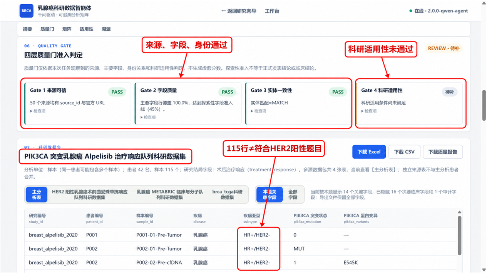
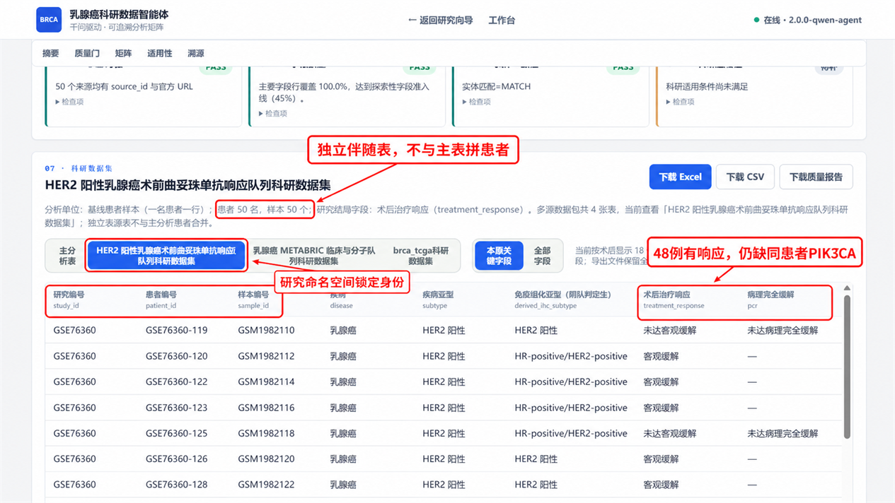
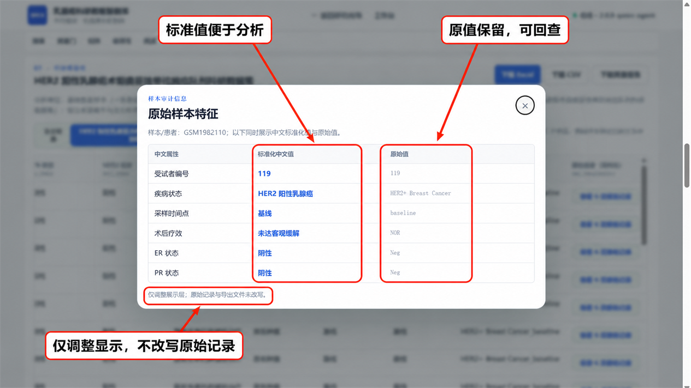
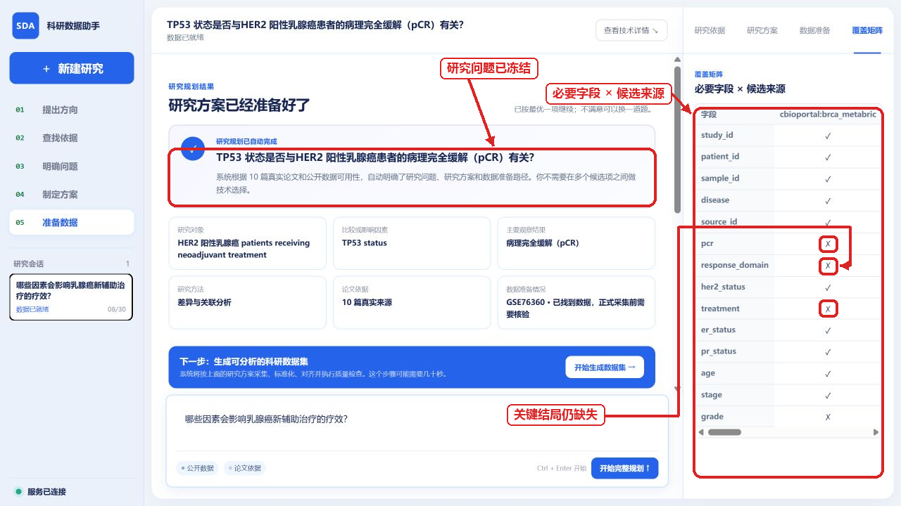
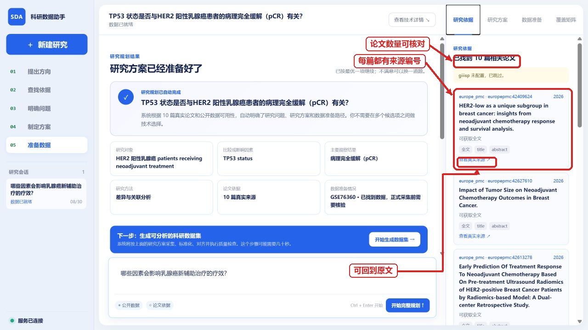
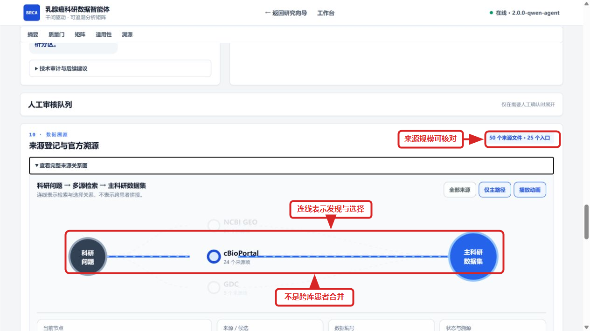
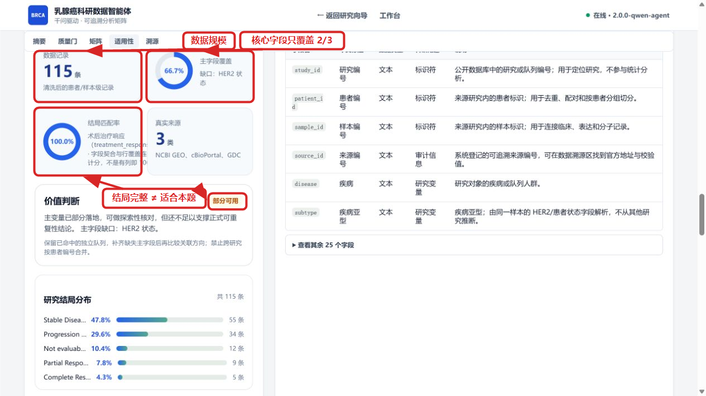

# 从科研问题到可复核数据：乳腺癌精准治疗科研数据智能体的设计、实测与边界

> 参赛方向：方向 1“科学数据整合与影响力分析应用”·A“科学数据查找、解析与整合”  
> 项目名称：乳腺癌精准治疗科研数据智能体  
> 数据场景：乳腺癌精准治疗公开科研数据的查找、异构解析、安全整合与质量审计  
> 文档版本：2026-08-31（国赛叙事增强版）  
> 结果口径：正文把“本次系统实测”“未封存审核卷回归”和“公开模块对照”分开报告；不把候选分数写成冻结赛题成绩，不把科研数据整理写成临床诊断。
> 图像标注：网页截图中的红框、红色箭头和红字为本报告后期增加的证据定位标记，不是网页原生按钮或额外评测结果；标注只强调原页面中已经存在的文字和数值。

## 参赛作品简介（300 字内）

乳腺癌研究需要联合患者、分子变异、治疗与疗效数据，但资料分散、字段和患者编号口径不一。本作品把自然语言问题转化为字段需求，由受控程序查找并解析 GEO、cBioPortal、GDC 等真实来源，按研究边界形成主表与伴随表，并保留来源、原始信息和质量结论。当前代表任务生成 115 行含 PIK3CA 与响应的主表，但因缺少题目要求的 HER2 直接证据，科研适用性门判为 `REVIEW`；GSE76360 另形成 50 名患者的响应伴随表，不与其他队列强行拼接。系统不替研究者编结论，而是说明哪些数据可用、为何可用、还缺什么。

## 摘要

本研究面向方向 1A“从科学问题到可用数据”的真实场景。科研人员提出“研究 HER2 阳性乳腺癌中 PIK3CA 突变与新辅助治疗响应的关系”时，真正需要的并不是一段医学知识，而是一份在同一分析单位内同时含有人群、分子变量、治疗、结局和来源的数据集。查找公开资料后可以发现，GSE76360 提供 HER2 阳性术前治疗响应，METABRIC 提供较丰富的临床与 PIK3CA 信息，alpelisib 队列提供 PIK3CA 与治疗响应；然而，这些队列的人群、结局和患者身份并不等价。若只按关键词或列名拼表，容易把“主题相关”误判为“可回答问题”，甚至制造不存在的跨研究患者记录。

根据上述矛盾，本文构建了“问题结构化—真实来源获取—异构记录解析—同研究字段整理—患者/样本边界检查—四层质量判断—结果与缺口输出”的科研数据生产链。模型只承担问题理解和工具规划；患者事实由已注册 Adapter 获取，确定性程序完成字段映射、身份审计、来源登记和发布门控。默认主链当前能够解析来源 API 结果及 GEO Series Matrix 的样本元数据，形成主表、伴随表、字段字典、来源清单与质量报告；CSV/Excel/HTML/JATS/PDF 文本解析、逐字段 Evidence 和安全修复已作为独立治理接口实现，但尚未全部进入默认任务的逐单元格执行链。Planning RAG 用于查找文献和数据编号，不生成患者事实。

在 2026 年 8 月 31 日的当前版本实测中，系统围绕代表问题完成 2 轮、6 次真实工具调用，登记 50 个来源，形成 4 张互不强行合并的数据表。主分析表来自 `breast_alpelisib_2020`，共 115 行、31 列，包含 PIK3CA 与治疗响应，但页面记录显示其亚型为 HR+/HER2−，不能代替题目所需的 HER2 阳性人群；因此 Gate 1 来源可信、Gate 2 已有字段行覆盖和 Gate 3 实体一致性均通过，Gate 4 科研适用性保留为 `REVIEW`，`publish_allowed=false`。GSE76360 伴随表得到 50 个基线患者样本，其中 48 个有响应，仍因缺少同患者 PIK3CA 而不能完成目标关联分析。同一未封存审核卷中的严格千问 LIVE 候选回归得到 Retrieval F1 0.65、Faithfulness 1.00、Traceability 1.00、Error F1 1.00、Repair Accuracy 1.00 和 SDTI 91.75，但 11 个任务中仍有 5 个 `REVIEW`。结果表明，本系统已经解决真实来源查找、数据库记录解析、安全分表、来源追溯和可用性判断问题；尚未解决公开数据本身缺少同患者目标变量、默认主链逐字段治理未完全贯通以及独立封存评测不足的问题。

**关键词：** AI for Science；科学数据整合；乳腺癌；异构数据；患者—样本关联；数据溯源；质量门；科研可用性

---

## 1 背景与赛题理解

### 1.1 AI for Science 的落点不是“模型会回答”，而是“证据能复用”

AI for Science 的宏观目标，是让计算方法参与科学问题提出、数据发现、实验设计和证据分析。对方向 1A 而言，这一宏大目标必须落实为一个可以验收的具体问题：**用户给出研究目标后，系统能否找到真实资料，把它们整理成可分析、可追溯、可复用的数据，并在数据不够时明确停止。**

查找科研数据管理文献可知，FAIR 原则把科学数据质量概括为可发现、可访问、可互操作和可复用四个方面[1]；W3C PROV 则强调用实体、活动和责任主体描述数据的产生与派生过程，以支持可信判断和异构系统之间的来源交换[2]。这些原则说明，科研数据应用的完成标准不能只是“检索到了网页”或“导出了 CSV”，而应同时回答四个常识问题：数据从哪里来、经历了什么处理、不同记录为什么能放在一起、结果可用于哪项分析。

因此，本文没有把大模型回答的流畅度作为最终目标，而是把作品目标定义为：

> **输入一项乳腺癌科研需求，输出带有分析单位、来源凭证、处理说明、质量状态和适用边界的结构化数据包；若关键变量不属于同一批患者，则保留独立表与缺口，不制造联合记录。**

这一定位与方向 1A 的关系是直接的：论文和数据库查找对应“可发现”，官方入口与 accession 对应“可访问”，字段与身份边界对应“可互操作”，数据字典、来源和质量报告对应“可复用”。下面进一步把这一一般要求落到乳腺癌研究场景。

### 1.2 从宽泛医学方向到可检查的科研问题

乳腺癌精准治疗涉及疾病亚型、受体状态、分子变异、治疗方案和疗效结局。若只提出“做一个乳腺癌智能分析系统”，评委无法判断系统究竟需要什么数据，也无法验证结果是否完成。因此，本文选择以下代表问题作为贯穿全文的检验任务：

> **研究 HER2 阳性乳腺癌中 PIK3CA 突变与新辅助治疗响应的关系，并整理患者级科研数据集。**

根据上述问题，首先需要明确分析单位。本文把“同一研究中的一名患者及其可追溯样本”作为目标分析单位；这意味着 HER2 状态、PIK3CA 变异和治疗响应必须能够在同一患者或可靠 crosswalk 内关联。若三项变量只是分别出现在三个不同队列中，则只能说明资料彼此相关，不能说明它们属于同一分析对象。

进一步地，科研问题可拆成表 1 所示的数据要求。该表不是技术字段的堆砌，而是后续来源选择、数据清洗和质量判断的共同依据。

**表 1 代表性科研问题需要的数据及其研究含义**

| 要回答的问题 | 必要数据 | 分析单位与口径 | 缺失或混用的后果 |
|---|---|---|---|
| 研究对象属于哪项研究 | `study_id`、accession | 研究级命名空间 | 无法解释患者编号和字段定义 |
| 记录对应谁、哪份样本 | `patient_id`、`sample_id` | 患者级/样本级 | 可能重复计数或跨研究错配 |
| 是否属于目标人群 | 疾病、HER2 状态、检测方法 | HER2 IHC/FISH 等临床维度 | ERBB2 CNA 不能直接代替临床 HER2 阳性 |
| 是否有目标分子暴露 | PIK3CA 突变、变异位点 | 同患者或同样本检测 | 另一队列的突变不能补到本队列患者 |
| 接受了什么治疗 | 治疗名称、阶段和时间点 | 新辅助治疗口径 | 其他治疗阶段不能直接替代 |
| 结局是什么 | `response_domain`、pCR/临床响应 | 患者临床响应 | OS/DFS 或细胞系 AUC/IC50 不能冒充响应 |
| 这个值能否核对 | `source_id`、URL、原字段/原值 | 来源和处理过程 | 无法确认值是真实读取还是模型生成 |

分析表 1 可得：本题的难点不是字段名称多，而是这些字段必须同时满足“同研究、同患者、同语义、可追溯”四个条件。于是，系统设计不能从“想用哪些热门技术”出发，而应从上述四类约束逐一推出模块。

### 1.3 数据预查揭示的三个关键矛盾

为判断问题是否能够由公开数据直接解决，本文先查找 GEO、cBioPortal 和 GDC 等来源，再比较其数据角色。NCBI GEO 用于存储和共享功能基因组学研究及样本注释[3]，cBioPortal 提供癌症研究的临床与分子数据访问[4]，GDC 提供癌症基因组数据的标准化访问与处理基础[5]。这些来源都与乳腺癌有关，但“来自权威数据库”并不自动意味着“适合当前任务”。

第一，**找到数据不等于找到能回答问题的数据**。当前实测选择的 `breast_alpelisib_2020` 主表包含 PIK3CA 和治疗响应，共 115 行；然而该研究对应 alpelisib 与芳香化酶抑制剂耐药场景[8]，页面样本亚型为 HR+/HER2−。因此，这张表能够支持该队列内部的探索，却不能直接回答 HER2 阳性新辅助治疗问题。

第二，**字段相关不等于医学含义相同**。HER2 IHC、FISH 与 ERBB2 拷贝数都涉及 HER2/ERBB2，但检测对象与临床含义不同；患者 pCR、临床响应和细胞系药敏也属于不同响应域。若只按字符串相似度合并，系统会得到格式整齐但医学含义错误的表。

第三，**患者编号相似不等于同一个人**。GSE76360 有 HER2 阳性术前治疗响应[7]，METABRIC 有 PIK3CA 和临床分子信息，但两项研究没有可靠患者 crosswalk。若直接按行号或相似编号连接，就会把一项研究患者的突变贴到另一项研究患者的疗效上。

综上，真实难点可以概括为：多源数据不仅“格式异构”，还存在**问题口径异构、医学语义异构和身份命名空间异构**。这三个矛盾将后续工作自然分成五个小任务：先把问题结构化，再让来源分工；随后统一字段但保留原值；然后限制患者/样本关联；最后用质量门判断数据能否支持当前研究。

### 1.4 研究目标、完成标准与边界

根据上述分析，本文设定五项可验证目标。

**表 2 研究目标及验收方式**

| 研究目标 | 达标表现 | 不达标时的正确行为 |
|---|---|---|
| 把问题变成数据需求 | 明确人群、暴露、治疗、结局、分析单位和必要字段 | 保留待确认项，不直接搜索宽泛关键词 |
| 从真实来源取得记录 | 有 accession、`source_id`、官方 URL 和工具状态 | 来源未取得时只作为候选线索 |
| 把异构记录整理为表 | 输出主表、伴随表、字段字典和可取得原始信息 | 无法统一的字段保留原值与缺口 |
| 安全关联患者和样本 | 只在同研究命名空间或可靠 crosswalk 内连接 | 低置信度进入 `unresolved/review` |
| 判断当前数据能否使用 | 来源、字段、身份和科研适用性逐层给出结论 | `REVIEW` 时禁止自动发布或强行拼接 |

本文所称“解决问题”，特指解决了公开科研数据的查找、解析、整理、追溯和可用性判断，不等同于已经得到 PIK3CA 与疗效的医学因果结论。只有当同一目标队列中的必要变量满足质量条件后，才可以进入下游统计建模。下一章据此说明系统各模块为何出现、输入输出如何衔接。

---

## 2 系统设计

### 2.1 设计总则：模型负责规划，程序负责事实

自然语言问题具有不确定性，而患者事实必须确定可核查。考虑到这两类任务的风险不同，系统采用“双轨分工”：

- 千问或确定性规划器负责识别人群、变量、结局、数据粒度和候选工具；
- 已注册 Adapter 负责访问真实来源，模型不能自行生成患者行；
- 确定性程序负责字段整理、患者/样本边界检查、来源登记和质量门；
- 医学安全规则与发布状态不可由模型覆盖。

为避免后文概念混淆，给出四个基本定义：

1. **分析单位**：一行数据实际代表的对象，如患者、样本或细胞系；不同单位不能未经转换直接比较。
2. **来源记录**：Adapter 从官方数据库实际获得并登记的记录；论文摘要和模型解释不能充当患者记录。
3. **Evidence**：标准值背后的来源、原字段、原值和转换依据；当前默认主链稳定提供行级来源与可取得原始信息，逐单元格 Evidence 仍在独立治理接口。
4. **科研适用性**：当前数据是否在正确人群、正确分析单位和正确结局域内覆盖研究所需变量；它不同于单纯字段完整率。

### 2.2 当前系统架构及能力接入边界

*图 1 当前系统架构与能力接入边界。蓝绿实线为默认任务主链，紫色虚线为已实现但未完全贯通的规划/治理接口，红色阻断线表示当前禁止或尚未实现的能力。*

从图 1 可以看出，当前系统不是一个“大模型直接连所有数据库”的黑箱，而是由输入与规划、默认任务主链和结果复用三部分组成。用户问题先形成 `ResearchSpec/ResearchBrief`，随后进入来源获取与数据构建；可形成患者/样本表的 GEO、cBioPortal 和受限 DepMap 路径，与只提供试验、文献或证据线索的 GDC、AACT、CIViC、Europe PMC 等路径分开处理。由此可见，系统首先区分“患者事实来源”和“候选/证据来源”，再决定哪些记录能够进入主表。

图中主表选择之后仍设置 `DataAlignmentAuditor` 和四层 `Quality Gate`。这说明数据表生成不是流程终点：一张表即使行数较多、缺失率较低，只要研究人群或结局口径不符合题目，仍不能进入分析。图 1 右侧输出因此包含主表、伴随表、来源过程材料和质量缺口，而不是只给一份 CSV。

同时，图 1 用紫色虚线标出两个真实边界。其一，Planning RAG、Research Contract 和 Source Plan 已能生成并展示，但当前默认生成数据时仍主要传递科研问题文本，没有把契约和来源计划作为每次取数的硬约束。其二，通用 Parser、CanonicalRecord、EvidenceCell 和 Safe Repair 已有接口与测试，却尚未成为默认灵活宽表的逐单元格必经链。因此，本文只把实线能力写成当前主链，把虚线能力写成可用侧链，不把架构蓝图误写成每次请求都已贯通。

### 2.3 从科研问题到数据结论的端到端过程

*图 2 当前任务工作流与两类反馈闭环。缺口闭环决定是否补搜、换队列或停止；字段修复闭环只处理允许自动修复的低风险值。*

分析图 2，系统处理过程可分为八个连续步骤：

1. 输入科研问题，抽取疾病、人群、暴露、治疗、结局和分析单位；
2. 形成目标字段与来源计划，区分必需字段和辅助字段；
3. 调用受控 Adapter 查找数据库记录和论文/数据编号线索；
4. 按来源类型解析 API、GEO 样本元数据或独立解析接口支持的载体；
5. 在各自研究内部整理常用字段，形成候选科研表；
6. 按问题匹配度选主表，其他来源作为伴随表，不跨研究补患者值；
7. 检查来源、字段、身份和科研适用性；
8. 输出数据、来源、缺口和 `PASS/PARTIAL/REVIEW` 状态。

该流程中存在两类容易混淆的“修正”。若发现主表缺少 HER2、响应或目标分子变量，这属于**数据缺口**，系统应换来源、补搜或停止，不能凭模型补值；若发现 `HER-2` 等低风险别名需要统一，这属于**受控字段修复**，只有命中允许规则并重新验证后才能写入。高风险医学冲突和患者身份冲突始终转人工复核。于是，反馈不是一个笼统的“再问模型”，而是根据问题类型进入不同路径。

### 2.4 问题结构化：先说明要什么，再决定去哪里找

自然语言科研问题不能直接对应数据库字段。若直接把整句话交给多个搜索接口，系统可能返回大量主题相关但变量不完整的资料。因此，第一步先构建研究需求：

\[
R=\{P,E,T,O,U,F\}
\]

其中，\(P\) 表示研究人群，\(E\) 表示暴露或分子变量，\(T\) 表示治疗，\(O\) 表示结局，\(U\) 表示分析单位，\(F\) 表示必要字段集合。对于代表问题，\(P\) 为 HER2 阳性乳腺癌，\(E\) 为 PIK3CA 突变，\(T\) 为新辅助治疗，\(O\) 为患者临床响应，\(U\) 为患者/基线样本。

根据上述定义，后续来源不再只按标题关键词排序，而要检查它能否覆盖 \(F\) 中的关键字段。当前 Planning RAG 会从 Europe PMC 等入口查找论文并形成候选问题、数据编号和覆盖矩阵；RAG 的基本思想是先检索外部材料再辅助生成或决策[6]。考虑到文献叙述不能替代患者事实，本系统只让 RAG服务于研究规划和 accession 发现，真正进入数据表的记录必须由 Adapter 重新取得。

### 2.5 多源解析与来源分工：不是所有来源都进入患者主表

不同来源的数据角色不同，因此本文按“它能回答什么”而不是“数据库名是否知名”进行分工。

**表 3 主要来源、解析内容与使用边界**

| 来源 | 当前可取得的主要内容 | 进入哪一层 | 不能如何使用 |
|---|---|---|---|
| NCBI GEO | Series Matrix 中的 `!Sample_*` 元数据、characteristics、accession | 同研究样本/响应表 | 当前默认 builder 不读取表达矩阵数值，不补造缺失突变 |
| cBioPortal | 同一 study 内的临床、突变、CNA 和样本标识 | 患者/样本候选主表或伴随表 | 不跨 study 按相同编号 Join；CNA 不代替 IHC |
| GDC/TCGA | 官方癌症项目、文件和临床/组学候选 | 来源/候选或独立伴随表 | 不因项目相关就宣称目标字段已下载 |
| ClinicalTrials.gov/AACT | 试验设计、干预与结局登记 | 试验层 | 不当作患者级疗效行 |
| CIViC | 变异—药物—疾病证据 | 知识证据层 | 不替代真实患者检测 |
| Europe PMC | 论文、摘要、开放全文和 accession 线索 | 规划与证据发现 | 摘要不进入患者事实表 |
| CSV/Excel/HTML/JATS/PDF 文本 | 用户或接口已提供的结构化/文本材料 | 独立 Parser 侧链 | 当前首页无二进制通用上传；无通用 OCR/图像曲线数字化 |

分析表 3 可知，多源整合的第一步不是拼接，而是**分层**。只有来源在同一研究内部提供可靠患者/样本标识和所需变量时，才进入候选主表；其他来源保留为伴随表、试验层或证据层。这样既保留了多源信息，又避免“来源越多、错误连接越多”。

### 2.6 字段整理与医学语义约束

不同研究可能把同一概念写成不同字段名，也可能把看似相同的词用于不同检测。为此，系统在允许路径内保留原字段与原值，再生成标准值。以 GSE76360 为例，`NOR` 可映射为“未达客观缓解”，`Neg` 可映射为“阴性”，但原始字符串仍保存在 `raw_characteristics` 中。

考虑到医学概念错配的风险高于普通格式差异，系统冻结以下规则：

- HER2 IHC 2+ 不直接自动判为 HER2 阳性；
- ERBB2 CNA amplification 不等同于 HER2 IHC positive；
- 患者 pCR/clinical response 与细胞系 AUC/IC50 必须用 `response_domain` 区分；
- 高权威来源发生不可解释冲突时不自动选边；
- 低置信度患者/样本关系进入 `unresolved/review`。

这些规则说明，标准化不是把不同字符串变得一样，而是在不改变原始医学含义的前提下，使可比较的内容统一、不可比较的内容隔离。

### 2.7 患者/样本安全关联：先证明“同人”，再合并变量

设两条记录分别为 \(r_i\) 和 \(r_j\)，系统只在下列条件之一成立时允许患者级连接：

\[
Join(r_i,r_j)=1 \iff
\begin{cases}
study_i=study_j \land id_i=id_j, & \text{同研究命名空间};\\
crosswalk(i,j)=verified, & \text{来源提供可靠映射}.
\end{cases}
\]

否则，\(Join(r_i,r_j)=0\)，两张表保持独立并记录 Gap。这个规则看似保守，却直接解决了多源医学数据中最危险的问题：一张“列很全”的表可能是由不同患者拼成的。对于代表任务，GSE76360 和 METABRIC 没有可靠 crosswalk，因此只能分别保存响应与突变信息，不能进行患者级横向合并。

### 2.8 四层质量门：把“表很完整”与“适合本题”分开

假设主表共有 \(n\) 行，主要字段集合为 \(F_p\)。对字段 \(f_j\)，其非缺失覆盖率为 \(c_j\)，则主要字段平均行覆盖为：

\[
C_f=\frac{1}{|F_p|}\sum_{f_j\in F_p}c_j.
\]

当前默认主链依次执行四层判断：

**表 4 四层质量门的输入、条件与作用**

| 质量门 | 当前主链检查 | 探索性条件/行为 | 回答的问题 |
|---|---|---|---|
| Gate 1 来源可信 | `source_id`、官方 URL、accession/校验或缓存版本 | 来源均可登记才通过 | 数据从哪里来 |
| Gate 2 字段质量 | 当前已识别主要字段的平均行覆盖 | \(C_f\ge 0.45\) | 已有字段是否足够形成表 |
| Gate 3 实体一致性 | study/patient/sample/source 命名空间与未决身份行 | `entity_match_status=MATCH` | 表内记录能否安全对应 |
| Gate 4 科研适用性 | 样本量、题目主变量、结局同域、HER2 直接证据 | 当前规则要求记录数不低于 30；需要结局时匹配率不低于 0.75；需要 HER2 时直接状态/可追溯亚型证据不低于 0.50 | 这张表能否回答本题 |

Gate 2 页面虽同时列出一致性、单位和类型等检查项，但当前默认决策主要依据已识别字段的行覆盖；严格逐字段类型、原值和 Evidence 审核属于正在收束的治理侧链。之所以必须保留 Gate 4，是因为“表中已有字段的非缺失率很高”并不等于“题目要求的字段都存在”。本次实测正好验证了这一点：主表已有 PIK3CA 与响应，行覆盖可通过 Gate 2，但 HER2 目标人群证据不足，最终仍被 Gate 4 拦截。

至此，系统设计回答了“如何生产和约束数据”。然而，架构合理并不能证明系统已经做对；下一章将用当前版本的真实任务、页面结果、未封存审核卷和公开模块对照分别检验任务可用性、数据质量和系统短板。

---

## 3 当前版本实测与结果分析

### 3.1 实测设置：同一问题、当前代码、真实工具结果

为了避免使用旧页面或历史缓存结论冒充当前系统，本文于 2026 年 8 月 31 日启动当前仓库版本 `2.0.0-qwen-agent`，从首页提交代表问题，并以 `use_qwen=false` 的确定性规划模式运行。该设置的目的不是评估千问能力，而是检查当前默认数据主链是否能够在没有生成式补值的情况下完成真实取数、分表和质量判断。

本次任务编号为 `loop-5067e738f912:r1`。系统完成 2 轮采集、6/6 次真实工具调用，登记 50 个来源，形成 GEO、cBioPortal 和 GDC 三类来源记录。由于本次没有调用千问，正文不把此任务写成“千问实测”；千问 LIVE 的候选回归结果另在 3.6 节单独说明。

### 3.2 结果表并不是越多越好：先判断每张表能回答什么

当前系统形成 1 张主分析表和 3 张伴随表。对这些表进行结构和题目匹配分析，结果见表 5。

**表 5 当前实测形成的主表与伴随表**

| 数据表 | 当前规模 | 具备的关键内容 | 与代表问题的关系 | 系统决定 |
|---|---:|---|---|---|
| `breast_alpelisib_2020` 主表 | 115 行 × 31 列；42 名患者 | PIK3CA、alpelisib 治疗响应、样本信息 | 有分子变量和响应，但页面亚型为 HR+/HER2−，不满足 HER2 阳性新辅助治疗人群 | 作为当前最完整主表展示，Gate 4 `REVIEW` |
| GSE76360 伴随表 | 50 行 × 21 列；50 名患者 | HER2 阳性、术前曲妥珠单抗、治疗响应、原始样本注释 | 人群和响应同域，但缺少同患者 PIK3CA | 独立保留，不横向补突变 |
| METABRIC 伴随表 | 86 行 × 48 列（本次受记录上限影响） | 临床、PIK3CA、部分受体/分子信息 | 有突变和临床信息，但目标新辅助响应不完整 | 独立保留，不替代 GSE 响应 |
| TCGA-BRCA 伴随表 | 60 行 × 94 列（本次受记录上限影响） | 临床与大量组学/病理字段 | 字段较多，但并非目标响应队列 | 作为伴随数据，不因列多而升为目标主表 |

分析表 5 可以发现，系统确实找到了“PIK3CA + 响应”“HER2 阳性 + 响应”和“PIK3CA + 丰富临床”三类数据，但没有任何一张当前表同时满足目标人群、目标分子变量和目标治疗响应。若把三张表强行横向拼接，表面上会补齐所有列，实际上却破坏患者身份。因此，本次任务的正确产出是**四张保持研究边界的数据表和一个明确的 `REVIEW`**，而不是一张虚假的完整表。

这一结果还揭示了当前检索与选表逻辑的改进方向：主表选择更偏向字段和结局覆盖，尚不足以把 HER2 阳性人群约束放在更高优先级；因此系统需要进一步把冻结 Research Contract 中的人群条件硬绑定到来源排序和主表选择。

### 3.3 从 GSE76360 得到有效响应样本集，但仍不能回答 PIK3CA 问题

GSE76360 官方条目说明，该研究围绕早期 HER2 阳性乳腺癌术前治疗开展基因表达研究，并记录 pCR、客观缓解和未达客观缓解等结局[7]。当前解析器从 Series Matrix 的样本注释中保留每名患者的基线样本，得到 50 名患者。其治疗响应分布为：客观缓解 33 名、病理完全缓解 9 名、未达客观缓解 6 名、缺失 2 名。

由于缺失值会干扰后续分组统计和模型构建，若研究目标只分析该队列内部的治疗响应，则首先应排除 2 条响应缺失记录，得到有效响应样本集：

\[
D_{response}=\{i\in D_{GSE76360}\mid response_i\neq missing\},\qquad |D_{response}|=48.
\]

这 48 名患者可用于描述该队列的响应构成，也可作为后续响应相关研究的候选样本。然而，当前表没有同患者 PIK3CA 变量，因此不能继续建立 PIK3CA—响应相关模型。换言之，缺失响应的 2 条记录可以通过限定分析集处理，而整列 PIK3CA 缺失不是普通插补问题；它要求寻找新的同队列分子数据或更换研究设计。这个区分体现了数据清洗与科研问题判断的不同层次。

*图 3 当前版本实测（红框标注版）：左侧三门检查已经通过，右侧科研适用性门仍待补；下方红框同时指出主表虽有 115 行，但样本亚型为 HR+/HER2−。*

从图 3 可以看出，第一个红框把 Gate 1—3 作为一组：主表中的 PIK3CA 与治疗响应字段均有较好行覆盖，因此 Gate 2 通过；实体审计没有执行跨来源患者合并，因此 Gate 3 通过。第二个红框单独圈出 Gate 4 的“待补”，第三个红框则把失败原因落到具体数据行——样本亚型为 HR+/HER2−，不属于题目要求的 HER2 阳性人群。三个标记构成“基础质量通过—科研适用性失败—失败证据定位”的完整链条，说明前三层通过不能覆盖第四层失败。

### 3.4 当前质量指标的分母不同，不能只看一个百分比

当前页面同时出现“字段行覆盖 100%”“主字段覆盖 66.7%”和“全表完整率 87.5%”。三个数字看似矛盾，实则分母不同：

- 100% 指 Gate 2 中**已经识别并进入主表的主要字段**在行级上的平均非缺失覆盖；
- 66.7% 指题目三项核心要求 PIK3CA、治疗响应和 HER2 中，前两项已落地而 HER2 缺失，即 2/3；
- 87.5% 指当前 115 行、31 列宽表中全部展示字段的总体完整程度。

因此，质量分析必须先说明“对什么计算”，再解释数值。若只展示 100%，评委容易误以为研究问题已经完整覆盖；Gate 4 和 66.7% 的任务主字段覆盖共同说明，当前表结构较完整，但不适合目标人群。这个例子也证明了系统保留任务级适用性指标的必要性。

### 3.5 数据表、原值与来源能否相互核对

*图 4 当前版本中的 GSE76360 基线患者样本表（红框标注版）：队列作为独立伴随表保存，研究—患者—样本三层身份与响应字段分别被标出。*

从图 4 可以看出，左上红框首先标明这是一张独立伴随表，而不是当前主分析表；表头红框进一步圈出 `study_id`、`patient_id` 和 `sample_id`，说明每条记录受研究命名空间约束，患者编号也被写为 `GSE76360-119` 等形式。右侧红框指向响应与 pCR 字段：50 名患者中有 48 名具备响应，但表内仍没有同患者 PIK3CA。三个标记共同说明“可以分析该队列响应”与“不能回答 PIK3CA—响应关系”必须同时成立。

*图 5 样本 GSM1982110 的标准值与 GEO 原始特征并排展示（红框标注版）；底部同时标明展示层不改写原始记录。*

分析图 5，左侧红框圈出“标准化中文值”，其作用是让字段能够直接进入统计分组；右侧红框圈出 `119`、`HER2+ Breast Cancer`、`baseline`、`NOR` 和 `Neg` 等 GEO 原值，其作用是保留复核依据。底部红框进一步限定“仅调整显示，不改写原始记录”。因此，标准化与保真并非二选一，而是标准值用于分析、原值用于核查。需要注意，该抽屉尚不等于每个单元格都有统一 EvidenceCell、规则编号和置信度，逐字段证据仍需纳入默认治理主链。

### 3.6 未封存审核卷：效果改善在哪里，证据边界在哪里

当前实测用于回答“任务是否能安全产出数据”；系统质量的量化回归则来自另一组未封存审核卷。审核卷包含 50 条检索判断、26 条字段标准化样本和 18 条错误样本。历史基线不调用千问；严格 LIVE 候选流程在 11 个检索问题上调用 `qwen3.8-max` 11/11 次。由于该卷已经用于多轮开发，结果只能解释为同卷回归观察，不是独立泛化成绩。

*图 6 五维质量指标对比；图中候选分数与本次 `use_qwen=false` 页面任务不是同一次运行。*

**表 6 同一未封存审核卷的指标结果与解释**

| 指标 | 历史基线 | 严格 LIVE 候选 | 当前能够说明什么 |
|---|---:|---:|---|
| Retrieval Precision | 0.3548 | 0.5909 | 无关返回减少，但距 0.90 目标仍远 |
| Retrieval Recall | 0.6111 | 0.7222 | 找回能力改善，仍漏掉 5 个应命中来源 |
| Retrieval F1 | 0.4490 | 0.6500 | 检索仍是最明显短板 |
| Faithfulness | 0.6538（17/26） | 1.0000（26/26） | 本卷字段映射均与预期一致 |
| Traceability | 1.0000（26/26） | 1.0000（26/26） | 当前观察器口径下来源锚点完整 |
| Error F1 | 0.6957 | 1.0000 | 18 条小型错误卷上检测正确 |
| Repair Accuracy | 0.5000（1/2） | 1.0000（3/3） | 3 次允许自动修复均正确，样本量仍小 |
| SDTI | 63.36 | 91.75 | 同卷综合回归提高，不等于正式赛题成绩 |
| Safety Gate | FAIL | REVIEW | 两次均未达到自动发布条件 |

从图 6 和表 6 可以发现，最大改善出现在字段忠实、错误检测和允许修复样本，而检索 F1 仍只有 0.65。这表明当前系统的主要矛盾已经从“字段规则经常不一致”转向“能否稳定找到真正满足研究合同的来源”。同时，Repair Accuracy 的分母只有 3，不能据此宣称系统可以自动修复全部医学错误。

当次严格 LIVE 候选运行还登记了 186 个唯一来源，186/186 具备受控 `source_id`、允许名单内官方 HTTPS 主机且 Adapter 未报失败；11 个任务中 6 个 `PASS`、5 个 `REVIEW`，`publish_allowed=false`。这些数字支持“来源地址受控、危险任务会被拦截”，但不能证明 186 项内容都经医学专家核实，也不能计算所谓“幻觉降低百分比”。

### 3.7 公开模块对照：复杂度只有带来收益时才有意义

为了判断各工程模块的相对强弱，项目还在公开数据上与可复现方法进行同条件对照。不同模块使用不同数据集和指标，因此只逐项比较，不相加为新的总分，也不解释为乳腺癌临床效果。

*图 7 字段匹配、实体匹配、检索和错误检测的公开模块对照。*

分析图 7，字段匹配 F1 为 0.7994，高于 COMA 对照的 0.7670；实体匹配 F1 为 0.7449，与 RecordLinkage 的 0.7440 基本持平；检索重排增强 nDCG@10 为 0.3818，较旧融合 0.3791 有真实提升，但仍低于单路 BGE 的 0.3880；错误单元检测 F1 为 0.5726，明显低于 Raha 子集的 0.8159。由此可见，系统并非所有模块都领先：字段对齐具有有限优势，实体匹配持平，检索仍有小幅差距，通用错误检测短板更明显。

*图 8 五个 BEIR 数据集上的分层检索结果。*

从图 8 可以看出，BGE 在五个数据集上的 nDCG@10 宏平均为 0.3880；加入 CrossEncoder 后，项目重排增强宏平均为 0.3818，较旧融合 0.3791 提高 0.0027，但仍未超过 BGE 单路，且平均查询延迟约 452.01 ms。因此，本文把重排作为已验证的候选增强路径，同时保留 BGE 单路和 BM25 作为低依赖回退，并继续在开发集选择策略、在独立测试集确认，而不是把增加复杂度直接写成全面领先。

### 3.8 本章结论：1.3 节的问题解决了多少

根据当前任务、审核卷和公开对照，可以给出分层答案：

- 真实来源查找和受控登记已经完成，本次 6/6 个工具成功并登记 50 个来源；
- 数据库记录解析和结构化输出已经完成，形成 1 张主表和 3 张独立伴随表；
- 来源与研究命名空间边界生效，没有把 GSE、METABRIC、TCGA 和 alpelisib 队列强行按患者拼接；
- 四层质量门能识别“表结构可用但不适合本题”，因此代表问题没有被错误宣布为已解决；
- 当前仍未得到同一 HER2 阳性新辅助治疗队列中同时具有 PIK3CA 和响应的完整分析表，故医学关联问题尚未解决；
- 检索覆盖、逐字段 Evidence 主链、人工反馈回写和独立封存评测仍需继续完善。

上述结果回答了“效果到底怎么样”：系统已经能产出和审计科研数据，也能在关键条件不满足时停止；它的安全判断比“强行给答案”更可靠，但来源发现和全链治理尚未达到自动发布水平。下一章进一步说明前端如何把这条判断链呈现给非技术研究者。

---

## 4 当前前端网页：把处理过程变成研究者能检查的判断链

### 4.1 研究规划界面：从一句方向过渡到一份数据方案

当前前端采用“左侧研究阶段—中间任务工作区—右侧依据/方案/覆盖矩阵”的三栏结构。用户先输入宽泛方向，系统依次扫描文献、提出问题、冻结研究方案、规划来源，最后由用户主动生成数据。这样的顺序使“为什么找这些数据”先于“下载哪个文件”，避免把数据库操作暴露给非技术用户。

*图 9 当前规划界面示例（红框标注版）。截图来自本机历史会话“TP53—pCR”，只用于展示问题冻结、覆盖矩阵和缺口定位，不是本文 PIK3CA 代表任务的结果。*

分析图 9，中部红框表示研究问题已经冻结，避免系统在取数过程中悄然换题；右上红框把“必要字段 × 候选来源”定义为来源选择依据；右下红框直接圈出 pCR、`response_domain` 和 treatment 等缺失项。以截图中的 METABRIC 候选为例，它覆盖研究和身份字段，却缺少关键结局与治疗字段。由此，界面把“为什么选这个来源”和“为什么它仍不够”同时展示，下一步不再是盲目下载，而是继续比较来源或在生成数据后由质量门复核。

需要说明的是，当前规划界面会自动选择首个推荐问题并冻结方案；用户可以查看或重启研究，但多个候选之间的显式人工比较仍可加强。此外，当前生成任务主要传递研究问题文本，截图中的 Contract 与 Source Plan 尚未成为所有取数动作的硬约束。

### 4.2 文献依据界面：让“基于文献”成为可核对来源

*图 10 当前规划会话的文献依据（红框标注版）：论文数量、单篇来源编号和原文入口分别可核对。*

从图 10 可以看出，第一个红框使“10 篇”成为可检查的检索规模，而不是一句笼统的“查找了文献”；第二个红框圈出单篇论文的 provider、`source_id`、标题和年份，使引用对象能够被唯一识别；第三个红框指向“查看真实来源”，让研究者可以回到原文。文献在这里承担问题收束和 accession 发现作用。考虑到检索结果仍可能主题偏离，论文数量不等于证据质量，研究者仍需检查每篇论文与当前人群、暴露和结局是否一致。

因此，本项目中的“基于文献”不是让模型引用一段无法核对的文本，而是把文献条目作为规划证据；患者事实仍需由数据库 Adapter 重新取得。上一界面回答“为什么找”，下一步数据表回答“实际找到了什么”。

### 4.3 主表与伴随表：数据结果首先显示研究边界

图 3 和图 4 展示当前数据工作台。主表标签明确显示 115 行 alpelisib 队列，三个伴随表则分别保存 GSE76360、METABRIC 和 TCGA-BRCA。研究者切换标签时，分析单位、患者数、样本数和结局字段同时变化。

这种交互的作用不是让用户在四张表之间“挑一张看起来最好”的表，而是提醒不同表属于不同研究。数据表回答了“得到什么”，但不能单独回答“能否用于本题”，因此页面上方紧邻四层质量门。对于本次任务，质量门的 `REVIEW` 比 115 行记录更重要，因为它阻止用户把 HR+/HER2− 队列误用于 HER2 阳性问题。

### 4.4 原值审计：说明一个值为什么这样写

图 5 展示的原始样本特征弹窗把中文标准值与 GEO 原值并排放置。研究者可以从“未达客观缓解”回到 `NOR`，也能看到患者编号、疾病、人群和取样时间点的原始表达。这一设计把字段清洗从不可见的后台动作变成可复核证据。

但是，单个值能够回查仍不能说明整个数据集为何被选择。为此，系统还需要展示科研问题、数据库和最终主表之间的来源关系。

### 4.5 来源血缘：展示发现与选择，不暗示跨库合并

*图 11 当前来源关系图（红框标注版）：来源规模、发现路径及“并非跨库患者合并”的边界被同时标出。*

分析图 11，右上红框首先给出“50 个来源文件、25 个入口”，使来源规模可以核对；中部红框沿“科研问题—cBioPortal—主科研数据集”圈出当前主要发现与选择路径；下方红字明确限定“不是跨库患者合并”。这三个标记避免把一张血缘图误读成患者关联图：连线说明数据如何被找到和选中，不证明不同数据库记录属于同一个人。

当前来源页能够回答“从哪里找到这张表”，行级 `source_id` 能回答“这行属于哪个来源”；但全表逐单元格 Evidence 尚未默认贯通。因此，来源血缘是可追溯链的一部分，不应单独等同于完整字段证据。

### 4.6 适用性页面：把数据规模、完整度和研究价值分开

*图 12 当前科研适用性（红框标注版）：数据规模、核心字段覆盖和“结局完整不等于适合本题”的判断被分开呈现。*

从图 12 可以看出，左上两个红框分别标出 115 行数据规模和 66.7% 核心字段覆盖，说明“数据不少”与“题目字段齐全”是两个问题；左中红框圈出 100% 结局匹配，并用箭头连接“部分可用”，强调响应完整仍不能补偿 HER2 缺失。页面没有用单一总分掩盖这一矛盾。当前实测还发现 34 名患者对应多个样本；后续若建立模型，必须按患者分组划分训练集与测试集，否则同一患者的不同样本可能同时出现在两侧，造成数据泄漏。

字段字典进一步说明每列的数据类型、角色和科研用途，使 `study_id`、`patient_id`、`sample_id` 和 `source_id` 不会被误当作普通预测变量。至此，前端完成“提出问题—查看文献—明确字段—生成数据—检查质量—核对原值—查看来源—决定补搜或复核”的可视判断链。

### 4.7 当前人工反馈的真实状态

页面保留人工审核队列和 `ACCEPT/REJECT/EDIT/DEFER` 决定接口，但当前审核记录字段与默认任务结果尚未稳定统一，人工决定也没有自动回写已完成任务的主表并触发重跑。因此，本文只把它描述为**审核原型**，不写成已经闭环的人工纠错系统。下一阶段应让每个 Review 项具有统一状态、修改前后值、审阅人、时间和再验证结果，再由质量门重新计算发布状态。

---

## 5 特殊性、不可替代性与现实意义

### 5.1 特殊性来自约束协同，而不是数据库数量

本系统的价值并非“接入的数据库最多”或“模型参数最大”，而是三项约束共同生效：**事实只能由受控来源产生；患者只能在可靠身份边界内连接；质量失败必须改变后续行动。**

**表 7 项目特征、实现机制、当前证据与边界**

| 特征 | 实现机制 | 当前证据 | 尚不能夸大的部分 |
|---|---|---|---|
| 处理模糊科研方向 | 文献扫描、问题候选、Research Contract、字段覆盖矩阵 | 当前新版规划界面已能展示问题、论文和覆盖路径 | Contract 尚未成为每次取数的硬约束 |
| 面向乳腺癌专业语义 | HER2 检测维度、PIK3CA、响应域和医学规则 | 当前主表因 HER2 证据不足被 Gate 4 拦截 | 不能由一组规则外推全部肿瘤学概念 |
| 接入真实专业数据 | 受控 Adapter、accession、官方 URL、来源状态 | 本次 6/6 工具成功、登记 50 个来源 | 来源被登记不等于内容已全部进入患者主表 |
| 多源但不乱合 | 主表/伴随表分离、研究命名空间、crosswalk 条件 | 四张表保持独立，未跨研究贴患者值 | 公开数据无 crosswalk 时系统只能隔离，不能凭空解决 |
| 结果可追溯 | 行级 `source_id`、原始 GEO characteristics、来源关系图 | GSM1982110 可从标准值回到原值 | 默认宽表尚非每格都有统一 EvidenceCell |
| 质量失败改变行动 | 四层 Gate、Gap、`REVIEW` 和停止原因 | Gate 1—3 通过但 Gate 4 拒绝错误人群 | Review 人工回写尚未完全打通 |
| 效果按口径呈现 | 任务 Gate、SDTI、公开模块基准分开展示 | 能同时看到 91.75、Retrieval F1 0.65 和 `publish=false` | 未封存审核卷不能作为独立最终成绩 |

### 5.2 为什么不能只用搜索引擎、通用大模型或普通 ETL

若只使用搜索引擎，研究者可以找到 GEO 和 cBioPortal 页面，却仍需人工判断哪些字段属于同一患者、结局是否同域；若只使用通用大模型，它可以解释 PIK3CA 或 HER2，却无法保证患者行来自真实数据库，也不能把生成内容当作测量事实；若只使用普通 ETL，它可以改列名和连接表，却不知道 HER2 IHC 与 CNA 的医学边界，也不会判断当前表是否适合题目；若只构建 RAG 或知识图谱，可以组织论文关系，但仍缺少患者/样本表的安全身份约束和质量门。

本项目把这些工具的分工固化为一条可执行流程：模型负责把问题说清楚，Adapter 负责取得事实，规则负责守住语义与身份边界，质量门负责决定是否进入分析。对于只想获得一段背景知识的用户，通用大模型已经足够；对于需要患者/样本级公开数据、原值核对和“不适合本题”判断的研究任务，这种组合机制具有不可被单一工具直接替代的价值。

### 5.3 现实意义：减少的不是一次点击，而是错误研究路径

传统流程常在论文、数据库和 Excel 之间反复复制字段。真正昂贵的工作不是下载文件，而是发现：当前队列没有目标结局、两个编号不属于同一患者、某个 HER2 值来自 CNA 而非 IHC，或者模型训练后才发现同一患者泄漏到训练集和测试集。

本系统把这些判断前移到数据生产阶段。以本次任务为例，115 行主表已经可以用于 alpelisib 队列内部探索，但系统没有因为“PIK3CA 和响应都存在”就忽略 HER2 人群不符；GSE76360 得到 48 个有效响应样本后，也没有用另一队列的突变补齐。这种“尽早停止错误分析”的价值难以用页面点击数衡量，却能直接减少后续统计建模建立在错误分析集上的风险。

### 5.4 当前限制与下一阶段优先级

本项目的限制按影响链条分为四类。

**数据与来源边界。** 当前 GEO 默认 builder 读取 Series Matrix 的样本元数据，在表达矩阵数值开始前停止；通用 CSV/Excel/HTML/JATS/PDF 文本解析属于独立接口，首页没有通用二进制上传，也没有 OCR 或图像曲线数字化。当前代表问题仍缺少同一 HER2 阳性新辅助治疗队列中的 PIK3CA 与响应联合数据。

**主链贯通边界。** Planning Contract、Source Plan 和字段覆盖矩阵尚未硬约束默认取数；Canonical/Evidence/Repair 与灵活宽表主链尚未收束为同一条逐单元格治理链；人工审核决定尚未稳定回写主表并触发重评。

**评测与泛化边界。** Retrieval F1 为 0.65，检索仍未达到 0.90 目标；Repair Accuracy 1.00 只有 3 次修复；严格 LIVE 卷尚未 sealed；公开模块对照显示通用错误检测弱于 Raha 子集。工程测试通过不能替代独立 Gold Set 和领域专家复核。

**应用与部署边界。** 系统不提供临床诊断和用药建议；本地内存会话适合演示，生产部署仍需认证、HTTPS 和共享状态；浏览器只预览部分记录，完整结果应以导出文件为准。

根据上述限制，下一阶段不应继续无条件增加模块，而应依次完成：

1. 把冻结 Research Contract 的人群、变量和结局作为来源排序与主表选择的硬条件；
2. 针对当前错误候选和漏检优化乳腺癌来源检索，并建立新的封存测试集；
3. 将通用解析、Canonical Schema 和逐字段 Evidence 接入默认数据链；
4. 统一 Review 状态和人工修改记录，回写后重新运行质量门；
5. 若作品要声明论文附件/图表数字化，再实现并独立验证 PDF 表格、OCR 和图像校验能力。

这些优先级直接由本次实测暴露的问题得到，而不是为了追求架构图更复杂。

---

## 6 结论

本文围绕方向 1A 的科学数据场景，构建了一套从自然语言科研问题到结构化数据包的乳腺癌科研数据智能体。系统把人群、分子变量、治疗、结局和分析单位结构化，由受控 Adapter 获取真实来源，再完成来源分工、同研究字段整理、患者/样本边界审计、四层质量判断和多格式输出。模型负责规划而不生成患者事实，论文检索服务于问题与来源发现而不替代数据库记录。

代表问题检验了系统是否真正解决 1.3 节提出的任务。当前版本形成 115 行含 PIK3CA 与响应的 alpelisib 主表、50 行 GSE76360 响应伴随表，以及 METABRIC 和 TCGA-BRCA 伴随表；但主表不满足 HER2 阳性人群，GSE 又缺少同患者 PIK3CA，来源间没有可靠患者 crosswalk。因此系统保留独立数据表并给出 `REVIEW`，没有制造联合患者记录。该结果证明查找、解析、分表、追溯和安全拒绝已经完成，也证明目标医学关联尚未由当前公开数据解决。

效果方面，同一未封存审核卷的严格千问 LIVE 候选回归中，Faithfulness、Traceability、Error F1 和 Repair Accuracy 为 1.00，SDTI 为 91.75；但 Retrieval F1 只有 0.65，11 个任务中仍有 5 个 `REVIEW`，且当前页面代表任务未调用千问。公开模块对照进一步表明字段匹配具有有限优势，实体匹配持平，检索融合和通用错误检测仍有明显短板。因而，本文不以一个综合分替代单项问题和发布状态。

为让“公开对照”可读且不与原始问题混淆，新增 `RQ-01` 与 `PB-01`—`PB-04` 题号说明。公开结果的真实口径是：字段匹配宏平均 `0.7994` 高于 COMA `0.7670`，实体匹配 `0.7449` 略高于 RecordLinkage `0.7440`，检索重排增强 `0.3818` 高于旧融合 `0.3791` 但略低于 BGE `0.3880`，错误检测 `0.5726` 低于 Raha 子集 `0.8159`。逐题图、原问题映射和失败原因见 [公开对照题号与结果说明](PUBLIC_COMPARISON_GUIDE_20260902.md)；这组图只补充其他能力图，不改本报告既有结构图和流程图。

综上，本项目的特殊性不在于“用 AI 给出乳腺癌答案”，而在于让科研数据形成一条可检查的因果链：为什么找这些来源、它们实际提供什么、哪些记录能够安全关联、每个值如何回查、什么条件阻止分析。下一阶段应优先把 Research Contract、来源选择和逐字段 Evidence 收束到默认主链，并用新的封存任务集复验。只有当目标人群、分子变量和临床结局在同一可靠分析单位内同时满足质量条件后，系统才应进入正式统计分析；在此之前，清楚地给出 `REVIEW` 本身就是负责任的科研结果。

---

## 附录 A 通俗术语表

| 术语 | 本文中的含义 |
|---|---|
| AI for Science | 用 AI 帮助科学研究提出问题、寻找和整理证据，不让 AI 代替真实测量 |
| Research Contract | 把“研究谁、看什么变量、用什么结局”冻结为任务清单 |
| Adapter | 连接特定官方数据库的受控取数器 |
| accession | 数据库给研究、数据集或样本分配的可核对编号 |
| 主表/伴随表 | 最匹配当前任务的分析表，以及不能安全合并但仍有价值的独立来源表 |
| crosswalk | 来源提供的可靠身份映射，用来证明两个编号确实属于同一患者/样本 |
| Canonical Schema | 不同来源共同遵守的标准字段结构 |
| Evidence | 标准值背后的来源、原字段、原值和处理依据 |
| `response_domain` | 区分患者临床响应、试验结局、知识证据和细胞系药敏 |
| Quality Gate | 在数据进入分析前检查来源、字段、身份和科研适用性的门禁 |
| Gold Set | 人工确认预期结果的评测样本 |
| sealed/frozen | 评测卷已封存，不能继续用于调参；本文候选卷尚未封存 |
| SDTI | 检索、忠实、追溯、错误检测和修复五项指标的几何平均综合指数 |

## 附录 B 当前实测记录

| 项目 | 本文记录 |
|---|---|
| 实测日期 | 2026-08-31 |
| 当前版本 | `2.0.0-qwen-agent` |
| 任务编号 | `loop-5067e738f912:r1` |
| 科研问题 | HER2 阳性乳腺癌中 PIK3CA 突变与新辅助治疗响应 |
| 运行方式 | `use_qwen=false`，确定性规划；不作为千问成绩 |
| 工具与来源 | 2 轮，6/6 次工具成功；50 个来源；GEO/cBioPortal/GDC 三类 |
| 主表 | `breast_alpelisib_2020`，115 行 × 31 列，42 名患者 |
| 伴随表 | GSE76360 50×21；METABRIC 86×48；TCGA-BRCA 60×94 |
| 质量结论 | Gate 1—3 `PASS`，Gate 4 `REVIEW`；`publish_allowed=false` |
| 当前关键缺口 | 主表缺少符合题目的 HER2 阳性直接证据；GSE76360 缺同患者 PIK3CA |
| 截图说明 | 图 3—5、11—12 来自该实测任务；图 9—10 来自另一个当前 UI 规划历史会话，只展示新版规划界面 |

## 附录 C 项目内证据与复现索引

1. [当前生产主链](CURRENT_MAINLINE.md)
2. [分层数据与指标报告](DATA_REPORT_20260829.md)
3. [系统设计报告](FINAL_SYSTEM_DESIGN_REPORT_20260830.md)
4. [前端当前功能说明](FRONTEND_COMPLETE.md)
5. [医学安全规则](05_医学安全规则.md)
6. [冻结指标与 SDTI 公式](06_评测指标与SDTI.md)
7. [候选卷 Manifest](../goldset/templates/MANIFEST.json)
8. [历史审核卷基线 metrics.json](../goldset/breast_cancer/official_candidate/evaluation_runs/official-candidate-20260829T132222Z/metrics.json)
9. [严格千问 LIVE 候选 metrics.json](../goldset/breast_cancer/official_candidate/evaluation_runs/official-candidate-qwen-live-audited-final-20260830/metrics.json)
10. [严格千问 LIVE 候选 AUDIT.json](../goldset/breast_cancer/official_candidate/evaluation_runs/official-candidate-qwen-live-audited-final-20260830/AUDIT.json)
11. [公开同类方法实测结果](../evaluation/github_competitor_benchmark_20260830/results.json)
12. [当前系统架构 SVG](images/current-system-architecture-v4-20260831.svg)
13. [当前任务工作流 SVG](images/current-task-workflow-v4-20260831.svg)

## 参考文献

[1] Wilkinson M D, Dumontier M, Aalbersberg I J, et al. [The FAIR Guiding Principles for scientific data management and stewardship](https://doi.org/10.1038/sdata.2016.18). *Scientific Data*, 2016, 3:160018.

[2] W3C. [PROV-DM: The PROV Data Model](https://www.w3.org/TR/prov-dm/). W3C Recommendation, 2013.

[3] Edgar R, Domrachev M, Lash A E. [Gene Expression Omnibus: NCBI gene expression and hybridization array data repository](https://pubmed.ncbi.nlm.nih.gov/11752295/). *Nucleic Acids Research*, 2002, 30(1):207–210.

[4] Cerami E, Gao J, Dogrusoz U, et al. [The cBio Cancer Genomics Portal: An Open Platform for Exploring Multidimensional Cancer Genomics Data](https://pubmed.ncbi.nlm.nih.gov/22588877/). *Cancer Discovery*, 2012, 2(5):401–404.

[5] Grossman R L, Heath A P, Ferretti V, et al. [Toward a Shared Vision for Cancer Genomic Data](https://pmc.ncbi.nlm.nih.gov/articles/PMC6309165/). *New England Journal of Medicine*, 2016, 375:1109–1112.

[6] Lewis P, Perez E, Piktus A, et al. [Retrieval-Augmented Generation for Knowledge-Intensive NLP Tasks](https://papers.neurips.cc/paper/2020/file/6b493230205f780e1bc26945df7481e5-Paper.pdf). *NeurIPS*, 2020.

[7] NCBI GEO. [GSE76360: 03-311 Trastuzumab preoperative trial of early-stage HER2-positive breast cancer](https://www.ncbi.nlm.nih.gov/geo/query/acc.cgi?acc=GSE76360).

[8] Razavi P, Dickler M N, Shah P D, et al. [Alterations in PTEN and ESR1 promote clinical resistance to alpelisib plus aromatase inhibitors](https://www.nature.com/articles/s43018-020-0047-1). *Nature Cancer*, 2020, 1:382–393.
